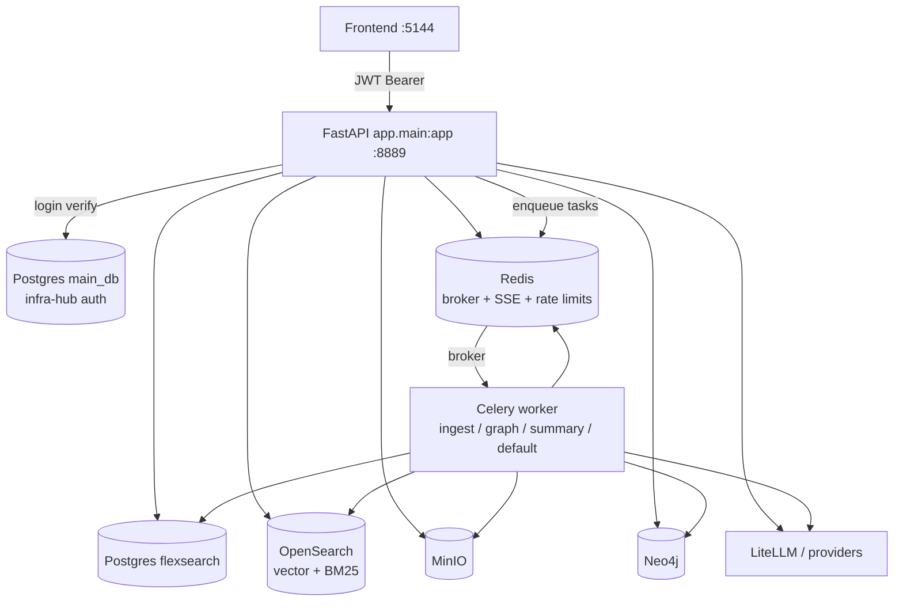
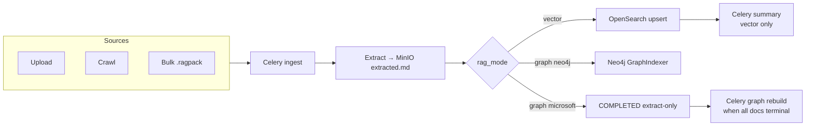
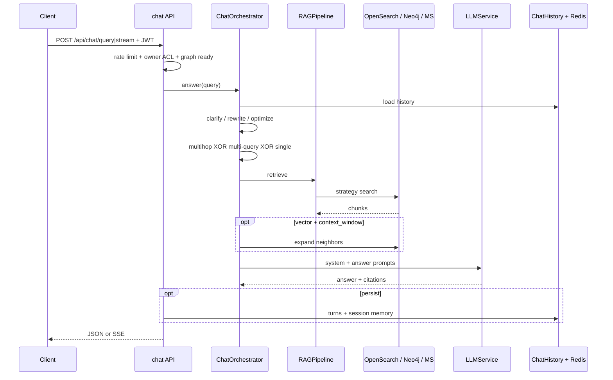
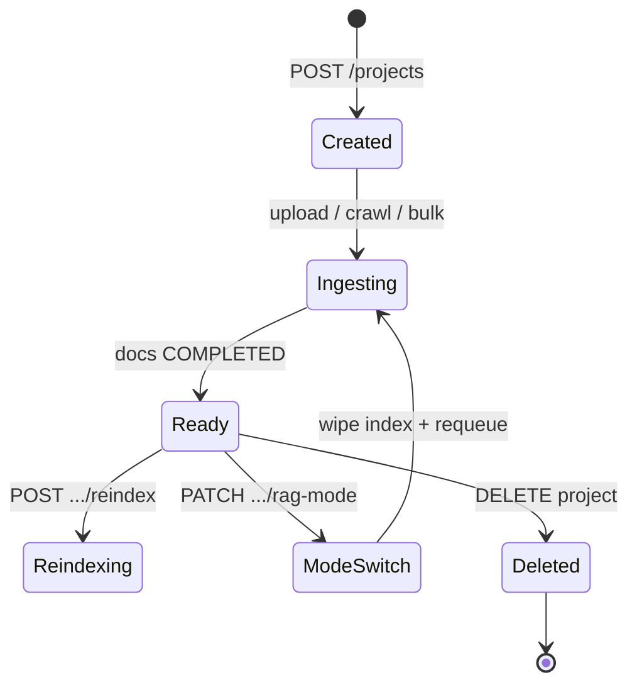

# FlexSearch

**FlexSearch** is a self-hosted enterprise RAG platform: project-scoped document corpora, dual retrieval modes (vector OpenSearch or graph Neo4j / Microsoft GraphRAG), and grounded LLM chat with citations and streaming.

**RAG** (Retrieval-Augmented Generation) means: find relevant passages from *your* documents first, then ask an **LLM** (large language model) to answer using those passages. FlexSearch does that per project so answers stay grounded in the corpus and cite numbered sources instead of relying on the model’s general knowledge alone.

You upload, crawl, or bulk-import content; **Celery** workers extract and index it asynchronously; users ask questions in a project chat (or a retrieval-only Search lab). Answers cite numbered passages from the knowledge base. The app sits on shared **infra-hub** services (Postgres, OpenSearch, MinIO, Redis, Neo4j) rather than bundling its own databases.

| Layer | Role |
|-------|------|
| **Frontend** (`:5144`) | React/Vite UI — projects, RAG settings, upload/crawl/bulk, Chat + Search tabs |
| **API** (`:8889`) | FastAPI — auth, projects, documents, chat, retrieval, jobs, admin |
| **Workers** | Celery on Redis — ingest, graph rebuild, hierarchical summaries, crawl, bulk |
| **Stores** | Postgres (app state), OpenSearch (vector/BM25), Neo4j or MinIO GraphRAG workspace (graph), MinIO (files), Redis (broker + SSE + rate limits + chat memory) |

Deep technical detail lives under [`backend/`](backend/README.md) and [`backend/docs/`](backend/docs/). This README connects those guides into one product map. For plain-language definitions and worked examples, see [Key concepts](#key-concepts) and [Concepts in depth](#concepts-in-depth).

---

## Table of contents

1. [What you can do](#what-you-can-do)
2. [Architecture](#architecture)
3. [Quick start](#quick-start)
4. [Key concepts](#key-concepts) — [how it works](#how-it-works-mental-model), [glossary](#glossary), projects, modes, chat
5. [Concepts in depth](#concepts-in-depth) — RAG, embeddings, dense vs BM25, hybrid/RRF, parent-child, graph vs vector, Celery, citations, SSE
6. [Documentation map](#documentation-map)
7. [Frontend overview](#frontend-overview)
8. [Ops pointers](#ops-pointers)
9. [Known limitations (high level)](#known-limitations-high-level)
10. [Tech stack & license](#tech-stack--license)

---

## What you can do

- **Organize by project** — Each project owns documents, `rag_mode` (vector or graph), `rag_config`, and chat sessions. Normal APIs are **owner-only**; admins use `/api/admin/*`.
- **Ingest many ways** — Upload (PDF/text/HTML/images), website crawl (BFS + robots + optional sitemap), or `.ragpack` bulk import. All paths share the same Celery ingest pipeline.
- **Choose retrieval mode** — **Vector**: OpenSearch dense / BM25 / hybrid RRF / parent-child, optional hierarchical summaries. **Graph**: Neo4j entity graphs or Microsoft GraphRAG communities (mutually exclusive with vector per project).
- **Chat with citations** — Sync or SSE stream answers; optional rewrite, multi-query, multihop, neighbor expand; Postgres history + Redis short-term memory.
- **Operate safely** — JWT + infra-hub login, rate limits, SSRF guards on crawl/bulk URLs, Prometheus metrics, golden-set eval, runbooks.

---

## Architecture

Conceptually the system has three jobs: **ingest** (turn files into searchable knowledge), **retrieve** (find passages for a question), and **generate** (LLM answer + citations). The API handles HTTP and ACL; Celery workers do the heavy ingest/graph/summary work so requests stay responsive; shared infra-hub stores hold state, files, and indexes.

### System context

FlexSearch is an **application** on infra-hub (shared databases and search, not embedded in this repo). Compose attaches `backend`, `worker`, and `frontend` to the external `infra-network`.



**Connection matrix** (typical):

| Runtime | OpenSearch | Redis |
|---------|------------|-------|
| Containers on `infra-network` | `http://opensearch:9200` | `redis://:${REDIS_PASSWORD}@redis:6379/0` |
| Host / local | `http://127.0.0.1:9200` | `redis://:${REDIS_PASSWORD}@127.0.0.1:63791/0` |

Compose overrides `OPENSEARCH_URL` and Redis host/port for `backend` and `worker`. Bind published ports to localhost (`127.0.0.1:8889`, `127.0.0.1:5144`) and put a reverse proxy in front for public access — see [`docs/deployment.md`](docs/deployment.md).

### Ingest flow

Ingest is “make this document searchable.” Upload, crawl, and bulk all eventually call `create_and_enqueue_document` → Celery **`ingest`**. Extraction produces markdown in MinIO; **vector** mode then chunks, embeds, and upserts into OpenSearch, while **graph** mode builds entity graphs (Neo4j) or defers to a project-level Microsoft GraphRAG rebuild. Mode then branches:



Document status (simplified): `uploaded` → `stored` → `extracting` → `extracted` → (`chunking` → `indexing` | `graph_indexing`) → `completed` | `failed`. Hierarchical summary jobs run **after** vector completion and may fail without flipping the doc off `COMPLETED`.

### Query / chat flow

**Retrieve** = find passages; **chat** = retrieve + LLM answer + optional history. The Search lab (`POST /api/retrieval/query`) and chat share `RAGPipeline.retrieve()`. Chat wraps it with query stages (rewrite, multi-query, multihop, …), generation, and persistence.



---

## Quick start

### Prerequisites

- Docker & Docker Compose (for `make up` / app containers)
- Python 3.11+ with [uv](https://github.com/astral-sh/uv)
- Node.js 18+ with [pnpm](https://pnpm.io)
- Running **infra-hub** (Postgres, OpenSearch, Redis, MinIO; Neo4j for graph projects)
- For local OCR/PDF workers: `tesseract-ocr` and `poppler-utils`

```bash
# Ubuntu/Debian
sudo apt update && sudo apt install -y tesseract-ocr poppler-utils
# macOS
brew install tesseract poppler
```

### Configure

```bash
cp backend/.env.example backend/.env
cp frontend/.env.example frontend/.env
# Required: POSTGRES_*, MINIO_*, JWT_SECRET, REDIS_PASSWORD
# Chat / Neo4j graph: API_KEY (+ MODEL_NAME)
# Optional: METRICS_ENABLED, RATE_LIMIT_*, OPENSEARCH_*, NEO4J_*
```

### Install & run (local)

```bash
make install
make dev-local          # API + Celery (ingest,graph,summary,default) + frontend
# or:
make worker-local       # Celery only
make up                 # docker compose up -d --build
```

| Target | Purpose |
|--------|---------|
| `make install` | `uv sync` (backend) + `pnpm install` (frontend) |
| `make dev-local` | uvicorn reload + celery worker + Vite |
| `make worker-local` | Celery only |
| `make up` / `make dev` | Docker app stack on `infra-network` |
| `make db-migrate` | `alembic upgrade head` |
| `make db-stamp` | Stamp Alembic head without SQL (schema already via `init_db`) |
| `make test` | Backend pytest |
| `make eval` | Golden-set eval harness |

Open **http://localhost:5144** — register/login, create a project, ingest documents, use the **Chat** tab.

### Smoke checks

```bash
curl -s http://127.0.0.1:9200 | head
redis-cli -h 127.0.0.1 -p 63791 -a "$REDIS_PASSWORD" ping
curl -s http://127.0.0.1:8889/health
curl -s http://127.0.0.1:8889/metrics | head   # if METRICS_ENABLED
make eval
```

API OpenAPI UI: `GET /api/docs` (HTTP Basic against a **local** FlexSearch user — infra-linked admins typically cannot Basic-auth docs).

---

## Key concepts

This section is the teaching layer: what each idea *is*, why it exists, and how FlexSearch uses it. For implementation truth (APIs, env knobs, edge cases), follow the [Documentation map](#documentation-map).

### How it works (mental model)

Without RAG, an LLM answers from training data — fine for “what is photosynthesis?”, risky for “what does *our* Q3 policy say about remote work?”. FlexSearch’s job is to **ground** answers in *your* project corpus:

1. **Project** — You pick vector or graph mode and RAG settings once per corpus. That choice isolates indexes, ACL, and chat history so Corp A’s PDFs never leak into Corp B’s answers.
2. **Ingest** — Files become `extracted.md`, then either OpenSearch chunks (vector) or a graph index (Neo4j / Microsoft GraphRAG). Heavy work runs in Celery so upload APIs stay responsive.
3. **Ask** — Chat (or Search) retrieves top passages for the question; chat also calls an LLM with those passages and returns an answer with citation numbers the UI can open.

**Worked example.** You upload `handbook.pdf`. A worker extracts markdown, splits it into chunks, embeds them, and upserts into OpenSearch. Later you ask: *“How many PTO days do new hires get?”* Dense/BM25/hybrid find the PTO section; the LLM answers from that text and cites `[1]`. If the handbook never mentions PTO, retrieval returns little or nothing — the model should refuse or say it doesn’t know, instead of inventing a number.

Optional chat **stages** (rewrite, multi-query, multihop, neighbor expand) improve *recall* before generation. They wrap the same retrieval pipeline; they do not replace it. Search lab (`POST /api/retrieval/query`) is the same retrieve step without generation — useful when you are tuning strategies and want to see raw hits.

### Glossary

| Term | Plain meaning | In FlexSearch |
|------|---------------|---------------|
| **RAG** | Answer from retrieved docs, not from memory alone | Chat + retrieval lab over a project corpus |
| **LLM** | Model that writes the answer (and helps extract entities, summaries, rewrites) | Via LiteLLM / configured providers (`API_KEY`, `MODEL_NAME`) |
| **Embedding** | Numeric vector that captures meaning of a text snippet | `EmbeddingService` embeds chunks (and queries for dense search) |
| **Vector store / OpenSearch** | Index of chunks searchable by meaning and/or keywords | Sole store for **vector** projects: dense k-NN + BM25 in one index |
| **Chunking** | Split long documents into retrieval-sized pieces | `fixed_window` / `recursive` / `semantic` / `parent_child` (LangChain-backed) |
| **Dense search** | Find chunks whose embeddings are close to the query embedding | OpenSearch HNSW on `embedding` |
| **BM25 (sparse)** | Classic keyword ranking (term frequency / document length) | Same OpenSearch index; lexical path for exact terms |
| **Hybrid search** | Combine meaning + keywords | Dense + BM25 fused with **client-side RRF** (reciprocal rank fusion) |
| **Parent-child** | Search small children, return larger parent context | Chunk metadata `parent`/`child`; retrieval expands to parents |
| **Rerank** | Re-score retrieved hits for precision | Optional `cross_encoder` in vector mode only |
| **GraphRAG / Neo4j** | Index entities and relations (or communities), not only text chunks | `rag_mode=graph`: Neo4j per-doc **or** Microsoft GraphRAG in MinIO |
| **Celery** | Background job runner | Queues `ingest`, `graph`, `summary`, `default` over Redis |
| **MinIO** | S3-compatible object storage | Raw uploads, `extracted.md`, Microsoft GraphRAG workspace |
| **Redis** | Fast shared cache / pub-sub | Celery broker, SSE progress, rate limits, short-term chat memory |
| **SSE** | Server-Sent Events — one-way stream from server to client | Chat tokens/citations; document and job progress |
| **Citations** | Pointers from answer claims back to retrieved passages | Numbered sources in chat responses |
| **infra-hub** | Shared platform services this app attaches to | Postgres, OpenSearch, Redis, MinIO, Neo4j on `infra-network` |

Deeper walkthroughs of the same ideas (with when-to-use examples) live in [Concepts in depth](#concepts-in-depth).

### Projects

A **project** is the tenancy boundary and the unit of RAG configuration: one owner, one corpus, one `rag_mode`, one `rag_config` JSON, optional `graph_index_status`, and cascaded documents + chat sessions.

**Why projects?** RAG quality and safety both depend on *which* documents are in scope. Mixing “HR handbook” and “public marketing blog” in one index makes retrieval noisier and citations harder to trust. Projects keep indexes, ACL, and chat history isolated per corpus — ask in Project A and you never retrieve Project B’s chunks.

**What “isolation” means in practice:**

- Separate OpenSearch filters / Neo4j workspace / GraphRAG workspace keyed by project.
- Owner-only access on normal APIs (`user_can_access_project`); admins use `/api/admin/*`.
- Chat sessions and turns belong to a project, so history does not cross corpora.
- Mode and strategy settings (`rag_config`) are per project, so you can run hybrid+parent-child on one corpus and Neo4j graph on another.



- Create: `POST /api/projects` (defaults from env strategy names + `RagConfig.from_settings()`).
- Access: `user_can_access_project` → **owner only** on normal routes.
- Delete: wipe OpenSearch / Neo4j / GraphRAG workspace / MinIO, then cascade ORM.
- Mode switch: destructive — wipe old index, reset config, requeue all docs (`ReindexMode.AUTO`).

### `rag_mode`: vector vs graph

**Vector** treats the corpus as searchable text chunks (good for “find the paragraph that says X”). **Graph** treats it as entities and relationships or communities (good for “how do A and B connect?”). A project uses one mode at a time — switching wipes the old index.

| Concern | Vector | Graph |
|---------|--------|-------|
| Config | `VectorRagConfig` | `GraphRagConfig` (`graph_backend`: `neo4j` \| `microsoft`) |
| Index | OpenSearch (`SearchStore`) | Neo4j per-doc **or** Microsoft project rebuild in MinIO |
| Retrieval | `dense` / `bm25` / `hybrid` / `parent_child` | `graph_local` / `graph_global` |
| Rerank | `none` / `cross_encoder` | Always none |
| Summaries | Optional Celery `summary` queue | Skipped |
| Chat neighbor expand | Yes (`context_window`) | No |

**When to choose which (intuition):**

| Question shape | Prefer | Why |
|----------------|--------|-----|
| “What does the warranty section say about battery replacement?” | **Vector** | You need the supporting *paragraph*, not a graph of entities. |
| “Who reports to the CFO, and which vendors do they own?” | **Graph** | Multi-hop entity/relationship questions fit Neo4j / community search better. |
| Exact SKUs, error codes, clause IDs mixed with paraphrases | **Vector + hybrid** | BM25 catches codes; dense catches rephrasings; RRF merges both. |

Shared: extraction strategies (`ocr`, `vlm`, `docling`, `hybrid_pdf`), MinIO `extracted.md`, status SSE, `/api/chat/*`, retrieval lab.

### Document lifecycle

Documents move through extract → index so the UI can show progress and failed steps are visible. Status (simplified): `uploaded` → `stored` → `extracting` → `extracted` → (`chunking` → `indexing` | `graph_indexing`) → `completed` | `failed`.

**Why a staged lifecycle?** Ingest is multi-step and failure-prone (OCR, embeddings, Neo4j writes). Explicit statuses let the UI stream progress via SSE, let ops see *which* step broke, and let reindex skip expensive extract when `from_extracted` / hash match applies.

1. Row created → raw object in MinIO → Celery `process_document_task`.
2. Extract (+ preprocess) → `extracted.md` / meta; skip-extract when `AUTO` hash matches.
3. **Vector:** chunk → embed → OpenSearch upsert → optional summary job.
4. **Neo4j:** passage split + LLM entities/relations → Neo4j.
5. **Microsoft:** mark complete after extract; when all docs terminal → Celery `graph` rebuild.

Reindex modes: `auto` | `full` | `from_extracted`. Progress via Redis pub/sub + SSE (`/documents/events`, `/jobs/{id}/events`). Hierarchical summary jobs run **after** vector completion and may fail without flipping the doc off `COMPLETED`.

### Chat

Chat is the product surface: grounded Q&A with citations. Search lab is retrieval-only (no generation) for tuning strategies.

**Retrieve vs generate.** Retrieval returns ranked passages. Generation asks an LLM to write an answer *using* those passages. FlexSearch deliberately shares `RAGPipeline.retrieve()` between Search and Chat so chat quality tracks the same index and strategies — you are not maintaining two retrieval stacks.

- **Orchestrator** loads history → prepare (clarify / rewrite / optimize) → retrieve (multihop **XOR** multi-query **XOR** single) → optional neighbor expand → citations → LLM.
- **Persist** (default): `chat_sessions` / `chat_turns` in Postgres + Redis memory TTL.
- **Stream:** SSE events `session`, `status`, `citations`, `token`, `done`, `persisted`, `close` / `error`.
- Graph chat is gated: Microsoft needs `graph_index_status=ready`; Neo4j needs non-empty passages/entities.

**Stage cheat-sheet** (why they exist):

| Stage | What it does | Example |
|-------|--------------|---------|
| *rewrite* | Cleans vague or chatty questions into a retrieval-friendly query | “tell me about that leave thing” → “PTO policy for new hires” |
| *multi-query* | Fans out paraphrases for broader recall | One question becomes several wordings; hits that appear often are favored |
| *multihop* | Chains retrieval for multi-step questions (wins if both multihop and multi-query are on) | “Who owns vendor X?” may need a person hop then a vendor hop |
| *neighbor expand* | Pulls adjacent chunks around a hit (vector only) | Hit is mid-section; expand prev/next so the LLM sees full context |

Suggestions (project chips + follow-ups) are separate LLM endpoints — not part of the orchestrator.

### Auth (brief)

Roles: `INFRA_ADMIN` > `ADMIN` > `USER`. Login tries infra-hub `main_db` first (→ linked `INFRA_ADMIN`), else local FlexSearch users. JWT carries `sub` + `role`, but **ACL always reloads the DB user**. Details: [Auth & ACL](backend/docs/auth/README.md).

---

## Concepts in depth

Short conceptual primers. They complement the glossary above and the domain guides under `backend/docs/` — they do not replace those guides.

### What RAG solves

An LLM alone is a fluent generalist. RAG adds a **retrieve-then-generate** loop:

1. Embed / search / graph-walk the user’s question against *your* index.
2. Pack the top passages (or graph context) into the prompt.
3. Ask the LLM to answer *from that context*, with citations.

**Without RAG:** “Our refund window is 30 days” might be invented or pulled from some other company’s training data.  
**With RAG:** The answer must lean on retrieved handbook text; if nothing relevant is indexed, the system can say so instead of hallucinating policy.

FlexSearch’s product shape is project-scoped RAG: isolation at ingest time, strategy choice at query time, citations at answer time.

### Embeddings and dense search

An **embedding** is a fixed-length list of numbers that places text in a meaning space: similar sentences land near each other even when wording differs.

- At ingest, each chunk is embedded and stored on the OpenSearch document’s `embedding` field.
- At query time, the user’s question is embedded the same way; **dense search** finds nearest neighbors via HNSW k-NN.

**Example.** Chunk: *“Employees may work remotely up to three days per week.”*  
Query: *“Can I WFH part of the week?”* — few shared keywords, but embeddings often still retrieve the remote-work chunk. That is the strength of dense retrieval.

### Dense vs BM25: when each fails

**BM25** (sparse / lexical) ranks documents by how well they match the *words* in the query — term frequency, rarity, length normalization. It does not “understand” synonyms; it matches tokens.

| Situation | Dense often wins | BM25 often wins |
|-----------|------------------|-----------------|
| Paraphrase / synonym | “WFH” ↔ “remote work” | Exact phrase already in the doc |
| Typos / informal chat | Semantic near-miss still helps | Token mismatch hurts |
| Product codes, SKUs, error IDs | Embedding may blur rare tokens | Exact `ERR-4412` / `SKU-9F3A` match |
| Names and clause numbers | Soft match | Precise string hit |

**Example where BM25 alone fails:** Query *“time off for new staff”* vs handbook text *“PTO accrual for probationary employees”* — little lexical overlap; dense is more likely to connect them.

**Example where dense alone fails:** Query *`INV-2024-8891`* — a rare ID. BM25 (or hybrid) is far more reliable than hoping the embedding space preserved that token.

### Hybrid search and RRF

**Hybrid** runs dense *and* BM25, then merges rankings. FlexSearch fuses **client-side with RRF** (reciprocal rank fusion): a document that ranks high in *either* list scores well. Raw BM25 scores and cosine similarities are not blended directly — those scales are not comparable; ranks are.

**When hybrid helps:** corpora with both natural language *and* identifiers (policies + ticket IDs, manuals + part numbers).  
**When pure BM25 may suffice:** short, keyword-heavy corpora where paraphrases are rare.  
**When pure dense may suffice:** narrative docs with few exact codes.

Details and the client-side two-query behavior: [OpenSearch / SearchStore](backend/docs/opensearch/README.md).

### Chunking and parent-child

LLMs and embedding models have context limits; a 200-page PDF cannot be one retrieval unit. **Chunking** splits documents into retrieval-sized pieces (`fixed_window`, `recursive`, `semantic`, or `parent_child`).

**Parent-child** is a precision/context tradeoff:

1. Index **small child** chunks (good for matching a specific sentence).
2. On hit, return the **larger parent** span (more surrounding context for the LLM).

**Example.** Child hit is one bullet about battery warranty; the parent is the full Warranty section. The LLM sees enough surrounding text to answer accurately without stuffing the entire manual into the prompt.

Vector chat can also **neighbor-expand** adjacent chunks around a hit (`context_window`) — related idea, different mechanism (prev/next siblings vs parent metadata).

### Graph RAG vs vector RAG

**Vector RAG** indexes *text passages*. Retrieval is “which paragraphs are closest to this question?”

**Graph RAG** indexes *structure*: entities, relations (Neo4j per document), or communities / summaries (Microsoft GraphRAG workspace in MinIO). Retrieval is local/global graph search rather than OpenSearch k-NN.

| | Vector | Graph |
|-|--------|-------|
| Unit of retrieval | Chunk (or summary) text | Entities, paths, communities, passages |
| Best at | Quoting and explaining source prose | “How are A and B related?” across docs |
| FlexSearch backends | OpenSearch dense/BM25/hybrid/parent-child | Neo4j **or** Microsoft GraphRAG (per project) |

They are mutually exclusive per project: switching modes wipes the old index and requeues documents. Shared upstream: same extract → MinIO `extracted.md` path.

### Why Celery (async workers)

Extracting a scanned PDF, embedding thousands of chunks, or rebuilding a GraphRAG workspace can take minutes. Doing that inside an HTTP request would time out and block the API.

**Celery** moves that work to workers fed by Redis queues (`ingest`, `graph`, `summary`, `default`). The API enqueues a task, returns quickly, and the UI follows progress over SSE (or polls if Redis is down for document events).

**Mental model:** API = control plane; workers = data plane for heavy ingest/index jobs.

### Citations and grounding

A **citation** is a numbered pointer from a claim in the answer back to a retrieved passage (and usually document metadata). Grounding means: the model is instructed to use retrieved context; the UI can open `[1]`, `[2]` so a human can verify.

Citations do not *prove* every sentence is faithful — that is what eval / human review are for — but they make answers auditable. Empty retrieval should yield a cautious or canned “not in knowledge base” path rather than unconstrained generation.

### SSE (streaming)

**SSE** (Server-Sent Events) is a one-way HTTP stream from server to client. FlexSearch uses it for:

- **Chat:** `status` → `citations` → `token`… → `done` so the UI can show pipeline stage and progressive text.
- **Jobs / documents:** ingest, crawl, and bulk progress without the client hammering poll endpoints.

Why not wait for one big JSON blob? Generation and OCR are slow; streaming keeps the product feeling live. Clients that prefer simplicity can use non-streaming chat (`POST /api/chat/query`). The browser chat UI uses a fetch-based SSE client so Bearer JWTs can be sent (native `EventSource` cannot set Authorization headers).

---

## Documentation map

Start here for product orientation; use the linked guides for implementation truth. Backend hub: [`backend/README.md`](backend/README.md).

### Backend hub & RAG core

#### [Backend README](backend/README.md)

Hub for the FastAPI shell: bootstrap, middleware, env matrix, API surface map, Celery/SSE/rate-limit overview, and pointers into every domain doc. Prefer this over older root notes when wiring ports, health, or routers. Includes the connection matrix and known graph wiring bugs called out for ops honesty.

#### [RAG module](backend/app/rag/README.md)

Strategy-pattern ingest and retrieval: LangChain-backed chunking, extraction, embedding, OpenSearch write path, dense/BM25/hybrid/parent-child, graph plug-in, factory wiring, and `ChatOrchestrator` link. Documents vector vs graph scope, fingerprints, extension points, and limitations (unused BM25 knobs, client-side RRF, etc.).

### Domain guides

#### [Auth & ACL](backend/docs/auth/README.md)

Roles, infra-hub vs local login, JWT claims vs DB authorization, FastAPI dependencies, and owner-only project ACL versus `/api/admin/*`. Covers chat session and job SSE authorization, OpenAPI Basic auth caveats for infra-linked accounts, and known gaps (no refresh tokens, admin create `name` issues).

#### [Data model](backend/docs/data-model/README.md)

Postgres ER for User → Project → Document and ChatSession → ChatTurn; enums (`UserRole`, `RagMode`, `DocumentStatus`); what lives outside Postgres (OpenSearch, Neo4j, MinIO, Redis). Explains dual schema bootstrap — runtime `init_db()` vs Alembic `001`–`008` — and when to migrate vs stamp.

#### [Chat](backend/docs/chat/README.md)

End-to-end RAG chat: `/api/chat/query` and `/stream`, session CRUD, persist semantics, SSE event catalog, citations, empty-retrieval behavior, and vector vs graph differences. Separates orchestrator concerns from suggestions and points at query-stages for rewrite/multihop detail.

#### [Query stages](backend/docs/query-stages/README.md)

Per-project `ChatConfig` stages that wrap `RAGPipeline.retrieve()` without forking it: clarify, rewrite, keyword optimize, multihop vs multi-query precedence, frequency fusion, vector-only neighbor expand, and debug timings. Includes cost/tuning guidance and the rule that enabling both multihop and multi-query silently prefers multihop.

#### [Neo4j / Graph RAG](backend/docs/neo4j-graph-rag/README.md)

Graph mode end-to-end for Neo4j (incremental per-document entity graphs) and Microsoft GraphRAG (project-level MinIO workspace, local/global search). Covers indexing pipelines, retrieval matrix, config, Neo4j labels, ops reconcile/kill switches, and remaining gaps (unused `max_context_tokens`, Neo4j “global” = passage fulltext, process-local `_in_flight`).

#### [OpenSearch / SearchStore](backend/docs/opensearch/README.md)

Sole vector + lexical store for vector projects: index mapping, `SearchStore` protocol, ID schemes, hybrid **client-side RRF**, hierarchy filters, and migration off Qdrant / in-process BM25. Documents that BM25 `k1`/`b` config knobs are accepted but not applied to OpenSearch queries.

#### [Celery](backend/docs/celery/README.md)

App-owned workers (no Beat): queues `ingest`, `graph`, `summary`, `default`; task IDs and coalesce/replace rules; document status + SSE; crawl/bulk fan-out into ingest. Ops-focused failure table (stuck `stored`, revoked task discard, eager mode in prod) and scaling tips for splitting queues.

#### [Website crawler](backend/docs/crawler/README.md)

BFS same-domain crawl with robots, optional sitemap seed, SSRF guards, and markdown extraction into the shared ingest path. Documents API (`POST .../crawl`), job SSE, Celery `default` queue, env defaults, and gaps (sitemap index recursion, DNS TOCTOU, no cancel API).

#### [Bulk `.ragpack`](backend/docs/bulk/README.md)

ZIP import/export with `manifest.json` (`file` / `text` / `url` refs), zip-slip-safe extract, Celery import + sync export of COMPLETED docs. Same shared ingest fan-out as crawl; notes MIME allowlist differences vs upload API and synchronous export blocking the API process.

#### [Hierarchical summaries](backend/docs/summaries/README.md)

Post-ingest vector-only job: K-Means on chunk embeddings → LLM cluster summaries → document manifesto, all in the same OpenSearch index via `summary_level`. Retrieval modes `chunks_only` / `summaries_first` / `mixed`, citation expand to member chunks, and COMPLETED-on-summary-failure semantics.

#### [Suggestions](backend/docs/suggestions/README.md)

Project suggested-question chips (OpenSearch manifesto/clusters or Neo4j entities / filenames) and post-answer follow-ups. Rate-limited under the sensitive rule; follow-ups currently gather **vector** OpenSearch context even for graph projects (often empty).

#### [Eval](backend/docs/eval/README.md)

Offline golden-set harness for retrieval@k and lexical faithfulness — CI-safe mocks, no live OpenSearch/LLM. Run via `make eval` / `python -m app.eval`; thresholds fail the process. Explicitly not a live project quality eval until a client path exists.

#### [Ops](backend/docs/ops/README.md)

Production ops view: `/metrics` and `/health`, rate-limit env matrix, logging, worker topology, SSRF/ACL checklist, load smoke script, and links to [runbooks](backend/docs/ops/runbooks.md) (empty retrieval, Celery backlog, OpenSearch down, stuck graph, summary COMPLETED-with-error, etc.).

### Related root docs

| Doc | Role |
|-----|------|
| [`docs/deployment.md`](docs/deployment.md) | Deploy patterns (compose / nginx); verify against current compose + backend README |
| [`backend/.env.example`](backend/.env.example) | Full settings template |
| [`docker-compose.yml`](docker-compose.yml) | App services on external `infra-network` |
| [`Makefile`](Makefile) | install, dev-local, worker, migrate, test, eval |

---

## Frontend overview

React + TypeScript + Vite UI (Tailwind, Zustand). Default port **5144**. The UI is a thin client over the API: configure a project’s RAG mode, push content through ingest, then ask questions in Chat (or inspect retrieval in Search without generation). The stock [`frontend/README.md`](frontend/README.md) is the Vite template; product behavior lives in app code:

| Area | Location |
|------|----------|
| API client | `frontend/src/lib/api.ts` — projects, documents, chat stream, crawl/bulk jobs, suggestions |
| RAG types / form | `rag-types.ts`, `RagConfigForm.tsx` — per-project strategies + chat stages |
| Project UX | `pages/project-detail.tsx` — Chat \| Search tabs, upload, crawl, bulk, graph status |
| Chat panel | `ProjectChatPanel.tsx` — sessions, SSE tokens/citations, suggestion chips |
| Projects list | `pages/projects.tsx` |

Typical flow: create project (pick vector or graph) → configure RAG → ingest → Chat. Search lab hits retrieval-only APIs without generation. SSE uses `@microsoft/fetch-event-source` so Bearer JWTs can be sent (browser `EventSource` cannot).

---

## Ops pointers

| Concern | Where |
|---------|--------|
| **Health** | `GET /health` — OpenSearch + Redis; `healthy` only if both ok; optional metrics snapshot. Does **not** check Postgres or Neo4j. |
| **Metrics** | `GET /metrics` when `METRICS_ENABLED` — process-local Prometheus text (chat, retrieval, stages, LLM, ingest, rate limits). Bind privately. |
| **Workers** | One process/container consuming `ingest,graph,summary,default` (concurrency 2). No Celery Beat. Split queues if OCR starves graph/crawl. |
| **Rate limits** | Chat 60/min, crawl/bulk 10/min, suggestions 30/min (defaults); Redis sliding window with in-process fallback. |
| **SSE** | Document/project progress + crawl/bulk job events; Redis down → DB poll fallback for documents. |
| **Eval** | `make eval` — offline CI gate, not live RAG quality. |
| **Load smoke** | `python backend/scripts/load_smoke.py --endpoint health\|chat …` |
| **Incidents** | [`backend/docs/ops/runbooks.md`](backend/docs/ops/runbooks.md) |

Compose healthcheck curls `http://localhost:8889/health`. Worker image includes Tesseract/Poppler for OCR/PDF.

---

## Known limitations (high level)

These are documented in domain guides; do not treat UI knobs as guarantees without checking the linked doc.

| Area | Limitation | Detail |
|------|------------|--------|
| OpenSearch | BM25 `k1`/`b` unused; hybrid RRF is two client queries | [opensearch](backend/docs/opensearch/README.md) |
| Graph | Neo4j “global” is passage fulltext (not communities); `max_context_tokens` unused; `_in_flight` process-local across workers | [neo4j-graph-rag](backend/docs/neo4j-graph-rag/README.md) |
| Chat stages | Multihop silently wins over multi-query; `optimization.enabled` always runs keyword optimize | [query-stages](backend/docs/query-stages/README.md) |
| Summaries | Failure leaves doc `COMPLETED` with `summary:` error; graph skips entirely | [summaries](backend/docs/summaries/README.md) |
| Crawl / bulk | SSRF DNS TOCTOU; no cancel API; export sync on API; bulk MIME looser than upload | [crawler](backend/docs/crawler/README.md), [bulk](backend/docs/bulk/README.md) |
| Suggestions | Follow-ups use vector OpenSearch context on graph projects | [suggestions](backend/docs/suggestions/README.md) |
| Eval | Offline mocks only — no live `--project-id` path | [eval](backend/docs/eval/README.md) |
| Auth | No refresh/denylist; JWT `role` claim not used for ACL | [auth](backend/docs/auth/README.md) |
| Upload | Docling supports Office MIME types the upload allowlist does not | [RAG module](backend/app/rag/README.md) |

---

## Tech stack & license

**Backend:** FastAPI, SQLAlchemy, Alembic, Celery, OpenSearch, Neo4j, MinIO, Redis, LiteLLM, LangChain text-splitters (chunking), Microsoft GraphRAG, Jinja2 prompts  

**Frontend:** React, TypeScript, Tailwind CSS, Zustand, Vite  

**Infrastructure (infra-hub):** PostgreSQL, OpenSearch, MinIO, Redis, Neo4j  

**License:** MIT

---

## Where to go next

1. **Run it** — [Quick start](#quick-start) then create a vector project and upload a PDF.
2. **Learn the ideas** — [Key concepts](#key-concepts) → [Concepts in depth](#concepts-in-depth).
3. **Understand the API shell** — [`backend/README.md`](backend/README.md).
4. **Tune retrieval / chat** — [RAG module](backend/app/rag/README.md) → [query-stages](backend/docs/query-stages/README.md) → [chat](backend/docs/chat/README.md).
5. **Operate** — [ops](backend/docs/ops/README.md) + [runbooks](backend/docs/ops/runbooks.md).
6. **Graph projects** — [neo4j-graph-rag](backend/docs/neo4j-graph-rag/README.md) before enabling Microsoft GraphRAG in production.
