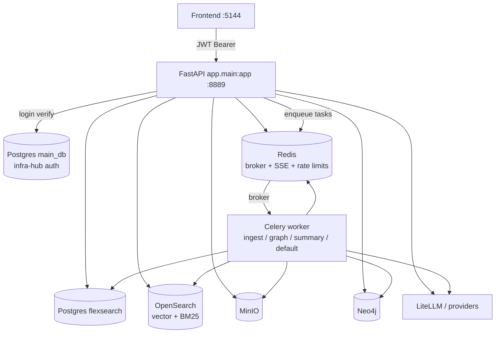
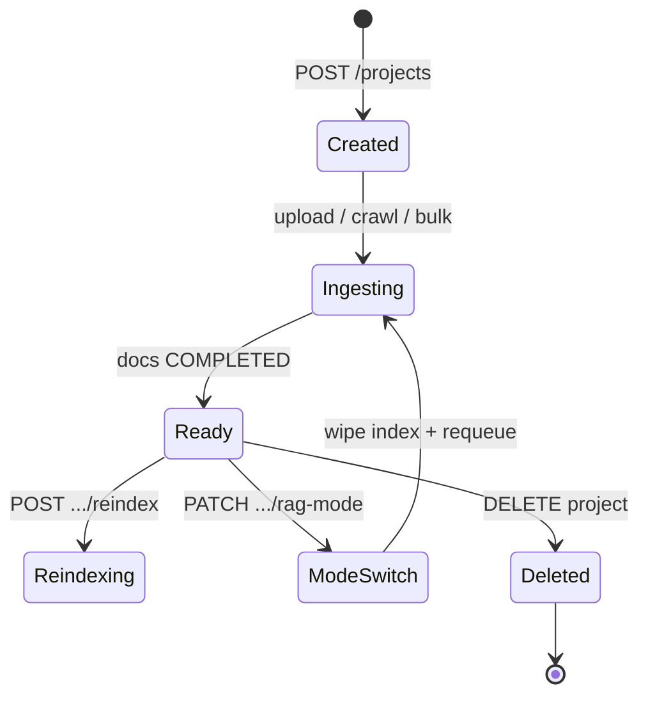
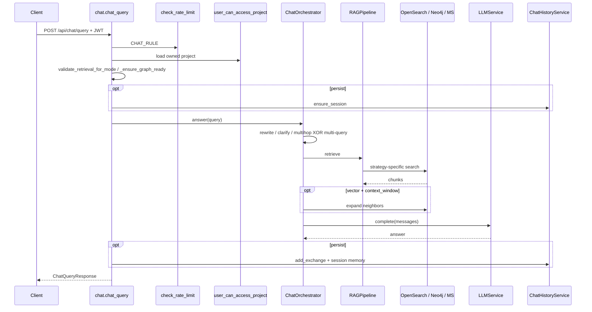

# FlexSearch Backend

FastAPI application shell for FlexSearch: auth, projects, document ingest, OpenSearch vector/BM25 retrieval, Neo4j / Microsoft GraphRAG, chat orchestration, Celery workers, and ops endpoints.

This README is the **hub** for backend architecture. Domain deep-dives live under `docs/` and `app/rag/`.

**What this backend does:** turn uploaded (or crawled) documents into searchable knowledge, then answer questions with citations. The API accepts requests; heavy work (OCR, embedding, graph rebuild) runs in background workers so the HTTP process stays responsive.

### Mental model: shell vs engines

Think of this package as a **control plane** around RAG engines:

| Layer | What it is | Analogy |
|-------|------------|---------|
| **FastAPI shell** (`app/main.py` + `app/api/*`) | Thin HTTP edge: auth, ACL, validate, enqueue, stream progress, return JSON/SSE | Front desk — takes tickets, never runs the factory floor |
| **Celery workers** (`app/celery_app.py` + `app/services/*_worker.py`) | Slow pipelines: extract, embed, index, crawl, bulk, summaries, MS GraphRAG rebuild | Factory floor — same DB/object store as the desk |
| **RAG engines** (`app/rag/`, OpenSearch, Neo4j, LiteLLM) | How knowledge is stored and queried | The machines that cut, sort, and answer |

**Example:** `POST /projects/{id}/documents/upload` returns quickly after MinIO write + Celery enqueue. The browser then listens on SSE while a worker OCR’s the PDF, chunks text, embeds, and upserts OpenSearch. Chat (`POST /chat/query`) stays on the API process (retrieve + LLM), because it must return an answer in one request — but it never re-implements ingest.

---

## Documentation index

| Guide | Description |
|-------|-------------|
| [Auth & ACL](docs/auth/README.md) | Roles, JWT, infra-hub login, owner vs `/admin` ACL |
| [Data model](docs/data-model/README.md) | ER diagram, enums, `init_db` vs Alembic |
| [RAG module](app/rag/README.md) | Pipeline, strategies, factory, vector vs graph |
| [Chat](docs/chat/README.md) | Orchestrator, SSE, citations, history, Redis memory |
| [Query stages](docs/query-stages/README.md) | Rewrite, multi-query, multihop, context expand, debug |
| [Neo4j Graph RAG](docs/neo4j-graph-rag/README.md) | Neo4j graph path end-to-end |
| [OpenSearch](docs/opensearch/README.md) | Index mapping, SearchStore, hybrid RRF, connection matrix |
| [Celery](docs/celery/README.md) | Queues, workers, task IDs, SSE progress |
| [Website crawler](docs/crawler/README.md) | BFS/robots crawl → shared ingest |
| [Bulk `.ragpack`](docs/bulk/README.md) | Import/export + job SSE |
| [Hierarchical summaries](docs/summaries/README.md) | Post-ingest summary queue, hierarchy retrieval |
| [Suggestions](docs/suggestions/README.md) | Project chips + follow-up questions |
| [Eval](docs/eval/README.md) | Golden-set retrieval@k + faithfulness |
| [Ops](docs/ops/README.md) | Metrics, rate limits, SSRF, load smoke |
| [Runbooks](docs/ops/runbooks.md) | Incident playbooks |

---

## Key concepts (glossary)

Short definitions for terms used throughout this backend. Deep dives stay in the linked docs.

| Term | Plain meaning | In this codebase |
|------|---------------|------------------|
| **RAG** | Retrieve relevant passages from your docs, then ask an LLM to answer using them (not from memory alone). | `RAGPipeline` indexes & retrieves; `ChatOrchestrator` wraps retrieve → answer + citations |
| **Vector / dense search** | Find chunks whose embedding vectors are similar to the query embedding. | OpenSearch k-NN via `SearchStore` / dense retrieval |
| **BM25 / sparse search** | Classic keyword ranking (term frequency + document length). Good for exact names and codes. | OpenSearch full-text; fused with dense in hybrid mode |
| **Hybrid + RRF** | Run dense and BM25, then merge rankings. **RRF** (reciprocal rank fusion) scores by rank position, not raw scores. | Client-side RRF in `HybridRetrieval` |
| **Graph RAG** | Index entities/relations (or a GraphRAG workspace) and retrieve via graph traversal instead of (or alongside) chunk vectors. | `rag_mode=graph` → Neo4j or Microsoft GraphRAG |
| **Chunking** | Split extracted text into indexable pieces. | Strategies under `app/rag/chunking/` (vector mode) |
| **Embedding** | Turn text into a numeric vector for similarity search. | `EmbeddingService` — local sentence-transformers or API via LiteLLM |
| **LiteLLM** | One client library that talks to many LLM/embedding providers with a common API. | `app/services/litellm_config.py`, `LLMService`, embeddings |
| **FastAPI** | Python web framework: typed routes, dependency injection, OpenAPI. | `app.main:app` — the HTTP process |
| **Celery** | Background job runner: API enqueues work; workers pull from Redis queues. | `app/celery_app.py` — ingest, graph, summary, default |
| **Alembic** | Database migration tool (versioned SQL/schema changes). | `alembic/versions/`; `make db-migrate` |
| **JWT** | Signed token proving who logged in (no server session store for identity). | Bearer token; **ACL still loads the user from Postgres** |
| **SSE** | Server-Sent Events — one-way HTTP stream of progress/events to the browser. | Document/job/chat streams via Redis pub/sub |
| **Rate limiting** | Cap how often a user/IP can hit expensive endpoints. | Redis sliding window (`check_rate_limit`) |
| **Observability** | Metrics and timing so you can see load and latency. | In-process Prometheus text at `/metrics` (no OpenTelemetry) |
| **infra-hub** | Shared platform services (Postgres auth DB, OpenSearch, Redis, MinIO, Neo4j) that FlexSearch consumes rather than owning. | Compose attaches to external `infra-network` |
| **Citation** | Numbered pointer from an answer claim back to a retrieved passage. | Built in chat after retrieve; UI can open the source chunk |
| **Query stages** | Optional LLM/preprocess steps around retrieve (rewrite, multi-query, multihop, neighbor expand). | `ChatOrchestrator` + `app/rag/chat/stages/` |
| **`.ragpack`** | Zip bundle of project docs/config for bulk import/export. | `app/services/bulk/` |
| **SSRF guard** | Block crawls that target private/internal IPs via public URL tricks. | `CRAWL_BLOCK_PRIVATE_URLS` (default on) |

### Glossary examples (worked)

- **Dense vs BM25:** “What is the refund policy?” → dense often wins (paraphrase). “Find SKU `ACME-4421`” → BM25 often wins (exact token). Hybrid + RRF runs both and merges ranks.
- **JWT vs ACL:** Token says `sub=<user-uuid>`. Route loads that user from Postgres and checks `user_can_access_project`. Promoting someone to admin in the DB works on the next request even if the old JWT still has `role=USER`.
- **SSE vs polling:** Ingest publishes `document:{id}` events on Redis; `GET .../documents/{id}/events` keeps the HTTP response open and forwards those events. Without Redis, the same endpoint falls back to DB polling.
- **FastAPI vs Celery:** Listing projects is FastAPI. Embedding 2,000 chunks is Celery. Chat generation is FastAPI (synchronous request) calling LiteLLM; it does not enqueue a Celery “answer” task.

---

## Architecture overview

FlexSearch is an **app** on shared **infra-hub** services (Postgres, OpenSearch, MinIO, Redis, Neo4j). The API process and Celery workers share the same settings and Redis broker.

**Why two processes?** The FastAPI app answers HTTP quickly (auth, list projects, kick off chat). Slow work — PDF extract, embedding thousands of chunks, Microsoft GraphRAG rebuild — runs in Celery workers so one large ingest does not block other users’ API calls. Both talk to the same databases and object store; Redis is the message bus between them.

**What Redis is doing here (three hats):**

1. **Broker** — Celery task queue (API → worker).
2. **Pub/sub** — progress events for SSE (worker → API → browser).
3. **Ephemeral state** — rate-limit windows, short-term chat memory cache.

Postgres remains the durable source of truth for users, projects, documents, and chat turns. MinIO holds blobs (`raw*` uploads, `extracted.md`). OpenSearch / Neo4j hold the searchable indexes.



| Piece | Role |
|-------|------|
| **Postgres (`flexsearch`)** | App data: users, projects, documents, chat sessions |
| **Postgres (`main_db`)** | Infra-hub identity — used only to verify infra-admin login |
| **OpenSearch** | Chunk vectors + BM25 text index (vector RAG) |
| **MinIO** | Object storage for raw uploads and `extracted.md` |
| **Redis** | Celery broker, SSE pub/sub, chat memory cache, rate-limit windows |
| **Neo4j** | Graph store when `graph_backend=neo4j` |
| **LiteLLM / providers** | Chat completions and (optionally) remote embeddings |

### Ingest vs query paths

Two directions of data flow:

1. **Ingest** — get content into an index (upload, crawl, or bulk pack → extract → vector upsert or graph index).
2. **Query** — retrieve relevant context and (for chat) generate an answer.

**Teaching picture:** ingest is write-heavy and asynchronous; query is read-heavy and latency-sensitive. That is why uploads enqueue Celery, while `/retrieval/query` and `/chat/*` run retrieve (and LLM) in the API process.

```mermaid
flowchart LR
  subgraph ingest [Ingest]
    U[Upload / crawl / bulk] --> Q[Celery ingest]
    Q --> E[Extract → MinIO extracted.md]
    E --> V{rag_mode}
    V -->|vector| OS[OpenSearch upsert]
    V -->|graph neo4j| N4[Neo4j index]
    V -->|graph microsoft| GQ[Celery graph queue]
    OS --> SQ[Celery summary<br/>vector only]
  end
  subgraph query [Query]
    R[POST /api/retrieval/query] --> P[RAGPipeline.retrieve]
    C[POST /api/chat/query\|stream] --> O[ChatOrchestrator]
    O --> P
    P --> OS2[OpenSearch] & N42[Neo4j] & MS[MS GraphRAG]
    O --> LLM2[LLM answer + citations]
  end
```

### Connection matrix (infra-hub)

| Runtime | OpenSearch | Redis (SSE + Celery) |
|---------|------------|----------------------|
| Containers on `infra-network` | `http://opensearch:9200` | `redis://:${REDIS_PASSWORD}@redis:6379/0` |
| Host / local | `http://127.0.0.1:9200` | `redis://:${REDIS_PASSWORD}@127.0.0.1:63791/0` |

Compose (`docker-compose.yml`) overrides `OPENSEARCH_URL`, `REDIS_HOST=redis`, `REDIS_PORT=6379` for the `backend` and `worker` services. Network `infra-network` is **external**.

---

## Quick start

From repository root:

```bash
cp backend/.env.example backend/.env   # fill secrets
make install
make dev-local          # API + Celery worker + frontend
# or:
make worker-local       # Celery only
make up                 # docker compose up -d --build
```

| Target | Purpose |
|--------|---------|
| `make install` | `uv sync` (backend) + `pnpm install` (frontend) |
| `make dev-local` | uvicorn reload + celery `-Q ingest,graph,summary,default` + frontend |
| `make worker-local` | Celery worker only |
| `make up` / `make dev` | Docker app stack |
| `make db-migrate` | `alembic upgrade head` |
| `make db-stamp` | Stamp Alembic head without SQL |
| `make test` | Backend pytest |
| `make eval` | Golden-set eval harness |

**Why API + worker together locally?** Without a worker listening on Redis queues, uploads stay `PENDING`/`PROCESSING` forever: the FastAPI shell only enqueues. `make dev-local` starts both so the full ingest → SSE → ready loop works on one machine.

**Manual API**

```bash
cd backend && source .env && uv sync
uvicorn app.main:app --reload --port "${API_PORT:-8889}" --app-dir .
# or from repo root with --app-dir backend (as Makefile does)
```

**Docker entrypoints**

- API: `backend/Dockerfile` → `uvicorn app.main:app --host 0.0.0.0 --port ${API_PORT}`
- Worker: `backend/Dockerfile.worker` → Celery on queues `ingest,graph,summary,default`

Smoke:

```bash
curl -s http://127.0.0.1:9200 | head
redis-cli -h 127.0.0.1 -p 63791 -a "$REDIS_PASSWORD" ping
curl -s http://127.0.0.1:8889/health
```

---

## App bootstrap & middleware

**Module:** `app/main.py`

On startup (**lifespan**), the app prepares dependencies before serving traffic: ensure Postgres tables exist, Neo4j schema is present, and interrupted graph jobs are reconciled. On shutdown it closes Redis and DB pools cleanly.

| Concern | Behavior |
|---------|----------|
| Lifespan | `init_db()` → Neo4j `ensure_schema()` → `reconcile_interrupted_graph_indexes()`; shutdown `close_redis()` / `close_db()` |
| Middleware | **Only** `CORSMiddleware` (`settings.cors_origins_list`) |
| Auth | Per-route `Depends(get_current_*)` — no global auth middleware |
| Rate limits | Explicit `check_rate_limit(...)` on sensitive routes — not middleware |
| Logging | `setup_unified_logging` + third-party bridge at import; uvicorn `log_config=None` when run as `__main__` |
| Docs | OpenAPI/Swagger disabled at defaults; served at `/api/docs` + `/api/openapi.json` behind HTTP Basic |

**Why no global auth middleware?** Routes choose their own dependency (`get_current_user`, admin-only helpers, or public health). That keeps `/health` and login open while protecting project APIs. **CORS** is the only cross-cutting middleware so browsers on the frontend origin can call the API with credentials/headers as configured.

**Lifespan in plain language:** before the first request, “make sure the filing cabinets exist” (tables/schema) and “mark stuck graph rebuilds honestly” (reconcile). On stop, close pooled connections so Redis/Postgres do not leak clients across reloads.

Routers mounted under `/api`: `auth`, `projects`, `documents`, `website`, `bulk`, `jobs`, `retrieval`, `chat`, `rag`, `admin`.

Root routes: `GET /`, `GET /health`, `GET /metrics` (if enabled).

---

## Environment variables by subsystem

Central loader: `app/core/config.py` (`Settings`). Prefer `.env`; never `os.getenv` elsewhere.

All knobs go through one Pydantic settings object so API and workers agree on hosts, secrets, and feature flags.

| Subsystem | Variables | Notes |
|-----------|-----------|-------|
| **App** | `API_PORT`, `DEBUG`, `LOG_LEVEL`, `SQL_ECHO`, `CORS_ORIGINS`, `APP_PUBLIC_URL`, `APP_PUBLIC_HOST`, `SERVICE_PUBLIC_HOST` | Public URL auto-appended to CORS |
| **Postgres** | `POSTGRES_USER`, `POSTGRES_PASSWORD`, `POSTGRES_HOST`, `POSTGRES_PORT`, `POSTGRES_DB`, `POSTGRES_URL` | URL assembled if omitted |
| **Infra-hub auth** | `INFRA_HUB_POSTGRES_DB`, `INFRA_HUB_POSTGRES_URL` | Default DB `main_db`; URL derived from Postgres creds |
| **OpenSearch** | `OPENSEARCH_URL`, `OPENSEARCH_INDEX_PREFIX`, `OPENSEARCH_INDEX_NAME`, knn `OPENSEARCH_KNN_*`, optional auth/TLS | Index name = `{prefix}_{name}` |
| **MinIO** | `MINIO_ENDPOINT`, `MINIO_ACCESS_KEY`, `MINIO_SECRET_KEY`, `MINIO_BUCKET`, `MINIO_SECURE` | Required keys |
| **Redis / Celery** | `REDIS_HOST/PORT/PASSWORD/DB`, `REDIS_URL`, `CELERY_BROKER_URL`, `CELERY_RESULT_BACKEND`, `CELERY_TASK_ALWAYS_EAGER` | Broker defaults to Redis URL |
| **Neo4j** | `NEO4J_URI`, `NEO4J_USER`, `NEO4J_PASSWORD` | Graph backend `neo4j` |
| **Auth** | `JWT_SECRET`, `JWT_ALGORITHM`, `JWT_EXPIRE_MINUTES` | `JWT_SECRET` required |
| **LLM** | `LLM_API_BASE`, `MODEL_NAME`, `API_KEY` | LiteLLM |
| **Embeddings** | `EMBEDDING_MODEL`, `EMBEDDING_API_BASE`, `EMBEDDING_API_KEY` | Local `sentence-transformers/...` or API |
| **GraphRAG** | `GRAPH_INDEXING_ENABLED`, `GRAPHRAG_*` | Microsoft GraphRAG indexing |
| **Default strategies** | `EXTRACTION_STRATEGY`, `CHUNKING_STRATEGY`, `RETRIEVAL_STRATEGY`, `RERANKING_STRATEGY` | Seed for new project configs |
| **Crawl** | `CRAWL_MAX_DEPTH`, `CRAWL_MAX_PAGES`, `CRAWL_RATE_LIMIT`, `CRAWL_RESPECT_ROBOTS`, `CRAWL_USE_SITEMAP`, `CRAWL_BLOCK_PRIVATE_URLS` | SSRF guard default on |
| **Rate limits** | `RATE_LIMIT_ENABLED`, `RATE_LIMIT_CHAT_PER_MINUTE`, `RATE_LIMIT_CRAWL_PER_MINUTE`, `RATE_LIMIT_BULK_PER_MINUTE`, `RATE_LIMIT_SENSITIVE_PER_MINUTE` | `0` = unlimited for that rule |
| **Metrics** | `METRICS_ENABLED` | `GET /metrics` |

Full template: [`backend/.env.example`](.env.example).

**Concept:** settings are the contract between API and worker containers. If the API points at OpenSearch A and the worker at OpenSearch B, ingest “succeeds” in logs while chat retrieves empty — same code, split brains. Keep one `.env` (or compose env) shared.

---

## Auth & roles

Hierarchy: **`INFRA_ADMIN` > `ADMIN` > `USER`**.

Auth answers two questions: **who are you?** (login → JWT) and **what may you touch?** (ACL against the FlexSearch user row and project ownership).

| Role | How obtained |
|------|----------------|
| `INFRA_ADMIN` | Login succeeds against infra-hub `main_db.users` → linked FlexSearch row |
| `ADMIN` | Created by infra admin via `/api/admin/users` |
| `USER` | `POST /api/auth/register` or admin create |

- JWT: HS256, claims `sub` (user UUID) + `role` + `exp`. **ACL uses DB user**, not the JWT role claim.
- **Normal project routes are owner-only** (`user_can_access_project`). Admins manage other users’ data only via `/api/admin/*`.

**Why DB over JWT role?** A role change in Postgres takes effect on the next request without waiting for token expiry. The JWT proves identity; the database is the source of truth for permissions.

**Worked example**

1. Alice registers → `USER`, gets JWT.
2. She creates project P → she is owner; Bob’s JWT cannot `GET /projects/{P}` (ACL fails even with a valid token).
3. Infra admin promotes Alice to `ADMIN` in Postgres → her existing JWT may still say `role=USER`, but `/api/admin/*` checks the DB role on each call.
4. Infra-admin login is special: password is verified against infra-hub `main_db`, then mapped into a FlexSearch user row — FlexSearch does not own the platform identity store.

Details: [docs/auth/README.md](docs/auth/README.md).

---

## API surface map

All paths prefixed with `/api` unless noted. Auth = Bearer JWT unless stated.

Routers group HTTP endpoints by domain. Prefer this map for “where is X?”, then open the listed module for handlers.

**How to read this map:** each table is a domain facade. Upload/crawl/bulk all eventually call the same ingest enqueue path; chat and retrieval both call `RAGPipeline.retrieve` — different HTTP shapes over one retrieval core.

### Auth — `app/api/auth.py`

| Method | Path | Purpose |
|--------|------|---------|
| POST | `/auth/register` | Local USER signup |
| POST | `/auth/login` | OAuth2 password form → token |
| GET | `/auth/me` | Current user |
| PATCH | `/auth/me/profile` | Local display name |
| POST | `/auth/me/password` | Local password change |

### Projects — `app/api/projects.py`

| Method | Path | Purpose |
|--------|------|---------|
| POST/GET | `/projects` | Create / list owned |
| GET/PATCH/DELETE | `/projects/{id}` | Get / update / delete (owner) |
| POST | `/projects/{id}/reindex` | Requeue COMPLETED docs |
| PATCH | `/projects/{id}/rag-mode` | Destructive vector↔graph switch |
| GET/POST | `/projects/{id}/graph-index/status\|rebuild` | Graph index |
| GET | `/projects/{id}/graph-export` | Microsoft GraphRAG zip |

### Documents — `app/api/documents.py`

| Method | Path | Purpose |
|--------|------|---------|
| POST | `/projects/{id}/documents/upload` | Upload → MinIO → Celery ingest |
| GET | `/projects/{id}/documents` | List |
| GET | `/projects/{id}/documents/events` | Project SSE |
| GET/DELETE | `/projects/{id}/documents/{doc_id}` | Get / delete |
| GET | `.../{doc_id}/events` | Document SSE |
| POST | `.../{doc_id}/retry` | Force full extract |
| GET | `.../{doc_id}/content` | Extracted markdown preview |

### Website / bulk / jobs

| Method | Path | Purpose |
|--------|------|---------|
| POST | `/projects/{id}/crawl` | Enqueue crawl ([crawler](docs/crawler/README.md)) |
| POST | `/projects/{id}/bulk-import` | Upload `.ragpack` ([bulk](docs/bulk/README.md)) |
| GET | `/projects/{id}/export` | Download `.ragpack.zip` |
| GET | `/jobs/{job_id}/events` | Crawl/bulk SSE |
| GET | `/projects/{id}/suggestions` | Suggested questions |
| POST | `/chat/suggestions/followup` | Follow-ups |

### Retrieval & chat

| Method | Path | Purpose |
|--------|------|---------|
| POST | `/retrieval/query` | Retrieve-only chunks |
| POST | `/chat/query` | Sync RAG answer |
| POST | `/chat/stream` | SSE RAG stream |
| CRUD | `/chat/sessions...` | History |

**Retrieve vs chat:** `/retrieval/query` is the Search lab — ranked passages, no LLM answer. `/chat/query` and `/chat/stream` run the same retrieve path, then generate a grounded answer with citations and optional session history. Prefer retrieval when debugging index quality; prefer chat for the product answer UX.

### RAG options & admin

| Method | Path | Purpose |
|--------|------|---------|
| GET | `/rag/options` | UI strategy defaults by mode/backend |
| * | `/admin/...` | User/project/document admin ([auth](docs/auth/README.md)) |

OpenAPI UI: `GET /api/docs` (HTTP Basic against FlexSearch users).

---

## Database models & migrations

Entities: **User → Project → Document**; **ChatSession → ChatTurn** (project- and user-scoped).

Enums: `UserRole`, `RagMode` (`vector`|`graph`), `DocumentStatus` (ingest pipeline), graph index status in JSON.

**Dual schema paths:**

1. **Startup `init_db()`** — `create_all` + ad-hoc ALTER helpers (hierarchy, name, rag_config, document columns). Convenient for local/dev bring-up.
2. **Alembic** `001`…`008` — including `rag_mode` and chat tables. Versioned, reviewable changes for shared/prod environments.

Prefer `make db-migrate` in shared environments; use `make db-stamp` when schema already matches via `init_db` (marks Alembic “at head” without re-running SQL).

**Why both?** Early iterations used `init_db()` for speed; Alembic is the durable migration history. Stamp when the live schema already matches so you do not double-apply columns.

**Ownership mental model:** a project belongs to one user (owner). Documents belong to a project. Chat sessions belong to `(project, user)` — two users never share a session row even on the same project (normal routes are owner-only anyway). Deleting a project cascades ORM children and also wipes index/object-store data via lifecycle helpers (see below).

Full ER, status machines, and migration table: [docs/data-model/README.md](docs/data-model/README.md).

---

## Project lifecycle

A **project** is an owned workspace with one RAG mode (vector or graph), a `rag_config`, and zero or more documents. Lifecycle steps below map API actions to the services that mutate indexes and storage.

**Why projects exist:** they are the ACL boundary, the RAG-mode boundary, and the index namespace. Switching mode is destructive because OpenSearch chunk indexes and Neo4j/MS graph indexes are not interchangeable views of the same rows — they are different representations that must be rebuilt from `extracted.md` / raw files.



| Step | Code |
|------|------|
| Create | `projects.create_project` — owner = current user; `rag_config` from body or defaults; graph gets `graph_index_status` |
| Access | Owner-only on normal routes; admins use `/admin` |
| Upload | `documents.upload_document` → MinIO `raw*` → `schedule_process_document` |
| Crawl / bulk | `create_and_enqueue_document` → same ingest queue |
| Mode switch | `wipe_index_for_mode` then reset config/status and requeue all docs |
| Delete project | `delete_project_fully` — wipe indexes + cascade ORM |
| Delete document | Cancel Celery ingest/summary → delete MinIO + index data → ORM delete |

**Narrative walkthrough**

1. **Create** — empty folder with a chosen mode (`vector` or `graph`) and strategy defaults.
2. **Ingest** — upload PDF, crawl a site, or import `.ragpack`. Each path creates Document rows and enqueues Celery; status moves through the document state machine until `COMPLETED` (or `FAILED`).
3. **Ready** — chat/retrieval can hit the index. Vector projects may still build hierarchical summaries asynchronously on the `summary` queue after `COMPLETED`.
4. **Reindex** — keep files, rebuild index (e.g. after changing chunk/embed settings that require re-chunk).
5. **Mode switch** — wipe the old index backend, flip `rag_mode`, requeue everything. Treat as a migration, not a toggle.
6. **Delete** — remove Postgres rows **and** OpenSearch/Neo4j/MinIO artifacts so orphans do not linger in infra-hub.

Document status machine: see [data-model](docs/data-model/README.md#documentstatus-string-via-strenumtype).

---

## SSE & Redis

**SSE** lets the UI watch long jobs (ingest, crawl, bulk, chat stream) without polling every second. The API holds an HTTP response open and pushes events as Redis publishes them.

**Mental model:** the worker does the work and shouts progress into a Redis channel; the API process subscribed for that browser connection forwards shouts as `text/event-stream` lines. Chat streaming is similar in shape (long-lived HTTP) but emits LLM tokens and stage debug events from the API process itself, not from Celery.

Redis (`app/services/redis_client.get_redis`) is used for:

| Use | Mechanism |
|-----|-----------|
| Document / project progress | Pub/sub channels + SSE (`app/api/document_sse.py`) |
| Crawl / bulk jobs | Job meta + pub/sub (`app/services/job_events.py`, `app/api/jobs.py`) |
| Chat session memory | `SessionMemoryService` (TTL); hydrates from Postgres on miss |
| Rate limits | Sorted-set sliding window (`app/core/rate_limit.py`) |
| Celery | Broker + result backend |

If Redis is unavailable: document/job SSE **falls back to DB/poll**; rate limits fall back to **in-process** windows; Celery will not run.

SSE response headers: `Cache-Control: no-cache`, `Connection: keep-alive`, `X-Accel-Buffering: no`.

**Example:** after upload, the UI opens `GET /api/projects/{id}/documents/{doc_id}/events`. Events might include status transitions (`EXTRACTING` → `EMBEDDING` → `COMPLETED`). Crawl/bulk use `GET /api/jobs/{job_id}/events` with the same pattern. Chat uses `POST /api/chat/stream` (SSE body on the POST response) for tokens + citations + optional debug stages.

---

## Rate limits

`app/core/rate_limit.check_rate_limit` — enabled when `RATE_LIMIT_ENABLED=true`.

Protects expensive or abuse-prone routes (chat LLM calls, crawl, bulk). Upload and retrieval are intentionally left open for lab/UX flows; tighten at the reverse proxy if needed.

| Rule name | Default / min | Applied on |
|-----------|---------------|------------|
| `chat` | 60 | `POST /chat/query`, `/chat/stream` |
| `crawl` | 10 | `POST .../crawl` |
| `bulk` | 10 | bulk-import / export |
| `sensitive` | 30 | suggestions endpoints |

Key: `user:{id}` when authenticated, else client IP (`X-Forwarded-For` first hop). Exceeded → `429` + `Retry-After`.

**Not rate-limited by this module:** upload, retrieval, admin, reindex, graph rebuild.

**Why these defaults?** Chat burns LLM tokens; crawl/bulk can fan out into many ingest jobs; suggestions are lighter but still LLM-backed. Upload/retrieval stay unlimited here so demos and Search-lab iteration are not friction-gated — production deployments often add edge limits anyway.

**Sliding window (plain language):** count hits in the last 60 seconds for key `user:…` or IP. Redis sorted sets coordinate across API replicas; if Redis is down, each process keeps its own deque (weaker, still better than nothing).

---

## Health & metrics

**Health** answers “can this API reach its critical path dependencies?” **Metrics** answer “how much work is happening and how slow are the stages?”

| Endpoint | Behavior |
|----------|----------|
| `GET /health` | Pings OpenSearch + Redis. `status` is `healthy` only if **both** are `ok`; else `degraded`. Optionally embeds `metrics.snapshot()` when `METRICS_ENABLED`. **Does not** check Postgres or Neo4j. |
| `GET /metrics` | Prometheus text exposition; `404` if metrics disabled |
| Compose healthcheck | `curl -f http://localhost:8889/health` |

In-process counters live in `app/observability/metrics.py` (retrieval, chat, rate-limit hits, …). Stage timings use `app/observability/tracing.py` hooks into the same registry — **not** distributed OpenTelemetry traces. Counters are per process (scrape the API for chat/retrieval; worker processes hold their own ingest counters).

**Why OpenSearch + Redis only?** Those two are on the hot path for vector retrieve and for Celery/SSE coordination. Postgres/Neo4j failures surface on first failing request; health stays a cheap liveness/dependency probe, not a full dependency DAG.

---

## Celery queues overview

App: `app/celery_app.py`. **No Celery Beat** — all work is on-demand (nothing runs on a crontab).

Queues isolate workloads so a long GraphRAG rebuild does not starve document ingest, and summary jobs stay off the critical ingest path.

| Queue | Tasks |
|-------|-------|
| `ingest` | `process_document_task` |
| `graph` | `rebuild_graph_index_task` (Microsoft GraphRAG rebuild) |
| `summary` | `build_document_summaries_task` (vector mode; skipped for graph/MS) |
| `default` | `website_crawl_task`, `bulk_import_task` → each calls `create_and_enqueue_document` → **ingest** |

Worker command (Makefile / compose):

```bash
celery -A app.celery_app worker -Q ingest,graph,summary,default --concurrency=2
```

**Queue story with an example:** crawling `example.com` runs on `default`, creates one Document per page, and each page’s heavy extract/embed lands on `ingest`. A Microsoft GraphRAG rebuild runs on `graph` so it does not block those page ingests. After vector ingest completes, hierarchical summaries enqueue on `summary` so “doc is searchable” is not blocked on cluster-summary LLM calls.

Details: [docs/celery/README.md](docs/celery/README.md).

---

## RAG / retrieval behavior (shell-relevant)

**RAG in one sentence:** find the best passages for a question, then (for chat) prompt an LLM with those passages and return an answer with citations.

Projects pick **`rag_mode`**: **vector** (OpenSearch chunks) or **graph** (Neo4j / Microsoft GraphRAG). Mode switch wipes the old index and requeues documents — the two backends are not mixed in one project.

**When to choose which mode (product intuition)**

| Mode | Good for | Index shape |
|------|----------|-------------|
| **vector** | “Where does the doc say X?” passage Q&A, keyword + semantic hybrid | Chunks (and optional summary docs) in OpenSearch |
| **graph** | Entities, relations, corpus-level themes; local/global graph queries | Neo4j subgraph or Microsoft GraphRAG workspace |

Same upload → extract → chat wrapper; different index + retrieve strategies. See [app/rag/README.md](app/rag/README.md) for strategy factories.

| Topic | Actual behavior |
|-------|-----------------|
| Vector store | **OpenSearch only** (dense + BM25 + client-side hybrid RRF) |
| BM25 `k1`/`b` | Accepted in config / `SparseRetrieval` but **not applied** to OpenSearch queries (index-level similarity) |
| Hybrid | Client-side RRF over dense + BM25 (`HybridRetrieval`, `rrf_k`) |
| Chat stages | Wrap `RAGPipeline.retrieve` — see [query-stages](docs/query-stages/README.md) |
| Multihop vs multi-query | **XOR**: if `multihop.enabled`, multi-query is skipped (`ChatOrchestrator._retrieve_staged`) |
| `context_window` | Neighbor expand runs only for **`rag_mode=vector`** |
| Summaries | Post-ingest on `summary` queue; graph mode skips; summary failure still leaves doc `COMPLETED` |

**Stage XOR example:** Multi-query asks several paraphrases and fuses hits (breadth). Multihop decomposes a complex question into sequential retrieves (depth). Enabling both would double cost and confuse fusion, so the orchestrator runs multihop **or** multi-query, never both.

**Neighbor expand example:** Retrieve hits chunk 12 of a doc; `context_window=1` also pulls chunks 11 and 13 so the LLM sees surrounding sentences. That only applies to vector OpenSearch indexes with `chunk_index` neighbors — graph retrieval returns different context shapes.

**LLM / embeddings:** chat completions and remote embeddings go through **LiteLLM** (`LLM_API_BASE`, `MODEL_NAME`, `API_KEY`). Local `sentence-transformers/...` embedding models bypass LiteLLM and run in-process.

### Graph notes (post-audit fixes)

1. **`graph_backend` in retrieve:** `RAGPipeline.retrieve` passes `GraphEffectiveRagConfig` (includes `graph_backend`) into `build_graph_retrieval_strategy`. Bare `GraphRetrievalConfig` still defaults to neo4j.
2. **`wipe_neo4j_graph`:** calls `delete_project_subgraph` (aligned with `Neo4jStore`).
3. **MS rebuild lock:** Celery task holds `_in_flight` and calls `build_index_for_project(..., manage_in_flight=False)` to avoid same-process no-op skip. `_in_flight` remains process-local across workers.

Pipeline delete helpers for graph mode always use Neo4j subgraph APIs (not MS workspace wipe) — project delete/mode-switch should go through `wipe_index_for_mode` instead. See [neo4j-graph-rag](docs/neo4j-graph-rag/README.md) §10 for remaining gaps (`max_context_tokens`, Neo4j “global” semantics).

---

## Typical RAG chat request flow

End-to-end: authenticate → rate-limit → ACL → optional session → orchestrator stages → retrieve → LLM → persist.

**What each step is protecting or producing**

| Step | Why it exists |
|------|----------------|
| JWT + load user | Prove identity; DB row for ACL/role |
| `check_rate_limit` | Cap LLM spend / abuse on chat |
| `user_can_access_project` | Owner-only knowledge boundary |
| `validate_retrieval_for_mode` / graph ready | Fail fast if index/mode mismatch or MS index not built |
| Query stages | Improve recall/precision before/around retrieve |
| `RAGPipeline.retrieve` | Grounding context from the project index |
| LLM complete/stream | Answer text (and tokens on SSE) |
| History + Redis memory | Multi-turn follow-ups without re-pasting the whole thread |



**Sync vs stream:** `/chat/query` waits for the full `ChatQueryResponse`. `/chat/stream` uses SSE so the UI can render tokens and optional debug stage events as they happen; citations still arrive when retrieval + generation have enough to publish them. Both share `ChatOrchestrator` — streaming is a delivery mode, not a second RAG stack.

---

## Tests (entry points)

```bash
cd backend && .venv/bin/pytest tests/ -v
```

Notable suites: `test_chat.py`, `test_query_stages.py`, `test_opensearch_retrieval.py`, `test_phase4_*.py`, `test_phase5.py`, `test_rag_mode_switch.py`.

Eval: `make eval` → `python -m app.eval`.

Tests are the executable contract for mode switch, OpenSearch hybrid behavior, and chat stages — prefer them over re-deriving behavior from older docs when unsure.

---

## Related root docs

- Repo deployment notes: [`docs/deployment.md`](../docs/deployment.md) (ops/deploy; verify against this README + compose).
- Frontend consumes the `/api` surface above via `frontend/src/lib/api.ts`.
