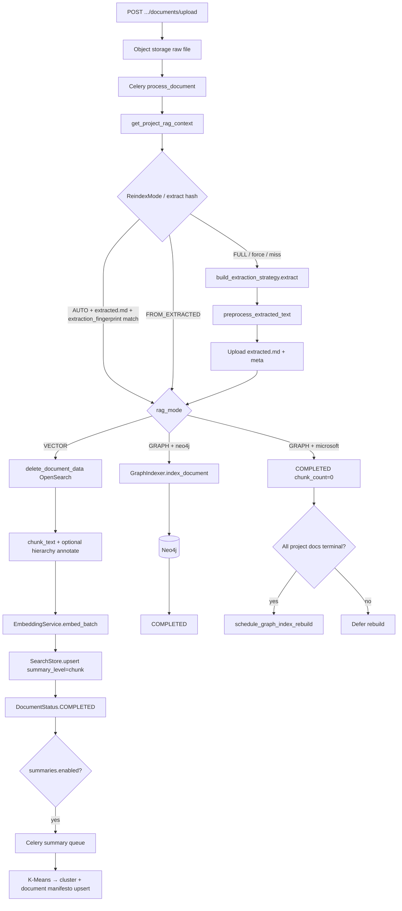
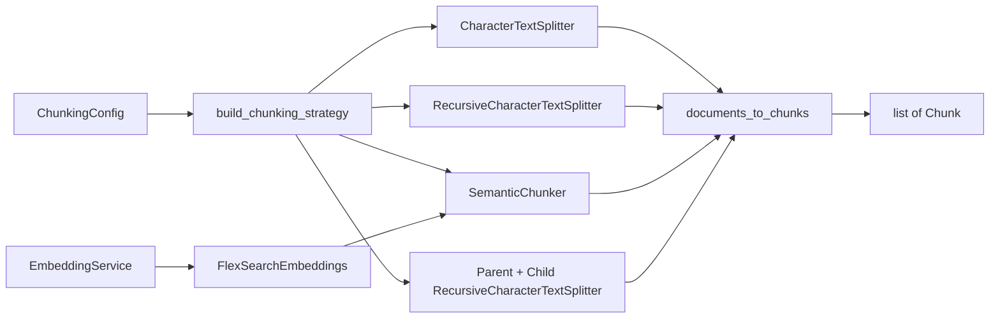
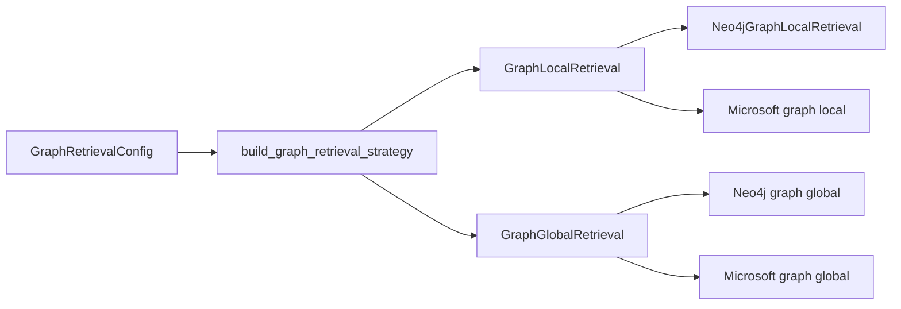
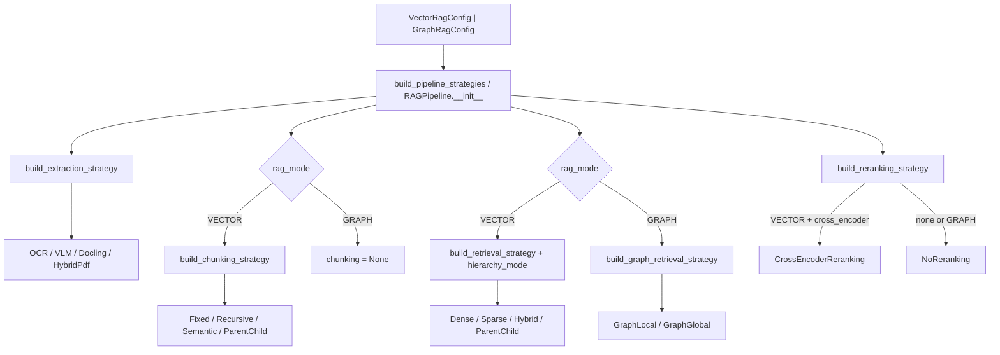
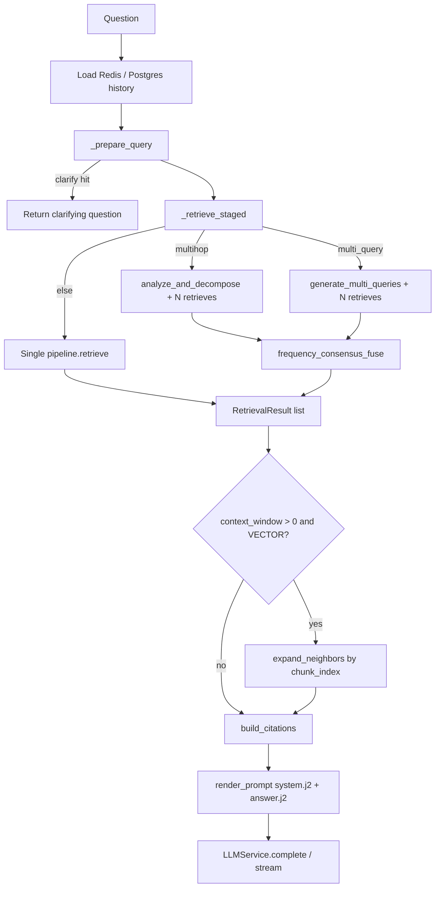

# FlexSearch RAG Module

Technical architecture **and conceptual map** for `backend/app/rag/`: strategy-pattern ingest, indexing, retrieval, and the chat layer that wraps retrieval for answer generation.

This document is derived from the implementation (not from older READMEs). Class and file names match the code as of the enterprise RAG upgrade.

---

## What is RAG here?

**RAG (Retrieval-Augmented Generation)** means: before the LLM answers, the system finds relevant pieces of *your* documents and passes them as context. That keeps answers grounded in project content instead of the model’s prior alone.

Think of it as a closed-book exam vs open-book:

| Without RAG | With RAG |
|-------------|----------|
| Model answers from training memory | Model answers from passages you retrieved |
| May invent details for private docs | Can cite chunk text that actually exists |
| One shot: question → tokens | Two phases: **find evidence** → **write from evidence** |

FlexSearch’s end-to-end path (vector mode) is five conceptual stages:

```
ingest/extract → chunk → embed (+ index) → retrieve (+ optional rerank) → generate
```

| Stage | Plain job | FlexSearch home |
|-------|-----------|-----------------|
| **1. Ingest / extract** | Turn files into clean text (`extracted.md`) | `ingestion/*` |
| **2. Chunk** | Split text into searchable units | `chunking/*` |
| **3. Embed + index** | Vectors (and/or graph nodes) into storage | `EmbeddingService` + `SearchStore` / Neo4j |
| **4. Retrieve (+ rerank)** | Given a question, find the best context | `retrieval/*`, `reranking/*` |
| **5. Generate** | Prompt from hits → LLM answer | `ChatOrchestrator` + `app/prompts/` |

**Worked example (one question through the pipe):**

1. Upload `API-Guide.pdf` → OCR/Docling produces `extracted.md`.
2. Recursive chunking yields ~80 chunks; each is embedded and upserted to OpenSearch (`summary_level=chunk`).
3. User asks: *“How do I rotate the webhook signing key?”*
4. Dense (or hybrid) retrieval returns the 5 nearest chunks; optional cross-encoder reorders them.
5. `answer.j2` numbers those passages; the LLM answers *from* them and the UI can cite chunk ids.

Graph mode shares upload → extract → chat, but replaces chunk/embed/OpenSearch with entity/relation (or community) indexing and `graph_local` / `graph_global` retrieval.

**Why strategies / factories?** Each stage is pluggable (`ocr` vs `vlm`, `dense` vs `hybrid`, etc.) so a project can trade cost, latency, and quality without forking the pipeline. Factories in `factory.py` wire config → concrete classes (see §10).

---

## Glossary (quick)

| Term | Plain meaning |
|------|----------------|
| **Chunk** | A slice of document text small enough to embed and retrieve. |
| **Embedding** | A numeric vector that places text in a space where similar meaning is nearby. |
| **Dense retrieval** | Search by vector similarity (semantic match). |
| **Sparse / BM25** | Keyword search: term frequency + document length, good for exact words/IDs. |
| **Hybrid + RRF** | Run dense and BM25, then merge ranked lists with Reciprocal Rank Fusion. |
| **Reranking** | Re-score a short candidate list with a stronger (slower) model. |
| **Parent–child** | Index small children for match quality; return larger parents for context. |
| **Hierarchy / summaries** | Cluster- and document-level summary docs that can gate or expand retrieval. |
| **Graph RAG** | Index entities/relations (or communities) instead of (or alongside) vector chunks; query the graph. |
| **Orchestrator stages** | Optional LLM steps around retrieve: rewrite, multi-query, multi-hop, expand neighbors. |
| **Strategy pattern** | Swap algorithm behind a shared interface; config picks the class, callers stay unchanged. |

---

## 1. Scope: vector vs graph

Projects are **mutually exclusive** on `Project.rag_mode` (`RagMode.VECTOR` | `RagMode.GRAPH`). Mode is immutable except via `PATCH /projects/{id}/rag-mode`, which wipes the old index and requeues documents.

**Why two modes?**

- **Vector RAG** — Best default for “find passages that say X.” Chunks live in OpenSearch; answers cite text windows.
- **Graph RAG** — Better when the question needs entities, relationships, or corpus-wide themes (who/what is connected; community-level overviews). Indexing and retrieval go through Neo4j or Microsoft GraphRAG, not the OpenSearch chunk path.

Same upload → extract → chat wrapper; different index and retrieve strategies.

| Concern | Vector RAG | Graph RAG |
|---------|------------|-----------|
| Config type | `VectorRagConfig` | `GraphRagConfig` |
| Extract | `ocr` / `vlm` / `docling` / `hybrid_pdf` | Same extract strategies |
| Chunking | `fixed_window` / `recursive` / `semantic` / `parent_child` | No vector chunker; Neo4j uses `GraphIndexer.split_passages` (`passage_chunk_size`) |
| Index | OpenSearch via `SearchStore` | Neo4j **or** Microsoft GraphRAG workspace |
| Retrieval | `dense` / `bm25` / `hybrid` / `parent_child` | `graph_local` / `graph_global` |
| Reranking | `none` / `cross_encoder` | Always `NoReranking` |
| Summaries | Optional hierarchical cluster/document docs in OpenSearch | Skipped for Microsoft GraphRAG; not used for Neo4j vector hierarchy |
| Orchestrator | `RAGPipeline` + `ChatOrchestrator` | Same chat wrapper; retrieve dispatches to graph strategies |

Shared across modes: upload → Celery ingest → extraction → object-storage `extracted.md`, status SSE, `/api/chat/*`, lab retrieval APIs.

**Related packages outside this folder:**

| Path | Role |
|------|------|
| `app/schemas/rag_config.py` | All knobs, fingerprints, overrides |
| `app/services/search_store/` | OpenSearch `SearchStore` (sole implementation) |
| `app/services/vector_store.py` | Shim: `get_vector_store` → `get_search_store` |
| `app/services/embedding.py` | `EmbeddingService` (local ST or LiteLLM) |
| `app/services/document_worker.py` | Celery ingest orchestration |
| `app/services/summary/` | Hierarchical summary job |
| `app/prompts/` | Jinja2 prompt pack |
| `app/rag/chat/` | `ChatOrchestrator` + stages |
| `app/rag/graph/` | Neo4j `GraphIndexer` / entity extract |

---

## 2. Module map

| Path | Role |
|------|------|
| `pipeline.py` | `RAGPipeline`: extract, chunk, index, retrieve, delete |
| `factory.py` | Build strategies from config |
| `ingestion/` | `OCRExtractionStrategy`, `VLMExtractionStrategy`, `DoclingExtractionStrategy`, `HybridPdfExtractionStrategy`, preprocess, hierarchy annotate |
| `chunking/` | LangChain-backed fixed / recursive / semantic / parent-child |
| `embedding/` | `LocalEmbeddingBackend` (used by `EmbeddingService`) |
| `retrieval/` | Dense, sparse (BM25), hybrid, parent-child, hierarchy helpers, graph_* dispatch |
| `reranking/` | `NoReranking`, `CrossEncoderReranking` |
| `chat/` | Orchestrator + rewrite / multi-query / multihop / fusion / context expand / debug |
| `graph/` | Neo4j indexing path |

---

## 3. Ingest flowchart

Celery entry: `process_document_task` (`ingest` queue) → `document_worker.process_document()`.

**Conceptually:** a document becomes searchable only after extract → (vector: chunk → embed → upsert) or (graph: index into Neo4j / defer Microsoft rebuild). Skip-extract avoids re-OCR when the extraction config fingerprint still matches, but vector reindex still re-chunks.



### Status machine (vector)

`UPLOADED` → `STORED` → `EXTRACTING` → `EXTRACTED` → `CHUNKING` → `INDEXING` → `COMPLETED` (then async summary).

Graph Neo4j uses `GRAPH_INDEXING` instead of chunk/index. Microsoft marks complete after extract and rebuilds at project scope.

### Skip-extract rules (`ReindexMode`)

| Mode | Behavior |
|------|----------|
| `AUTO` | Skip extract if `extracted_text_path` exists, `extraction_config_hash == extraction_fingerprint(extraction)`, and file present. Still re-chunks/re-indexes for vector. |
| `FROM_EXTRACTED` | Require existing `extracted.md`; never re-extract. |
| `FULL` / `force_full_extract=True` | Always re-extract. |

Note: skip hash is **extraction-only** (`extraction_fingerprint`). Vector `ingestion_fingerprint` hashes extraction **and** chunking but is not what gates skip-extract.

---

## 4. Extraction strategies

Factory: `build_extraction_strategy(ExtractionConfig | GraphExtractionConfig)` in `factory.py`.

**Why extraction exists:** Raw uploads are not LLM-ready. PDFs may be scanned; HTML has chrome; images need OCR or vision. Extractors produce a single text (often markdown) that chunking and graph passage splitters consume. Bad extract → garbage chunks → retrieval cannot recover what was never indexed.

### Conceptual guide: when to pick which

| Strategy | Intuition | Prefer when… | Cost / latency |
|----------|-----------|--------------|----------------|
| **OCR** | “Read the letters.” Native PDF text first; Tesseract when a page looks empty/scanned. | Digital PDFs, scans of prose, default ops path | Low–medium |
| **hybrid_pdf** | Same native-then-OCR idea with different empty-page thresholds and batching for sparse pages. | Large PDFs with mixed native + scanned pages | Similar to OCR; slightly different trigger |
| **VLM** | “Look at the page like a human.” Vision LLM reads every page as an image. | Figures, complex layout, forms where text layer is wrong | High (API + DPI render) |
| **Docling** | “Preserve structure.” IBM Docling → markdown with headings/tables. | Manuals, specs, docs where section structure matters for chunking | Medium; structure-aware |

**Worked examples:**

| Document | Likely choice | Why |
|----------|---------------|-----|
| Text-layer PDF policy handbook | `ocr` | Cheap native extract is enough |
| Phone-photo of a whiteboard | `vlm` (or OCR if only plain text) | Layout + handwriting; VLM stronger on scene understanding |
| Product PDF with tables + TOC | `docling` | Headings/tables survive into markdown for recursive/semantic chunking |
| 400-page mix of born-digital + scanned appendices | `hybrid_pdf` | OCR only sparse pages; avoid full VLM bill |

| `strategy` | Class | PDF | Images | text/md/html |
|------------|-------|-----|--------|--------------|
| `ocr` (default) | `OCRExtractionStrategy` | pypdf; OCR page if &lt;50 non-ws chars; full OCR fallback | Tesseract | Direct decode / HTML via `content_extractor` |
| `hybrid_pdf` | `HybridPdfExtractionStrategy` | pypdf; OCR if &lt;40 chars; batch `convert_from_bytes` for sparse pages | Tesseract | Same |
| `vlm` | `VLMExtractionStrategy` | Every page → image → vision LLM (`VLM_PDF_DPI=120`, max side 1280) | Vision LLM | Direct |
| `docling` | `DoclingExtractionStrategy` | IBM Docling → markdown | Via Docling | Direct for plain/md; Docling for HTML |

All implement `BaseExtractionStrategy.extract(...) → ExtractedContent`.

**MIME gap:** `DoclingExtractionStrategy.SUPPORTED_TYPES` includes docx/pptx, but `api/documents.py` upload allowlist is only pdf, plain, markdown, html, png, jpeg — so Docling’s Office formats are unreachable via the upload API.

**Near-duplicate:** `ocr` and `hybrid_pdf` both do native-text-then-OCR; thresholds and progress handling differ slightly (`hybrid_pdf` discards `on_progress` in the sync helper).

---

## 5. Preprocess

Applied in `document_worker` after extract (not inside extractors), gated by `extraction.preprocess` (`PreprocessConfig`, default `enabled=True`):

1. **Encoding** — `ftfy.fix_text` if installed, else `unicodedata.normalize("NFKC")`
2. **Headers/footers** — `remove_repeated_headers_footers` (repeated short edge lines / page numbers)
3. **Whitespace** — collapse blank lines, strip trailing spaces

**Why:** OCR/PDF noise (mojibake, repeated page headers, runaway blank lines) pollutes embeddings and BM25. Cleaning once before chunking improves both.

Entry point: `ingestion/preprocess.py` → `preprocess_extracted_text(...)`.

Stored `content_format` is `"markdown"` for `vlm`/`docling`, else `"plain"`.

### Hierarchy metadata (vector)

If `extraction.extract_hierarchy` (default `True`), after chunking `pipeline.chunk_text` calls `annotate_chunks_with_hierarchy(text, chunks)` (`ingestion/hierarchy.py`): markdown ATX headings → `heading_path` / `section_title` on each chunk’s metadata. Graph configs have no this flag.

**Why:** Heading path is metadata for citations and filtering/debug — it does not replace hierarchical *summary* docs (those are the async cluster/document summaries in §7).

---

## 6. Chunking

Vector only. Factory: `build_chunking_strategy(ChunkingConfig)`.

**Why chunk?** Embedders and context windows have limits. Too large → diluted vectors and wasted tokens; too small → answers lack surrounding context. Overlap keeps sentences that straddle boundaries from disappearing.

### Conceptual guide: when to use each

| Strategy | Idea | Use when… | Avoid when… |
|----------|------|-----------|-------------|
| **fixed_window** | Slice by character count on whitespace. | Homogeneous prose; you want predictable sizes and simple ops. | Docs with clear sections/code you must not split mid-block. |
| **recursive** | Prefer natural separators (paragraphs → lines → words); optionally keep code fences / tables atomic. | Mixed docs, markdown manuals, code+prose. **Good default upgrade from fixed.** | You need topic-coherent splits that ignore separator layout. |
| **semantic** | Embed sentences; split where meaning shifts (similarity breakpoint). | Topic drifts inside long sections (research notes, narratives). | Tight latency budgets at ingest (extra embedding pass). |
| **parent_child** | Small **children** for precise retrieval; large **parents** returned as context. | Long manuals/SOPs: needle match + wide answer window. | Tiny docs; or retrieval strategy is not `parent_child` (children alone are awkward for dense-only). |

**Worked examples:**

1. **Fixed window — blog posts / FAQs**  
   Uniform short articles. Size 512 / overlap 50 is enough; mid-section cuts are rare and overlap papers over them.

2. **Recursive — API markdown with code fences**  
   Separators try `\n\n` before mid-paragraph cuts; `preserve_structure=True` keeps fenced code / pipe tables as atomic units so a retrieve hit is not half a JSON example.

3. **Semantic — meeting notes that change subject**  
   One file covers “budget” then “hiring.” Semantic breakpoints tend to cut between topics even without heading markers.

4. **Parent–child — 200-page operations manual**  
   - Child (~300 chars): matches *“torque the flange bolts to 45 Nm”*.  
   - Parent (~1500 chars): returns the surrounding procedure (tools, safety, next step).  
   Retrieval (`ParentChildRetrieval`) searches **children**, then loads **parents** by id so the LLM sees the wider window.

### Strategies (concept → behavior)

| Strategy | Idea | Tradeoff |
|----------|------|----------|
| **fixed_window** | Slice by character count on whitespace. | Simple, predictable; may cut mid-section. |
| **recursive** | Prefer natural separators (paragraphs → lines → words); optionally keep code fences / tables atomic. | Better structure preservation for prose and mixed docs. |
| **semantic** | Embed sentences; split where meaning shifts (similarity breakpoint). | Topic-coherent chunks; needs embeddings at ingest; slower. |
| **parent_child** | Small **children** for precise retrieval; large **parents** returned as context. | Best of both: match on fine grain, answer with wider window. |

All strategies are **LangChain-backed** (see `chunking/langchain_adapter.py`):

| `strategy` | LangChain core | Default params | Behavior |
|------------|----------------|----------------|----------|
| `fixed_window` | `CharacterTextSplitter` (`separator=" "`, `add_start_index=True`) | size 512, overlap 50 | Fixed char windows; break on whitespace |
| `recursive` | `RecursiveCharacterTextSplitter` | 512 / 50, `preserve_structure=True` | Separator cascade; optional atomic code fences / pipe tables |
| `semantic` | `SemanticChunker` (`langchain_experimental`) + FlexSearch embeddings | sim 0.5 → percentile breakpoint, min 100, max 1000 | Sentence embeddings → semantic breakpoints; oversized groups capped with recursive splitter |
| `parent_child` | Nested `RecursiveCharacterTextSplitter` | parent 1500, child 300, overlap 50 | Emits parents + children with `chunk_type`, `parent_chunk_id`, `parent_id` |

**Adapter:** `FlexSearchEmbeddings` wraps `EmbeddingService` for LangChain's `Embeddings` ABC. `documents_to_chunks` maps LangChain `Document` + `start_index` → FlexSearch `Chunk` (per-chunk metadata copies).

**Deps:** `langchain-text-splitters`, `langchain-core`, `langchain-experimental` (SemanticChunker; package is in maintenance/sunset — still the supported LangChain semantic splitter).

Graph mode: `RAGPipeline._chunking = None`; Neo4j passages from `GraphIndexer.split_passages(text, config.extraction.passage_chunk_size)` (default 800).

**Parent-child ID contract:** parents store under OpenSearch `_id = parent_chunk_id` (UUID). Children keep `parent_id` pointing at that id. `ParentChildRetrieval` searches children then `get_by_ids(parent_ids)`. Parents abut with **no** overlap; only children overlap inside a parent (keeps child offsets inside one parent window).



---

## 7. Embedding and OpenSearch write path

```
list[Chunk]
  → EmbeddingService.embed_batch([c.content for c in chunks])
  → list[SearchDocument]
  → SearchStore.upsert(...)
```

### Embedding

**Concept:** An embedding model maps text → a fixed-length vector. At query time the question is embedded the same way; **dense** search finds nearest neighbors (kNN in OpenSearch). Paraphrases land nearby even when words differ (“rotate signing key” ≈ “rotate webhook secret”).

- Service: `app/services/embedding.py` → `get_embedding_service()`
- Backend: local `sentence-transformers/...` (`LocalEmbeddingBackend`) **or** LiteLLM API (`vector_embedding_endpoint()`)
- Default model: `sentence-transformers/all-MiniLM-L6-v2` (`Settings.embedding_model`)
- GraphRAG Microsoft path uses `get_graphrag_embedding_service()` separately

### SearchStore (sole backend: OpenSearch)

| Piece | Location |
|-------|----------|
| Protocol | `app/services/search_store/protocol.py` → `SearchStore` |
| Types | `SearchDocument`, `SearchHit`, `SearchFilters`, `SummaryLevel` |
| Impl | `OpenSearchStore` in `opensearch_store.py` |
| Factory | `get_search_store()` |
| Legacy | `vector_store.get_vector_store` aliases `get_search_store` |

`RAGPipeline.index_chunks`:

- Stable child/normal ids: `uuid5(NAMESPACE_DNS, f"{document_id}_{chunk_index}")`
- Parent ids: `parent_chunk_id` from metadata
- Always sets `summary_level="chunk"`
- Pops `chunk_type` / `parent_chunk_id` / `is_parent` into first-class fields / drops

### Hierarchical summaries (async)

**Why:** Long documents produce many chunks. Cluster summaries and a document “manifesto” let retrieval start from coarse topics, then expand to member chunks (`summaries_first` / `mixed`). Think table-of-contents → section → paragraph.

After vector `COMPLETED`, if `VectorRagConfig.summaries.enabled`:

1. `schedule_document_summary` → Celery summary queue
2. `summary/service.py` → `build_document_summaries`: scroll chunks → K-Means on embeddings → LLM cluster summaries (`cluster_summary.j2`) → document manifesto (`document_manifesto.j2`)
3. Upserts OpenSearch docs with `summary_level` `cluster` | `document` and `member_chunk_ids`

Skipped when disabled or document chunk count &lt; `summaries.min_chunks` (default 6). Not used as the retrieval source of truth for Microsoft GraphRAG projects.

**Conceptual example:** A 50-chunk security whitepaper clusters into “threat model,” “controls,” “incident response.” Query *“what’s the high-level control story?”* can hit a cluster/document summary first (`summaries_first`), then expand to member chunks for the answer.

---

## 8. Retrieval strategies

Built **per call** in `RAGPipeline.retrieve()` (supports `RetrievalOverrides`).

**Concept:** Retrieval answers “which pieces of the index should the LLM see?” Vector strategies differ in *how* they score relevance; graph strategies differ in *local neighborhood vs global community* views.

### Dense vs sparse vs hybrid (intuition)

| Approach | Matches on | Strengths | Weaknesses |
|----------|------------|-----------|------------|
| **Dense** | Embedding similarity | Paraphrase / synonym / intent | Can miss rare exact tokens |
| **Sparse (BM25)** | Term overlap | Exact IDs, jargon, quotes | Weak on paraphrase |
| **Hybrid** | Both, fused | Covers more query types | Extra search cost; fusion params matter |
| **Parent–child** | Dense on children → load parents | Precise hit + wider context | Needs parent_child chunking at ingest |

**Worked examples (same corpus, different queries):**

| Query | Better first-stage | Why |
|-------|--------------------|-----|
| *“What is the refund policy for digital goods?”* | **Dense** (or hybrid) | Wording varies (“money-back,” “returns”); meaning matters more than exact tokens. |
| *“Where is error code E-4417 documented?”* | **BM25** (or hybrid) | Rare ID `E-4417` is a needle; embeddings may blur alphanumeric tokens. |
| *“How does SKU-9F2A relate to cold-chain shipping?”* | **Hybrid** | Needs exact SKU **and** semantic “cold-chain” context. |
| *Long SOP: “torque flange bolts”* | **parent_child** retrieval | Child nails the sentence; parent returns the full procedure block. |

**RRF (Reciprocal Rank Fusion) — intuition:** Merge two ranked lists without needing calibrated scores. Dense returns scores in embedding space; BM25 returns lexical scores — they are not comparable. RRF ignores raw scores and uses **rank position**:

\[
\mathrm{score}(d) \approx \sum_{\text{lists}} \frac{1}{k + \mathrm{rank}(d)}
\]

with `rrf_k` default **60**. A doc that is #1 in BM25 and #5 in dense beats a doc that is #20 in both.

**Tiny RRF example** (`k=60`):

| Doc | Dense rank | BM25 rank | RRF |
|-----|------------|-----------|-----|
| A (`E-4417` page) | 8 | 1 | \(1/68 + 1/61 \approx 0.0311\) |
| B (paraphrase hit) | 1 | 12 | \(1/61 + 1/72 \approx 0.0303\) |
| C (weak both) | 15 | 20 | \(1/75 + 1/80 \approx 0.0258\) |

A edges B: the exact-ID list rescues a mid dense rank. FlexSearch’s hybrid path runs dense + BM25 (each oversampled to `max(top_k*3, top_k)`), then **client-side** `_rrf` in `OpenSearchStore`. This is separate from chat multi-query **frequency consensus** fusion (§12).

### Vector

| `strategy` | Class | Mechanism |
|------------|-------|-----------|
| `dense` | `DenseRetrieval` | Query embed → `OpenSearchStore.dense_search` (knn); optional `score_threshold` |
| `bm25` | `SparseRetrieval` | `OpenSearchStore.bm25_search` (`match` on `content`) |
| `hybrid` | `HybridRetrieval` | `OpenSearchStore.hybrid_search`: dense + BM25 each at `max(top_k*3, top_k)`, then **client-side RRF** in `OpenSearchStore._rrf` (`rrf_k`, default 60) |
| `parent_child` | `ParentChildRetrieval` | Dense on `chunk_type=child`, `summary_level=chunk` → resolve parents by id → score = best child |

Pipeline fetches `top_k * 2` then reranks/truncates to `top_k`.

**BM25 knobs:** `Bm25RetrievalParams.k1` / `b` are accepted by schema and passed into `SparseRetrieval`, but **not applied** to OpenSearch queries — the index uses its own BM25 similarity settings. Documented in `sparse.py`.

**parent_child + hierarchy:** `hierarchy_mode` is accepted for factory symmetry but **does not change filters**; parent-child always searches chunk-level children.

### Hierarchy modes (`summaries.retrieval_mode`)

Helpers: `retrieval/hierarchy.py`.

| Mode | OpenSearch filter | Postprocess |
|------|-------------------|-------------|
| `chunks_only` (default) | `summary_level=chunk` | No expand |
| `summaries_first` | `summary_levels=[cluster, document]` | Replace summary hits with `member_chunk_ids` via `get_by_ids` |
| `mixed` | No level filter | Keep summaries **and** append members |

Wired through `build_retrieval_strategy(..., hierarchy_mode=rag_config.summaries.retrieval_mode)`.

**When to think about hierarchy modes:** large multi-topic corpora where “what’s this doc about?” questions benefit from coarse summaries; leave `chunks_only` for precise fact lookup.

### Graph plug-in (conceptual)

**Idea:** Vector RAG retrieves *passages*. Graph RAG retrieves *structure* — entities, relations, and (for global) community summaries. Plug-in means the same `RAGPipeline.retrieve` / chat wrapper; only the strategy behind the interface changes.

| Question shape | Prefer | Why |
|----------------|--------|-----|
| *“Quote the warranty clause”* | Vector | Need exact wording from a chunk |
| *“Who reports to whom in Org X?”* | `graph_local` | Neighborhood / entity focus |
| *“What themes span the whole corpus?”* | `graph_global` | Community / overview |

**Touchpoints in this module:**

- Ingest (Neo4j): `graph/` → `GraphIndexer` splits passages, extracts entities, writes the graph.
- Ingest (Microsoft): extract only per doc; project-level rebuild when all docs are terminal.
- Retrieve: `graph_local` (entity/neighborhood focused) vs `graph_global` (community / corpus overview), each with Neo4j and Microsoft backends.



- Neo4j: per-document `GraphIndexer` during ingest; entity/passage graph query at retrieve time.
- Microsoft: extract-only per doc; **project-level** rebuild when all documents are terminal (`schedule_graph_index_rebuild`).

#### Graph backend wiring (`graph_backend`)

`RAGPipeline.retrieve` (graph branch) builds `GraphEffectiveRagConfig` and passes the **full effective config** into `build_graph_retrieval_strategy`, so `graph_backend` (neo4j vs microsoft) is preserved at query time.

`build_graph_retrieval_strategy` accepts `GraphRagConfig | GraphEffectiveRagConfig | GraphRetrievalConfig`. A bare `GraphRetrievalConfig` still defaults `graph_backend="neo4j"` (intentional for callers that only pass retrieval params).

Regression: `tests/test_audit_fixes.py`, `tests/test_rag_config.py`.

---

## 9. Reranking

**Why rerank?** First-stage retrieval is fast but coarse (bi-encoder / BM25 rank many candidates independently of pairwise fit). A **cross-encoder** scores `(query, passage)` pairs *jointly* and reorders a shortlist — higher quality at higher latency/cost.

**Conceptually:**

```
retrieve top_k*2 candidates  →  cross-encoder rescore  →  keep top_k
```

**Example:** Query *“Can contractors use VPN without MFA?”*  
Dense might surface a general VPN setup chunk (#1) and a contractors+MFA exception (#3). Cross-encoder often promotes the exception because it reads query and passage together.

Graph mode skips this (`NoReranking`) — graph context assembly is not a passage shortlist in the same sense.

| `strategy` | Class | Behavior |
|------------|-------|----------|
| `none` (default) | `NoReranking` | Slice to `top_k` |
| `cross_encoder` | `CrossEncoderReranking` | Lazy-load `sentence_transformers.CrossEncoder`; default model `cross-encoder/ms-marco-MiniLM-L-6-v2` (`reranking.params.model_name`) |

Graph mode: factory always returns `NoReranking` regardless of config.

---

## 10. Factory wiring (strategy pattern)

**Why factories?** Callers (`RAGPipeline`, chat, workers) should depend on **interfaces** (`BaseExtractionStrategy`, `BaseChunkingStrategy`, …), not on concrete OCR/VLM/Hybrid classes. Config is the single switch:

```
VectorRagConfig.chunking.strategy = "recursive"
        ↓
build_chunking_strategy(config)
        ↓
RecursiveChunking(...)
```

Swap `"recursive"` → `"semantic"` without touching ingest or retrieve call sites. That is the **strategy pattern**: algorithms are interchangeable behind a common ABC; `factory.py` is the composition root that reads schema Literals and constructs the right class.

**Benefits in this codebase:**

- Per-project knobs in `rag_config` (and UI `GET /api/rag/options`) without code forks.
- Lab overrides (`RetrievalOverrides`) rebuild retrieve/rerank per call while extract/chunk stay fixed for the pipeline instance.
- Tests can fake strategies or OpenSearch without rewriting the pipeline.



- Extraction + chunking are constructed once on `RAGPipeline.__init__`.
- Retrieval + reranking are **rebuilt on every** `retrieve()` from `EffectiveRagConfig` / `GraphEffectiveRagConfig` (override-aware).
- Embedding and OpenSearch are process singletons via `get_embedding_service()` / `get_search_store()`, not the RAG factory.

---

## 11. `rag_config` knobs

Schema: `app/schemas/rag_config.py`. UI metadata: `GET /api/rag/options`.

### Vector (`VectorRagConfig`)

| Section | Fields | Defaults |
|---------|--------|----------|
| `extraction` | `strategy`, `preprocess.*`, `extract_hierarchy` | `ocr`, preprocess on, hierarchy on |
| `chunking` | `strategy`, `params` → `resolved_params()` | `fixed_window`, `{}` |
| `retrieval` | `strategy`, `params` | `dense`, `{}` |
| `reranking` | `strategy`, `params` | `none` |
| `summaries` | `enabled`, `retrieval_mode`, `min_chunks`, `n_clusters`, token caps | on, `chunks_only`, 6, auto √n |
| `chat` | See below | — |

Env bootstrap (`Settings` → `from_settings()`): `EXTRACTION_STRATEGY`, `CHUNKING_STRATEGY`, `RETRIEVAL_STRATEGY`, `RERANKING_STRATEGY`.

### Graph (`GraphRagConfig`)

| Section | Notes |
|---------|-------|
| `graph_backend` | `"neo4j"` \| `"microsoft"` |
| `extraction` | Same strategies + `passage_chunk_size` (800) + preprocess |
| `indexing` | Neo4j: `max_entities_per_passage`, `embed_entities` |
| `microsoft_indexing` | `method`, `community_level` |
| `retrieval` | `graph_local` / `graph_global` + backend-specific params |
| `chat` | Shared `ChatConfig` |

### Chat (`ChatConfig`)

Optional stages around a single retrieve — each costs LLM and/or extra searches; enable only when the query pattern needs it.

| Field | Default | Role |
|-------|---------|------|
| `temperature` / `max_tokens` / `top_k` | 0.3 / 2048 / 5 | Generation + retrieve depth |
| `include_history` | True | Load session turns |
| `memory` | enabled, 10 turns, 3600s TTL | Redis short-term |
| `optimization` | off | clarify / rewrite / keyword optimize |
| `multi_query` | off, count 3 | Variant queries + consensus fuse |
| `multihop` | off, max_hops 2 | Decompose + fuse |
| `context_window` | 0 | ±N neighbor chunks (vector only) |
| `debug` | False | Stage timings in response / SSE |

### Overrides

`RetrievalOverrides` → `EffectiveRagConfig.for_retrieval` / `GraphEffectiveRagConfig.for_retrieval`: per-query strategy, params, reranking, `top_k`.

### Mode switch

`api/projects.py` → `switch_rag_mode`: `wipe_index_for_mode` (OpenSearch / Neo4j / GraphRAG workspace) → replace `rag_config` with `default_rag_config_for_mode` → requeue all docs `ReindexMode.AUTO`.

---

## 12. Chat generation link

`ChatOrchestrator` (`rag/chat/orchestrator.py`) wraps `RAGPipeline.retrieve()`; it does **not** fork the pipeline.

**Stages in plain language:**

| Stage | What it does | Why |
|-------|----------------|-----|
| **clarify / rewrite / optimize** | Ask for missing info, or rewrite the user question (and keyword-optimize) using history | Chatty follow-ups (“what about that?”) need a standalone search query |
| **multi_query** | LLM invents N paraphrases; retrieve each; **frequency consensus fuse** | One phrasing may miss; agreement across variants boosts stable hits |
| **multihop** | Decompose into ordered sub-questions; retrieve per hop; fuse | Questions that need A then B (“compare X’s Y to Z”) |
| **context expand** | Pull ±N neighbors by `chunk_index` | A hit mid-section often needs adjacent chunks |
| **debug** | Attach stage timings | Ops / tuning |



**Fusion note:** multi-query / multi-hop use `frequency_consensus_fuse` (`chat/stages/fusion.py`) — max score + `0.15 * (count - 1)`. This is **not** OpenSearch RRF. Hybrid retrieval’s RRF lives only inside `OpenSearchStore.hybrid_search`.

**Context expand:** `expand_neighbors` is vector/OpenSearch-only; skipped for graph and for non-`chunk` summary hits.

### Prompt pack (`app/prompts/`)

| Template | Used for |
|----------|----------|
| `system.j2` | System message (graph-aware clause when `rag_mode=graph`) |
| `answer.j2` | Numbered passages + history + question |
| `rewrite.j2` / `optimize.j2` / `clarify.j2` | Query prep stages |
| `multi_query.j2` / `multihop.j2` | Expansion / hop plan (JSON) |
| `cluster_summary.j2` / `document_manifesto.j2` | Summary job |
| `followup.j2` / `suggested_questions.j2` | Suggestion services |

Loader: `prompts.render_prompt(name, **ctx)`.

---

## 13. Extension points

To add a new strategy:

1. Implement the base ABC (`BaseExtractionStrategy`, `BaseChunkingStrategy`, `BaseRetrievalStrategy`, or `BaseRerankingStrategy`).
2. Export from the package `__init__.py`.
3. Add a `Literal` + params model in `schemas/rag_config.py`; extend `resolved_params()` if needed.
4. Wire a `match` arm in `factory.py`.
5. Expose the name in `api/rag.py` → `get_rag_options` for the UI.
6. Add tests under `backend/tests/` (prefer OpenSearch fakes / unit tests over live cluster).

For a new search backend: implement `SearchStore` and switch `get_search_store()` — retrieval strategies should not import OpenSearch directly (they already go through the protocol).

---

## 14. Known limitations

1. **BM25 `k1`/`b` unused** — Config/UI knobs do not change OpenSearch similarity.
2. **Hybrid RRF is client-side** — `OpenSearchStore._rrf` after separate dense + BM25 queries (not a native OpenSearch hybrid query DSL).
3. **Bare `GraphRetrievalConfig` defaults neo4j** — Callers that pass only retrieval params (not `GraphEffectiveRagConfig`) still get neo4j builders; `retrieve()` passes the full effective config.
4. **Upload MIME vs Docling** — docx/pptx supported by strategy, blocked by upload allowlist.
5. **`ocr` ≈ `hybrid_pdf`** — Overlapping behavior; little product differentiation.
6. **`ParentChildRetrieval` ignores `score_threshold`** — Factory does not pass `DenseRetrievalParams.score_threshold`.
7. **parent_child ignores hierarchy modes** — Summaries and parent-child do not compose.
8. **SemanticBreakpoint mapping** — `similarity_threshold` is mapped onto LangChain `SemanticChunker` percentile distance amount (`(1 - sim) * 100`); it is not a raw cosine join threshold.
9. **Optimization always runs keyword optimize** when `optimization.enabled` — No separate `optimize` bool; rewrite/clarify are the only sub-flags.
10. **Chunking-only config edits do not auto-reindex** — Need retry / reindex / mode switch; AUTO skip-extract still re-chunks when ingest is scheduled.
11. **`EffectiveRagConfig` default `top_k=5`** — Ignores `chat.top_k` unless the caller passes it (`ChatOrchestrator` does).
12. **Parent windows do not overlap** — Only child windows use overlap inside a parent.
13. **`langchain-experimental` sunset** — `SemanticChunker` still lives there; monitor upstream for a non-experimental home.

---

## 15. Testing

```bash
cd backend && .venv/bin/pytest \
  tests/test_chunking_langchain.py \
  tests/test_opensearch_retrieval.py \
  tests/test_bm25_retrieval.py \
  tests/test_query_stages.py \
  tests/test_chat.py \
  tests/test_phase3_ingest_summaries.py \
  tests/test_rag_config.py \
  -v
```

---

## 16. Related docs

- [Backend README](../../README.md)
- [OpenSearch](../../docs/opensearch/README.md)
- [Hierarchical summaries](../../docs/summaries/README.md)
- [Chat](../../docs/chat/README.md)
- [Query stages](../../docs/query-stages/README.md)
- [Celery](../../docs/celery/README.md)
- [Neo4j / Graph RAG](../../docs/neo4j-graph-rag/README.md)
- [Website crawler](../../docs/crawler/README.md)
- [Bulk import/export](../../docs/bulk/README.md)
