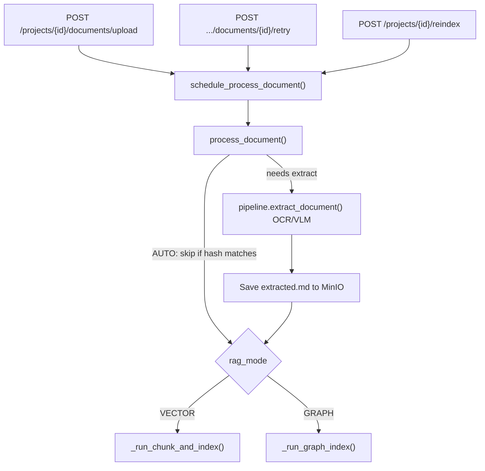
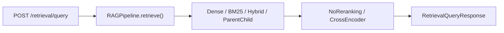
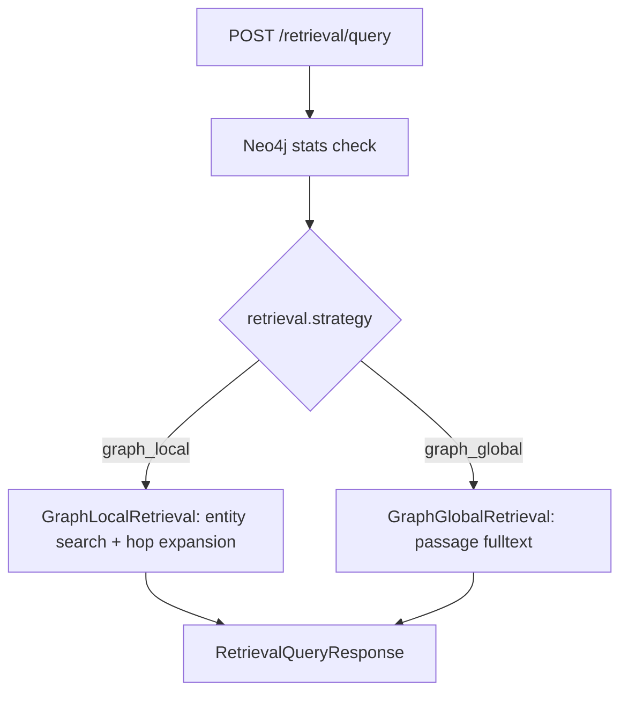

# RAG Module

This directory contains the strategy layer for FlexSearch's two RAG modes: **Vector RAG** and **Graph RAG**. Orchestration lives in [`pipeline.py`](pipeline.py); strategy wiring is in [`factory.py`](factory.py).

Each project selects a mode at creation time (`RagMode.VECTOR` / `rag_mode: "vector"` or `RagMode.GRAPH` / `rag_mode: "graph"`). Ingestion and retrieval both branch on that mode.

## Mode Comparison

| | Vector RAG | Graph RAG |
|---|---|---|
| Mode | `RagMode.VECTOR` | `RagMode.GRAPH` |
| Index store | Qdrant (`flexsearch_chunks`) | Neo4j |
| Index unit | Embeddings of text chunks | Passages + entities + relationships |
| LLM required at ingest | No (OCR/VLM only for extraction) | Yes (entity/relation extraction) |
| Reranking | Optional (dense/hybrid + cross-encoder) | None (`"none"`) |

---

## Shared Ingestion Trigger

Both modes share the same document processing entry path. Indexing is triggered asynchronously after upload or reindex — there is no separate Celery worker; processing runs as an in-process asyncio task.

### Entry points

| Trigger | File | Endpoint / function |
|---|---|---|
| Document upload | [`../api/documents.py`](../api/documents.py) | `POST /projects/{project_id}/documents/upload` → `schedule_process_document()` |
| Document retry | [`../api/documents.py`](../api/documents.py) | `POST .../documents/{id}/retry` → `schedule_process_document(..., force_full_extract=True)` |
| Project reindex | [`../api/projects.py`](../api/projects.py) | `POST /projects/{project_id}/reindex` → schedules all completed documents |

### Scheduler and worker

1. [`../services/document_tasks.py`](../services/document_tasks.py) — `schedule_process_document()` creates an asyncio task.
2. [`../services/document_worker.py`](../services/document_worker.py) — `process_document()` loads project config, builds a pipeline via `create_pipeline()`, and runs extraction + mode-specific indexing.



### Reindex modes

`ReindexMode` in [`../services/document_worker.py`](../services/document_worker.py):

| Mode | Behavior |
|---|---|
| `auto` | Skip text extraction if cached `extracted.md` exists and extraction config hash matches |
| `full` | Force re-extraction from the raw file |
| `from_extracted` | Skip extraction; re-index from stored `extracted.md` only |

### Shared extraction step

Before mode-specific indexing, both paths may run:

- `RAGPipeline.extract_document()` — OCR or VLM strategy from [`ingestion/`](ingestion/)
- Extracted text saved to MinIO as `extracted.md` with metadata
- Document status: `EXTRACTING` → `EXTRACTED`

Graph projects additionally require `API_KEY` in the environment; indexing fails early if the LLM key is missing.

---

## Vector RAG — Indexing Pipeline

After extraction, Vector RAG projects call `_run_chunk_and_index()` in the document worker.

### Steps

1. **`_run_chunk_and_index()`** — deletes existing Qdrant points for the document via `pipeline.delete_document_data()`
2. **`RAGPipeline.ingest_from_text()`** — orchestrates chunking and indexing
3. **`chunk_text()`** — splits text using the configured chunking strategy (`build_chunking_strategy()`)
4. **`index_chunks()`** — embeds chunks and upserts to Qdrant

### Chunking strategies

Configured via `VectorRagConfig.chunking` in [`../schemas/rag_config.py`](../schemas/rag_config.py):

| Strategy | Class | Directory |
|---|---|---|
| `fixed_window` (default) | `FixedWindowChunking` | [`chunking/fixed_window.py`](chunking/fixed_window.py) |
| `recursive` | `RecursiveChunking` | [`chunking/recursive.py`](chunking/recursive.py) |
| `semantic` | `SemanticChunking` | [`chunking/semantic.py`](chunking/semantic.py) |
| `parent_child` | `ParentChildChunking` | [`chunking/parent_child.py`](chunking/parent_child.py) |

### Embedding and vector store

- **Embedding** — `LocalEmbedding.embed_batch()` in [`embedding/local.py`](embedding/local.py) (default model: `all-MiniLM-L6-v2`, 384 dimensions)
- **Upsert** — `VectorStoreService.upsert_vectors()` in [`../services/vector_store.py`](../services/vector_store.py)
- Point IDs are deterministic UUID5 values derived from `document_id` + `chunk_index`
- Payload includes `content`, `document_id`, `project_id`, `chunk_index`, `filename`, char offsets, and chunk metadata

### Document status progression

`CHUNKING` (70%) → `INDEXING` (85%) → `COMPLETED` (100%)

### Default stack

When a project has no custom `rag_config` overrides:

- **Extract:** OCR
- **Chunk:** fixed 512-char window, 50-char overlap
- **Retrieve:** dense vector search
- **Rerank:** none

---

## Vector RAG — Retrieval

### API entry

`POST /retrieval/query` in [`../api/retrieval.py`](../api/retrieval.py)

Request body includes `project_id`, `query`, `top_k`, and optional `overrides` (e.g. per-query retrieval strategy).

### Pipeline flow

`RAGPipeline.retrieve()` (vector branch in [`pipeline.py`](pipeline.py)):

1. `EffectiveRagConfig.for_retrieval()` — merges project config with query overrides
2. `build_retrieval_strategy()` — fetches `top_k * 2` candidate chunks
3. `build_reranking_strategy()` — trims results to `top_k`



### Retrieval strategies

Built by `build_retrieval_strategy()` in [`factory.py`](factory.py):

| Strategy | Class | Mechanism |
|---|---|---|
| `dense` (default) | `DenseRetrieval` | Embed query → Qdrant cosine search filtered by `project_id` |
| `bm25` | `SparseRetrieval` | In-memory BM25 index built from Qdrant chunks on first query per project |
| `hybrid` | `HybridRetrieval` | Dense + BM25 merged via reciprocal rank fusion (RRF) |
| `parent_child` | `ParentChildRetrieval` | Search child chunks, return parent context |

Implementation files live in [`retrieval/`](retrieval/).

### Reranking

| Strategy | Class | Behavior |
|---|---|---|
| `none` (default) | `NoReranking` | Pass-through, no re-scoring |
| `cross_encoder` | `CrossEncoderReranking` | Cross-encoder re-scores candidates |

Reranking strategies are in [`reranking/`](reranking/).

---

## Graph RAG — Indexing Pipeline

> **Detailed Neo4j guide:** For a step-by-step walkthrough (uploading 1–2 PDFs, sequence diagrams, retrieval internals, and full code references), see [`docs/neo4j-graph-rag/README.md`](../../docs/neo4j-graph-rag/README.md).

Graph RAG replaces chunk embedding + Qdrant with LLM entity extraction and a Neo4j knowledge graph.

**Prerequisite:** `API_KEY` must be set — `GraphExtractor` calls an LLM for each passage.

After shared text extraction, `_run_graph_index()` calls `GraphIndexer.index_document()` in [`graph/indexer.py`](graph/indexer.py).

### Steps

1. **Split passages** — fixed-size text windows via `GraphIndexer.split_passages()` (`passage_chunk_size`, default 800, 50-char overlap)
2. **Per passage:**
   - Upsert `Passage` node in Neo4j (linked to `Document` → `Project`)
   - `GraphExtractor.extract()` — LLM extracts entities and relations (prompts in [`graph/prompts.py`](graph/prompts.py))
   - Upsert `Entity` nodes
   - Create `Passage -[:MENTIONS]-> Entity` links
   - Create `Entity -[:RELATES_TO {type, description}]-> Entity` links
3. **Embed entities** (when `embed_entities` is enabled) — batch embed entity descriptions → `Neo4jStore.set_entity_embeddings()`

On reindex, `delete_document_subgraph()` clears the prior graph for that document before writing new nodes.

### Neo4j graph model

```
Project <-[:IN_PROJECT]- Document <-[:FROM_DOCUMENT]- Passage -[:MENTIONS]-> Entity
Entity -[:RELATES_TO {type, description}]-> Entity
```

Schema, constraints, fulltext indexes, and the entity vector index are created by `Neo4jStore.ensure_schema()` in [`../services/neo4j_store.py`](../services/neo4j_store.py) at app startup ([`../main.py`](../main.py) lifespan).

### Document and project status

- Document: `GRAPH_INDEXING` (75%) → `COMPLETED` (100%); `chunk_count` stores passage count
- Project: `graph_index_status` JSON tracks `status`, `entity_count`, `passage_count`, and ingestion fingerprint

---

## Graph RAG — Retrieval

Same API entry as Vector RAG: `POST /retrieval/query`.

The graph branch in `RAGPipeline.retrieve()` skips reranking entirely (always returns `"none"` as the reranking strategy).

### Pre-check

Before querying, the API verifies Neo4j stats show at least one passage or entity. If the graph is empty, the endpoint returns HTTP 409.

### Retrieval strategies

Built by `build_graph_retrieval_strategy()` in [`factory.py`](factory.py):

#### `graph_local` — entity-centric

[`retrieval/graph_local.py`](retrieval/graph_local.py) — `GraphLocalRetrieval`

1. Embed the query
2. Search entities via vector index (`entity_embedding`), with fulltext fallback (`entity_search`)
3. Expand matched entities through `RELATES_TO` hops (`max_hops`, default 2)
4. Collect passages that mention matched or expanded entities
5. Fallback: if no passages are found but entities matched, return entity descriptions as results

Best for entity-specific, relationship-aware questions.

#### `graph_global` — passage-centric

[`retrieval/graph_global.py`](retrieval/graph_global.py) — `GraphGlobalRetrieval`

1. Fulltext search on passage content (Neo4j index `passage_content`; falls back to `CONTAINS`)
2. Return top passages directly — no graph traversal at query time

Best for broad thematic or keyword-style search.



| Aspect | `graph_local` | `graph_global` |
|---|---|---|
| Starting point | Query-matched entities | Query-matched passages |
| Graph traversal | Yes — hop expansion over `RELATES_TO` | No |
| Returns | Passage text (or entity descriptions as fallback) | Passage text |

---

## Module Map

```
backend/app/rag/
├── pipeline.py          # Central orchestrator (extract, ingest, retrieve, delete)
├── factory.py           # Builds strategy instances from RagConfig
├── ingestion/           # OCR and VLM text extraction (shared by both modes)
├── chunking/            # Vector RAG chunk strategies
├── embedding/           # Shared embedding service (chunks and graph entities)
├── retrieval/           # Vector strategies + graph_local / graph_global
├── reranking/           # Vector RAG rerankers only
└── graph/               # GraphIndexer, GraphExtractor, LLM prompts
```

### External dependencies

These live outside `rag/` but are part of the end-to-end flow:

| File | Role |
|---|---|
| [`../services/document_worker.py`](../services/document_worker.py) | Ingestion worker — `process_document()`, `_run_chunk_and_index()`, `_run_graph_index()` |
| [`../services/document_tasks.py`](../services/document_tasks.py) | Async task scheduling |
| [`../services/vector_store.py`](../services/vector_store.py) | Qdrant upsert, search, delete |
| [`../services/neo4j_store.py`](../services/neo4j_store.py) | Neo4j schema, CRUD, entity/passage search |
| [`../schemas/rag_config.py`](../schemas/rag_config.py) | `VectorRagConfig`, `GraphRagConfig`, effective config merging |
| [`../api/retrieval.py`](../api/retrieval.py) | Retrieval query endpoint |
| [`../api/documents.py`](../api/documents.py) | Upload and retry endpoints |
| [`../api/projects.py`](../api/projects.py) | Project creation and reindex |

---

## Cleanup and Deletion

`RAGPipeline` routes deletion based on project mode:

| Method | Vector RAG | Graph RAG |
|---|---|---|
| `delete_document_data()` | Removes Qdrant points for the document | Removes Neo4j subgraph for the document (requires `project_id`) |
| `delete_project_data()` | Deletes all Qdrant points for the project | Deletes the entire Neo4j subgraph for the project |

Called from document delete and project delete API handlers.
