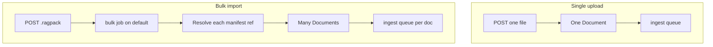
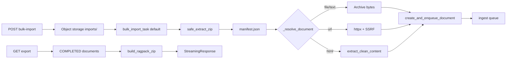
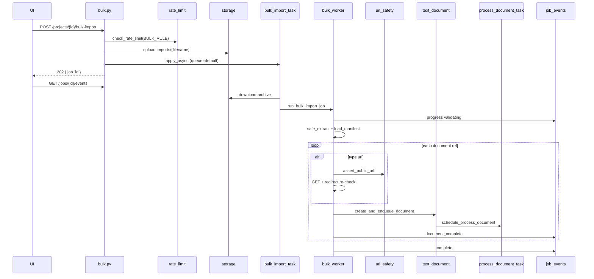
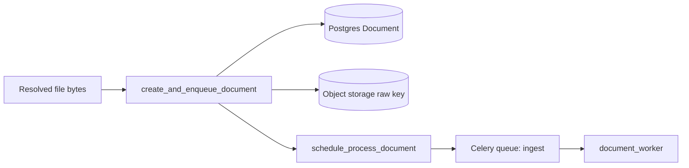

# Bulk import / export (`.ragpack`)

Portable project corpora as a ZIP archive (`.ragpack` / `.ragpack.zip` / `.zip`). Import runs on Celery **`default`**; each resolved file lands in the **same ingest pipeline** as UI uploads via `create_and_enqueue_document` → `schedule_process_document` → **`ingest`** queue → `document_worker`.

**In plain terms:** a RAG pack is a suitcase of documents plus a packing list (`manifest.json`). Bulk import unpacks that suitcase into a project and hands every file to the normal “make this searchable” pipeline. Bulk export packs a project’s finished documents back into a suitcase you can move, back up, or re-import elsewhere.

This document describes the **code as implemented**. Known gaps are listed in [Limitations](#limitations--gaps).

---

## Why bulk packs exist

Uploading one file at a time through the UI is fine for a handful of PDFs. Bulk packs exist when the *corpus itself* is the unit of work—not a single upload.

Think of three everyday jobs:

| Job | Story | What the pack does |
|-----|--------|-------------------|
| **Seed** | “Stand up a demo / eval project with a known corpus.” | One archive → many documents enqueued for ingest, so every environment starts from the same files. |
| **Backup** | “Snapshot what this project already knows.” | `GET …/export` writes a zip of **COMPLETED** docs (prefer extracted text). You can store that zip offline and re-import later. |
| **Migrate** | “Move knowledge to another project or environment.” | Export from A, import into B. Re-import creates **new** document rows and re-runs ingest—it is not an in-place clone of IDs or index state. |

A fourth practical need: **mix sources in one shot**. The same manifest can point at files inside the zip, text paths with an explicit MIME, and remote URLs. One POST replaces dozens of upload clicks *plus* a few one-off URL fetches.

| Need | What bulk provides |
|------|-------------------|
| **Seed or migrate a project** | Ship dozens or hundreds of files in one archive instead of N upload clicks |
| **Move knowledge between projects/environments** | Export completed docs as a pack, re-import into another project |
| **Mix sources in one shot** | Files inside the zip, inline text paths, and remote URLs in the same manifest |
| **Keep the HTTP request short** | API accepts the zip and returns `202` + `job_id`; parse/resolve/enqueue runs in the background |

**Design intent:** bulk does **not** invent a second RAG pipeline. It only accelerates *getting bytes into* the shared ingest path that single uploads and crawl pages already use. Indexing quality, chunking, and retrieval behavior are owned by that shared path—not by the pack format.

Concrete seed example: a golden-set folder on disk becomes a hand-built zip (`manifest.json` + `documents/*.md`). Import into a fresh project; when each document reaches `COMPLETED`, chat/eval can hit the same corpus every time.

---

## Key concepts

| Term | Meaning |
|------|---------|
| **`.ragpack`** | A ZIP that holds `manifest.json` plus the files it references. Extensions `.ragpack`, `.ragpack.zip`, and `.zip` are accepted by name. |
| **Manifest** | The packing list: which projects/documents are in the archive, and whether each entry is a local `file`, `text`, or remote `url`. See [Manifest mental model](#manifest-mental-model). |
| **Bulk vs single upload** | Single upload: one HTTP request → one `Document` → ingest. Bulk: one HTTP request → one Celery import job → many `Document`s → each fans out to ingest. |
| **Import job** | Background work identified by `job_id` (`bulk:{16-hex}`). Progress streams over SSE; the API does not wait for ingest to finish. |
| **Document complete (job event)** | Means the bulk worker successfully *queued* that document for ingest—not that chunking/indexing finished. Searchability comes later on the `ingest` queue. |
| **Export** | Synchronous download of a zip built from documents already in `COMPLETED` status (prefer extracted text, else raw bytes). |
| **Shared ingest path** | After resolution, every bulk doc goes through `create_and_enqueue_document` like UI uploads and crawl pages: Postgres row → object storage → Celery `ingest` → extract/chunk/index. |
| **Zip-slip** | A malicious zip member whose path escapes the extract directory (e.g. `../../etc/passwd`). Bulk rejects these via `safe_join` / `safe_extract_zip`. |

Each import submit gets a **fresh** `job_id` (no coalesce with a previous bulk job). Re-importing the same pack into a project creates **new** documents and re-runs ingest; the pack format itself does not deduplicate.

---

## Purpose

| Operation | Behavior |
|-----------|----------|
| **Import** | Upload archive → object storage → Celery parse → create documents → fan-out ingest |
| **Export** | Sync ZIP of **COMPLETED** documents (prefer extracted text, else raw) |

Progress for import: Redis job events + SSE at `GET /api/jobs/{job_id}/events` (same ACL pattern as crawl).

### Bulk vs single upload



Both paths end at the same `document_worker`. The difference is *how many* documents one API call produces and *where* unpacking/URL fetch happens (Celery `default` for bulk, request path for single upload).

---

## `.ragpack` format

A RAG pack is intentionally simple: a zip you can build by hand or with `build_ragpack_zip`. Nested folders (e.g. macOS zip wrappers) are supported: `find_manifest_dir` BFS-searches for `manifest.json`.

ZIP containing at least `manifest.json` plus referenced files.

### Layout example

```
manifest.json
documents/guide.md
documents/report.pdf
```

### Manifest mental model

Treat `manifest.json` as a **packing list**, not as the corpus itself:

| Layer | Role |
|-------|------|
| **Zip members** | The physical bytes on disk inside the archive (`documents/guide.md`, …). |
| **Manifest entries** | Declarations of *what to import* and *how to resolve* each item (`file` / `text` / `url`). |
| **Target project** | Where those resolved bytes become FlexSearch `Document`s (API path `project_id`, unless the worker is called in create-from-manifest mode). |

Mental checklist when reading a pack:

1. **Find the list** — locate `manifest.json` (root or one nested folder).
2. **Walk projects** — `projects[]` groups documents logically; under the HTTP API they all land in the path project.
3. **Resolve each ref** — `file`/`text` must exist at `path` under the manifest directory; `url` is fetched at import time (not stored in the zip).
4. **Hand off** — resolved `(filename, bytes, content_type)` → shared ingest enqueue.

So a pack with three files and two URL refs is five future documents, not “three files plus metadata.” URL bytes never travel inside the zip; the manifest only carries the address.

```
packing list (manifest)          suitcase (zip)
─────────────────────            ────────────────
file  → documents/a.pdf   ──►    documents/a.pdf  (bytes in zip)
text  → documents/b.md    ──►    documents/b.md   (bytes in zip)
url   → https://…/c.pdf   ──►    (nothing in zip; fetched later)
```

### `manifest.json` schema

Pydantic models in `app/services/bulk/schemas.py` (`BulkImportManifest`).

```json
{
  "version": "1.0",
  "projects": [
    {
      "name": "My Project",
      "description": "optional",
      "documents": [
        {
          "type": "file",
          "path": "documents/guide.md",
          "title": "Guide"
        },
        {
          "type": "text",
          "path": "documents/notes.md",
          "title": null,
          "content_type": "text/markdown"
        },
        {
          "type": "url",
          "url": "https://example.com/a.pdf",
          "title": "Remote PDF"
        }
      ]
    }
  ]
}
```

### Document reference types

Three ways to say “this becomes one document.” They differ in **where bytes come from** and **how MIME is chosen**—not in what happens after enqueue.

| `type` | When to use it | Fields | Resolution |
|--------|----------------|--------|------------|
| `file` | Binary or text already in the zip; let FlexSearch guess MIME from the filename | `path`, optional `title` | Read bytes from archive; MIME via `guess_content_type(path.name)` |
| `text` | Same as file, but you want an explicit `content_type` (default `text/markdown`) | `path`, optional `title`, `content_type` | Read bytes; use declared `content_type` |
| `url` | Fetch at import time; keep the pack small or pin a remote artifact | `url` (HttpUrl), optional `title` | HTTP GET (see below); HTML → markdown |

**Choosing among them (examples):**

- Seed corpus of local PDFs/markdown → `file` (or `text` when you care about MIME).
- Hand-authored notes you always want treated as markdown → `text` with `content_type: "text/markdown"`.
- “Also pull this public PDF / HTML page when the pack is imported” → `url` (SSRF-gated when `CRAWL_BLOCK_PRIVATE_URLS` is on). Closest to a one-shot scrape, not a full site crawl—see [crawler docs](../crawler/README.md).

`file` and `text` both read from the archive; the practical difference is MIME: `file` guesses from the path name, `text` trusts the declared `content_type`.

**HTML handling:** if content is HTML (MIME or `.html`/`.htm`), `extract_clean_content` converts to markdown and the stored filename becomes `{stem}.md`.

**Export builder** (`build_ragpack_zip`) always emits `type: "file"` entries under paths like `documents/{document_id}_{safe_filename}`. A round-tripped pack therefore loses original `url` / `text` typing—everything comes back as in-archive files.

---

## Import API

### `POST /api/projects/{project_id}/bulk-import`

| Item | Detail |
|------|--------|
| Status | **202 Accepted** |
| Body | Multipart form field `file` |
| Auth | Bearer user; `verify_project_access` |
| Rate limit | `BULK_RULE` → `RATE_LIMIT_BULK_PER_MINUTE` (default **10**/min) |
| Accepted names | `.ragpack`, `.ragpack.zip`, or `.zip` (extension check only) |
| Empty file | **400** |

Flow:

1. Read entire upload into memory
2. Upload to object storage at `{project_id}/imports/{filename}` (`content_type=application/zip`)
3. `schedule_bulk_import(storage_path, target_project_id, owner_user_id)`
4. Return `{ "job_id", "status": "queued", "project_id" }`

**Job id shape:** `bulk:{16-hex}`.

Meta registered with `job_type=bulk`, `project_id`, optional `owner_user_id` for SSE ACL.

There is **no** archive size limit and **no** magic-byte ZIP validation at the API.

Conceptually: the API’s job is “accept the suitcase and park it in storage,” not “ingest every page.” Parsing, URL fetches, and per-document enqueue happen in the worker so the client can subscribe to progress without holding an open upload connection for the whole batch.

---

## Export API

### `GET /api/projects/{project_id}/export`

| Item | Detail |
|------|--------|
| Status | **200** streaming ZIP |
| Auth / rate limit | Same project ACL + `BULK_RULE` |
| Execution | **Synchronous** in the API process (not Celery) |
| Filename | `{sanitized_project_name}.ragpack.zip` |

`export_project_ragpack`:

1. Load project; select documents with `status == COMPLETED` (created_at ascending)
2. For each: prefer `extracted_text_path` if present; else raw `storage_path`
3. Skip missing storage objects
4. If no files → `ValueError` → API **404**
5. Build ZIP via `build_ragpack_zip`

Large projects can block the API worker for a long time (see gaps).

Export is the reverse suitcase: only documents that already finished ingest. In-flight or failed docs are omitted (see limitations).

---

## Architecture





### How a pack becomes searchable knowledge

Bulk import is a **batch producer** of documents, not the indexer itself. The pack format ends at “bytes + metadata”; searchability is owned by the shared ingest pipeline.

Conceptual stages:

1. **Validate & extract** — zip-slip-safe unpack; find and parse `manifest.json`; ensure referenced `file`/`text` paths exist.
2. **Resolve** — turn each manifest entry into bytes (from the archive or HTTP), optionally HTML→markdown.
3. **Register** — `create_and_enqueue_document` writes a Postgres `Document`, stores raw bytes in object storage, and schedules ingest.
4. **Ingest (async, separate queue)** — `document_worker` extracts, chunks, embeds/indexes (vector OpenSearch and/or graph paths per project RAG mode)—same as a UI upload.
5. **Queryable** — once a document reaches `COMPLETED`, chat/retrieval can use it. Export only includes those completed docs.

So “import complete” on the bulk job means “every successful ref was *enqueued* for ingest.” Individual documents may still be processing, failed, or waiting on the `ingest` queue.

**Walkthrough example** — pack with one PDF and one URL:

```
manifest.json
documents/handbook.pdf          ← type: file
(+ url entry for https://example.com/faq.html)
```

| Step | What happens | What you can observe |
|------|----------------|----------------------|
| POST bulk-import | Zip parked in `{project_id}/imports/…`; Celery `bulk_import_task` queued | `202` + `job_id` like `bulk:a1b2…` |
| Worker extract | `safe_extract_zip` → find `manifest.json` → validate `documents/handbook.pdf` exists | SSE `progress` / `validating` → `extracting` |
| Resolve file | Read PDF bytes from disk under extract root | — |
| Resolve url | SSRF check → GET HTML → `extract_clean_content` → `faq.md` markdown bytes | — |
| Enqueue ×2 | Two `Document` rows + two `ingest` tasks | SSE `document_complete` twice (queued, not indexed yet) |
| Bulk job done | Worker emits `complete` with `documents_succeeded: 2` | Job finished; PDFs/markdown may still be chunking |
| Ingest finishes | Each doc → `COMPLETED` in Postgres; chunks in OpenSearch (and/or graph paths) | Chat/retrieval can cite them; **now** export would include them |

Timing trap: if you export immediately after bulk `complete`, you may get an empty or partial zip—export only packs `COMPLETED` documents. Wait for document status (or UI) before treating the project as a durable backup.

### Shared ingest path

Same as crawl and UI upload fan-out:



`TEXT_INGEST_TYPES` in `text_document.py` documents intended MIME types but is **not enforced**. The upload API (`documents.py`) has its own allowlist; bulk can enqueue types that upload would reject (e.g. arbitrary binaries guessed as `application/octet-stream`).

---

## Zip safety

### Why it matters

A zip is not a flat list of friendly filenames—it is a list of **member paths** the extractor will write. A malicious archive can name a member `../../somewhere/outside/the/temp/dir` (classic **zip-slip**). Naive extract would write outside the intended directory and could overwrite worker files or plant content elsewhere on disk.

Bulk import trusts the *caller’s* project ACL for who may upload, but it must **not** trust member paths inside the archive. Every path is forced under a temp extract root; anything that escapes is rejected before write.

Manifest `path` values are checked the same way when resolving `file` / `text` refs (`safe_join`), so a packing list cannot point at `/etc/passwd` or `../../../secrets` relative to the extract root.

### Helpers

`app/services/bulk/ragpack.py`:

| Helper | Role |
|--------|------|
| `safe_join(base, relative)` | Reject absolute paths, null bytes, path traversal (`..`) |
| `safe_extract_zip` | Extract only if every member stays under extract root (zip-slip safe) |
| `find_manifest_dir` | BFS for directory containing `manifest.json` |
| `validate_referenced_files` | Ensure `file` / `text` paths exist before the import loop |

**Example:** member `documents/ok.pdf` → allowed under `/tmp/ragpack_…/documents/ok.pdf`. Member `../../etc/passwd` → `safe_join` raises; extract aborts. After a safe extract, `validate_referenced_files` still fails the job early if the manifest lists `documents/missing.pdf` that is not in the zip.

Tests cover zip-slip rejection and `safe_join` traversal (`tests/test_phase4_crawl_bulk.py`).

Zip safety is about **filesystem containment**, not content scanning. It does not virus-scan payloads, cap archive size, or validate magic bytes at the API—those remain known gaps.
---

## Document resolution details

`_resolve_document` in `bulk_worker.py`:

### `url`

1. If `CRAWL_BLOCK_PRIVATE_URLS`: `assert_public_url`
2. `httpx.AsyncClient(follow_redirects=False, timeout=60)`
3. Manual redirects ≤ 5; re-run SSRF on each `Location`
4. `raise_for_status`
5. Filename from `title` or URL path basename
6. MIME from `Content-Type` or `guess_content_type`
7. If HTML → markdown via shared website extractor

URL refs do **not** honour robots.txt or crawl rate limits.

### `file` / `text`

1. `safe_join(base_dir, path)` + `read_bytes`
2. Filename from `title` or path name (ensure suffix when needed)
3. HTML → markdown as above

### Target project vs create-from-manifest

| Mode | When | Behavior |
|------|------|----------|
| **Target project** | API always passes `target_project_id` | All documents from **all** manifest projects are imported into that one project; manifest `name`/`description` are ignored for targeting |
| **Create projects** | `target_project_id is None` and `owner_user_id` set | Create a new `Project` per manifest entry (`RagMode.VECTOR` + default rag_config) |

If neither id is provided → `ValueError`.

The HTTP import API always uses **target project** mode (the `project_id` in the path). Manifest `projects[]` is still a list so one pack can describe multiple logical groups, but they collapse into the path project unless you call the worker with `target_project_id=None`.

**Mental model:** the packing list may say “Project A / Project B,” but the product API says “put everything in *this* project.” Treat multi-project manifests as organizational metadata unless you invoke the worker’s create-from-manifest path directly.

Per-document failures are logged and counted (`documents_failed`); the job still emits `complete` with partial success. Fatal errors (bad zip, missing manifest, missing project) emit `error` and re-raise.

---

## Celery

Import is a **batch job** on the `default` queue: one task downloads the archive, loops the manifest, and fans out many ingest tasks. That split keeps long unpack/URL work off the API process and lets ingest scale independently.

| Item | Value |
|------|-------|
| Task | `app.services.celery_tasks.bulk_import_task` |
| Queue | **`default`** |
| Soft / hard time limit | 45 / 50 minutes |
| `max_retries` | 1 |
| Scheduler | `app.services.bulk.bulk_tasks.schedule_bulk_import` |

Task downloads the archive from storage (`FileNotFoundError` if missing), then `_run_async(run_bulk_import_job(...))`.

Temp extract directories are removed in `finally`.

Unlike document ingest (which can coalesce on `ingest:{document_id}:{mode}`), each bulk submit uses a unique `bulk:{hex16}` task id—retrying or re-uploading starts a new job.

---

## Job progress SSE

Same endpoint as crawl: `GET /api/jobs/{job_id}/events`.

Use this to watch the **batch** (unpack + enqueue), not each document’s full ingest lifecycle. For per-document ingest status, use the project’s document APIs / UI.

Import events:

| `event` | Stage examples |
|---------|----------------|
| `progress` | `validating`, `extracting`, per-doc failure messages |
| `document_complete` | One doc queued (`document_id`, `project_id`) |
| `complete` | `documents_succeeded`, `documents_failed`, `document_ids` |
| `error` | Fatal |

Meta TTL: 6 hours (`job_events.JOB_TTL_SEC`).

---

## Config / environment

| Env / setting | Default | Notes |
|---------------|---------|-------|
| `CRAWL_BLOCK_PRIVATE_URLS` | `true` | Also gates bulk **URL** document refs |
| `RATE_LIMIT_ENABLED` | `true` | |
| `RATE_LIMIT_BULK_PER_MINUTE` | `10` | Import **and** export; `0` = unlimited |

There are **no** dedicated settings for max archive size, max documents per pack, or export timeouts.

---

## Building a pack by hand

Useful for seeding demos, eval corpora, or migrating a folder of docs without writing a script.

1. Create `manifest.json` with `version`, `projects[].documents[]`
2. Place files at the relative `path` values
3. Zip so `manifest.json` is findable (root or one nested folder)
4. `POST .../bulk-import` with the zip

Minimal seed sketch:

```
my-corpus/
  manifest.json          # type:file → documents/intro.md, documents/policy.pdf
  documents/
    intro.md
    policy.pdf
```

Zip the contents (or the folder—`find_manifest_dir` tolerates one nested wrapper), then import. Add a `type: "url"` entry only when you want the worker to fetch a remote page/PDF at import time.

**Round-trip:** `GET .../export` produces a pack of completed docs only (extracted markdown preferred). Re-importing that pack into another project re-ingests those files through the normal pipeline (new document rows; not an in-place update of the originals). That is the supported migrate/backup loop: export → store or transfer → import elsewhere → wait for ingest `COMPLETED`.

Programmatic build: `build_ragpack_zip(project_name=..., description=..., files=[(archive_path, bytes), ...])`.
---

## Limitations / gaps

1. **Strict archive limits** — compressed size, expanded size, members, member size, nesting, encryption, special files, and compression ratio are rejected at fixed ceilings.
2. **Export is synchronous** — large corpora can block the API process; no Celery export job.
3. **One supported-format registry** — direct and bulk imports use the same backend-owned extension, MIME, and content-signature policy.
4. **Multi-project manifest + single target** — API import dumps every document into the path `project_id` with no warning that other manifest projects are collapsed.
5. **Public-only URL references** — DNS results and redirect targets are validated and connection-pinned; internal URLs are intentionally rejected.
6. **URL refs ignore robots / rate limits** — only SSRF + redirect hop limit.
7. **Extension-only accept** — `.zip` with non-zip content fails later in the worker, not at the API.
8. **No import cancel API** — long imports cannot be revoked from the product API.
9. **Partial HTML conversion** — HTML becomes markdown before ingest; original HTML is not retained.
10. **Export skips incomplete docs** — only `COMPLETED`; in-flight or failed documents are omitted without a summary in the zip.

---

## Related code map

| Path | Role |
|------|------|
| `app/api/bulk.py` | Import + export HTTP |
| `app/services/bulk/schemas.py` | Manifest / document refs / submit response |
| `app/services/bulk/ragpack.py` | Safe zip I/O, manifest load, export builder |
| `app/services/bulk/bulk_tasks.py` | Enqueue Celery import |
| `app/services/bulk/bulk_worker.py` | Import job + export helper + `_resolve_document` |
| `app/services/text_document.py` | Shared create + ingest enqueue |
| `app/services/url_safety.py` | SSRF for URL refs |
| `app/services/website/content_extractor.py` | HTML → markdown (shared with crawler) |
| `app/services/celery_tasks.py` | `bulk_import_task` |
| `app/api/jobs.py` | Job SSE |
| `app/services/job_events.py` | Redis pub/sub + meta |
| `app/core/rate_limit.py` | `BULK_RULE` |

### Tests

| File | Coverage |
|------|----------|
| `tests/test_phase4_crawl_bulk.py` | Round-trip zip, zip-slip, `safe_join`, manifest load |
| `tests/test_phase4_api.py` | Bad extension rejection smoke |
| `tests/test_phase5.py` | SSRF helpers (shared) |

Little integration coverage of import → ingest completion.
