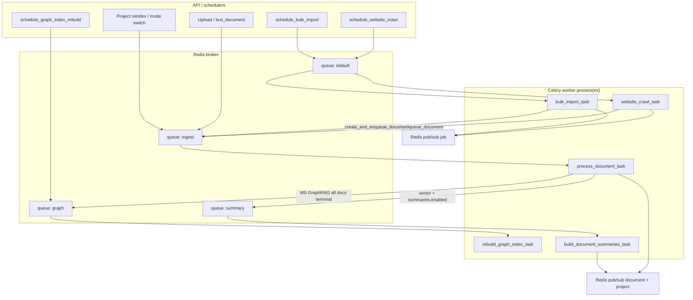
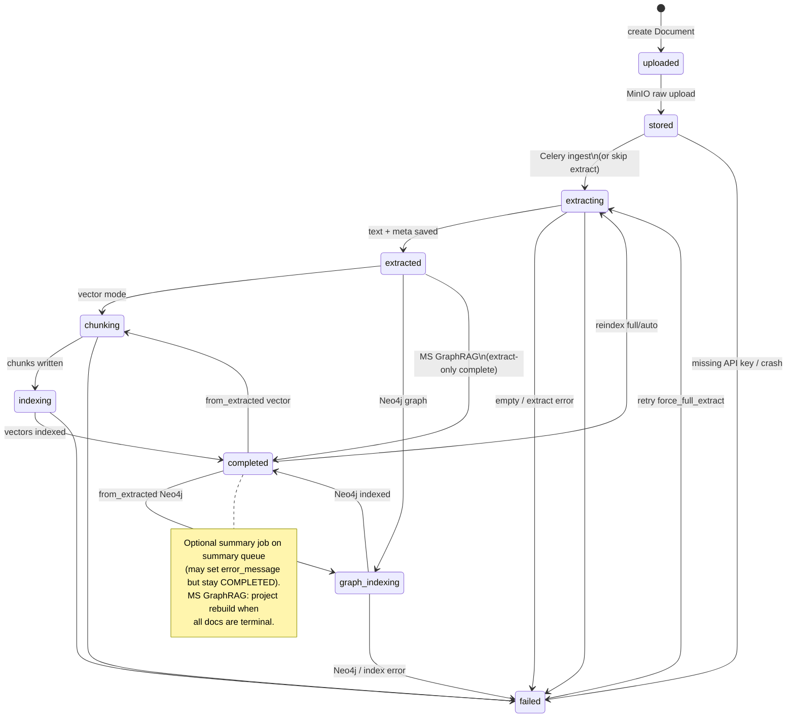

# Celery — FlexSearch app-owned workers

Background jobs for document ingest, graph rebuild, hierarchical summaries, website crawl, and bulk import run in **FlexSearch Celery workers** (not a shared hub Celery). The broker and result backend are the existing infra-hub **Redis** — the same instance used for document and job SSE progress.

**In plain terms:** uploading a PDF or starting a crawl must feel instant in the UI, but making that content searchable can take minutes (OCR, embeddings, GraphRAG). Celery is the hand-off: the API says “do this work,” returns immediately, and a separate worker process does the heavy lifting while Redis carries both the job messages and the progress events the browser listens to.

**There is no Celery Beat.** Nothing is scheduled on a crontab. All work is enqueued on demand from the API or from other tasks. Graph “stale indexing” recovery is API-driven (`reconcile_*` on startup / status), not periodic.

---

## What a task queue is

A **task queue** is a durable inbox of work units. Producers (here: FastAPI handlers and other tasks) put **messages** on the inbox; consumers (**workers**) pull messages and run the corresponding Python functions.

That pattern solves three problems for RAG systems:

1. **Time** — extract / embed / graph rebuild do not fit in an HTTP request budget.
2. **Isolation** — a crash in OCR or a hung LLM call should not take down the API process that serves chat and uploads.
3. **Scale** — you can run more worker processes (or split queues) without scaling the request-serving layer the same way.

Celery is FlexSearch’s task-queue runtime: named tasks, named queues, JSON payloads, ack/redelivery knobs, and soft/hard time limits. The “product” outcome of a task is almost never Celery’s result object — it is Postgres status, OpenSearch/Neo4j writes, MinIO artifacts, and SSE progress.

```
┌────────────┐     enqueue      ┌─────────────┐     pull      ┌──────────────┐
│  FastAPI   │ ───────────────► │ Redis queue │ ────────────► │ Celery worker│
│ (producer) │                  │  (broker)   │               │  (consumer)  │
└────────────┘                  └─────────────┘               └──────┬───────┘
                                                                     │
                                          progress / status          ▼
                                     ◄────────────────────  Postgres + Redis SSE
```

---

## Why Celery? (why async for ingest / OCR / graph)

HTTP request handlers must stay fast and reliable. Ingest (OCR, chunking, embedding), graph rebuild, crawl, and summary work can take minutes and need CPU, PDF tools, or LLM calls. If that ran inside the API process:

- Uploads and chat would block or time out.
- A crash mid-OCR would take down the API.
- You could not scale heavy work separately from request serving.

**Celery** is the job runner: the API records intent (“process this document”), puts a message on a queue, and returns. Separate **worker** processes pull those messages and do the long work. Progress still reaches the UI via Redis pub/sub (SSE), not by holding the HTTP connection open for the whole job.

### Why these workloads run async

| Workload | Why not in the request path | Example |
|---|---|---|
| **Document ingest** | OCR, PDF parse, chunking, embedding, OpenSearch/Neo4j writes — minutes, heavy deps (`tesseract`, `poppler`). | User drops a 40-page scanned PDF; API returns after MinIO + enqueue; worker spends minutes in `EXTRACTING` → `CHUNKING` → `INDEXING`. |
| **Website crawl** | Many HTTP fetches + one document enqueue per page; fan-out into the ingest queue. | Crawl 80 pages on `default`; each page becomes a document that later runs on `ingest`. |
| **Bulk import** | Unpack `.ragpack`, many documents; same shared ingest path. | One zip upload → bulk job → N ingest tasks, not N long HTTP uploads. |
| **Summaries** | LLM over clusters after vectors exist; optional; must not block “chunks searchable”. | Doc reaches `COMPLETED` with searchable chunks; summary job may fail later without un-searching the doc. |
| **Graph rebuild** | Project-wide Microsoft GraphRAG index; debounced so bursty uploads coalesce. | Ten uploads finish within seconds; one debounced `graph_rebuild:{project_id}` runs instead of ten full rebuilds. |

RAG product rule of thumb: **searchability and indexing are background pipelines**; **ask / chat / upload acknowledgment stay on the request path**.

---

## Concepts and terminology

| Term | Plain meaning in FlexSearch |
|---|---|
| **Celery** | Library + worker runtime that turns Python functions into background jobs with queues, timeouts, and delivery guarantees. |
| **Task** | A named unit of work (e.g. `process_document_task`). Declared in `celery_tasks.py`; the real business logic lives in `*_worker.py`. |
| **API request** | A short HTTP call that validates input, writes DB/MinIO state, **enqueues** a task, and returns. It does not wait for OCR or graph rebuild to finish. |
| **Broker** | The message bus that holds queued work until a worker takes it. Here: **Redis**. |
| **Result backend** | Where Celery can store task state/results (`SUCCESS` / `FAILURE` / ids). Also Redis (`CELERY_RESULT_BACKEND`). |
| **Worker** | A long-lived process (`celery … worker`) that consumes one or more **queues** and runs tasks. Compose service `worker`, or `make worker-local`. |
| **Queue** | A named lane of work (`ingest`, `graph`, `summary`, `default`). Routing keeps heavy OCR from starving unrelated jobs when you split workers. |
| **Enqueue / schedule** | `apply_async` (via helpers in `celery_schedule.py` / `*_tasks.py`): put a message on a queue. “Schedule” here means **on-demand enqueue**, not a cron. |
| **Ack / `task_acks_late`** | Worker acknowledges a message only after the task finishes. If the worker dies mid-task, Redis can **redeliver** the message. |
| **Soft / hard time limit** | Soft: raise so the task can clean up; hard: kill the process. Prevents runaway OCR/graph jobs. |
| **`max_retries`** | Declared Celery retry budget. FlexSearch tasks do **not** call `self.retry()` — failures are terminal unless late-ack redelivery after a crash. |
| **Celery Beat** | Optional scheduler that enqueues tasks on a crontab. **Not used** in FlexSearch. |
| **Eager mode** | `CELERY_TASK_ALWAYS_EAGER=true`: run the task inline in the calling process (tests). Useless (and harmful) in prod with a real worker. |
| **Task id coalesce** | Reuse or replace Celery task ids so duplicate uploads/rebuilds do not pile up identical work. See §3 Idempotent task ids. |
| **Countdown** | Delay before a queued task becomes runnable (used to debounce graph rebuild). |

### Broker vs worker vs result backend

These three roles are easy to conflate because FlexSearch uses **one Redis** for all of them (plus SSE). Mentally keep them separate:

| Role | Job | What FlexSearch actually uses it for |
|---|---|---|
| **Broker** | Holds *pending work* (queue lists). Without it, nothing is enqueued. | `CELERY_BROKER_URL` — messages for `ingest` / `graph` / `summary` / `default`. |
| **Worker** | *Executes* tasks; talks to Postgres, MinIO, OpenSearch, Neo4j, LLMs. | Compose `worker` / `make worker-local`. Side effects here are the real deliverable. |
| **Result backend** | Stores Celery’s view of task state (`PENDING` / `STARTED` / `SUCCESS` / `FAILURE`) and return values. | `CELERY_RESULT_BACKEND` — mainly **inspect / coalesce** (`celery_task_known_to_workers`, reusable task ids). The UI does **not** poll Celery results for progress. |

**Example:** After upload, the API writes `STORED` and enqueues `ingest:{document_id}:vector`. The broker holds that message. A worker pulls it, runs OCR, and publishes SSE. Coalesce helpers may later ask the result backend “is `ingest:…` already active?” so a second click does not pile a duplicate job. Progress percentages come from document status + Redis pub/sub, not from Celery’s result payload.

### Tasks vs API requests

```
Client  →  FastAPI (validate, persist, enqueue)  →  202 / immediate response
                                    ↓
                              Redis queue
                                    ↓
                         Celery worker (minutes)
                                    ↓
                    Postgres status + Redis SSE → Client
```

The API owns **authorization, persistence, and enqueue**. The worker owns **extract / index / crawl / summarize**. SSE bridges progress without tying the browser to a multi-minute HTTP request.

**Mental model:** the HTTP response means “accepted and tracked,” not “searchable.” A document at `STORED` is on the queue; it becomes answerable in chat only after the worker reaches `COMPLETED` (vector) or the project graph index is ready (Microsoft GraphRAG).

### How queues work (conceptually)

1. Producer (API or another task) serializes arguments as JSON and pushes to a named queue in Redis.
2. Workers subscribed with `-Q ingest,graph,…` pull the next message (prefetch=1 so one long job does not hoard the lane).
3. The worker runs the task function; on success/failure it acks the message (`acks_late`).
4. Side effects (OpenSearch, Neo4j, MinIO, status rows) are the real deliverable; Celery’s result backend is mainly for inspect / coalesce, not the product UI.

### Queues as isolation

A queue is a **lane**, not a separate Celery app. All FlexSearch tasks share one `celery_app`; routing decides *which lane* a message sits in.

Why isolate lanes?

| Pressure | What goes wrong with one shared lane | How named queues help |
|---|---|---|
| Long OCR | A 30-minute ingest blocks crawl/summary behind it in FIFO | Put OCR on `ingest`; crawl stays on `default` |
| Burst uploads | Graph rebuilds and summarization wait behind extract | `graph` / `summary` can run on a dedicated consumer |
| Ops scale | You must scale “everything” to fix OCR backlog | Split: `-Q ingest --concurrency=2` vs `-Q graph,summary --concurrency=1` |

By default Compose runs **one worker consuming all four queues** — fine for local/dev. Isolation becomes operational when you *split processes* (see §8). Conceptually, the route table already encodes the separation so you can split without changing task code.

**Example:** twenty scanned PDFs enqueue on `ingest` while a user starts a website crawl on `default`. With a single combined worker and concurrency 2, crawl still shares CPU with OCR. With a dedicated `default` worker, crawl fan-out continues even if ingest is saturated.

### Idempotency (why task ids matter)

Background jobs are **at-least-once** in spirit: late ack can redeliver after a crash; users can click retry; uploads can be repeated. Idempotency here means “do not pile identical in-flight work,” not “every side effect is perfectly once-only.”

FlexSearch’s main lever is **stable or deliberate Celery task ids** plus helpers in `celery_schedule.py`:

- **Coalesce** — if `ingest:{document_id}:{mode}` is already RUNNING/PENDING, leave it alone instead of enqueueing a twin.
- **Replace** — summaries always get a fresh replace path so a reindex is not blocked by a stuck summary id; graph rebuild can replace a *queued* countdown with a new id so debounce resets.
- **Unique per submit** — crawl/bulk use random suffixes; each submit is a new job.

**Anti-pattern:** `revoke(task_id)` then `apply_async(..., task_id=same_id)`. Workers remember revocations and **discard** the re-enqueue (`Discarding revoked task`), leaving documents stuck at `stored`. After revoke, always use a fresh id.

**Example:** user uploads the same file twice quickly in vector mode. Both calls target `ingest:{doc_id}:vector`. Coalesce keeps a single in-flight task instead of two workers racing OpenSearch wipes and embeds.

### SSE progress mental model

Workers do **not** stream progress on the original upload/crawl HTTP connection. That connection already returned. Progress is a **second channel**:

```
Worker updates status
        ↓
  Postgres commit  +  Redis PUBLISH (document / project / job channel)
        ↓
  API SSE endpoint (subscribed) forwards events to the browser
```

| Concern | Owned by |
|---|---|
| Durable truth (“this doc is `EXTRACTING`”) | Postgres document / job fields |
| Live push to open UIs | Redis pub/sub |
| Who may subscribe | API (JWT + project access / job meta ACL) |
| What Celery result backend is for | Inspect / coalesce — **not** the progress UI |

If Redis pub/sub is down, document SSE falls back to **DB poll every 2s**; terminal statuses still close the stream. Job SSE for crawl/bulk uses `flexsearch:job:{id}` plus `:last` / `:meta` snapshots (see §7).

**Example:** upload returns immediately with the document id. The project page opens `GET …/documents/events`, receives `STORED` → `EXTRACTING` → … → `COMPLETED`, and the progress bar moves — all while the Celery worker is in another process.

### Failure and retry (concepts)

Three different “try again” mechanisms exist; only one is automatic Celery behavior in FlexSearch:

| Mechanism | When it fires | What the user sees |
|---|---|---|
| **Late-ack redelivery** | Worker *process dies* mid-task before ack | Same task message may run again; best-effort `FAILED` marking on uncaught crash if not already `COMPLETED` |
| **Declared `max_retries`** | Would apply if code called `self.retry()` / `autoretry_for` | **Unused** — tasks do not auto-retry soft failures |
| **User / API retry** | Explicit retry, reindex, Rebuild, `force_full_extract` | New enqueue (often new or coalesced task id); status moves off `failed` / re-enters extract |

Plus graph-specific **reconcile** (startup / status) for stale `indexing` without Beat.

**Example:** tesseract fails on a corrupt page → task raises → document `FAILED` with error text → no Celery auto-retry. User hits retry → `force_full_extract=True` → new ingest attempt. Contrast: OOM kills the worker mid-OCR → message was not acked → broker redelivers → worker may pick it up again without a UI click.

---

## 1. Overview

| Concern | Implementation |
|---|---|
| App | `celery -A app.celery_app` (`app/celery_app.py`) |
| Broker / results | Redis (`CELERY_BROKER_URL` / `CELERY_RESULT_BACKEND`, default = `REDIS_URL`) |
| Queues | `ingest`, `graph`, `summary`, `default` |
| Progress | Document SSE (Redis pub/sub) + job SSE for crawl/bulk |
| Workers | One Compose service (or `make worker-local`) consuming all four queues |
| Beat | **None** |

Async business logic lives in `*_worker.py` modules. Celery task wrappers in `celery_tasks.py` call `_run_async()` (`asyncio.run` + SQLAlchemy `engine.dispose()` after each task) so the next task does not hit “Future attached to a different loop”.

---

## 2. Config

### Connection matrix

| Runtime | Redis URL |
|---|---|
| Containers on `infra-network` | `redis://:${REDIS_PASSWORD}@redis:6379/0` |
| Host / local | `redis://:${REDIS_PASSWORD}@127.0.0.1:63791/0` |

`CELERY_BROKER_URL` / `CELERY_RESULT_BACKEND` default to `REDIS_URL` (assembled from `REDIS_HOST` / `PORT` / `PASSWORD` / `DB` when `REDIS_URL` is unset). See `backend/.env.example`.

```bash
redis-cli -h 127.0.0.1 -p 63791 -a "$REDIS_PASSWORD" ping
# Expect: PONG
```

### Celery runtime settings (`celery_app.conf`)

| Setting | Value | Why |
|---|---|---|
| `task_serializer` / `result_serializer` | `json` | Safe cross-language payloads |
| `accept_content` | `["json"]` | Reject pickle |
| `timezone` / `enable_utc` | `UTC` / `True` | Consistent countdown debounce |
| `task_track_started` | `True` | `STARTED` visible for coalesce / inspect |
| `task_acks_late` | `True` | Redeliver if worker dies mid-task |
| `worker_prefetch_multiplier` | `1` | Fairness across long OCR/graph jobs |
| `task_default_queue` | `default` | Catch-all |
| `task_create_missing_queues` | `True` | Auto-declare routes |
| `task_always_eager` | `CELERY_TASK_ALWAYS_EAGER` | Inline for tests only |
| `task_eager_propagates` | `True` | Surface exceptions in eager mode |

**Prod:** `CELERY_TASK_ALWAYS_EAGER=false`. If left `true`, the API process runs tasks inline and Compose `worker` does nothing useful.

---

## 3. Queues and tasks

Four queues isolate different kinds of work. By default one worker consumes all of them; under load you can split processes so OCR on `ingest` does not block graph or crawl (see §8 Scaling tip).

### Route table

| Queue | Task name | Soft / hard limit | `max_retries` |
|---|---|---|---|
| `ingest` | `app.services.celery_tasks.process_document_task` | 30m / 35m | 2 |
| `graph` | `app.services.celery_tasks.rebuild_graph_index_task` | 60m / 65m | 1 |
| `summary` | `app.services.celery_tasks.build_document_summaries_task` | 20m / 25m | 1 |
| `default` | `app.services.celery_tasks.website_crawl_task` | 45m / 50m | 1 |
| `default` | `app.services.celery_tasks.bulk_import_task` | 45m / 50m | 1 |

`max_retries` is declared but tasks do **not** call `self.retry()` / `autoretry_for`. Failures are terminal unless the worker crashes and `acks_late` redelivers the message.

### What each task does

| Task | Body | Notes |
|---|---|---|
| `process_document_task` | `document_worker.process_document` | Vector extract→chunk→OpenSearch, or graph extract / Neo4j index. On uncaught crash, best-effort `FAILED` if not already `COMPLETED`. |
| `rebuild_graph_index_task` | Generation-fenced `graphrag_workspace.build_index_for_project(..., is_update=True)` | Microsoft GraphRAG project rebuild protected by a renewable Redis lease. |
| `build_document_summaries_task` | `summary_worker.run_document_summary_job` | Hierarchical summaries for **vector** docs only; skips graph / MS GraphRAG / disabled config. |
| `website_crawl_task` | `crawl_worker.run_website_crawl_job` | BFS pages → `create_and_enqueue_document` → ingest queue. |
| `bulk_import_task` | Download MinIO `.ragpack` → `bulk_worker.run_bulk_import_job` | Same shared ingest path per document. |

### Idempotent task ids

| Kind | Task id pattern | Enqueue policy (`celery_schedule.py`) |
|---|---|---|
| Ingest | `ingest:{document_id}:{mode}` | **Coalesce** if RUNNING / known PENDING (`prepare_reusable_task_id`) |
| Graph rebuild | `graph_rebuild:{project_id}` | Coalesce RUNNING; **replace** queued countdown with a **new** id (`replace_queued=True`) + `countdown` |
| Summary | `summary:{document_id}` | **Always replace** including RUNNING (`prepare_replace_task_id`) so reindex is not blocked |
| Crawl | `crawl:{project_id}:{hex12}` | Unique per submit |
| Bulk | `bulk:{hex16}` | Unique per submit |

**Never** `revoke(task_id)` then `apply_async(..., task_id=same_id)`. Workers keep a revoked set and discard the re-enqueue (`Discarding revoked task`), leaving documents stuck. After revoke, always use a fresh id (`{base}:{uuid8}`).

---

## 4. Enqueue helpers (not Beat)

`app/services/celery_schedule.py` is **safe enqueue / coalesce**, not Celery Beat.

Celery Beat would fire tasks on a clock (“every night at 2am”). FlexSearch instead enqueues only when something happens (upload, crawl submit, all docs terminal for GraphRAG, etc.). The helpers below prevent duplicate in-flight work and avoid the revoke-then-reuse-id trap.

| Helper | Behavior |
|---|---|
| `celery_task_known_to_workers` | Inspect active / reserved / scheduled |
| `prepare_reusable_task_id` | Return `None` to leave in-flight alone; else reusable or fresh id |
| `prepare_replace_task_id` | Force-replace; revoke + fresh id when needed |

Schedulers:

| Function | File | Queue |
|---|---|---|
| `schedule_process_document` / `cancel_document_ingest` | `document_tasks.py` | ingest |
| `schedule_graph_index_rebuild` | `graph_index_tasks.py` | graph (default debounce 5s) |
| `schedule_document_summary` / `cancel_document_summary` | `summary_tasks.py` | summary |
| `schedule_website_crawl` | `website/crawl_tasks.py` | default |
| `schedule_bulk_import` | `bulk/bulk_tasks.py` | default |

Triggers for ingest: upload API, `text_document.create_and_enqueue_document` (crawl/bulk), document retry (`force_full_extract=True`), project reindex / RAG mode switch.

---

## 5. Document ingest pipeline

### Status enum

`uploaded` → `stored` → `extracting` → `extracted` → (`chunking` → `indexing` \| `graph_indexing`) → `completed` \| `failed`

Think of this machine as the **contract between worker and UI**: each transition is a Postgres write plus an SSE publish. The Celery task may run for a long time; the status row is how the rest of the system knows where that task is.

### Progress milestones

| Status | Typical % | Meaning |
|---|---|---|
| UPLOADED | 10 | Row created |
| STORED | 25 | Raw object in MinIO; Celery enqueued |
| EXTRACTING | 40–55 | Text extraction (+ page progress) |
| EXTRACTED | 55 | `extracted.md` + meta written |
| CHUNKING | 70 | Vector split |
| INDEXING | 85 | Vector write (brief); also used briefly by summary job |
| GRAPH_INDEXING | 75 | Neo4j per-document index |
| COMPLETED | 100 | Done (or extract-only for MS GraphRAG) |
| FAILED | 0 | Error message set |

### Reindex modes (`ReindexMode`)

| Mode | Behavior |
|---|---|
| `auto` | Skip extract if path + extraction hash match and MinIO object exists |
| `full` | Force re-extract |
| `from_extracted` | Require `extracted.md`; skip extract |

### Vector path

1. `cancel_document_summary` (avoid stale upsert / blocked re-schedule)
2. Wipe OpenSearch data for the document
3. CHUNKING → ingest → INDEXING → COMPLETED
4. If `VectorRagConfig.summaries.enabled` → `schedule_document_summary` on **summary** queue

### Graph paths

**Microsoft GraphRAG:** After extract → document `COMPLETED` (“graph index will rebuild shortly”). Rebuild is scheduled only when **all** project documents are terminal (`COMPLETED` / `FAILED`), then `schedule_graph_index_rebuild`.

**Neo4j:** `GRAPH_INDEXING` → `GraphIndexer.index_document` → project `graph_index_status=ready` → document `COMPLETED`.

### Status + SSE

`update_document_status` commits Postgres, then publishes JSON to:

- `flexsearch:document:{document_id}`
- `flexsearch:project:{project_id}`

API:

- `GET /api/projects/{id}/documents/events`
- `GET /api/projects/{id}/documents/{doc}/events`

Redis down → DB poll every 2s. Terminal statuses close the stream.

Delete ordering: `cancel_document_ingest` + `cancel_document_summary` **before** Neo4j/OpenSearch wipe so a live worker cannot race `delete_document_subgraph` (EntityNotFound / stuck ~75%).

---

## 6. Downstream jobs

### Summaries (`summary` queue)

- Scheduled only after vector COMPLETED when summaries are enabled.
- Worker **skips** graph mode and Microsoft GraphRAG (`skipped` reasons in return dict).
- On build failure: document stays **`COMPLETED`** with `error_message` like `summary: …` and step “Summaries failed (chunks still searchable)” — chunks remain queryable.
- Progress may briefly show ~92% / `INDEXING` while building.

### Graph rebuild (`graph` queue)

- Debounced with Celery `countdown` (default 5s).
- Coordination and fencing:
  1. A Redis `SET NX PX` lease serializes builds across processes and hosts.
  2. Lease renewal uses a unique task token; compare-and-delete prevents releasing another worker's lease.
  3. The PostgreSQL RAG generation fences every write and publication step.
- Stale recovery (dedicated Beat scheduler):
  - API startup: `reconcile_interrupted_graph_indexes()`
  - Status path: `reconcile_stale_graph_index()` (~70 minutes / dead-task inspect)

### Crawl / bulk (`default` queue)

```
API schedule_* → Celery default queue
  → crawl/bulk worker
  → create_and_enqueue_document (MinIO + STORED)
  → schedule_process_document → ingest queue
```

Job progress uses separate Redis channels (see §7). Crawl registers job meta at schedule time. Bulk registers meta only when `target_project_id` is set — imports without a target project may break job SSE ACL until last-event fallback.

---

## 7. SSE progress

Workers do not stream bytes back over the original upload HTTP connection. They publish status to Redis; the API’s SSE endpoints subscribe and forward events to the browser. Same Redis instance as the Celery broker, different key/channel conventions.

**Two SSE families, one idea:** document ingest reports per-document (and project-fanout) status; crawl/bulk report a **job** envelope whose “document complete” events usually mean *queued for ingest*, not *fully indexed*. Searchability still lands on the `ingest` queue afterward.

### Documents

Workers → `document_events.publish_document_status` → Redis pub/sub → `document_sse.py`.

### Jobs (crawl / bulk)

| Redis key / channel | TTL | Purpose |
|---|---|---|
| `flexsearch:job:{job_id}` | — | Pub/sub channel |
| `flexsearch:job:{job_id}:last` | 6h | Last event snapshot |
| `flexsearch:job:{job_id}:meta` | 6h | ACL: `project_id`, `job_type`, `owner_user_id` |

`GET /api/jobs/{job_id}/events`: JWT → resolve meta → `verify_project_access` → snapshot → live `progress` until `complete` / `error` → `close`.

Event payload fields typically include `event`, `stage`, `message`, `progress`, plus crawl/bulk specifics (`pages_*`, `document_ids`, …).

---

## 8. Running workers

A **worker** is just a process subscribed to queues. One combined process is enough for local/dev; production can run several consumers with different `-Q` sets for isolation.

### Docker Compose

Service `worker` (`Dockerfile.worker`):

- Image deps: `tesseract-ocr`, `poppler-utils` (OCR / PDF)
- Env: `CELERY_QUEUES=ingest,graph,summary,default`, `CELERY_CONCURRENCY=2`
- CMD: `celery -A app.celery_app worker --loglevel=INFO -Q ${CELERY_QUEUES} --concurrency=${CELERY_CONCURRENCY}`
- Same Redis/OpenSearch env as backend; `depends_on: backend` healthy
- **Single combined worker** plus a dedicated Beat scheduler that dispatches the transactional outbox; production may split queue consumers

### Local

```bash
make worker-local
# or API + frontend + worker:
make dev-local
```

Equivalent:

```bash
cd backend && .venv/bin/celery -A app.celery_app worker --loglevel=INFO \
  -Q ingest,graph,summary,default --concurrency=2
```

### Scaling tip

When OCR ingest starves graph/summary/crawl, split processes:

```bash
celery -A app.celery_app worker -Q ingest --concurrency=2
celery -A app.celery_app worker -Q graph,summary --concurrency=1
celery -A app.celery_app worker -Q default --concurrency=1
```

---

## 9. Failure and recovery

| Symptom | Likely cause | Fix |
|---|---|---|
| Docs stuck at `stored` / PENDING | Worker down or wrong `-Q` | Start worker; confirm all four queues |
| Broker connection refused | Redis host/port/password (63791 vs 6379) | Align `.env` with infra-hub |
| `Discarding revoked task` | Revoke then reuse same task id | Use `celery_schedule` helpers only |
| Graph lease contention | Another process owns the Redis lease | Wait for the active build; inspect lease renewal and generation logs |
| Graph status stuck `indexing` | Worker crash / API restart | Startup reconcile or status reconcile; click Rebuild |
| Summary “done” but error text | Summary task failed after chunks indexed | Re-run summary / reindex; chunks still searchable |
| Neo4j wipe on mode switch | `wipe_neo4j_graph` → `delete_project_subgraph` | Fixed; verify Neo4j after destructive mode switches |
| Eager mode in prod | `CELERY_TASK_ALWAYS_EAGER=true` | Set `false`; run real workers |

**Retries in practice:** declared `max_retries` is unused by application code. Resilience comes from (1) late ack redelivery if the worker process dies, (2) user/API retry (`force_full_extract`, reindex, Rebuild), and (3) graph `reconcile_*` for stale indexing — not from Celery auto-retry loops.

---

## 10. Testing

- Unit: `backend/tests/test_document_tasks_celery.py` (coalesce, enqueue, failure marking)
- Graph schedule / reconcile: `test_graphrag_index_fixes.py`
- Eager: `CELERY_TASK_ALWAYS_EAGER=true` for inline tests without a worker

---

## 11. Task flow (Mermaid)



## 12. Document status state machine (Mermaid)



---

## 13. Code map

| File | Role |
|---|---|
| `app/celery_app.py` | App, routes, serializers |
| `app/services/celery_tasks.py` | Five task entrypoints + `_run_async` |
| `app/services/outbox.py` | Transactional event creation, dispatch, retry, and reconciliation |
| `app/services/document_tasks.py` | Schedule / cancel ingest |
| `app/services/document_worker.py` | Ingest state machine |
| `app/services/document_status.py` | DB update + publish |
| `app/services/document_events.py` | Document Redis channels |
| `app/services/document_storage.py` | MinIO key helpers |
| `app/services/summary_tasks.py` / `summary_worker.py` | Summary enqueue + job |
| `app/services/graph_index_tasks.py` | Graph rebuild schedule, Redis lease, generation fence, and reconcile |
| `app/services/job_events.py` | Job meta / SSE |
| `app/services/website/crawl_*.py` | Crawl schedule + worker |
| `app/services/bulk/bulk_*.py` | Bulk schedule + worker |
| `app/services/text_document.py` | Shared create + enqueue |
| `app/api/document_sse.py` / `jobs.py` | SSE endpoints |
| `Dockerfile.worker` / Compose `worker` | Runtime |

---

## 14. Related

- [Ops](../ops/README.md) — metrics, rate limits, worker topology
- [Runbooks](../ops/runbooks.md) — backlog, stuck graph, summary COMPLETED-with-error
- [Summaries](../summaries/README.md)
- [Crawler](../crawler/README.md)
- [Bulk](../bulk/README.md)
- [OpenSearch](../opensearch/README.md)
- [Backend README](../../README.md)
