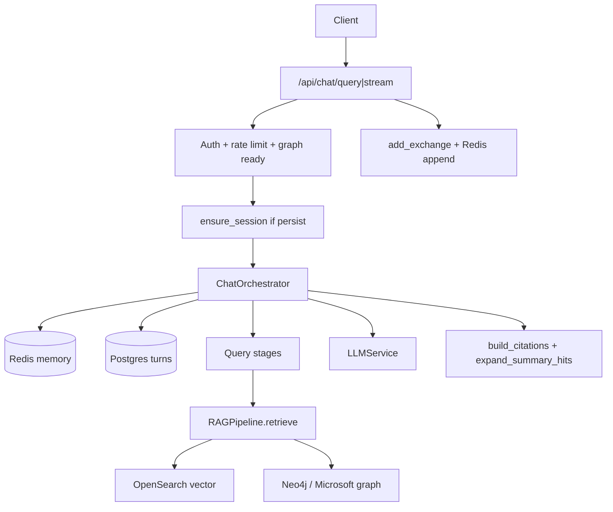
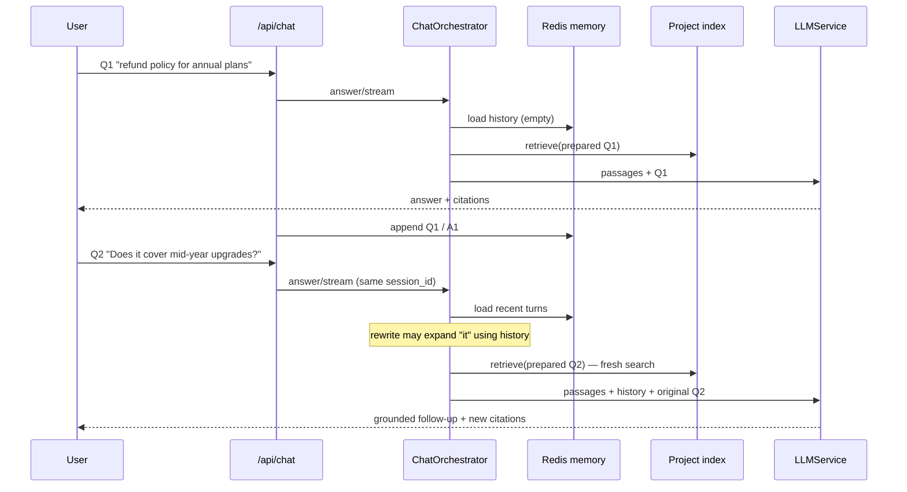
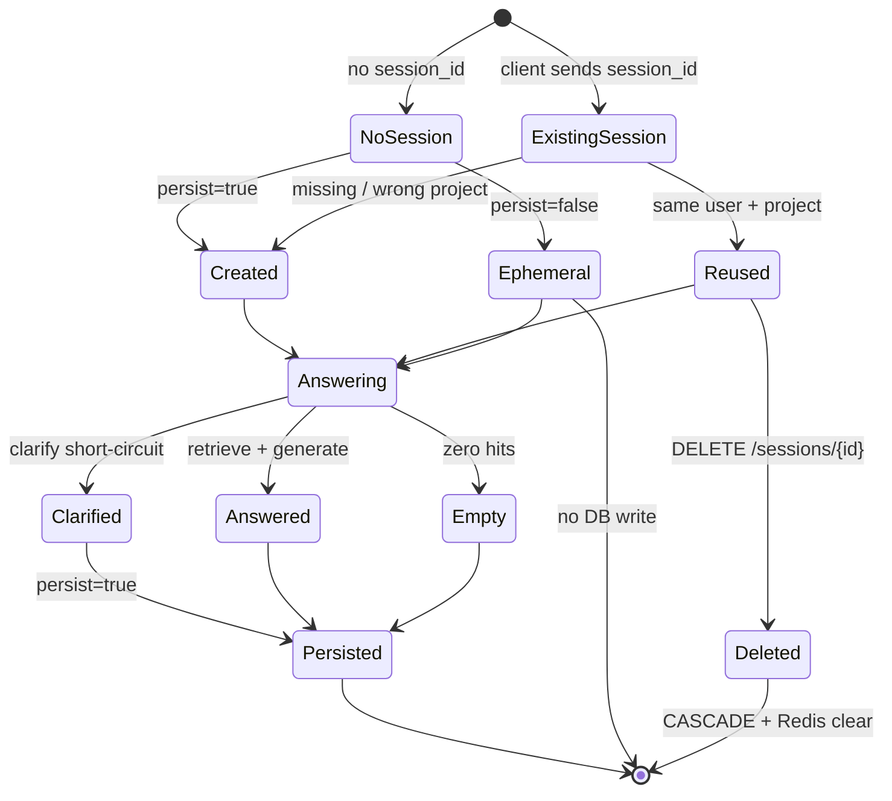

# Chat (E2E RAG)

End-to-end RAG chat: **query stages → retrieve → context expand → generate → citations**, with Postgres session history, Redis short-term memory, and SSE streaming. Works for **vector** (OpenSearch) and **graph** (Neo4j / Microsoft GraphRAG) projects.

In plain terms: the user asks a question in a project; FlexSearch looks up relevant passages from that project’s index, asks an LLM to answer **only from those passages**, and returns the answer with numbered citations. Optional multi-turn sessions let follow-ups use prior conversation context without inventing facts outside the knowledge base.

Query-quality stages (rewrite, multi-query, multihop, neighbor expand, debug) are documented in [query-stages/README.md](../query-stages/README.md). Suggested / follow-up question chips are **not** part of the orchestrator — see [suggestions/README.md](../suggestions/README.md).

---

## 1. Purpose

Turn a user question into an LLM answer grounded in the project knowledge base, with numbered citations and optional multi-turn context.

### Grounded chat vs search-only

Two product surfaces share one retrieval stack, but they answer different jobs:

| | **Search / retrieval lab** | **Grounded chat** |
|--|----------------------------|-------------------|
| Output | Ranked passages (hits) | Natural-language answer + citations |
| Model | None for the answer | LLM generate / stream over retrieved context |
| Trust signal | Scores and raw chunk text | Numbered `[n]` citations the UI can open |
| Continuity | Stateless per query | Sessions, turns, optional history |
| Failure mode | Empty hit list | Canned “could not find…” or clarify question (`empty_retrieval=true`) |

**Retrieval alone** answers “which chunks look relevant?” **Grounded chat** answers “what should I tell the user, and can I show where that came from?”

The grounding contract is deliberate:

1. Retrieve from the **project index** (OpenSearch or graph) — never treat the chat log as a corpus.
2. Prompt the LLM with those passages and instruct it to answer from context (`answer.j2`).
3. Attach the same passage list as structured citations so the UI can verify claims.
4. On zero hits (or clarify short-circuit), **do not** invent an ungrounded essay — return a fixed empty message or a clarifying question.

**Why a dedicated chat path?** Retrieval alone returns ranked chunks. Chat adds generation, session memory, and citation formatting so the product can answer questions—not just search. It deliberately reuses the same `RAGPipeline.retrieve()` as the Search lab so chat quality tracks the same index and strategies, rather than maintaining a second retrieval stack.

| Concern | Chat | Retrieval lab |
|---------|------|---------------|
| Endpoint family | `/api/chat/*` | `/api/retrieval/*` (and related) |
| Generation | Yes (`LLMService.complete` / `stream`) | No — hits only |
| Sessions / history | Yes | No |
| Query stages | Yes (`ChatConfig`) | No |
| Citations | Numbered, summary-expanded | Raw retrieval results |

Chat never forks retrieval: every retrieve goes through `RAGPipeline.retrieve()` → OpenSearch (vector) or Neo4j / Microsoft (graph).

### Key concepts (glossary)

| Term | Meaning |
|------|---------|
| **RAG-grounded answer** | The model is prompted with retrieved passages and instructed to answer from that context. Citations let the UI show *where* each claim came from. |
| **Chat session** | A named conversation thread scoped to one **(project, user)**. Holds ordered turns in Postgres; optional Redis cache for recent turns used as LLM history. |
| **Turn** | One message in a session: `user` or `assistant`. Exchanges are always written as a **user + assistant pair**. |
| **Multi-turn memory** | Prior turns fed into rewrite/clarify and answer generation so follow-ups like “what about the second point?” resolve against earlier context. Controlled by `chat.include_history` + `chat.memory`. |
| **Citation** | A numbered source passage (`[1]`, `[2]`, …) linked to a chunk (and document metadata). Built after retrieve; summary-level hits are expanded to concrete chunks before citing. |
| **Orchestrator** | `ChatOrchestrator`: the stage pipeline that prepares the query, retrieves, expands context, builds citations, and generates (or streams) the answer. |
| **Streaming (SSE)** | Server-Sent Events path that emits tokens and intermediate events as they become available, instead of waiting for the full JSON answer. |
| **Persist** | Whether the API writes the exchange to Postgres and appends to Redis (`persist=true` by default). |
| **Empty retrieval** | No usable passages after retrieve (or clarify short-circuit with no retrieve). Client gets a canned “could not find…” message (or clarifying question) and `empty_retrieval=true`. |

---

## 2. Architecture

```
Frontend ProjectChatPanel
      │
      ├─ POST /api/chat/query      JSON answer + citations
      └─ POST /api/chat/stream     SSE tokens + citations + debug
              │
              ▼
      ChatOrchestrator (app/rag/chat/orchestrator.py)
              │
              ├─ SessionMemoryService     Redis short-term turns
              ├─ ChatHistoryService       Postgres hydrate on Redis miss
              ├─ Query stages             clarify / rewrite / optimize /
              │                           multihop XOR multi_query /
              │                           context_expand (vector)
              ├─ RAGPipeline.retrieve()   same path as Search lab
              ├─ build_citations()        + expand_summary_hits
              └─ Jinja2 system + answer → LLMService
              │
              ▼
      ChatHistoryService.add_exchange → chat_sessions / chat_turns
      SessionMemoryService.append_turn  → Redis
```



**Design intent:** split durable history (Postgres) from hot conversational context (Redis). The orchestrator is the single place that sequences stages; the HTTP layer handles auth, session ensure, SSE framing, and post-answer persistence. That keeps retrieval/generation logic testable without HTTP, and keeps the UI able to stream progress without coupling to storage details.

### Key modules

| Module | Role |
|--------|------|
| `app/api/chat.py` | HTTP surface, SSE framing, persist orchestration |
| `app/schemas/chat.py` | Request/response Pydantic models |
| `app/rag/chat/orchestrator.py` | Stage pipeline + answer/stream |
| `app/rag/chat/types.py` | `ChatAnswer`, `Citation`, citation helpers |
| `app/rag/chat/stages/*` | Clarify, rewrite, multi-query, multihop, fusion, expand, debug |
| `app/services/chat_history.py` | Postgres sessions/turns |
| `app/services/session_memory.py` | Redis conversational memory |
| `app/prompts/*.j2` | `system`, `answer`, plus stage prompts (see query-stages) |
| `app/db/models.py` | `ChatSession`, `ChatTurn` |
| `alembic/versions/008_chat_sessions.py` | Schema migration |

---

## 3. How chat / sessions work (conceptually)

### Sessions, turns, and memory

Think in three layers:

| Layer | What it is | Who uses it |
|-------|------------|-------------|
| **Session** | A conversation thread owned by `(project_id, user_id)` | Session list UI, `session_id` on requests |
| **Turns** | Ordered `user` / `assistant` messages (always written as a pair) | Replay history, Postgres source of truth |
| **Memory window** | Last `max_turns` exchanges as `{role, content}` for the LLM | Rewrite/clarify + answer prompts |

A **session** is the unit of conversation continuity:

1. Client sends a question with optional `session_id` (and usually `persist=true`).
2. API **ensures** a session for that user+project (reuse or create).
3. Orchestrator **loads recent history** (Redis first; Postgres hydrate on miss) when memory is enabled.
4. Stages may rewrite or clarify using that history; retrieval still searches the **project index**, not the chat log.
5. The LLM generates an answer from retrieved passages **plus** history (for pronouns / follow-ups). The prompt uses the **original user question** for answering; rewritten text is retrieval-only.
6. On success with `persist`, the API stores the user/assistant pair and refreshes Redis.

Follow-ups therefore work in two layers: **memory** supplies conversational glue; **RAG** supplies factual grounding from the knowledge base. Chat does not treat prior assistant answers as an authoritative corpus—each turn re-retrieves.

Gates for loading history (`ChatOrchestrator._load_history`):

- `session_id` present
- `chat.include_history == true`
- `chat.memory.enabled == true`

If any gate fails, the turn is effectively single-shot (no conversational glue), even inside an existing session.

Ephemeral mode (`persist=false`) skips DB/Redis writes; useful for one-off probes. If the client still passes a valid `session_id` and memory flags allow, the orchestrator may still *read* history for that id.

### Multi-turn follow-ups (worked examples)

**Example A — pronoun resolution**

| Turn | User says | What happens |
|------|-----------|--------------|
| 1 | “What is the refund policy for annual plans?” | Retrieve policy chunks → answer with `[1]`, `[2]`. Persist user+assistant. |
| 2 | “Does **it** cover mid-year upgrades?” | Memory supplies turn 1 so rewrite (if enabled) can expand “it” → refund / annual plan. **New** retrieve against the index for upgrade rules. Answer grounded in fresh passages, not by trusting turn 1’s wording alone. |

Without history, turn 2’s retrieve query stays ambiguous (“it”), and recall suffers. With history but without re-retrieve, the model might invent upgrade rules from the earlier answer. FlexSearch does **both**: history for language, RAG for facts.

**Example B — “the second point”**

| Turn | User says | Role of memory vs RAG |
|------|-----------|----------------------|
| 1 | “Summarize onboarding steps for new vendors.” | RAG finds onboarding docs; answer lists steps with citations. |
| 2 | “Expand **the second point** with deadlines.” | Memory tells the model which step was “second”; retrieve looks up deadline-related chunks for that topic. Citations on turn 2 come from **this** retrieve, not recycled from turn 1. |

**Example C — clarify short-circuit**

| Turn | Behavior |
|------|----------|
| User: “Tell me about the policy.” (ambiguous) | If `optimization.clarify` is on, orchestrator may return a clarifying question, skip retrieve, set `empty_retrieval=true`, and (when `persist=true`) still store the exchange. |
| User: “I mean the travel reimbursement policy.” | Next turn uses history + a concrete ask → normal retrieve → grounded answer. |

**Example D — empty after a good prior turn**

Prior success does not privilege the next ask. If turn 3 retrieves nothing relevant, the canned empty message is returned even though the session has rich history. Memory is not a fallback knowledge base.



---

## 4. API reference

Router prefix: `/api/chat` (mounted in `app/main.py`). All endpoints require an authenticated active user.

### 4.1 Query and stream

| Method | Path | Response |
|--------|------|----------|
| `POST` | `/api/chat/query` | `ChatQueryResponse` JSON |
| `POST` | `/api/chat/stream` | `text/event-stream` SSE |

**When to use which:** `/query` waits for the full answer (simpler clients, tests). `/stream` is what the project chat UI uses so users see status, citations, and tokens as they arrive.

**Request body** (`ChatQueryRequest`):

| Field | Type | Default | Notes |
|-------|------|---------|-------|
| `project_id` | string (UUID) | required | Target project |
| `query` | string | required | `min_length=1` |
| `session_id` | string \| null | `null` | Continue an existing session |
| `top_k` | int \| null | `null` | 1–50; falls back to `chat.top_k` |
| `overrides` | `RetrievalOverrides` \| null | `null` | Per-query retrieval/rerank overrides |
| `persist` | bool | `true` | Write turns + Redis memory |

**Non-stream response** (`ChatQueryResponse`):

| Field | Meaning |
|-------|---------|
| `answer` | Final assistant text |
| `citations` | Numbered `ChatCitation` list |
| `retrieval_strategy` / `reranking_strategy` | From pipeline (or `"clarify"` / `"none"`) |
| `session_id` / `turn_id` | Set when persisted |
| `model`, `input_tokens`, `output_tokens`, `latency_ms` | Generation stats |
| `empty_retrieval` | True for clarify short-circuit or zero hits |
| `debug` | Stage timing summary when `chat.debug` is on |

### 4.2 Sessions and turns

| Method | Path | Notes |
|--------|------|-------|
| `POST` | `/api/chat/sessions` | Body: `{project_id, title?}` → 201 |
| `GET` | `/api/chat/sessions?project_id=&limit=&offset=` | User’s sessions for project |
| `GET` | `/api/chat/sessions/{session_id}` | Metadata; `turn_count` when turns loaded |
| `DELETE` | `/api/chat/sessions/{session_id}` | 204; CASCADE turns + clear Redis |
| `GET` | `/api/chat/sessions/{session_id}/turns` | Ordered turns |

Sessions are scoped to **(project_id, user_id)**. List responses do **not** include `turn_count`; only `GET /sessions/{id}` sets it.

There is no PATCH for title — title is set on create / first exchange (`ensure_session` / `add_exchange`).

### 4.3 Auth, rate limits, graph readiness

1. **Auth** — `get_current_active_user`; project access via `user_can_access_project` (403 if denied, 404 if missing).
2. **Rate limit** — `CHAT_RULE` (`app/core/rate_limit.py`), limit `settings.rate_limit_chat_per_minute` (default **60**/user/minute; `0` = unlimited). Applied to `/query` and `/stream`.
3. **Retrieval overrides** — `validate_retrieval_for_mode(rag_mode, rag_config, overrides)`; 400 on invalid combo.
4. **Graph readiness** (`_ensure_graph_ready`):
   - Microsoft GraphRAG: `graph_index_status` must be `ready` (else 409).
   - Neo4j: `get_neo4j_store().get_stats` must show passages or entities (else 409); store errors → 503.
5. **Timeouts** — orchestrator `TimeoutError` → 504 on `/query`; stream yields `event: error`.

---

## 5. Request / response schemas and `persist`

Schemas live in `app/schemas/chat.py`.

### Persist semantics

| `persist` | Behavior |
|-----------|----------|
| `true` (default) | `ensure_session` before orchestrate; after success, `add_exchange` + `persist_turn_memory` |
| `false` | No DB session create/update; no Redis append; `session_id` in response only if client sent one (orchestrator still may load history if that id exists and memory flags allow) |

**`ensure_session` rules:**

- If `session_id` is valid, owned by the user, and belongs to the project → reuse.
- Otherwise → create a new session titled from the question (truncated ~60 chars).
- Wrong project / missing session → **silent new session** (no 404). Clients should treat returned `session_id` as authoritative.

**Stream persist:** only runs when `persist` and `final_answer` is non-empty (from the `done` payload). Then emits `persisted` before `close`.

Clarify short-circuits and empty-retrieval canned answers are still persisted when `persist=true` (clarify uses `retrieval_strategy="clarify"`, empty citations).

---

## 6. SSE event catalog

### Why stream?

Generation (and sometimes multi-query / multihop retrieve) can take seconds. Waiting for a single JSON blob makes the UI feel stuck. SSE lets the client:

1. Show **pipeline stage** (`prepare` → `retrieve` → `generate`) while work is in flight.
2. Render **citation cards before the first token** — users can skim sources while the answer streams.
3. Append **tokens** incrementally instead of waiting for the full completion.
4. Optionally show **debug** stage timings when `chat.debug` is on.

Clients that do not need progressive UX can use `/query` instead — same orchestrator path, one response object.

Mental model of a stream:

```
session        → “here is the conversation id”
status         → “what the pipeline is doing”
citations      → “these passages will ground the answer”  (skipped on clarify)
token*         → “here is the text, piece by piece”
done           → “final payload + stats”
persisted      → “saved to Postgres / Redis” (if persist)
close          → “stream finished”
```

Framing helper: `format_sse(event, data)` → `event: …\ndata: {json}\n\n`.

Headers on the stream response:

```
Cache-Control: no-cache
Connection: keep-alive
X-Accel-Buffering: no
Content-Type: text/event-stream
```

| Event | Emitter | When | Payload |
|-------|---------|------|---------|
| `session` | API | After session ensure, if `session_uuid` set | `{ "session_id": "…" }` |
| `status` | Orchestrator | Pipeline progress | `{ "stage": "prepare" \| "retrieve" \| "generate" }` |
| `debug` | Orchestrator | When `chat.debug` | Per-stage `{ stage, duration_ms, detail }` or `{ stage: "summary", stages, total_stage_ms }` |
| `citations` | Orchestrator | After retrieve (+ expand) | `{ citations, retrieval_strategy, reranking_strategy, queries? }` |
| `token` | Orchestrator | Clarify text, empty message, or LLM chunks | `{ "content": "…" }` |
| `done` | Orchestrator | End of generation path | Answer + strategies + tokens + latency + optional `debug` / `citations` |
| `persisted` | API | After DB write | `{ "session_id", "turn_id" }` |
| `close` | API | Normal completion | `{ "reason": "complete" }` |
| `error` | API | Neo4j / timeout / unexpected | `{ "detail": "…" }` |

### Typical happy-path order

```
session → status(prepare) → [debug…] → status(retrieve) → [debug…] →
citations → status(generate) → token* → [debug…] → done → persisted → close
```

Clarify path skips retrieve/citations and streams one `token` then `done`.

Empty-retrieval path still emits `citations` (empty list) after retrieve, then one `token` with the canned message, then `done` with `empty_retrieval=true`.

Frontend consumer: `frontend/src/lib/api.ts` (`chatApi.stream`) handles all events except `close` (ignored). UI: `ProjectChatPanel.tsx`.

---

## 7. Persistence model

Chat uses a **two-tier** store:

| Tier | Store | Role |
|------|-------|------|
| Durable history | Postgres `chat_sessions` / `chat_turns` | Source of truth for session lists, turn replay, and hydrate-after-Redis-miss |
| Short-term memory | Redis | Fast list of recent `{role, content}` for the orchestrator; TTL’d so it does not grow forever |

### Why Redis + Postgres?

| Need | Better fit | Why |
|------|------------|-----|
| List sessions, open a thread, audit past answers + citation JSON | **Postgres** | Relational rows, CASCADE delete, survives restarts |
| Feed last N turns into rewrite / answer prompts on every chat request | **Redis** | Low-latency list read; no need to hit SQL on the hot path when warm |
| Bound memory growth | **Redis TTL** + `max_turns` cap | Conversational context is useful briefly; old turns remain in Postgres for replay |
| Survive Redis flush / expiry | **Hydrate from Postgres** | Multi-turn continuity without forcing the client to resend history |

**Why both?** Every request should not re-load full turn rows from Postgres when Redis is warm. When Redis expires or restarts, hydrate from Postgres so multi-turn context survives without requiring the client to resend history.

Concrete follow-up path with the split:

1. Turn 1 completes → `add_exchange` writes four columns of citation metadata to Postgres; `append_turn` pushes `{user, assistant}` into Redis.
2. Turn 2 arrives seconds later → `_load_history` hits Redis (fast), rewrite sees turn 1, retrieve runs fresh.
3. Hours later, Redis key expired → turn 5 still works: miss → `turns_as_memory` from Postgres → `replace_turns` warms Redis again.
4. User deletes the session → Postgres CASCADE removes turns; Redis key is cleared so stale memory cannot leak into a new conversation.

Redis failures are soft (log + empty / skip append). The product degrades to Postgres-only hydrate on the next cold load, not to a hard 500.

### Postgres

Migration: `008_chat_sessions.py`.

**`chat_sessions`**

| Column | Notes |
|--------|-------|
| `id` | UUID PK |
| `project_id` | FK → `projects` CASCADE |
| `user_id` | FK → `users` CASCADE |
| `title` | Optional string (255) |
| `created_at` / `updated_at` | Timestamptz; `updated_at` bumped on each exchange |

**`chat_turns`**

| Column | Notes |
|--------|-------|
| `id` | UUID PK |
| `session_id` | FK → `chat_sessions` CASCADE |
| `role` | `"user"` \| `"assistant"` (string) |
| `content` | Text |
| `citations` | JSON (assistant only) |
| `retrieval_strategy` / `reranking_strategy` | Assistant only |
| `model`, `input_tokens`, `output_tokens`, `latency_ms` | Assistant only |
| `created_at` | Timestamptz; relationship ordered by this |

`add_exchange` always writes a **user + assistant pair**.

### Redis short-term memory

`SessionMemoryService` (`app/services/session_memory.py`):

| Item | Value |
|------|-------|
| Key | `flexsearch:chat:memory:{session_id}` |
| Value | JSON list of `{role, content}` |
| TTL | `chat.memory.ttl_seconds` (default 3600) |
| Cap | Keeps last `max_turns * 2` entries on append |

**Hydrate path** (`ChatOrchestrator._load_history`):

1. Require `session_id`, `chat.include_history`, and `chat.memory.enabled`.
2. `memory.get_turns`.
3. On miss → `ChatHistoryService.turns_as_memory` → `memory.replace_turns`.

Redis failures are soft (log + empty / skip). Delete session clears the Redis key.



---

## 8. Orchestrator and RAG modes

`ChatOrchestrator(db, project)` parses `project.rag_mode` + `project.rag_config` into `VectorRagConfig` or `GraphRagConfig`, then reads `rag_config.chat` (`ChatConfig`, defaults if missing).

### Orchestrator mental model

Treat `ChatOrchestrator` as a **fixed funnel**, not a free-form agent. Each request walks the same stages; config only toggles which optional steps run. The HTTP layer never retrieves or prompts the LLM itself — it ensures the session, calls `answer` / `stream`, frames SSE, and persists.

```
                    ┌─────────────────────────────────────┐
   user question ──►│ 1. Remember   history (Redis→PG)    │
                    │ 2. Prepare    clarify/rewrite/opt   │
                    │ 3. Retrieve   shared RAGPipeline    │
                    │ 4. Expand     neighbors (vector)    │
                    │ 5. Cite       number + expand sum.  │
                    │ 6. Generate   system + answer.j2    │
                    │ 7. Observe    metrics / debug       │
                    └─────────────────────────────────────┘
```

Important invariants:

- **One retrieval implementation** — stages may call `retrieve` N times (multi-query / multihop) but never replace OpenSearch / Neo4j with ad-hoc search.
- **Original question for answering** — rewrite/optimize change the *search string*; `_build_messages` still passes the user’s original wording as `question`.
- **History is glue, not corpus** — prior turns help resolve “it” / “the second point”; facts must come from this turn’s passages.
- **Short-circuits are first-class** — clarify and empty retrieval exit before (or without) grounded generation, still producing a well-formed `ChatAnswer` / SSE `done`.

### Pipeline (conceptual)

Think of one chat request as a fixed funnel:

1. **Remember** — Load recent turns (if enabled) so follow-ups make sense.
2. **Prepare** — Optionally clarify (ask the user a question and stop), rewrite, or optimize keywords. These change *how* we search; they do not replace the knowledge base.
3. **Retrieve** — One or more calls into the shared pipeline (single query, multi-query fusion, or multihop). Same stores as Search lab.
4. **Expand** (vector) — Optionally pull neighboring chunks so answers are not cut mid-paragraph.
5. **Cite** — Number passages; expand hierarchical summary hits to concrete chunks so citations point at real text.
6. **Generate** — System + answer prompts with passages, history, and the **original** question. Stream or return JSON.
7. **Observe** — Record metrics / optional debug timings.

Stages are opt-in per project (`ChatConfig`) so simple deployments stay cheap; quality stages add LLM and retrieve cost only when enabled. Details: [query-stages](../query-stages/README.md).

### Pipeline (high level)

1. Load history (Redis → Postgres).
2. Prepare query: clarify → rewrite → optimize ([query-stages](../query-stages/README.md)).
3. Retrieve: multihop **XOR** multi-query **XOR** single `RAGPipeline.retrieve`.
4. Context expand if vector and `context_window > 0`.
5. `build_citations` → `expand_summary_hits(keep_summaries=False)` so answers cite concrete chunks ([summaries](../summaries/README.md)).
6. Generate with `system.j2` + `answer.j2` using the **original user question** (rewritten text is retrieval-only) and history.
7. Record `MetricsRegistry.record_chat` + per-stage `observe_stage`.

### Vector vs graph

| Aspect | Vector | Graph |
|--------|--------|-------|
| Store | OpenSearch via search store | Neo4j or Microsoft GraphRAG |
| Rerank | From project config (e.g. cross-encoder) | Always reported `"none"` |
| Neighbor expand | Yes when `context_window > 0` | Skipped |
| Multihop | Decompose + fuse | Same + `graph_aware` prompt; may set `retrieval_params.max_hops` |
| Empty index | Canned “could not find…” | Same; API also gates readiness up front |

Config UI defaults for chat stages are exposed at `GET /api/rag/options` → `chat.defaults` / `chat.phase2_stages`.

---

## 9. Citations and empty retrieval

### Citations as a trust mechanism

A fluent LLM answer without sources is hard to audit. Citations are the product’s trust surface:

1. After retrieve, each passage is numbered `[1]…[n]` in order.
2. `answer.j2` shows those passages and asks the model to cite with matching `[n]` markers where claims come from context.
3. The API returns the same numbered list (`ChatCitation`: chunk/document ids, content snippet, score, filename, metadata) so the UI can highlight or preview the source — independent of whether the model’s prose marked every claim perfectly.

So trust is **structural** (attached passage list + shared numbering), not solely dependent on the model always citing correctly. The UI can always show “these were the passages in context,” even if a sentence lacks a marker.

**Why expand summaries?** Hierarchical summary nodes are useful for retrieval breadth but are poor citation targets (they summarize many chunks). Expanding to member chunks keeps UI sources concrete and openable ([summaries](../summaries/README.md)).

`build_citations` (`types.py`):

1. Expand hierarchical summary hits via `expand_summary_hits` (cluster/document → member chunks).
2. Map each `RetrievalResult` to `Citation` (`index`, `chunk_id`, `document_id`, `content`, `score`, `filename`, `metadata`).

Answer prompt asks the model to cite with `[n]` markers matching passage order.

### Empty retrieval

When there are no citations after retrieve:

> I could not find relevant information in the project knowledge base for that question.

`empty_retrieval=true`. Clarify short-circuit also sets `empty_retrieval=true` (no retrieve attempted).

**Why a canned message instead of letting the LLM improvise?** Without passages, a “helpful” model may answer from parametric knowledge and look authoritative. The empty path refuses that: no passages → no grounded generation → fixed copy + flag. Clients can show a distinct empty state (and avoid painting citation cards) without parsing the text.

| Situation | Retrieve? | Citations | `empty_retrieval` | User-visible result |
|-----------|-----------|-----------|-------------------|---------------------|
| Normal grounded answer | Yes | Non-empty | `false` | Answer + `[n]` sources |
| Zero hits | Yes | `[]` | `true` | Canned “could not find…” |
| Clarify short-circuit | No | `[]` | `true` | Clarifying question (`retrieval_strategy="clarify"`) |

That flag lets clients distinguish “model refused / clarified / no evidence” from a normal grounded answer, without parsing the canned text.

Empty answers are still persisted when `persist=true` (useful so the session shows the failed ask). They do **not** invent citations.

---

## 10. Observability

`MetricsRegistry` (`app/observability/metrics.py`), exposed when `settings.metrics_enabled` via `GET /metrics` and health payload.

| Metric / method | Labels / notes |
|-----------------|----------------|
| `record_chat` | `path=query\|stream`, `rag_mode`, empty counter, `chat_total` latency, token counters |
| `observe_stage` | Per stage name from `StageTimer` (clarify, rewrite, retrieve, generate, …) |
| Pipeline | `record_retrieval` inside `RAGPipeline.retrieve` |

Stage timings are **always** collected for metrics. Client-facing `debug` payloads / SSE `debug` events require `chat.debug=true`.

---

## 11. Related endpoints (out of scope)

Suggestions and follow-ups use the same chat UI but **not** `ChatOrchestrator`:

| Endpoint | Service |
|----------|---------|
| `GET /api/projects/{id}/suggestions` | `generate_project_suggestions` |
| `POST /api/chat/suggestions/followup` | `generate_followup_questions` |

Prompts: `suggested_questions.j2`, `followup.j2`. Full detail: [suggestions/README.md](../suggestions/README.md).

---

## 12. Frontend consumers

| File | Role |
|------|-------|
| `frontend/src/components/ProjectChatPanel.tsx` | Chat UI, session sidebar, stream handlers, suggestion chips |
| `frontend/src/lib/api.ts` | `chatApi.query` / `stream` / sessions / turns |
| `frontend/src/components/RagConfigForm.tsx` | Per-project `ChatConfig` toggles |
| `frontend/src/lib/rag-types.ts` | `ChatConfig` TypeScript mirror |

---

## 13. Known limitations

- Wrong `session_id` for project → silent new session.
- `list_sessions` omits `turn_count`.
- No session title update API.
- Stream `close` is unused by the frontend client.
- Clarify / empty answers still persist when `persist=true`.
- `turns_as_memory` has no user filter (internal hydrate only).
- Redis down: hydrate from Postgres each cold request; appends no-op until Redis returns.
- Multihop silently wins over multi-query when both enabled — see [query-stages/README.md](../query-stages/README.md).

---

## See also

- [Query stages](../query-stages/README.md)
- [Suggestions](../suggestions/README.md)
- [Hierarchical summaries](../summaries/README.md)
- [OpenSearch](../opensearch/README.md)
- [Neo4j Graph RAG](../neo4j-graph-rag/README.md)
- [Ops / metrics](../ops/README.md)
