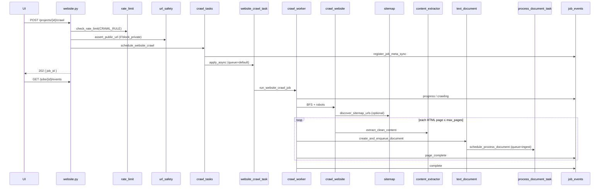
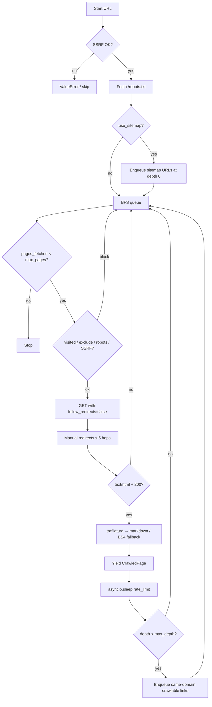
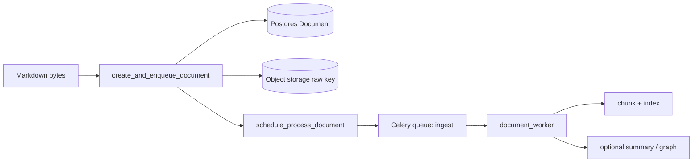

# Website crawler

Crawl a public website (BFS, robots-aware, optional sitemap seed) and land each page as a markdown `Document` in the **same FlexSearch ingest pipeline** as UI uploads: object storage → Celery `ingest` → extract/preprocess → chunk → OpenSearch → optional hierarchical summaries / graph index.

**In plain language:** you point FlexSearch at a public docs or help site; it walks the site politely, cleans each HTML page into markdown, and feeds those pages into the ordinary “make this searchable” pipeline. Chat then retrieves from that corpus like any other project documents.

This document describes the **code as implemented**. Known gaps are listed honestly in [Limitations](#limitations--gaps).

---

## Why crawling exists for RAG

Uploads and bulk packs cover files you already have. Many useful corpora live only as **public websites** — product docs, internal-style knowledge bases hosted on the open web, help centers, changelogs. Without a crawler you would download every page by hand (or write a one-off script) and upload the files.

Crawling for RAG means: **discover → fetch → clean → land as documents → chunk/index**. The goal is not to archive the whole web; it is to turn “this domain, within caps” into indexed passages so retrieval can answer questions grounded in that site.

| Without crawl | With crawl |
|---------------|------------|
| Operator saves each page as `.md` / PDF and uploads | Operator submits one start URL; the job discovers and lands pages |
| Corpus freshness = last manual export | Re-run crawl to refresh (new documents; no automatic overwrite — see [Dedup](#dedup-within-a-crawl)) |
| Discovery is human memory (“I think `/pricing` exists”) | Discovery is link-following + optional sitemap inventory |

Discovery and ingest are split on purpose: the crawl job finds and cleans pages on the **`default`** queue; each page independently schedules **`ingest`**, so indexing scales like normal documents and reuses the same pipeline. The crawler does **not** invent a second RAG stack — it only accelerates *getting web pages into* the shared ingest path.

---

## Concepts

| Term | Meaning |
|------|---------|
| **Crawling** | Systematically discovering and fetching pages by following links (and optionally a sitemap). FlexSearch walks a site within caps (`max_pages`, `max_depth`) and turns each HTML page into a document. |
| **Scraping** | Pulling content from a *known* URL (or a fixed list). Bulk import’s `type: "url"` refs are closer to scrape-one-URL; this crawler *discovers* URLs as it goes. |
| **BFS (breadth-first)** | Visit pages level by level from the start URL: first the start page, then its links, then their links — not a deep dive down one path first. |
| **Sitemap** | An XML list of URLs the site publishes (usually `/sitemap.xml`). Used here as an optional **seed**: those URLs enter the queue early so discovery is not limited to links found on the start page alone. |
| **robots.txt** | A site’s crawl policy file. When `respect_robots` is on, FlexSearch skips URLs the policy disallows for `FlexSearch-Crawler/1.0`. |
| **Politeness** | Not hammering a site: honor robots, sleep between fetches (`rate_limit`), stay same-domain, cap pages/depth. |
| **SSRF / URL safety** | Server-side request forgery: tricking the server into fetching private or internal network addresses. `url_safety` blocks private/loopback/metadata IPs so crawl jobs only hit public http(s) targets (when enabled). |
| **Content extraction** | Stripping chrome (nav, footer, scripts) and keeping the main article body as markdown — what you want in the RAG corpus, not the full raw HTML. |
| **Page → document** | Each crawled page becomes a project `Document` (markdown bytes + Postgres row + object storage), then the **same ingest path** as an upload: chunk → index → optional summaries/graph. |
| **Dedup (crawl-local)** | Within one job, a `visited` set keyed by **normalized** URL prevents fetching the same page twice as links fan in. Not content-hash dedup across jobs. |

### Crawling vs scraping (RAG framing)

Think of the corpus builder’s job:

- **Scrape** — “I already know `https://docs.example.com/guide/install` exists; fetch that one page.” Bulk `type: "url"` is this shape: fixed refs, no discovery.
- **Crawl** — “Start at `https://docs.example.com/`; find what else on this host is linked (and optionally listed in a sitemap), within depth/page budgets.”

For RAG, crawling is useful when the site *is* the knowledge base and the URL inventory is large or unknown. Scraping is better when you have an explicit allowlist and do not want the job to wander.

### BFS (breadth-first) with a small example

FlexSearch uses a queue (`deque`): dequeue the oldest pending URL, fetch it, then enqueue newly discovered same-domain links at `depth + 1`. That is **BFS**, not DFS (which would chase one branch to `max_depth` before siblings).

Why BFS for a docs crawl? Early levels tend to be hub pages (home, section indexes). Filling those first usually covers more of the site’s “map” before burning `max_pages` on a deep leaf trail.

Example site graph (arrows = links):

```
depth 0:  /                 (start)
depth 1:  /guide    /api    /blog
depth 2:  /guide/a  /guide/b   /api/auth
```

With `max_depth=1` and `max_pages=50`, the walk can land `/`, `/guide`, `/api`, `/blog` but will **not** enqueue `/guide/a` (would be depth 2). With `max_depth=2` but `max_pages=3`, BFS might land `/`, then two of the depth-1 hubs, and stop before deeper pages — the page cap wins over unfinished depth.

Sitemap URLs are enqueued at **depth 0** (see below), so they sit in the same early wave as the start URL, not as “deep” discoveries.

### robots.txt and politeness

`robots.txt` is a voluntary policy published at `{origin}/robots.txt`. Sites use it to mark paths crawlers should skip (admin, search URLs, infinite calendar feeds, etc.). FlexSearch’s User-Agent is `FlexSearch-Crawler/1.0`; when `respect_robots` is true, each candidate URL is checked with `RobotFileParser.can_fetch` before GET.

Example policy:

```
User-agent: *
Disallow: /admin
Disallow: /search
```

Then `https://docs.example.com/admin/secrets` is skipped even if a footer link points there; `/guide/install` is allowed.

**Politeness** in this codebase is the combination of:

| Knob | Role |
|------|------|
| `respect_robots` | Honor published Disallow rules for this UA |
| `rate_limit` | `asyncio.sleep` after each successful page (default 0.5s) |
| Same-domain only | Do not fan out to third-party CDNs or linked partners |
| `max_pages` / `max_depth` | Hard stop so one job cannot unbounded-crawl |

If `/robots.txt` cannot be fetched, the parser is `None` and FlexSearch treats the site as allow-all (documented behavior — not “fail closed”).

### Sitemap as a seed, not a full crawl plan

A **sitemap** is the publisher’s URL inventory (XML `<loc>` entries), often at `/sitemap.xml`. Orphan pages — real content never linked from the start page — are invisible to pure link-following. Seeding the queue from the sitemap fixes that for URLs the publisher bothered to list.

Conceptually:

```
start URL  ──► queue
sitemap locs ──► queue (depth 0, before BFS continues)
BFS link walk ──► more queue entries (depth = parent + 1)
```

FlexSearch only peeks at `{origin}/sitemap.xml` and `{origin}/sitemap_index.xml`, caps at **500** locs, and does **not** recursively fetch child sitemap files (see [Limitations](#limitations--gaps)). So “use sitemap” improves coverage; it is not a guarantee of every URL the CMS knows about.

### SSRF as a concept (why crawl needs a gate)

**Server-side request forgery (SSRF):** the attacker does not fetch a private URL themselves — they trick *your server* into fetching it. A crawl API is a natural SSRF surface: the user supplies a URL, and a privileged worker performs the HTTP GET.

Classic malicious targets:

| Target | Why it matters |
|--------|----------------|
| `http://127.0.0.1:6379/` | Hit Redis / admin ports on the host |
| `http://169.254.169.254/...` | Cloud instance metadata (credentials) |
| `http://10.0.0.5/internal` | Reach RFC1918 services the worker can route to |

FlexSearch’s `url_safety` module (when `CRAWL_BLOCK_PRIVATE_URLS` is on) allows only `http`/`https`, resolves DNS, and rejects private, loopback, link-local, CGNAT, and metadata ranges — at submit time, crawl start, and each queued URL / redirect hop. That is **defense in depth for a fetcher**, not a general WAF.

Remaining gap (honest): DNS is checked at validation time; `httpx` may resolve again at connect time (TOCTOU / DNS rebinding). See [SSRF / URL safety](#ssrf--url-safety).

### Content extraction (chrome vs corpus)

Raw HTML is a poor RAG unit: nav bars, cookie banners, footers, and scripts pollute embeddings and waste context tokens. Extraction (trafilatura → markdown, BeautifulSoup fallback) keeps the **main readable body** so chunks reflect article substance.

Example intuition: a docs page’s sidebar “Related articles” list should not dominate the vector for “how do I rotate API keys?” — the procedure in `<article>` should.

### Page → document

After extraction, a page is no longer “a live URL.” It becomes a normal project **Document**:

1. Markdown bytes with provenance header `<!-- source_url: {url} -->`
2. Postgres row + object-storage raw key via `create_and_enqueue_document`
3. Celery **`ingest`** → same extract/chunk/index path as UI uploads and bulk import

Citations and chat do not special-case “web” vs “upload”; they see documents and chunks. The `source_url` comment preserves where the text came from for humans and tooling.

Empty extract → stub body with title + `Source: {url}` so the crawl still records the URL rather than silently dropping the page.

### Dedup (within a crawl)

Within one crawl job, FlexSearch tracks a **`visited` set** of normalized URLs. Before fetch (and when enqueueing links / sitemap seeds), a URL already in `visited` is skipped. That stops the classic graph problem: many pages link to `/`, which would otherwise be re-fetched forever.

**Normalization** (`normalise_url`):

- Strip URL fragment (`#section`)
- Collapse trailing slash on the path (root `/` kept)
- Rebuild as `scheme://netloc/path` — **query strings are not kept** in the crawl key

Examples:

| Input | Normalized key | Effect |
|-------|----------------|--------|
| `https://ex.com/docs/#install` | `https://ex.com/docs` | Fragment variants share one visit |
| `https://ex.com/docs/` | `https://ex.com/docs` | Trailing-slash twin collapses |
| `https://ex.com/docs?utm=news` | `https://ex.com/docs` | Tracking params do not create a second fetch |
| `https://ex.com/docs?page=2` | `https://ex.com/docs` | Also collapses — content-bearing query variants are **not** distinguished (limitation of this normalizer) |

What dedup does **not** do:

- No content-hash merge (two different URLs with identical HTML → two documents)
- No cross-job identity (re-crawl creates **new** documents; it does not update prior crawl docs in place)
- No global “this URL already ingested last week” check

Redirect targets are re-normalized and added to `visited` as hops are followed (≤ 5), so a redirect loop or redirect-into-already-seen URL stops cleanly.

### How a crawl works (conceptually)

1. **Start** — User submits a public URL for a project; API rate-limits, optionally SSRF-checks, registers a job, returns `202` + `job_id`.
2. **Seed** — Optionally load sitemap URLs at depth 0; always include the start URL.
3. **Walk** — BFS: fetch HTML, extract main content, enqueue same-domain links (subject to depth, exclude patterns, robots, SSRF, visited).
4. **Land** — Wrap each page as markdown with a `source_url` comment → `create_and_enqueue_document` → object storage + ingest task.
5. **Progress** — Redis/SSE events (`page_complete`, `complete`, …) so the UI can show status while pages fan out to ingest.

---

## Purpose

| Goal | Mechanism |
|------|-----------|
| Discover pages | Same-domain BFS + optional `/sitemap.xml` seed |
| Respect site policy | `robots.txt` via `urllib.robotparser` |
| Avoid SSRF | `url_safety.assert_public_url` / `is_safe_public_url` when enabled |
| Produce corpus | Clean markdown per page → `create_and_enqueue_document` |
| Track long jobs | Redis job meta + SSE at `GET /api/jobs/{job_id}/events` |

Crawl orchestration runs on the Celery **`default`** queue. Each page fans out to the **`ingest`** queue independently.

---

## API

### `POST /api/projects/{project_id}/crawl`

| Item | Detail |
|------|--------|
| Status | **202 Accepted** |
| Auth | Bearer user; `verify_project_access` |
| Rate limit | `CRAWL_RULE` → `RATE_LIMIT_CRAWL_PER_MINUTE` (default **10**/min; `0` = unlimited) |
| SSRF gate | If `CRAWL_BLOCK_PRIVATE_URLS`, reject start URL before enqueue |
| Response | `{ "job_id", "status": "queued", "project_id" }` |

**Request body** (`WebsiteCrawlRequest`):

| Field | Type | Constraints | If omitted |
|-------|------|-------------|------------|
| `url` | HttpUrl | required | — |
| `max_depth` | int \| null | 0–10 | `CRAWL_MAX_DEPTH` |
| `max_pages` | int \| null | 1–500 | `CRAWL_MAX_PAGES` |
| `exclude_patterns` | string[] \| null | `fnmatch` on URL **path** | none |
| `respect_robots` | bool \| null | | `CRAWL_RESPECT_ROBOTS` |
| `use_sitemap` | bool \| null | | `CRAWL_USE_SITEMAP` |
| `rate_limit` | float \| null | 0–30 seconds between fetches | `CRAWL_RATE_LIMIT` |

**Job id shape:** `crawl:{project_id}:{12-hex}`.

Meta is registered synchronously in Redis (`job_type=crawl`, `project_id`) so SSE can ACL-check the caller.

### Progress: `GET /api/jobs/{job_id}/events`

SSE stream (shared with bulk). Authorization:

1. Load Redis job meta (`flexsearch:job:{id}:meta`, TTL 6h)
2. Require `project_id` on meta
3. `verify_project_access` for that project

Events published by the crawl worker:

| `event` | Meaning |
|---------|---------|
| `progress` | Job started / stage update |
| `page_complete` | One page queued for ingest (`document_id`, progress %) |
| `complete` | Crawl finished; `document_ids` list |
| `error` | Fatal failure |

Clients typically open SSE after the 202 response (see frontend `websiteApi.streamJob`).

---

## Architecture





### Shared ingest path (after each page)

Crawl stops at “clean markdown on disk + Document row.” Chunking, embeddings, OpenSearch (and optional summaries/graph) are **not** special-cased for websites — they use the same `document_worker` path as UI uploads and bulk import.



`create_and_enqueue_document`:

1. Insert `Document` (`UPLOADED` → flush → `storage_path` = `{project}/{doc_id}/raw{ext}`)
2. Upload bytes; status → `STORED`
3. `schedule_process_document` → task id `ingest:{document_id}:auto` on **`ingest`**

Crawl always passes `content_type="text/markdown"`.

---

## Crawler behavior

Implementation: `app/services/website/crawler.py`.

In practice this is a **bounded same-site walk**: stay on one host, prefer HTML pages, skip binary/asset URLs, and stop at depth/page caps so a large site cannot unbounded-fan out into the job.

| Rule | Behavior |
|------|----------|
| Traversal | BFS (`deque`) |
| Domain | Same `netloc` only |
| Normalize | Strip fragment; collapse trailing slash on path (root stays `/`); query string **dropped** from crawl key (see [Dedup](#dedup-within-a-crawl)) |
| Dedup | In-job `visited` set on normalized URL; redirect hops also marked visited |
| Skip extensions | Images, fonts, css/js, pdf, archives, media (see `_SKIP_EXTENSIONS`) |
| Exclude | `fnmatch` against URL **path** only |
| User-Agent | `FlexSearch-Crawler/1.0` |
| HTTP client | `httpx.AsyncClient(follow_redirects=False, timeout=30)` |
| Redirects | Manual follow ≤ 5; re-check same-domain + SSRF each hop |
| Accept | `content-type` contains `text/html` and status **200** |
| Rate | Sleep `rate_limit` seconds after each successful page |

### Robots

Implementation of the [robots / politeness](#robotstxt-and-politeness) concept:

If `respect_robots`:

1. `GET {scheme}://{netloc}/robots.txt`
2. Parse with `RobotFileParser`
3. Skip URLs where `can_fetch(USER_AGENT, url)` is false

If robots cannot be fetched → treat as allow-all (parser is `None`).

### Sitemap

Implementation of the [sitemap seed](#sitemap-as-a-seed-not-a-full-crawl-plan) concept. Only fixed well-known paths — no recursive child sitemap chase (see [Limitations](#limitations--gaps)).

`app/services/website/sitemap.py` → `discover_sitemap_urls`:

1. Try only `{origin}/sitemap.xml` and `{origin}/sitemap_index.xml`
2. Cap at **500** URLs
3. Parse `url/loc` (with and without sitemap namespace)
4. Locs ending in `.xml` whose text contains `"sitemap"` are **skipped** (not fetched recursively)
5. Matching same-domain crawlable URLs are enqueued at **depth 0** before BFS continues from the start URL

Does **not** read `Sitemap:` directives from `robots.txt`.

### Content extraction

`app/services/website/content_extractor.py`:

1. **Primary:** `trafilatura.extract(..., output_format="markdown", include_links=True, include_tables=True)`
2. **Fallback:** BeautifulSoup — strip `nav`/`header`/`footer`/`aside`/`script`/`style`; prefer `article` or `main`; emit headings, paragraphs, lists

### Page → document

`crawl_worker.run_website_crawl_job` wraps each page:

```markdown
<!-- source_url: {url} -->
# {title}

{extracted body}
```

Empty extract → stub with title + `Source: {url}`. Filename from sanitized title (max 80 chars) + `.md`.

Raw HTML is **not** persisted; only derived markdown is stored and ingested.

---

## SSRF / URL safety

Concept: [SSRF as a concept](#ssrf-as-a-concept-why-crawl-needs-a-gate). Implementation gate below.

`app/services/url_safety.py`, gated by `CRAWL_BLOCK_PRIVATE_URLS` (default `true`):

- Schemes: `http` / `https` only
- Blocks private, loopback, link-local, CGNAT, cloud metadata (`169.254.0.0/16`), IPv4-mapped IPv6, `localhost` / `*.local`
- Resolves hostname via DNS and checks all returned IPs

Applied at:

- API submit (start URL)
- Crawl start inside `crawl_website`
- Each queued URL / redirect target (`is_safe_public_url`)

**Gap:** validation resolves DNS at check time; `httpx` may resolve again at connect time (classic DNS-rebinding TOCTOU). There is no IP-pinned transport.

---

## Celery

| Item | Value |
|------|-------|
| Task | `app.services.celery_tasks.website_crawl_task` |
| Queue | **`default`** |
| Soft / hard time limit | 45 / 50 minutes |
| `max_retries` | 1 |
| Scheduler | `app.services.website.crawl_tasks.schedule_website_crawl` |

Workers that consume `default` must have network egress to crawl targets and access to Postgres, Redis, and object storage (same as ingest workers for the fan-out path).

---

## Config / environment

| Env / setting | Default | Notes |
|---------------|---------|-------|
| `CRAWL_MAX_DEPTH` | `2` | Request override max 10 |
| `CRAWL_MAX_PAGES` | `50` | Request override max 500 |
| `CRAWL_RATE_LIMIT` | `0.5` | Seconds between page fetches |
| `CRAWL_RESPECT_ROBOTS` | `true` | |
| `CRAWL_USE_SITEMAP` | `true` | |
| `CRAWL_BLOCK_PRIVATE_URLS` | `true` | Shared with bulk URL refs |
| `RATE_LIMIT_ENABLED` | `true` | |
| `RATE_LIMIT_CRAWL_PER_MINUTE` | `10` | `0` = unlimited |

Sitemap discover limit (**500**) is hardcoded in `sitemap.py`, not a settings field.

---

## Limitations / gaps

1. **Sitemap index recursion** — child sitemap `.xml` URLs are skipped; multi-file indexes under-discover pages.
2. **No `Sitemap:` from robots.txt** — only fixed `/sitemap.xml` and `/sitemap_index.xml` paths.
3. **Strict public-only networking** — private/internal sites are intentionally unreachable; each DNS result and redirect is validated and connection-pinned.
4. **Response and crawl ceilings** — remote bodies and total pages are bounded; operators must tune the documented limits for unusually large public sites.
5. **No crawl job cancel API** — ingest has revoke helpers; crawl tasks do not expose user cancel.
6. **Raw HTML not stored** — only markdown with a `source_url` comment.
7. **Query string collapsed in normalize** — `normalise_url` rebuilds `scheme://netloc/path` only, so `?utm=…` twins share one visit (good for tracking params) but content-bearing queries (`?page=2`) also collapse to the same key and are not crawled separately.
8. **Display filename collisions** — storage keys include `document_id` (unique); UI filenames from titles can collide.
9. **Frontend body subset** — UI may omit `respect_robots` / `use_sitemap` / `rate_limit`; server defaults apply.
10. **`TEXT_INGEST_TYPES` unused** — crawl always sends markdown, so this is mostly a bulk concern; the constant in `text_document.py` is not enforced for either path.

---

## Related code map

| Path | Role |
|------|------|
| `app/api/website.py` | HTTP endpoint |
| `app/services/website/schemas.py` | Request / `CrawledPage` models |
| `app/services/website/crawler.py` | BFS engine |
| `app/services/website/sitemap.py` | Sitemap discovery |
| `app/services/website/content_extractor.py` | HTML → markdown |
| `app/services/website/crawl_tasks.py` | Enqueue Celery job |
| `app/services/website/crawl_worker.py` | Job loop → documents |
| `app/services/url_safety.py` | SSRF checks |
| `app/services/text_document.py` | Shared document create + ingest enqueue |
| `app/services/celery_tasks.py` | `website_crawl_task` |
| `app/api/jobs.py` | Job SSE |
| `app/services/job_events.py` | Redis pub/sub + meta |
| `app/core/rate_limit.py` | `CRAWL_RULE` |
| `app/core/config.py` | Crawl + rate-limit settings |

### Tests

| File | Coverage |
|------|----------|
| `tests/test_phase4_crawl_bulk.py` | URL normalize, crawlable/exclude, extract fallback |
| `tests/test_phase4_api.py` | Crawl submit smoke (mocked schedule) |
| `tests/test_phase5.py` | SSRF unit cases |

Little end-to-end coverage of live crawl → ingest.
