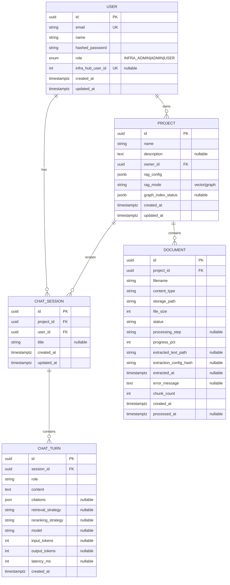
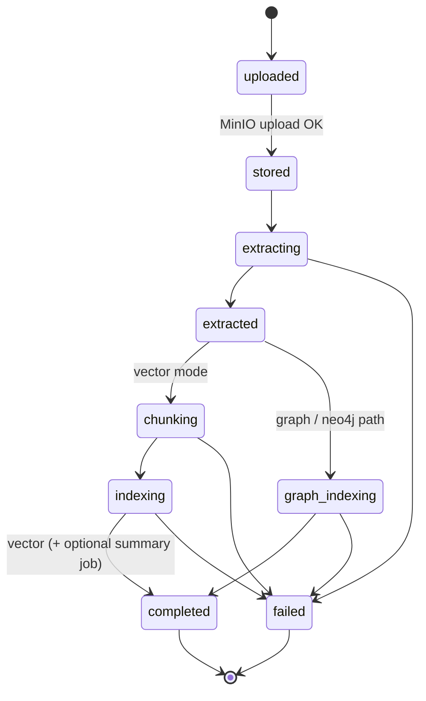

# Data Model

PostgreSQL schema for FlexSearch application state. Vector/BM25 chunks live in **OpenSearch**; Neo4j / Microsoft GraphRAG artifacts are separate. ORM: `app/db/models.py`. Engine: `app/db/postgres.py` (async SQLAlchemy + asyncpg).

**In plain language:** Postgres is the catalog — who owns which project, which files exist, whether ingest succeeded, and what was said in chat. Searchable text, raw bytes, and ephemeral job progress live in other stores on purpose. This doc teaches that split, then the ERD and status machines that implement it.

---

## How the data model works (conceptually)

FlexSearch splits **who owns what** from **what can be searched**.

A RAG product that stuffed everything into one database would either (a) make relational queries fight k-NN / BM25, or (b) lose durable ACL and chat history when the search cluster is wiped. FlexSearch therefore uses **four durable-ish planes** plus one ephemeral plane, keyed by the same UUIDs:

| Layer | Role in plain language |
|-------|------------------------|
| **Postgres** | Source of truth for users, projects, documents, chat history, and processing status — the “catalog” and ACL surface |
| **OpenSearch** | Searchable pieces of documents (chunks + optional summaries) for vector-mode RAG |
| **Neo4j / GraphRAG workspace** | Entities, passages, and graph structure when the project runs in graph mode |
| **MinIO** | Raw files and extracted text blobs referenced by document rows |
| **Redis** | Short-lived job progress, SSE fan-out, rate limits, Celery, and chat session memory — not durable domain state |

### Why each store exists

Think of one uploaded PDF as four related facts, not one blob:

1. **Catalog fact (Postgres):** “Document `D` belongs to project `P`, owned by user `U`, status=`indexing`, 42% done.” The UI, workers, and auth checks read this without opening the file or querying the index.
2. **Bytes fact (MinIO):** The original upload and `extracted.md` under `{project_id}/{document_id}/…`. Large opaque objects; Postgres only stores paths (`storage_path`, `extracted_text_path`).
3. **Search fact (OpenSearch or graph backend):** Retrieval units derived from the extracted text — chunks with embeddings + BM25 text (vector), or passages/entities (graph). This is what chat and the Search lab hit.
4. **Progress fact (Redis, optional):** Crawl/bulk job meta and SSE pub/sub while a long operation runs. Document ingest progress is *not* only Redis — it is also written onto the document row so a refresh after Redis TTL still shows status.

| Store | Holds | Does *not* hold | Why separate |
|-------|--------|-----------------|--------------|
| **Postgres** | Users, projects, document rows, `rag_config`, chat sessions/turns, durable document status | Chunk text, embeddings, raw PDF bytes | Relational ACL, migrations, and “is this file ready?” without scanning OpenSearch |
| **OpenSearch** | Chunk + summary documents, dense vectors, BM25 text for **vector** projects | Ownership, passwords, chat transcripts | Tuned for k-NN + full-text; filters by `project_id` / `document_id` |
| **Neo4j / GraphRAG** | Graph artifacts for **graph** projects | Catalog / chat | Traversal and community search need a graph model, not a chunk table |
| **MinIO** | Raw uploads, extracted markdown/meta, GraphRAG workspace files, ragpack imports | Search rankings, user accounts | Object storage scales for large files; DB keeps pointers |
| **Redis** | Job meta (~6h TTL), SSE channels, rate-limit windows, Celery broker/results, short-term chat memory | Source-of-truth catalog | High churn / pub-sub; intentional to expire |

**Rule of thumb:** if the product must still know it after Redis restarts or an index rebuild, it belongs in Postgres (metadata) or MinIO/OpenSearch/Neo4j (content). If it only matters while a spinner is on screen, Redis is enough.

A **project** is the unit of knowledge: one owner, one RAG mode (`vector` or `graph`), one config blob, and a set of documents. Retrieval and chat always run inside a project boundary so answers cannot cross libraries unless you deliberately share projects at the product layer.

**Documents** are catalog rows: filename, storage path, status, progress. The actual bytes live in MinIO; the searchable slices (chunks) live in OpenSearch (vector mode) or the graph backend (graph mode). Postgres keeps `chunk_count` and status so the UI and workers can track ingest without scanning the search index.

**Chunks** are not Postgres tables. After extraction, the pipeline splits text into retrieval units, embeds them, and indexes them. Each chunk is keyed back to `project_id` / `document_id` in OpenSearch (or graph passages/entities elsewhere). Deleting a project or document must therefore cascade across stores — ORM `CASCADE` alone is not enough.

**Chat sessions** are durable conversation threads scoped to both a project (which knowledge base?) and a user (whose thread?). **Turns** store the messages plus citation and token metadata. Redis holds a short-term mirror for low-latency multi-turn context; Postgres is the durable history.

**Jobs** (crawl, bulk import, and similar long-running work) are **not** Postgres entities. They are Redis meta + pub/sub keyed by `job_id`, with a TTL (~6h), used for SSE progress and ACL checks. Document ingest progress, by contrast, is persisted on the `documents` row (`status`, `processing_step`, `progress_pct`).

### Ownership cascade mental model

```text
User ──owns──► Project ──contains──► Document
                  │
                  └──scopes──► ChatSession ──contains──► ChatTurn
                                    ▲
User ───────────────────────────────┘
```

Read the diagram as **privilege and lifetime**, not just foreign keys:

| Edge | Mental model |
|------|----------------|
| **User → Project** | Ownership and default ACL. Deleting a user cascades owned projects in Postgres. |
| **Project → Document** | Every file belongs to exactly one knowledge base. Mode and `rag_config` on the project decide how that file is processed. |
| **Project + User → ChatSession** | A thread answers against one project’s index and belongs to one user (not shared chat tables across users). |
| **Session → Turn** | Ordered history with citations pointing *back* into retrieval hits (chunk/document ids), not foreign keys into OpenSearch. |

**Two cascades, not one.** Postgres `ON DELETE CASCADE` only removes child *rows*. Search indexes, object storage, and graph workspaces are keyed by the same UUIDs but live outside the ORM — so application helpers (`delete_project_fully`, `delete_document_fully`) wipe those stores before or around the SQL delete. If you only `DELETE FROM projects`, you orphan OpenSearch docs (and related MinIO / Neo4j artifacts).

Cross-store identity is by UUID: `project_id` / `document_id` appear in MinIO paths, OpenSearch documents, Neo4j properties, and Redis job meta so lifecycle helpers can wipe the right artifacts.

**Delete document (conceptually):** cancel ingest/summary tasks → delete MinIO raw/extracted keys → delete OpenSearch/graph data for that `document_id` → `DELETE` the Postgres row (`delete_document_fully`).

**Delete project (conceptually):** `wipe_index_for_mode` for the active plane (OpenSearch vectors, Neo4j subgraph, or Microsoft GraphRAG MinIO workspace) → `DELETE` the project row (cascades documents + chat sessions/turns in Postgres). Per-document MinIO raw/extracted objects are cleaned on document delete paths; project delete focuses on the RAG index / graph workspace plane, not a full prefix walk of every upload key.

---

## Key concepts & terminology

| Term | Meaning |
|------|---------|
| **Project** | A named knowledge base with owner, `rag_mode`, and `rag_config`. All ingest, retrieval, and chat are project-scoped. |
| **RAG mode** | Mutually exclusive pipeline: `vector` (OpenSearch chunks) or `graph` (Neo4j / Microsoft GraphRAG). Switching modes implies re-indexing / wiping the inactive store. |
| **Document** | One uploaded (or crawled/imported) file tracked in Postgres; content in MinIO; searchable form elsewhere after processing. |
| **Extraction** | Turning a raw file into text/markdown (and meta) stored under the document’s MinIO prefix. |
| **Chunk** | A retrieval unit derived from extracted text — indexed in OpenSearch (vector) or represented as graph passages/entities (graph). Not a Postgres row. |
| **Summary (hierarchical)** | Optional post-index artifacts (clusters / manifesto) in OpenSearch for vector mode only; failure does not fail document ingest. |
| **Graph index status** | JSON on the project describing whether the graph backend is pending, indexing, ready, failed, or disabled. |
| **Chat session / turn** | Durable multi-turn chat: session = thread; turn = one message with optional citations and usage stats. |
| **Job** | Ephemeral async work (crawl, bulk, …) tracked in Redis for progress/SSE — distinct from document status machines. |
| **Citation** | Structured pointer from an assistant turn back to retrieved chunks/documents (ids, snippets, scores) — JSON on the turn, not a join table. |
| **`rag_config`** | Per-project JSON knobs for extraction, chunking, retrieval, reranking, summaries, and chat stages. Parsed into `VectorRagConfig` or `GraphRagConfig`. |

---

## Entity-relationship diagram



### Cascades

| Parent | Child | On delete |
|--------|-------|-----------|
| `users` | `projects` | `CASCADE` |
| `projects` | `documents` | `CASCADE` |
| `projects` | `chat_sessions` | `CASCADE` |
| `users` | `chat_sessions` | `CASCADE` |
| `chat_sessions` | `chat_turns` | `CASCADE` |

Application-level deletes also clean non-Postgres stores before or around the ORM delete: `delete_document_fully` removes MinIO keys + index data for one file; `delete_project_fully` calls `wipe_index_for_mode` (OpenSearch / Neo4j / GraphRAG workspace) then deletes the project row. That dual cleanup exists because SQL cascades only cover Postgres children — search indexes and object storage would otherwise orphan data keyed by the same UUIDs.

---

## Enums & status machines

Statuses answer “where is this work in its lifecycle?” — and that answer is **product UX**, not just an internal worker flag.

| Surface | Where stored | What the user sees |
|---------|--------------|--------------------|
| Document ingest | `documents.status` (+ `processing_step`, `progress_pct`) | Upload list progress, SSE until `completed` / `failed` |
| Graph project readiness | `projects.graph_index_status` JSON | Whether chat/search against the graph is allowed |
| Crawl / bulk jobs | Redis job meta + pub/sub | Modal / SSE progress that expires (~6h) |

Document ingest uses a durable Postgres enum-like column; graph readiness lives on the project as JSON; long-running crawl/bulk jobs use Redis (see [Jobs](#jobs-redis-not-postgres) below).

**Why durable document status?** After a browser refresh, Redis SSE is gone, but the document row still says `indexing` at 60% or `failed` with `error_message`. Workers and the UI share one source of truth. Job progress for crawl/bulk is the opposite trade-off: operational telemetry that should not inflate the catalog schema.

### `UserRole` (Postgres `ENUM`)

```text
INFRA_ADMIN | ADMIN | USER
```

- **USER** — standard app user.
- **ADMIN** — FlexSearch-only admin.
- **INFRA_ADMIN** — tied to infra-hub (`infra_hub_user_id`); broader platform admin.

SQLAlchemy: `Enum(UserRole)` on `users.role`.

### `RagMode` (string column via `StrEnumType`)

```text
vector | graph
```

Chooses which retrieval backend the project uses. A project is never both at once: vector mode indexes OpenSearch; graph mode builds Neo4j or Microsoft GraphRAG artifacts. `StrEnumType` tolerates legacy uppercase names (`VECTOR` / `GRAPH`) on read and normalizes binds to lowercase values. Migration `007` normalized historical rows.

Switching modes is a **product decision with data consequences**: the inactive store must be wiped / re-indexed (`project_index_service`) so chat does not silently answer from stale OpenSearch chunks while `rag_mode` says `graph` (or the reverse).

### `DocumentStatus` (string via `StrEnumType`)

Ingest pipeline states — each value is a stage the worker advances through until the document is searchable (or failed). Map them to UI copy: “Uploading…”, “Extracting text…”, “Indexing…”, “Ready”, “Failed”.



Values: `uploaded`, `stored`, `extracting`, `extracted`, `chunking`, `indexing`, `graph_indexing`, `completed`, `failed`.

| Stage | Conceptually | UX implication |
|-------|----------------|----------------|
| `uploaded` / `stored` | Row exists; bytes landed in MinIO | File accepted; processing about to start |
| `extracting` / `extracted` | Text/markdown produced from the file | Still not searchable — only catalog + MinIO |
| `chunking` / `indexing` | Vector path: split → embed → OpenSearch | Progress toward “ask this document” |
| `graph_indexing` | Graph path: build entities/passages instead of OpenSearch chunks | Same UX goal, different backend |
| `completed` / `failed` | Terminal for UI/SSE — ready to search or stopped with `error_message` | Enable chat / show retry |

Progress fields: `processing_step` (human string), `progress_pct` (0–100). Terminal for SSE: `completed` | `failed`.

**Note:** Hierarchical summary jobs run **after** indexing on the Celery `summary` queue. Summary failure still leaves the document `COMPLETED` (ingest success is independent of summary success). Graph mode / Microsoft GraphRAG skips summary builds.

### Graph index status (JSON on `projects.graph_index_status`)

Project-level readiness for graph RAG (separate from per-document status). Chat/graph APIs can refuse queries until `status` is `ready`. Not a Postgres enum — Pydantic `GraphIndexState` (`app/schemas/graph_index.py`):

| Field | Type | Notes |
|-------|------|-------|
| `backend` | `neo4j` \| `microsoft` | |
| `status` | `pending` \| `indexing` \| `ready` \| `failed` \| `disabled` | |
| `indexed_at` | datetime/str | |
| `indexing_started_at` | datetime/str | Stale-index reconciliation |
| `fingerprint` | str | Content/config fingerprint |
| `error` | str | |
| `document_count` / `entity_count` / `passage_count` | int | Backend-specific |

Helpers: `default_graph_index_status()`, `GraphIndexState.from_db` / `to_db`.

**Two clocks for graph projects:** documents may individually reach `completed` while the project-level graph index is still `indexing`. Product UX should treat “this file finished” and “the graph is queryable” as related but distinct signals.

### Jobs (Redis, not Postgres)

Crawl, bulk import, and similar async workflows register meta under `flexsearch:job:{id}:meta` and stream progress over Redis pub/sub (`app/services/job_events.py`, API `GET /api/jobs/{job_id}/events`). Meta includes `project_id` (and optional `owner_user_id`) for ACL. TTL is finite (~6h); expired jobs 404. This is intentional: jobs are operational telemetry, not catalog entities — documents and projects remain the durable records.

Contrast with document ingest: opening the project next week still shows each file’s `status`; opening an expired crawl job id does not.

---

## Key JSON payloads

### `projects.rag_config` — project knobs

The project’s “how to process and retrieve” settings, stored as JSONB beside `rag_mode`. There is **no global feature flag** for chunking strategy or chat stages — operators (and the Settings UI) change knobs per project. Parsed by `parse_rag_config(rag_mode, data)` → `VectorRagConfig` or `GraphRagConfig` (`app/schemas/rag_config.py`).

**Mental model:** `rag_mode` picks the *plane* (OpenSearch vs graph). `rag_config` picks the *recipe* on that plane (how to extract, split, retrieve, answer).

| Area | Vector (`VectorRagConfig`) | Graph (`GraphRagConfig`) |
|------|----------------------------|---------------------------|
| Extract | `extraction` (ocr / vlm / docling / hybrid_pdf + preprocess) | `extraction` (passage size + preprocess) |
| Index shape | `chunking` (fixed_window, recursive, semantic, parent_child) | `indexing` / `microsoft_indexing` |
| Retrieve | `retrieval` (dense, hybrid, bm25, parent_child) + `reranking` | `retrieval` (`graph_local` / `graph_global`) |
| Enrich | `summaries` (hierarchical clusters / manifesto) | — (skipped for Microsoft GraphRAG) |
| Answer | `chat` (temperature, top_k, memory, query stages) | `chat` (same `ChatConfig` shape) |

Persisted via `.to_db()` → `model_dump(mode="json")`. Changing extraction/chunking (or graph indexing fields) changes the **ingestion fingerprint** — existing documents may need re-ingest to match the new recipe; retrieval/chat knobs can usually take effect on the next query without rewriting MinIO.

#### Examples (illustrative shapes)

**Default-ish vector project** — dense retrieval, fixed windows, summaries on, chat stages mostly off:

```json
{
  "extraction": { "strategy": "ocr", "preprocess": { "enabled": true }, "extract_hierarchy": true },
  "chunking": { "strategy": "fixed_window", "params": { "chunk_size": 512, "overlap": 50 } },
  "retrieval": { "strategy": "dense", "params": {} },
  "reranking": { "strategy": "none", "params": {} },
  "summaries": { "enabled": true, "retrieval_mode": "chunks_only" },
  "chat": { "temperature": 0.3, "top_k": 5, "include_history": true, "context_window": 0 }
}
```

**Lexical-heavy vector lab** — prefer BM25/hybrid when queries are IDs and rare terms:

```json
{
  "chunking": { "strategy": "recursive", "params": { "chunk_size": 512, "overlap": 50 } },
  "retrieval": { "strategy": "hybrid", "params": { "rrf_k": 60 } },
  "reranking": { "strategy": "cross_encoder", "params": {} },
  "chat": { "top_k": 8, "multi_query": { "enabled": true, "count": 3 } }
}
```

**Neo4j graph project** — local neighborhood retrieval, shared chat knobs:

```json
{
  "graph_backend": "neo4j",
  "extraction": { "strategy": "ocr", "passage_chunk_size": 800 },
  "indexing": { "max_entities_per_passage": 20, "embed_entities": true },
  "retrieval": { "strategy": "graph_local", "params": { "max_hops": 2, "top_entities": 10 } },
  "chat": { "temperature": 0.3, "top_k": 5, "multihop": { "enabled": false } }
}
```

Exact field defaults and validation live in `app/schemas/rag_config.py`; the Settings form and `GET /api/rag/options` expose the same knobs to the UI.

### Chat turn `citations`

JSON list/dict of citation objects written by `ChatHistoryService.add_exchange` (chunk_id, document_id, content, score, metadata, …). Conceptually these are frozen retrieval hits from the turn that produced the answer — useful for UI footnotes and audit, not a live join to OpenSearch.

---

## What is *not* in Postgres

Postgres holds **application state**; search and blobs live elsewhere so the catalog stays small and each store can scale independently.

| Store | Contents | Why separate |
|-------|----------|--------------|
| **OpenSearch** (`{OPENSEARCH_INDEX_PREFIX}_{OPENSEARCH_INDEX_NAME}`) | Chunk + summary documents, dense vectors, BM25 text — sole vector/lexical store | Tuned for k-NN + full-text; not relational ACL |
| **Neo4j** | Entities/passages/relationships for `graph_backend=neo4j` | Graph traversal / community search |
| **MinIO** | Raw uploads, `extracted.md`, meta JSON, GraphRAG workspace, ragpack imports | Large opaque objects; Postgres keeps paths only |
| **Redis** | Document/job SSE pub/sub, rate-limit windows, Celery broker/results, chat session memory | Ephemeral / high-churn; jobs TTL out |

MinIO key layout (`app/services/document_storage.py`):

```text
{project_id}/{document_id}/raw{ext}
{project_id}/{document_id}/extracted.md
{project_id}/{document_id}/extracted.meta.json
{project_id}/imports/{filename}          # bulk
```

Paths are nested under project then document so document lifecycle deletes can target the right keys the same way index wipes filter by `project_id` / `document_id`.

---

## Schema lifecycle — Alembic only

Application startup performs no DDL. It compares the database revision with the exact application revision and refuses to serve traffic when they differ. Runtime database credentials therefore need data privileges, not schema-mutation privileges.

All schema changes are forward-only Alembic migrations. Revision `009` adds user token versions, project RAG generations and transition state, previous-generation cleanup metadata, and durable outbox events.

Config: `backend/alembic.ini`. Commands (repo root):

```bash
make db-migrate      # alembic upgrade head
make db-revision msg="..."  # autogenerate
```

| Revision | Purpose |
|----------|---------|
| `001` | Empty baseline (schema historically created by `init_db`) |
| `002` | `INFRA_ADMIN` + `infra_hub_user_id` |
| `003` | `users.name` |
| `004` | `projects.rag_config` |
| `005` | Document processing columns + status values |
| `006` | `rag_mode` + `graph_index_status` |
| `007` | Normalize legacy `rag_mode` enum names → lowercase values |
| `008` | `chat_sessions` + `chat_turns` |

Chain: `001 → 002 → … → 008`.

### Operational guidance

- **Greenfield / local:** API start via `init_db` is enough for tables; still run `make db-migrate` or `make db-stamp` so Alembic version table matches.
- **Production / shared DBs:** Prefer Alembic as source of truth for incremental changes; treat `init_db` ad-hoc upgrades as compatibility shims for older deployments.
- Risk: dual paths can drift if a column is added only in one place.

---

## ORM notes

- Base: `app.db.postgres.Base` (`DeclarativeBase`).
- Sessions: `async_session_maker`, dependency `get_db` → `get_session`.
- Engine: `echo=False` always; SQL logging via app logging bridge when `SQL_ECHO` / `LOG_LEVEL=DEBUG`.
- Pool: `pool_size=5`, `max_overflow=10`, `pool_pre_ping=True`.

### `StrEnumType`

Custom `TypeDecorator` for string-backed enums (`RagMode`, `DocumentStatus`):

- Bind: enum → `.value` (lowercase).
- Result: accept value or legacy name; raise `LookupError` on unknown.

`UserRole` uses SQLAlchemy `Enum(UserRole)` (Postgres enum type), not `StrEnumType`.

---

## Related code

| Concern | Module |
|---------|--------|
| Models | `app/db/models.py` |
| Engine / init | `app/db/postgres.py` |
| Project schemas | `app/schemas/project.py`, `rag_config.py`, `graph_index.py` |
| Document schemas | `app/schemas/document.py` |
| Chat schemas | `app/schemas/chat.py` |
| Job SSE / meta | `app/services/job_events.py`, `app/api/jobs.py` |
| Full delete | `app/services/project_lifecycle.py` |
| Index wipe on mode switch | `app/services/project_index_service.py` |

See also: [Auth & ACL](../auth/README.md), [OpenSearch](../opensearch/README.md), [Neo4j Graph RAG](../neo4j-graph-rag/README.md), [Chat](../chat/README.md), [backend hub README](../../README.md).
