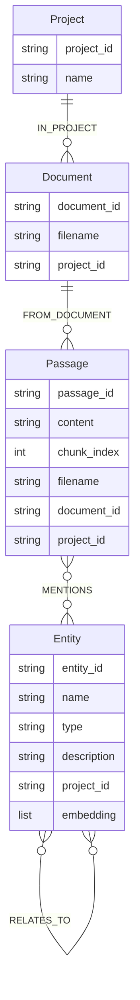
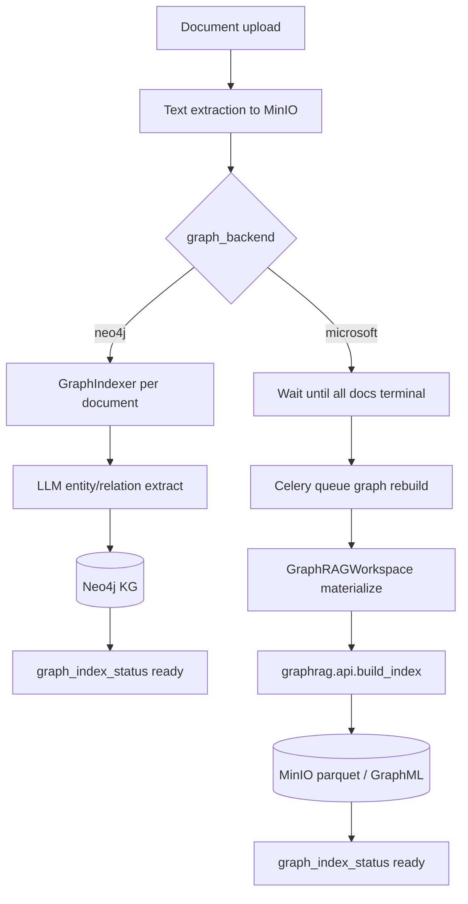
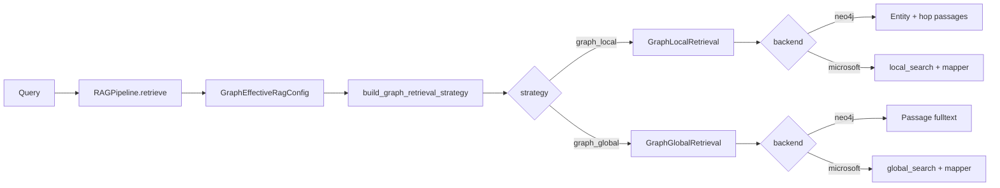
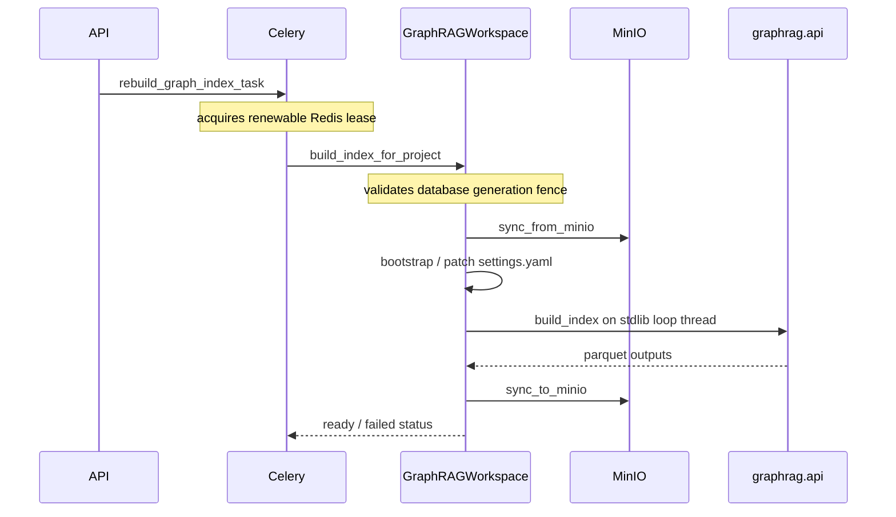
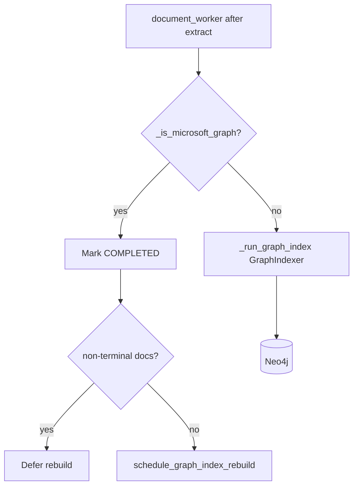

# Graph RAG — Neo4j & Microsoft GraphRAG

Technical reference for FlexSearch **graph mode** (`rag_mode=graph`). Projects choose a backend via `graph_backend`:

| Backend | Value | Index store | Typical use |
|---|---|---|---|
| **Neo4j** (default) | `"neo4j"` | Neo4j knowledge graph | Incremental per-document entity graphs; hop expansion |
| **Microsoft GraphRAG** | `"microsoft"` | MinIO workspace (parquet + GraphML) | Project-level community reports; thematic global search |

This document is derived from the implementation under `app/rag/graph/`, `app/rag/retrieval/graph_*.py`, `app/services/neo4j_store.py`, `app/services/graphrag_*.py`, and related APIs. It documents **known gaps** honestly (see [§10 Known limitations](#10-known-limitations--gaps)).

For a **conceptual deep dive** (schema evolution, chunk vs node embeddings, ANN entry points, Leiden communities, neighborhood ranking/reranking, hybrid pipelines — beyond FlexSearch specifics), see [GRAPH_RAG_DEEP_DIVE.md](./GRAPH_RAG_DEEP_DIVE.md).

---

## Table of contents

0. [Concepts & terminology](#0-concepts--terminology)
1. [Overview & when to choose which backend](#1-overview--when-to-choose-which-backend)
2. [Quick comparison](#2-quick-comparison)
3. [Neo4j indexing pipeline](#3-neo4j-indexing-pipeline)
4. [Microsoft GraphRAG indexing pipeline](#4-microsoft-graphrag-indexing-pipeline)
5. [Retrieval (local vs global)](#5-retrieval-local-vs-global)
6. [Config reference](#6-config-reference)
7. [Neo4j data model](#7-neo4j-data-model)
8. [Ops: queues, reconcile, kill switches](#8-ops-queues-reconcile-kill-switches)
9. [API surface](#9-api-surface)
10. [Known limitations & gaps](#10-known-limitations--gaps)
11. [Testing map](#11-testing-map)
12. [Architecture diagrams](#12-architecture-diagrams)
13. [Source file map](#13-source-file-map)

---

## 0. Concepts & terminology

This section is the teaching layer. Pipelines and Cypher below are the implementation; here is *why* the structure exists and which questions each path is for.

### Why Graph RAG exists

**Vector RAG** (FlexSearch’s default `rag_mode=vector`) embeds text chunks and retrieves by semantic similarity in OpenSearch. That is excellent for *find the paragraph that talks about X*:

| Question style | Why vectors usually win |
|---|---|
| “What does the policy say about remote work?” | The answer lives in one or a few similar passages |
| “Summarize the introduction of the Q3 report” | Paraphrase match to a contiguous chunk |
| “Find where the contract defines force majeure” | Lexical/semantic hit on a specific section |

Vectors do **not** explicitly store *who relates to whom*. If “Acme acquired Beta” appears in doc 1 and “Beta’s CFO joined Gamma” in doc 2, a single embedding search for “How is Acme connected to Gamma?” may never surface both facts in a way that makes the path obvious — similarity looks for *similar text*, not *linked entities*.

**Graph RAG** builds a **knowledge graph** from documents first, then retrieves by walking that structure. It shines when the question is about **links, neighborhoods, or corpus themes**:

| Question style | Why a graph helps |
|---|---|
| “How are Acme and Gamma related?” | Hop across `RELATES_TO` (Acme→Beta→Gamma) and pull passages that mention those entities |
| “Who partners with Nova Labs?” | Seed on Nova Labs → one-hop neighbors + mentioning passages |
| “What are the main themes across this corpus?” | Microsoft **community reports** (not Neo4j — see below) |
| “Everything we know about Project Orion” | Entity-centric local search: Orion + neighborhood text |

FlexSearch exposes graph mode as an alternative project mode: same chat/retrieval APIs, different index and retrieval path.

### Knowledge graph (plain language)

A knowledge graph is a network of **nodes** (things) and **edges** (connections). Think of a whiteboard: sticky notes for people/orgs/concepts, arrows labeled with verbs.

| Term | Meaning here | Tiny example |
|---|---|---|
| **Entity** | A named thing extracted from text — person, org, product, concept, etc. Stored as an `Entity` node (Neo4j) or row in `entities.parquet` (Microsoft). | `Acme Corp` (ORG), `Project Orion` (PROJECT) |
| **Relationship** | A typed link between two entities (e.g. “employs”, “located_in”). Neo4j stores these as `RELATES_TO` with a `type` property; Microsoft stores them in `relationships.parquet`. | `(Acme)-[:RELATES_TO {type:"acquired"}]->(Beta)` |
| **Passage / text unit** | A slice of source document text that *mentions* entities. Passages ground answers in real document wording — the graph is not the citation; the passage is. | “In March, Acme acquired Beta for $40M…” |
| **Mention** | Edge from a passage to an entity (`MENTIONS` in Neo4j): “this text talks about that entity.” | Passage P12 → Entity Acme |

**Mental picture (Neo4j):**

```
[Project] ←IN_PROJECT— [Document]
                            ↑ FROM_DOCUMENT
                        [Passage] —MENTIONS→ [Entity] —RELATES_TO→ [Entity]
                                              ↑
                                         (more MENTIONS from other passages)
```

Entities are merged by normalized name within a project (Neo4j), so “Acme” in doc A and “acme” in doc B become one node — useful for cross-document hops, with the usual risk of accidental name collisions (§10). Relationships extracted from a passage only connect entities **present in that same passage’s extract**; multi-document paths emerge because shared entity nodes stitch passages together.

### Graph RAG vs vector RAG (same product, different question)

| | Vector RAG | Graph RAG (this mode) |
|---|---|---|
| Index unit | Embedded chunks in OpenSearch | Entities + relations (+ passages or community reports) |
| Retrieval cue | Embedding similarity (± sparse/hybrid) | Entity match → graph neighborhood, or community reports / passage fulltext |
| Strength | Topical / paraphrased questions | Linked facts, multi-hop paths, corpus themes (Microsoft) |
| Cost / ops | Per-doc chunk + embed | Extra LLM extraction; Microsoft also does full-project rebuilds |
| Classic ask | “Find the paragraph about X” | “How are A and B related?” / “Themes across the corpus?” |

**Rule of thumb:** if a good answer is mostly *one contiguous stretch of text that sounds like the question*, stay in vector mode. If a good answer needs *following a chain of named things* or *a thematic map of the whole corpus*, use graph mode (and pick the backend that matches — hop graph vs communities).

Graph mode **skips** OpenSearch vector chunking for the project. Hierarchical document summaries are also skipped for graph projects.

### Local vs global search (question examples)

Both backends expose the same strategy names (`graph_local` / `graph_global`), but the **meaning of global differs** (critical — see [§10.5](#105-neo4j-graph_global-is-passage-fulltext-not-community-search)).

**Local** = start near the entities the question names, then pull nearby graph context (neighbors + passages / GraphRAG local context).

| Ask this… | Prefer |
|---|---|
| “What is Acme’s relationship to Beta?” | `graph_local` |
| “Who funds Project Orion?” | `graph_local` |
| “Which orgs are connected to Nova Labs within two hops?” | `graph_local` (Neo4j `max_hops`) |

**Global** (Microsoft) = answer from a **corpus-wide thematic view**: community reports produced after Leiden-style clustering. Good for overview questions that are *not* anchored to one entity.

| Ask this… | Prefer (Microsoft) |
|---|---|
| “What are the main themes in this document set?” | `graph_global` |
| “Give a high-level overview of risk topics across all filings” | `graph_global` |
| “How does the corpus discuss supply-chain resilience?” | `graph_global` |

**Global** (Neo4j) is **not** community search. It is passage fulltext over graph-stored passages — closer to “keyword search the extracted text slices” than “ask the theme summaries.” Prefer Neo4j `graph_local` for entity-centric asks; treat Neo4j `graph_global` as a fulltext fallback, not a thematic engine.

### Neo4j (property graph backend)

[Neo4j](https://neo4j.com/) is a **property graph** database: nodes and relationships can carry key/value properties (`name`, `type`, `description`, embeddings, …). FlexSearch uses it as the live store for the default graph backend: projects, documents, passages, and entities are nodes; `IN_PROJECT`, `FROM_DOCUMENT`, `MENTIONS`, and `RELATES_TO` are relationships.

- **Incremental:** each finished document is indexed into Neo4j as it completes — you can chat as soon as entities/passages exist (readiness gate: non-empty counts).
- **No communities:** FlexSearch does **not** run Leiden / community reports on Neo4j. Neighborhood = hop expansion on `RELATES_TO`.
- **Inspectable:** open Neo4j Browser (HTTP port from `NEO4J_HTTP_PORT`) and draw the same patterns the retriever uses.

### Cypher mental model

**Cypher** is Neo4j’s query language. Patterns look like ASCII drawings of the graph:

```cypher
(a:Entity)-[:RELATES_TO]->(b:Entity)
(p:Passage)-[:MENTIONS]->(e:Entity)
```

Read left-to-right: “match nodes of these labels connected by these relationship types.” Variable-length paths add a hop budget:

```cypher
(seed)-[:RELATES_TO*0..2]-(related)
```

means “from seed, follow `RELATES_TO` zero to two times” — the core of Neo4j `graph_local`. Indexing uses `MERGE` (upsert by id); seed finding uses fulltext/vector indexes on entities, then the hop pattern above collects passages. See [§7](#7-neo4j-data-model) for the exact shapes in `neo4j_store.py`.

You do not need to write Cypher to use FlexSearch chat — but when debugging “why did this entity neighborhood miss Gamma?”, thinking in Cypher patterns is the right model: *Did we seed the right entities? Is `max_hops` large enough? Is there a `RELATES_TO` path at all?*

### Microsoft GraphRAG & communities

**Microsoft GraphRAG** is a library/pipeline (not the Neo4j product) that extracts a graph from a corpus, runs **community detection** (Leiden-style clustering of densely connected entities), and writes LLM **community reports** — short summaries of each cluster’s theme. FlexSearch stores that workspace under MinIO (`projects/{id}/graphrag/`) as parquet + GraphML.

| Idea | What it means |
|---|---|
| **Entity / relationship** | Same conceptual role as Neo4j, but stored in parquet after a **project-level** build |
| **Community** | A cluster of related entities (dense subgraph), not a single document |
| **Community report** | LLM-written thematic summary of one community — the fuel for Microsoft `global_search` |
| **Local search** | Entity-centered: entities, neighbors, related text units for a focused question |
| **Global search** | Map-reduce over community reports for corpus-level / thematic questions |

**Neo4j vs Microsoft (communities):** Neo4j answers “walk the neighbors of these entities.” Microsoft global answers “read the theme summaries of the clusters.” Same UI knobs (`graph_local` / `graph_global`); different index artifacts. Neo4j `graph_global` does **not** invent communities to match the name — it only searches passage text ([§10.5](#105-neo4j-graph_global-is-passage-fulltext-not-community-search)).

### Indexing vs retrieval (mental model)

```
Documents → (LLM extract / GraphRAG build) → Graph index
Query     → match seeds in the graph → expand neighborhood or reports → passages/context → LLM answer
```

- **Indexing** turns text into graph structure (once per doc for Neo4j; whole-project rebuild for Microsoft).
- **Retrieval** uses that structure at query time; chat still generates the final answer with citations via the shared RAG pipeline.
- **Chat stages** (rewrite, multi-query, …) still wrap `retrieve()` the same way as vector mode — they do not replace the graph index; see [`docs/query-stages/README.md`](../query-stages/README.md).

---

## 1. Overview & when to choose which backend

Graph projects skip OpenSearch vector chunking. After text extraction:

- **Neo4j** — LLM extracts entities/relations per passage; writes into Neo4j; query via entity vector/fulltext + relationship hops, or passage fulltext. Best mental model: *build a live entity graph as each file finishes, then walk neighbors at ask time*.
- **Microsoft** — documents stay as extracted text until the whole project is ready; Celery rebuilds a GraphRAG index into MinIO; query via GraphRAG `local_search` / `global_search`. Best mental model: *wait for the full corpus, cluster it into themes, then answer from community reports or local entity context*.

### Decision guide (by question type)

| Your typical questions | Lean toward |
|---|---|
| “How are A and B related?” / “Who is connected to X?” / inspect hops in Browser | **Neo4j** + `graph_local` |
| New PDFs arrive continuously; you want to ask as soon as each file finishes | **Neo4j** (incremental) |
| “What are the main themes?” / corpus-wide overview / community summaries | **Microsoft** + `graph_global` |
| You need GraphRAG’s local/global APIs and exportable parquet/GraphML | **Microsoft** |
| “Find the paragraph that defines force majeure” (no link reasoning) | Prefer **vector** mode, not graph |

**Choose Neo4j** when you want incremental updates as each PDF finishes, hop-based neighborhood context, and a live property graph you can inspect in Neo4j Browser.

**Choose Microsoft** when you want Leiden-style communities, community report summaries, and GraphRAG’s local/global search APIs (higher LLM cost, project-level rebuilds).

Mode switch (`PATCH /projects/{id}/rag-mode`) is destructive: vector OpenSearch indexes are wiped when leaving vector mode; Neo4j subgraph or MinIO GraphRAG prefix is wiped when leaving graph mode (see wipe notes in §10).

---

## 2. Quick comparison

Same product surface (`graph_local` / `graph_global`), different index semantics — Neo4j is incremental entity-hop retrieval; Microsoft is corpus-level community indexing.

| Dimension | Neo4j | Microsoft GraphRAG |
|---|---|---|
| Indexing unit | Per document (after extract) | Whole project (after all docs terminal) |
| Trigger | `document_worker` → `GraphIndexer` | Debounced Celery `rebuild_graph_index_task` on queue `graph` |
| Storage | Neo4j Bolt | MinIO `projects/{id}/graphrag/` |
| Chunking | Passage split in indexer (`passage_chunk_size`) | GraphRAG internal chunking via `settings.yaml` |
| Entity extract | FlexSearch `GraphExtractor` (JSON LLM) | GraphRAG `extract_graph` workflows |
| Communities | None | `communities.parquet` + `community_reports.parquet` |
| `graph_local` | Entity match + `RELATES_TO` hops → passages | `graphrag.api.local_search` |
| `graph_global` | **Passage fulltext only** (not communities) | `graphrag.api.global_search` on community reports |
| Export | Not implemented | ZIP of parquet + GraphML |
| Rebuild API | Re-queue docs `FROM_EXTRACTED` | Immediate Celery rebuild (`debounce=0`) |
| Chat readiness | Non-empty entities/passages in Neo4j | `graph_index_status.status == "ready"` |
| Suggestions | Sample Neo4j entities | Filenames if Neo4j empty |
| Reranking | Disabled (`NoReranking`) | Disabled |

---

## 3. Neo4j indexing pipeline

Conceptually: each finished document is turned into **passages** (text slices), an LLM names the **entities** and **relationships** in each passage, and Neo4j stores the graph so later queries can hop from entity to entity and land back on source text via `MENTIONS`.

Indexing answers: *what things appear in this document, and how are they linked?* It does **not** answer the user’s chat question yet — that is retrieval ([§5](#5-retrieval-local-vs-global)). A useful intuition: extraction is local to each passage window; the **shared entity ids** (normalized names) are what stitch passages and documents into one project graph.
### Flow

```
Upload → extract (OCR/VLM/Docling/hybrid_pdf) → MinIO extracted.md
  → _handle_graph_after_extract (neo4j branch)
  → GraphIndexer.index_document
  → Neo4j upsert + optional entity embeddings
  → document COMPLETED, project graph_index_status ready
```

Requires `API_KEY`. Missing key fails the document early with a clear error.

### Passage splitting (`GraphIndexer`)

Passages are the graph’s link back to document wording (not OpenSearch chunks).

- Config: `extraction.passage_chunk_size` (default **800**, range 200–4096).
- Sliding window with **50**-character overlap.
- Passage ID: `uuid5(NAMESPACE_DNS, f"{document_id}:passage:{chunk_index}")`.

### LLM extraction (`GraphExtractor`)

The extractor asks the LLM for structured graph fragments per passage — “what things appear here, and how are they linked?” — not free-form summary text.

- System/user prompts in `app/rag/graph/prompts.py` — JSON only:
  - `entities[]`: `name`, `type`, `description`
  - `relationships[]`: `source`, `target`, `type`, `description`
- Caps entities per passage: `indexing.max_entities_per_passage` (default **20**).
- Entity ID: `uuid5(…, f"{project_id}:entity:{name.strip().lower()}")` — **name-normalized merge across documents**.
- Relations only link entities present in the same passage’s extract; self-loops dropped.
- Parse failures (bad JSON) → empty extract for that passage; indexing continues.

### Persistence order

1. `ensure_schema()`
2. `upsert_project` / `upsert_document`
3. `delete_document_subgraph` (idempotent re-index)
4. Per passage: upsert passage → extract → upsert entities → `MENTIONS` → `RELATES_TO`
5. If `indexing.embed_entities`: batch-embed descriptions → `set_entity_embeddings`

### Rebuild

`POST …/graph-index/rebuild` for Neo4j sets status `indexing` and schedules `process_document` for every document with `ReindexMode.FROM_EXTRACTED` (ingest queue), **not** the Celery `graph` queue.

---

## 4. Microsoft GraphRAG indexing pipeline

Conceptually: FlexSearch does not write entities into Neo4j for this backend. Extracted document text accumulates until the project is quiescent; then Microsoft GraphRAG builds a **project-level** index — entities, relationships, **communities** (clusters of related entities), and **community reports** (LLM summaries of each cluster). That artifact set lives in MinIO and powers local/global search.

The community step is the conceptual fork from Neo4j: after the entity graph exists, densely connected regions become communities, and each community gets a written report. Global questions read those reports; local questions still look entity-centered inside the same workspace.
### Flow

```
Upload → extract → document COMPLETED (chunk_count=0)
  → when count(non-terminal docs) == 0
  → schedule_graph_index_rebuild (countdown 5s, task id graph_rebuild:{project_id})
  → Celery queue=graph → rebuild_graph_index_task
  → GraphRAGWorkspace.build_index_for_project
  → materialize workspace → build_index → sync MinIO → status ready
```

Partial uploads defer rebuild until every document is `COMPLETED` or `FAILED`, so overlapping builds are not scheduled per finished file.

### Workspace layout (local temp + MinIO)

Prefix: `projects/{project_id}/graphrag/`

Outputs of note: `entities` / `relationships` are the extracted graph; `communities` assigns entities to clusters; `community_reports` are the LLM write-ups global search reads; `text_units` are GraphRAG’s chunked source units.

```
settings.yaml
prompts/                 # GraphRAG prompt templates
input/documents.csv      # written after successful build
output/
  entities.parquet
  relationships.parquet
  communities.parquet
  community_reports.parquet
  text_units.parquet
  *.graphml              # enabled by patching graphml: true
cache/
logs/
```

`materialize()`:

1. `tempfile.mkdtemp(prefix=f"graphrag-{project_id}-")`
2. Download MinIO prefix if present
3. Bootstrap/refresh GraphRAG 3.x via `initialize_project_at` when missing or legacy markers detected
4. Patch LiteLLM providers, API bases, concurrency, retries; force GraphML
5. Reject local `sentence-transformers/…` for `GRAPHRAG_EMBEDDING_MODEL` (API LiteLLM ids only)

After build/search, the temp root is always deleted (`cleanup`).

### Indexing methods

| Config `microsoft_indexing.method` | GraphRAG enum |
|---|---|
| `standard` / `std` | `IndexingMethod.Standard` |
| `nlp` / `fast` | `IndexingMethod.Fast` (NLP noun-phrase path) |

Unknown values fall back to Standard with a warning.

### Runtime env for GraphRAG

| Env var | Source |
|---|---|
| `GRAPHRAG_API_KEY` | `settings.api_key` |
| `GRAPHRAG_API_BASE` | `settings.llm_api_base` |
| `GRAPHRAG_EMBEDDING_API_KEY` | GraphRAG embedding endpoint key |
| `GRAPHRAG_EMBEDDING_API_BASE` | GraphRAG embedding endpoint base |

### Runner (`graphrag_runner.py`)

GraphRAG is incompatible with uvicorn’s uvloop + nest_asyncio. Builds and searches run in a `ThreadPoolExecutor(max_workers=2)` with a fresh stdlib `SelectorEventLoop` (`run_in_std_event_loop` / `run_sync_in_std_thread`).

### Fail-fast patches (`graphrag_failfast.py`)

Installed once per process at build start:

1. **GraphExtractor `__call__`** — GraphRAG normally swallows per-chunk LLM failures and returns empty entity frames (looks like “no entities”). FlexSearch re-raises after rate-limit retries so auth/model errors fail the build immediately.
2. **`derive_from_rows` gather** — on first task exception, cancel siblings and re-raise (instead of collecting all errors after every row finishes).

### Rate-limit patches (`graphrag_rate_limit.py`)

1. Monkey-patches `graphrag_llm.retry.exponential_retry.ExponentialRetry` (sync + async): logs each retry; on HTTP 429 honors `Retry-After` / body fields / message parse; otherwise exponential backoff + jitter.
2. `retry_on_rate_limit_async` wraps the fail-fast extractor path.

| Setting | Default | Role |
|---|---|---|
| `GRAPHRAG_CONCURRENT_REQUESTS` | 8 | Max parallel LLM calls (patched into `settings.yaml`) |
| `GRAPHRAG_RATE_LIMIT_MAX_RETRIES` | 30 | Sleep-and-retry budget for 429 |
| `GRAPHRAG_RATE_LIMIT_DEFAULT_WAIT_SECONDS` | 60 | Fallback when no Retry-After |
| `GRAPHRAG_RATE_LIMIT_MAX_WAIT_SECONDS` | 300 | Cap on Retry-After sleep |

### Status machine

`pending` → `indexing` → `ready` | `failed` | `disabled` (`microsoft_indexing.enabled=false`).

Fingerprint: `GraphRagConfig.graph_indexing_fingerprint()` (backend + extraction + microsoft_indexing).

Global kill switch: `GRAPH_INDEXING_ENABLED=false` skips builds without failing the project.

### Rebuild

`POST …/graph-index/rebuild` sets `indexing` and schedules Celery with `debounce_seconds=0`. Task always calls `build_index_for_project(..., is_update=True)`.

> **Note:** The task holds a renewable Redis lease and carries the PostgreSQL RAG generation as a fencing token — see §10.2.

---

## 5. Retrieval (local vs global)

**Local** means “start near the entities the question names, then pull nearby graph context.” **Global** means “answer from a corpus-wide view” — on Microsoft that is community reports; on Neo4j it is currently passage fulltext only (not a thematic map).

### Story: one question, two backends

Suppose the user asks: *“How are Acme and Gamma related?”*

1. **Neo4j `graph_local`:** embed/fulltext-match seed entities (Acme, Gamma) → walk `RELATES_TO` up to `max_hops` → collect passages that `MENTIONS` any entity in that neighborhood → LLM answers from those passages (and entity descriptions if no passages). The *path* Acme→Beta→Gamma may never be spelled out as a Cypher path in the response, but the **passages along the neighborhood** are what the model sees.
2. **Microsoft `graph_local`:** GraphRAG `local_search` pulls entity-centered context (entities, relationships, text units, etc.) from the MinIO workspace; `context_to_retrieval_results` maps that into the shared `RetrievalResult` shape.
3. **Microsoft `graph_global`:** better for *“What themes involve acquisitions in this corpus?”* — map-reduce over community reports, not a single entity neighborhood.
4. **Neo4j `graph_global`:** fulltext over passage content — useful if you want keyword hits on stored passages, **not** a substitute for community themes.

### Factory & pipeline

- `build_graph_retrieval_strategy(config)` in `app/rag/factory.py` reads `graph_backend` **only when given a full `GraphRagConfig` / `GraphEffectiveRagConfig`**.
- Facades: `GraphLocalRetrieval` / `GraphGlobalRetrieval` delegate to Neo4j or Microsoft implementations.
- Graph mode never applies cross-encoder reranking.

### Strategy matrix

| Strategy | Neo4j implementation | Microsoft implementation |
|---|---|---|
| `graph_local` | Embed query → `search_entities_for_query` (vector, else fulltext) → `get_passages_for_entities` with `RELATES_TO*0..max_hops` → passages; fallback to entity descriptions | Materialize workspace → `local_search` → `context_to_retrieval_results` |
| `graph_global` | `search_passages_fulltext` on `passage_content` (CONTAINS fallback) | `global_search` on community reports (`dynamic_community_selection` optional) |

**Hop expansion (Neo4j local):** seed entities matching the query → walk `RELATES_TO` up to `max_hops` → collect passages that `MENTIONS` any entity in that neighborhood. That is the multi-hop path vector chunk search cannot do directly.

Conceptually the Neo4j local loop is:

```
query text
  → seed Entity nodes (vector on description, else fulltext on name/description)
  → expand RELATES_TO*0..hops (project-scoped)
  → Passage nodes via MENTIONS
  → return passage text as RetrievalResult
  → if none: fall back to entity description strings
```

### Params

**Neo4j**

| Strategy | Param | Default | Notes |
|---|---|---|---|
| local | `max_hops` | 2 | Clamped 1–5 in Cypher |
| local | `top_entities` | 10 | Seed entities before hop expand |
| global | `top_passages` | 5 | Fulltext limit floor vs `top_k` |

**Microsoft**

| Strategy | Param | Default | Notes |
|---|---|---|---|
| local/global | `community_level` | 2 | 0–4 |
| global | `dynamic_community_selection` | false | Passed to GraphRAG API |
| both | `max_context_tokens` | 12000 | **Schema/UI only — not applied** ([§10.4](#104-max_context_tokens-unused)) |

### Context mapper

`graph_context_mapper.context_to_retrieval_results` normalizes GraphRAG context (DataFrames, dicts of lists, strings) into `RetrievalResult` using preferred text/id/document columns and synthetic scores when missing.

### Chat & retrieval gates

| Backend | Gate |
|---|---|
| Microsoft | `GraphIndexState.status == "ready"` else HTTP **409** |
| Neo4j | `get_stats`: if `passage_count == 0` and `entity_count == 0` → **409**; Neo4j down → **503** |

Implemented in `app/api/chat.py` (`_ensure_graph_ready`) and `app/api/retrieval.py`.

### Suggestions

`suggestion/service._gather_graph_context`:

- Tries Neo4j entity sample (fulltext with empty query → arbitrary entities).
- If empty (typical for Microsoft-only projects), falls back to completed document **filenames**.
- Does **not** load community reports from MinIO.

### Pipeline `graph_backend` wiring

`RAGPipeline.retrieve` builds `GraphEffectiveRagConfig.for_retrieval(...)` (includes `graph_backend`) and passes that object to `build_graph_retrieval_strategy` so Microsoft projects do not silently fall back to Neo4j. Bare `GraphRetrievalConfig` still defaults to neo4j for callers that only pass retrieval params — see [§10.1](#101-pipeline-graph_backend-wiring--fixed).

---

## 6. Config reference

### Environment / Settings (`app/core/config.py`)

| Variable | Default | Purpose |
|---|---|---|
| `NEO4J_URI` | `bolt://localhost:7687` | Bolt endpoint |
| `NEO4J_USER` / `NEO4J_PASSWORD` | from `.env` (match infra-hub) | Auth |
| `NEO4J_HTTP_PORT` | 7474 | Browser (ops) |
| `GRAPH_INDEXING_ENABLED` | `true` | Kill switch for Microsoft builds |
| `GRAPHRAG_COMMUNITY_LEVEL` | `2` | Default community level |
| `GRAPHRAG_EMBEDDING_MODEL` | `openai/text-embedding-3-small` | API embedding for GraphRAG |
| `GRAPHRAG_EMBEDDING_API_BASE` | `""` | Falls back to `EMBEDDING_API_BASE` |
| `GRAPHRAG_EMBEDDING_API_KEY` | `""` | Falls back to embedding then `API_KEY` |
| `GRAPHRAG_CONCURRENT_REQUESTS` | `8` | Parallel LLM during index |
| `GRAPHRAG_RATE_LIMIT_*` | see §4 | 429 policy |
| `MODEL_NAME` / `API_KEY` / `LLM_API_BASE` | — | Completion + Neo4j extract |
| `EMBEDDING_MODEL` | local MiniLM by default | **Neo4j** entity vectors (separate from GraphRAG embeddings) |

### Per-project `GraphRagConfig`

```text
graph_backend: neo4j | microsoft
extraction:
  strategy, passage_chunk_size, preprocess
indexing:                    # Neo4j
  max_entities_per_passage, embed_entities
microsoft_indexing:          # Microsoft
  enabled, method (standard|nlp), community_level
retrieval:
  strategy (graph_local|graph_global), params{}
chat: …                      # shared chat stages
```

Fingerprints:

- `ingestion_fingerprint()` — backend + extraction + indexing (+ microsoft_indexing when MS)
- `graph_indexing_fingerprint()` — used on Microsoft status rows

Defaults for UI: `GET /rag/options?rag_mode=graph&graph_backend=neo4j|microsoft`.

### Celery

| Task | Queue | Notes |
|---|---|---|
| `process_document_task` | `ingest` | Extract + Neo4j index or MS extract-complete |
| `rebuild_graph_index_task` | `graph` | Microsoft project rebuild; soft 60m / hard 65m |
| Summaries | `summary` | **Skipped** for all graph projects (and explicitly for Microsoft) |

---

## 7. Neo4j data model

The schema is a small property graph scoped by `project_id`: documents belong to a project, passages belong to documents, passages mention entities, and entities relate to each other. Everything queryable for RAG hangs off that chain — find entities, expand relations, return passage text.

### Why this shape (not “only entities”)

A graph of entities alone cannot cite documents. Passages are the **evidence layer**: retrieval returns passage `content` (or entity descriptions as fallback), so answers stay grounded in source wording. Mentions are the join table in graph form — without `MENTIONS`, hop expansion would know *related entities* but not *which text to show the LLM*.

### Labels & relationships



| Rel | Meaning |
|---|---|
| `IN_PROJECT` | Document → Project |
| `FROM_DOCUMENT` | Passage → Document |
| `MENTIONS` | Passage → Entity |
| `RELATES_TO {type, description}` | Entity → Entity (semantic type on the relationship property, not as Neo4j rel type) |

Relationship *semantics* (employs, partners_with, …) live on the `RELATES_TO.type` property so the Neo4j relationship type stays fixed and easy to traverse with one Cypher pattern. That is a deliberate Cypher tradeoff: one relationship type for all hops, richer meaning in properties.

### Constraints & indexes

Created by `Neo4jStore.ensure_schema()`:

- Unique constraints: `Project.project_id`, `Passage.passage_id`, `Entity.entity_id`, `Document.document_id`
- Fulltext: `passage_content` on `Passage.content`; `entity_search` on `Entity.name`, `Entity.description`
- Vector: `entity_embedding` on `Entity.embedding` (cosine). Dimension comes from the active embedding service. On mismatch the index is dropped, embeddings cleared, and the index recreated — **re-run graph indexing** to refill vectors.

Fulltext and vector indexes are how Neo4j **finds seed entities** for a natural-language query before hop expansion; they are not a substitute for the graph structure itself. Seeds answer “which nodes look like this question?”; hops answer “what else is connected?”; mentions answer “what text backs that up?”

### Example Cypher patterns (as used in code)

These are the main shapes FlexSearch issues — upsert, mention link, and local hop expand. Cypher’s `(a)-[:RELATES_TO*0..n]-(b)` means “follow RELATES_TO zero to n times” (the hop budget). Reading them as diagrams is enough for ops debugging; you rarely need to run them by hand unless inspecting Browser.

**Upsert entity**

```cypher
MERGE (e:Entity {entity_id: $entity_id})
SET e.name = $name, e.type = $type, e.description = $description, e.project_id = $project_id
```

**Link mention (race-safe)**

```cypher
OPTIONAL MATCH (p:Passage {passage_id: $passage_id, project_id: $project_id})
OPTIONAL MATCH (e:Entity {entity_id: $entity_id, project_id: $project_id})
WITH p, e WHERE p IS NOT NULL AND e IS NOT NULL
MERGE (p)-[:MENTIONS]->(e)
```

**Local hop expand → passages**

```cypher
MATCH (seed:Entity {project_id: $project_id})
WHERE seed.entity_id IN $entity_ids
OPTIONAL MATCH (seed)-[:RELATES_TO*0..$hops]-(related:Entity {project_id: $project_id})
WITH collect(DISTINCT seed) + collect(DISTINCT related) AS entities
UNWIND entities AS ent
MATCH (p:Passage {project_id: $project_id})-[:MENTIONS]->(ent)
MATCH (p)-[:FROM_DOCUMENT]->(d:Document)
RETURN DISTINCT p.passage_id, p.content, …
LIMIT $limit
```

**Delete document subgraph** — detach passages; delete entities with no remaining `MENTIONS`; delete document.

**Delete project** — `MATCH (n {project_id: $project_id}) DETACH DELETE n` plus Project node. Method name on the store: **`delete_project_subgraph`**.

---

## 8. Ops: queues, reconcile, kill switches

### Document worker branch

After extract, `_handle_graph_after_extract`:

- **Microsoft** — mark document completed; if any non-terminal docs remain, return; else `schedule_graph_index_rebuild`.
- **Neo4j** — `_run_graph_index` (status `GRAPH_INDEXING` → indexer → ready).

### Mode switch wipe (`project_index_service`)

| Leaving | Wipe |
|---|---|
| `vector` | OpenSearch `delete_by_project` |
| `graph` + microsoft | MinIO prefix `projects/{id}/graphrag/` |
| `graph` + neo4j | Neo4j project subgraph via `delete_project_subgraph` ([§10.3](#103-wipe_neo4j_graph-method-name--fixed)) |

### Stale indexing recovery

| Function | When |
|---|---|
| `reconcile_interrupted_graph_indexes` | API startup |
| `reconcile_stale_graph_index` | `GET …/graph-index/status` |

If status is `indexing` but workers are dead (Celery inspect) or `indexing_started_at` older than ~70 minutes → mark `failed` with a rebuild hint.

Microsoft aliveness: task id `graph_rebuild:{project_id}` + renewable Redis lease + database generation fence.
Neo4j aliveness: `ingest:{document_id}:{mode}` for all project documents.

### Kill switches

- `GRAPH_INDEXING_ENABLED=false` — skip Microsoft `build_index_for_project`.
- `microsoft_indexing.enabled=false` — status `disabled`, no build.

---

## 9. API surface

| Method | Path | Behavior |
|---|---|---|
| `GET` | `/rag/options?rag_mode=graph&graph_backend=…` | Defaults, strategy lists, param schemas for UI |
| `GET` | `/projects/{id}/graph-index/status` | Reconcile stale → return status/fingerprint/counts/error |
| `POST` | `/projects/{id}/graph-index/rebuild` | MS: Celery rebuild; Neo4j: re-ingest all from extracted |
| `GET` | `/projects/{id}/graph-export` | **Microsoft only**, status must be `ready`; ZIP parquet + GraphML |
| `PATCH` | `/projects/{id}/rag-mode` | Return `202`; build generation-specific storage, atomically publish on success, then asynchronously remove the old generation |
| Chat / retrieval | `/chat/…`, retrieval query | Graph strategy validation + readiness gates above |

`GraphIndexStatusResponse` fields: `backend`, `status` (`pending|indexing|ready|failed|disabled`), `indexed_at`, `fingerprint`, `error`, `document_count`, `entity_count`, `passage_count`.

---

## 10. Known limitations & gaps

### 10.1 Pipeline `graph_backend` wiring — **fixed**

**Was:** `RAGPipeline.retrieve` passed only `effective.retrieval` (`GraphRetrievalConfig`), so the factory defaulted `graph_backend="neo4j"` and Microsoft projects could hit Neo4j at query time.

**Now:** `retrieve` builds `GraphEffectiveRagConfig` (includes `graph_backend`) and passes it to `build_graph_retrieval_strategy`. The factory accepts `GraphRagConfig | GraphEffectiveRagConfig | GraphRetrievalConfig`. Covered by `tests/test_audit_fixes.py` and `tests/test_rag_config.py`.

Bare `GraphRetrievalConfig` still defaults to neo4j (intentional for callers that only pass retrieval params).

---

### 10.2 Distributed rebuild coordination and generation fencing

**Was:** A process-local `_in_flight` set could either cause a same-process no-op or permit simultaneous builds on different workers.

**Now:** `rebuild_graph_index_task` acquires a Redis lease with `SET NX PX`, renews it with a unique token, and releases it using compare-and-delete Lua. The database RAG generation is checked before external writes and before publishing readiness.

Redis is mandatory for coordination. If it is unavailable, the task retries instead of falling back to an unsafe local lock.

---

### 10.3 `wipe_neo4j_graph` method name — **fixed**

**Was:** called nonexistent `delete_project_graph`.

**Now:** `wipe_neo4j_graph` → `get_neo4j_store().delete_project_subgraph(...)` (same as pipeline delete). Covered by `tests/test_audit_fixes.py`.

---

### 10.4 `max_context_tokens` unused

`MicrosoftGraphLocalRetrievalParams` / `MicrosoftGraphGlobalRetrievalParams` expose `max_context_tokens` (default 12000). `/rag/options` advertises it. Neither `run_local_search` nor `run_global_search` passes it into GraphRAG APIs — dead config.

---

### 10.5 Neo4j `graph_global` is passage fulltext, not community search

Naming mirrors Microsoft’s global (community-report) search, but Neo4j global is **only** `search_passages_fulltext`. There is no community detection, report generation, or thematic map-reduce on Neo4j. Prefer `graph_local` for entity-centric Neo4j queries; treat Neo4j `graph_global` as BM25-like passage search over graph passages.

In short: **global** on Microsoft ≈ “ask the theme summaries”; **global** on Neo4j ≈ “keyword/fulltext over passages already stored in the graph,” not a second graph algorithm.

---

### Other medium issues

| Issue | Notes |
|---|---|
| Entity merge by lowercased name only | No alias / type-aware resolution; collisions across docs |
| Unused `entity_scores` in Neo4j local | Passage scores not blended with entity vector scores |
| Vector search failure fallback | Empty-query fulltext → arbitrary entity sample |
| Suggestions for Microsoft | Filenames only; no community report context |
| Graph export | Microsoft-only |
| `is_update=True` always on Celery rebuild | Incremental vs cold workspace semantics not clearly validated |
| Neo4j status updates | `_update_graph_index_status` may omit `backend` field |
| Hierarchical summaries | Skipped for all graph projects |

---

## 11. Testing map

| Test module | Covers |
|---|---|
| `tests/test_neo4j_graph.py` | Extractor JSON parse, entity id stability, `GraphRagConfig` parse |
| `tests/test_rag_config.py` | Factory for microsoft/neo4j graph retrieval; strategy sets |
| `tests/test_rag_mode_switch.py` | Mode switch / wipe behavior |
| `tests/test_rag_mode_config.py` | Graph vs vector config defaults |
| `tests/test_graphrag_index_fixes.py` | Redis lease acquire/release, generation fencing, rebuild scheduling, aliveness |
| `tests/test_graphrag_rate_limit.py` | 429 detection, wait parsing, retry helpers |
| `tests/test_graphrag_runner.py` | Stdlib loop / executor isolation |
| `tests/test_graphrag_settings.py` | Settings YAML patching / embedding constraints |
| `tests/test_graph_context_mapper.py` | Context → `RetrievalResult` |
| `tests/test_graph_export.py` | Export ZIP / readiness |
| `tests/test_retrieval.py` | Graph readiness gates (incl. microsoft ready) |
| `tests/test_chat.py` | Chat graph gates (where covered) |
| `tests/test_project_lifecycle.py` | Project delete / wipe paths |
| `tests/test_document_tasks_celery.py` | Ingest task wiring |

Regression coverage for §10.1–§10.3 lives in `tests/test_audit_fixes.py` and the major-upgrade security tests (backend preservation, wipe method, distributed lease, and generation fencing).

---

## 12. Architecture diagrams

### Dual-backend indexing



### Retrieval dispatch (intended)



> **Backend selection:** `Pipe` feeds Fac a `GraphEffectiveRagConfig` (includes `graph_backend`). Bare `GraphRetrievalConfig` still defaults to neo4j — see [§10.1](#101-pipeline-graph_backend-wiring--fixed).

### Microsoft workspace lifecycle



### Shared extract → branch



---

## 13. Source file map

| Path | Role |
|---|---|
| `app/rag/graph/indexer.py` | Neo4j passage split + index orchestration |
| `app/rag/graph/extractor.py` | LLM JSON entity/relation extract |
| `app/rag/graph/prompts.py` | Extraction prompts |
| `app/rag/retrieval/graph_local.py` | Local facade |
| `app/rag/retrieval/graph_local_neo4j.py` | Neo4j local |
| `app/rag/retrieval/graph_local_microsoft.py` | MS local |
| `app/rag/retrieval/graph_global.py` | Global facade |
| `app/rag/retrieval/graph_global_neo4j.py` | Neo4j passage fulltext “global” |
| `app/rag/retrieval/graph_global_microsoft.py` | MS global |
| `app/rag/retrieval/graph_context_mapper.py` | GraphRAG context → chunks |
| `app/rag/factory.py` | `build_graph_retrieval_strategy` |
| `app/rag/pipeline.py` | Graph retrieve path (`GraphEffectiveRagConfig` → factory; see §10.1) |
| `app/services/neo4j_store.py` | Schema, CRUD, search Cypher |
| `app/services/graphrag_workspace.py` | MinIO workspace, build, search |
| `app/services/graphrag_runner.py` | Stdlib event-loop executor |
| `app/services/graphrag_rate_limit.py` | 429-aware ExponentialRetry patch |
| `app/services/graphrag_failfast.py` | Fail-fast extractor / gather patches |
| `app/services/graph_index_tasks.py` | Debounce, Redis lease, generation fencing, reconcile |
| `app/services/celery_tasks.py` | `rebuild_graph_index_task` |
| `app/services/document_worker.py` | Post-extract graph branch |
| `app/services/project_index_service.py` | Wipe helpers (`delete_project_subgraph`; see §10.3) |
| `app/schemas/graph_index.py` | Status models |
| `app/schemas/rag_config.py` | `GraphRagConfig` + retrieval params |
| `app/api/projects.py` | Status, rebuild, export, rag-mode |
| `app/api/rag.py` | `/rag/options` |
| `app/api/chat.py` / `retrieval.py` | Readiness gates |
| `app/celery_app.py` | Queue routes (`graph`, `ingest`, `summary`) |

---

## Related docs

- Conceptual deep dive (design ideas, not just FlexSearch wiring): [`GRAPH_RAG_DEEP_DIVE.md`](./GRAPH_RAG_DEEP_DIVE.md)
- RAG module overview: [`app/rag/README.md`](../../app/rag/README.md)
- Celery ops: [`docs/celery/README.md`](../celery/README.md)
- Chat orchestration: [`docs/chat/README.md`](../chat/README.md)
