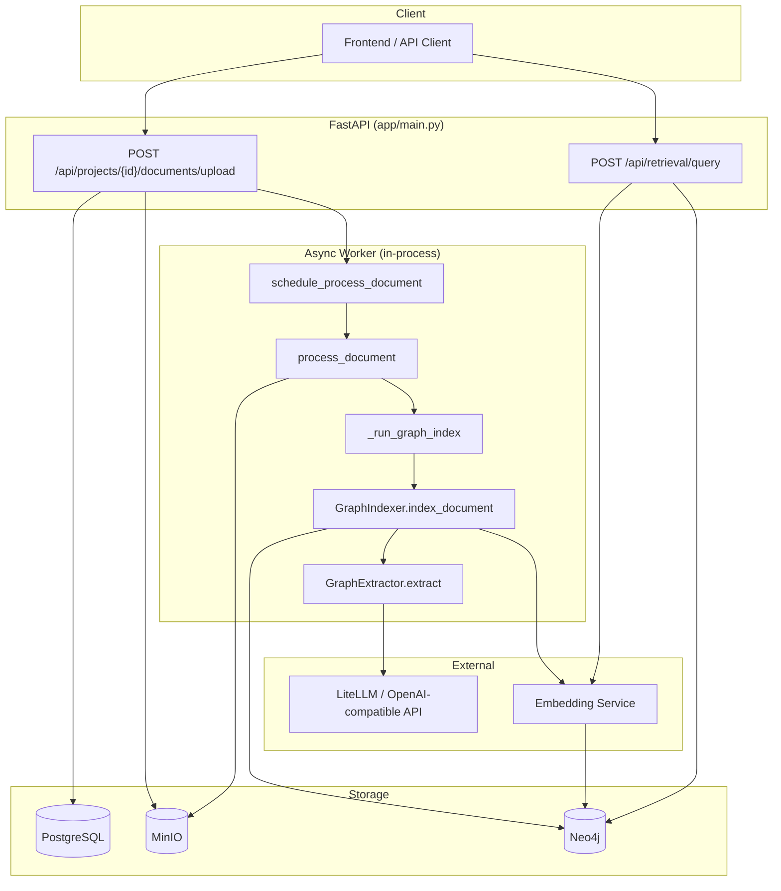
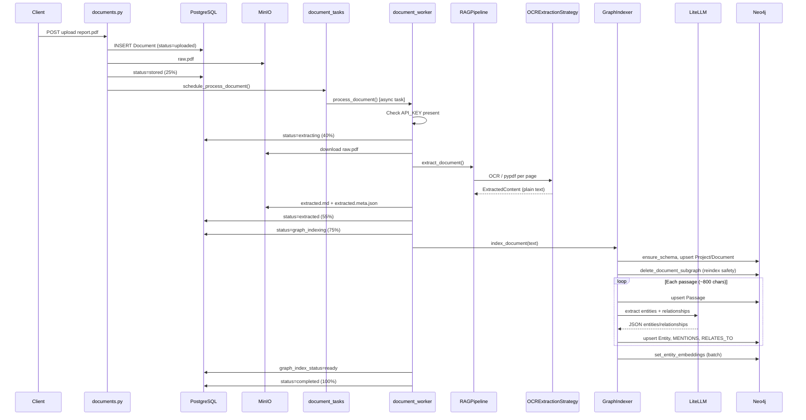
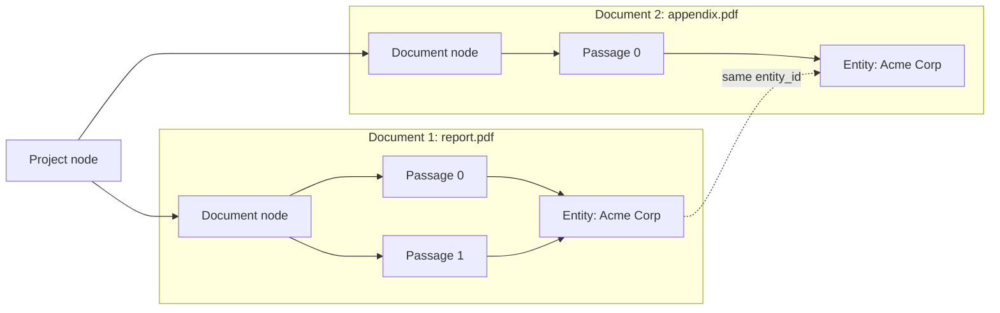
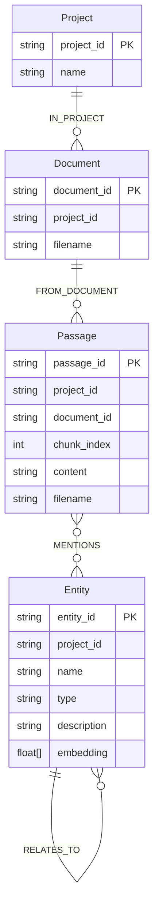
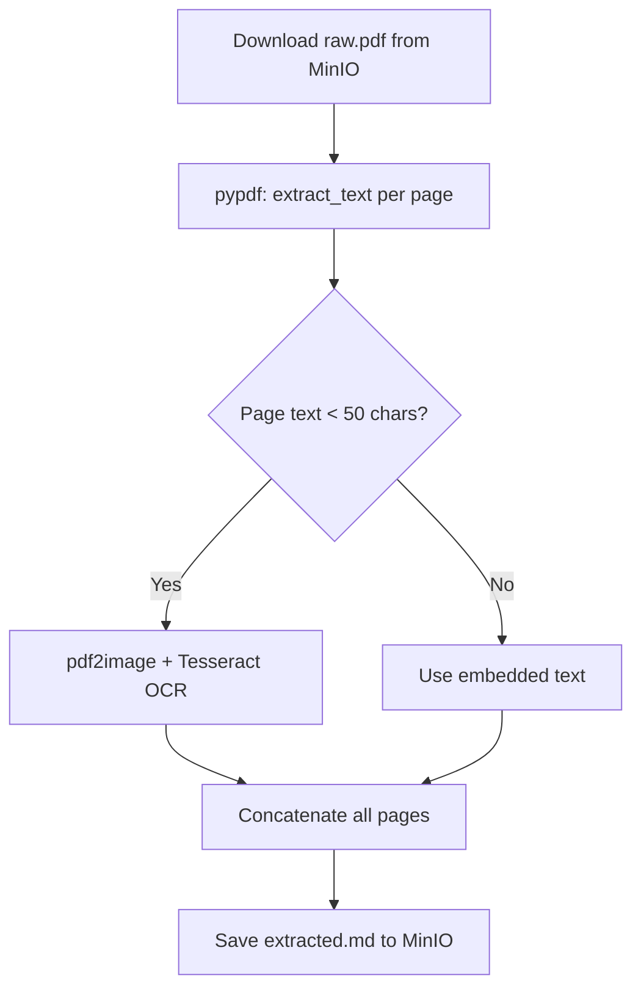
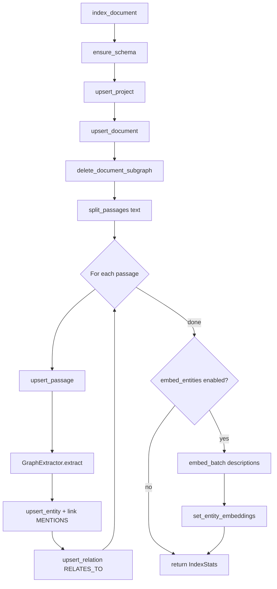
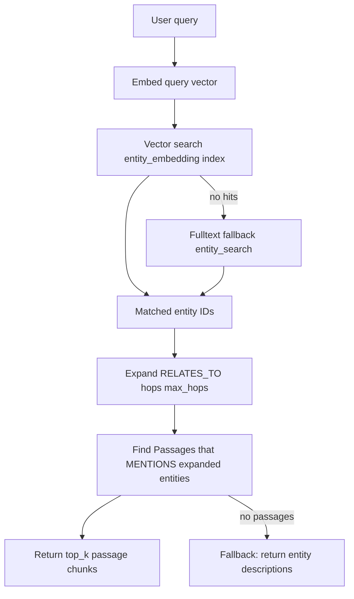
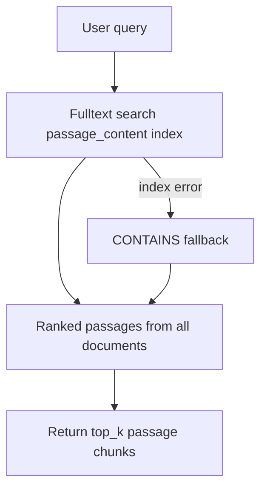
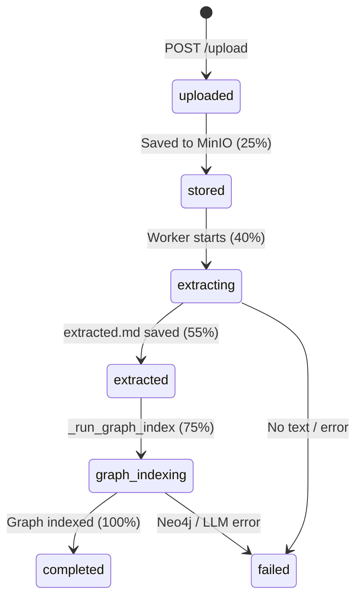
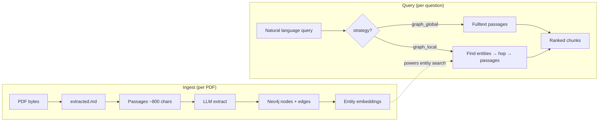

# Neo4j Graph RAG — End-to-End Guide

This document explains **exactly** how FlexSearch builds and queries a Neo4j knowledge graph when you upload one or two PDFs to a **Graph RAG** project with `graph_backend: "neo4j"`.

It covers the full backend path: HTTP upload → text extraction → passage splitting → LLM entity/relation extraction → Neo4j persistence → retrieval queries. It does **not** cover Microsoft GraphRAG (`graph_backend: "microsoft"`) or Vector RAG (Qdrant).

For a shorter module overview (Vector + Graph), see [`app/rag/README.md`](../../app/rag/README.md).

---

## Table of Contents

1. [What You Need Before Uploading](#1-what-you-need-before-uploading)
2. [High-Level Architecture](#2-high-level-architecture)
3. [Scenario: Upload 1 PDF](#3-scenario-upload-1-pdf)
4. [Scenario: Upload 2 PDFs](#4-scenario-upload-2-pdfs)
5. [Neo4j Graph Model](#5-neo4j-graph-model)
6. [Phase 1 — HTTP Upload & Scheduling](#phase-1--http-upload--scheduling)
7. [Phase 2 — Text Extraction (OCR/VLM)](#phase-2--text-extraction-ocrvlm)
8. [Phase 3 — Graph Indexing](#phase-3--graph-indexing)
9. [Phase 4 — Entity Extraction (LLM)](#phase-4--entity-extraction-llm)
10. [Phase 5 — Neo4j Persistence](#phase-5--neo4j-persistence)
11. [Phase 6 — Entity Embeddings](#phase-6--entity-embeddings)
12. [Phase 7 — Retrieval Queries](#phase-7--retrieval-queries)
13. [Configuration Reference](#configuration-reference)
14. [Storage Layout (MinIO + Postgres)](#storage-layout-minio--postgres)
15. [Status & Progress Tracking](#status--progress-tracking)
16. [Reindex, Retry & Deletion](#reindex-retry--deletion)
17. [Source File Map](#source-file-map)

---

## 1. What You Need Before Uploading

| Requirement | Why | Config / Code |
|---|---|---|
| **Graph RAG project** | `rag_mode` must be `"graph"` and `graph_backend` must be `"neo4j"` (default) | `GraphRagConfig` in [`app/schemas/rag_config.py`](../../app/schemas/rag_config.py) |
| **Neo4j running** | Stores passages, entities, relationships | `NEO4J_URI`, `NEO4J_USER`, `NEO4J_PASSWORD` in `backend/.env` |
| **LLM API key** | Entity/relation extraction calls an LLM per passage | `API_KEY` — worker fails early if missing |
| **MinIO** | Raw PDFs and extracted text artifacts | Object storage via `get_storage_service()` |
| **Postgres** | Projects, documents, `rag_config`, status | SQLAlchemy models in `app/db/models.py` |
| **Tesseract + Poppler** (OCR default) | PDF text extraction with OCR fallback | `OCRExtractionStrategy` in [`app/rag/ingestion/ocr.py`](../../app/rag/ingestion/ocr.py) |
| **Embedding model** | Entity vector search at query time (384-dim) | `EMBEDDING_MODEL` default: `sentence-transformers/all-MiniLM-L6-v2` |

On backend startup, Neo4j constraints and indexes are created automatically:

```52:56:backend/app/main.py
    try:
        get_neo4j_store().ensure_schema()
        logger.info("Neo4j schema ensured")
    except Exception as exc:
        logger.warning("Neo4j schema bootstrap skipped: %s", exc)
```

---

## 2. High-Level Architecture



**Key design choices for Neo4j Graph RAG:**

- **Per-document indexing** — each PDF is graph-indexed immediately after text extraction (unlike Microsoft GraphRAG, which waits for all documents).
- **Passage-level LLM calls** — text is split into ~800-char passages; each passage gets its own entity/relation extraction call.
- **Deterministic IDs** — entity and passage IDs are UUID5 hashes, so the same entity name in two PDFs merges into one node.
- **Retrieval-only API** — `POST /retrieval/query` returns ranked passage chunks; it does not synthesize an LLM answer.

---

## 3. Scenario: Upload 1 PDF

Assume you create a Graph RAG project (`graph_backend: "neo4j"`) and upload `report.pdf`.



### What ends up in Neo4j (1 PDF example)

If `report.pdf` extracts to 2,400 characters of text with `passage_chunk_size: 800`:

| Artifact | Count | Notes |
|---|---|---|
| `Project` node | 1 | One per FlexSearch project |
| `Document` node | 1 | `report.pdf` |
| `Passage` nodes | ~3 | 800-char windows, 50-char overlap |
| `Entity` nodes | varies | LLM-extracted per passage (capped at `max_entities_per_passage`) |
| `MENTIONS` edges | varies | Passage → Entity |
| `RELATES_TO` edges | varies | Entity → Entity with `type` and `description` |

---

## 4. Scenario: Upload 2 PDFs

Upload `report.pdf` first, then `appendix.pdf` to the **same project**.



### How the second PDF is processed

1. **Independent upload pipeline** — `appendix.pdf` goes through the same upload → extract → graph index flow as the first PDF.
2. **No project-level wait** — Neo4j indexing runs per document immediately after extraction (`_run_graph_index`), unlike Microsoft GraphRAG.
3. **Shared project graph** — both documents link to the same `Project` node via `Document -[:IN_PROJECT]-> Project`.
4. **Entity deduplication** — entity IDs are deterministic:

```46:49:backend/app/rag/graph/extractor.py
    @staticmethod
    def entity_id(project_id: str, name: str) -> str:
        normalized = name.strip().lower()
        return str(uuid5(NAMESPACE_DNS, f"{project_id}:entity:{normalized}"))
```

   If both PDFs mention **"Acme Corp"**, they share the **same** `Entity` node. The second document adds new `MENTIONS` edges from its passages and may update the entity description via `MERGE` + `SET`.

5. **Reindex safety per document** — before indexing, `delete_document_subgraph()` removes only that document's passages (and orphan entities):

```261:279:backend/app/services/neo4j_store.py
    def delete_document_subgraph(self, project_id: str, document_id: str) -> None:
        with self._get_driver().session() as session:
            session.run(
                """
                MATCH (d:Document {document_id: $document_id, project_id: $project_id})
                OPTIONAL MATCH (d)<-[:FROM_DOCUMENT]-(p:Passage)
                OPTIONAL MATCH (p)-[:MENTIONS]->(e:Entity)
                WITH collect(DISTINCT p) AS passages, collect(DISTINCT e) AS entities, d
                FOREACH (n IN passages | DETACH DELETE n)
                WITH entities, d
                UNWIND entities AS ent
                WITH ent, d
                WHERE NOT ()-[:MENTIONS]->(ent)
                DETACH DELETE ent
                DETACH DELETE d
                """,
```

   Re-uploading or reindexing `report.pdf` does **not** delete `appendix.pdf`'s graph data. Entities still mentioned by other documents are preserved.

6. **Cumulative stats** — `project.graph_index_status` is updated after each document with total `entity_count` and `passage_count` across the project.

---

## 5. Neo4j Graph Model



### Indexes created at startup

| Index | Type | Fields | Used for |
|---|---|---|---|
| `passage_content` | FULLTEXT | `Passage.content` | `graph_global` retrieval |
| `entity_search` | FULLTEXT | `Entity.name`, `Entity.description` | Entity search fallback |
| `entity_embedding` | VECTOR (384-dim, cosine) | `Entity.embedding` | `graph_local` retrieval |

Defined in `Neo4jStore.ensure_schema()`:

```82:116:backend/app/services/neo4j_store.py
    def ensure_schema(self) -> None:
        statements = [
            # UNIQUE constraints: project_id, passage_id, entity_id, document_id
            # FULLTEXT: passage_content, entity_search
            # VECTOR: entity_embedding (384 dims, cosine)
        ]
```

**Important:** `EMBEDDING_DIMENSION = 384` is hardcoded and must match your embedding model (`all-MiniLM-L6-v2` produces 384-dimensional vectors).

---

## Phase 1 — HTTP Upload & Scheduling

**Endpoint:** `POST /api/projects/{project_id}/documents/upload`  
**File:** [`app/api/documents.py`](../../app/api/documents.py)

### Step-by-step

| Step | Action | Code |
|---|---|---|
| 1 | Verify user can access project | `verify_project_access()` |
| 2 | Validate content type (`application/pdf` allowed) | `allowed_types` set |
| 3 | Create `Document` row with `status=uploaded`, `progress_pct=10` | `Document(...)` |
| 4 | Upload raw bytes to MinIO at `{project_id}/{document_id}/raw.pdf` | `raw_object_key()` |
| 5 | Set `status=stored`, `progress_pct=25` | `update_document_status()` |
| 6 | Schedule background processing | `schedule_process_document()` |

```119:139:backend/app/api/documents.py
    storage_path = raw_object_key(project_id, document.id, filename)
    document.storage_path = storage_path
    await db.commit()
    # ...
    storage.upload_file(path=storage_path, data=content, ...)
    await update_document_status(..., status=DocumentStatus.STORED, progress_pct=25)
    schedule_process_document(document.id, project_id)
```

### Task scheduling

`schedule_process_document()` creates an **in-process asyncio task** (not Celery):

```14:45:backend/app/services/document_tasks.py
def schedule_process_document(document_id, project_id, ...):
    async def _run():
        await process_document(document_id, project_id, ...)
    loop.create_task(_run(), name=f"process_document:{document_id}")
```

Uploading 2 PDFs creates **2 independent async tasks** that may run concurrently.

---

## Phase 2 — Text Extraction (OCR/VLM)

**Orchestrator:** `process_document()` in [`app/services/document_worker.py`](../../app/services/document_worker.py)  
**Strategy:** `RAGPipeline.extract_document()` → `OCRExtractionStrategy` or `VLMExtractionStrategy`

### Pre-checks

```181:190:backend/app/services/document_worker.py
        if rag_mode == RagMode.GRAPH and not settings.api_key:
            await update_document_status(..., status=DocumentStatus.FAILED,
                error_message="Set API_KEY in backend/.env for Graph RAG indexing")
            return
```

### Extraction cache (reindex optimization)

If `extracted.md` exists and the extraction config hash matches, extraction is skipped:

```201:207:backend/app/services/document_worker.py
            elif mode == ReindexMode.AUTO and not force_full_extract:
                if (document.extracted_text_path
                    and document.extraction_config_hash == ext_hash
                    and storage.file_exists(document.extracted_text_path)):
                    can_skip_extract = True
```

### PDF OCR flow

For `application/pdf` with default `extraction.strategy: "ocr"`:



Implementation in [`app/rag/ingestion/ocr.py`](../../app/rag/ingestion/ocr.py):

- Plain text / markdown: direct UTF-8 decode
- PDF: `PdfReader` per page; if a page has fewer than 50 characters of embedded text, fall back to `convert_from_bytes` + `pytesseract`
- Images: Tesseract OCR

### Artifacts saved

| MinIO path | Content |
|---|---|
| `{project_id}/{document_id}/raw.pdf` | Original upload |
| `{project_id}/{document_id}/extracted.md` | Normalized plain text (or markdown for VLM) |
| `{project_id}/{document_id}/extracted.meta.json` | `page_count`, `extraction_strategy`, config hash |

After extraction: `status=extracted`, `progress_pct=55`.

---

## Phase 3 — Graph Indexing

When `rag_mode == GRAPH` and `graph_backend == "neo4j"`, the worker calls `_run_graph_index()`:

```420:467:backend/app/services/document_worker.py
async def _run_graph_index(...):
    await update_document_status(..., status=DocumentStatus.GRAPH_INDEXING, progress_pct=75)
    await _update_graph_index_status(db, project, status="indexing")

    indexer = GraphIndexer()
    stats = await indexer.index_document(project_id, document_id, filename, text, rag_config)

    await _update_graph_index_status(db, project, status="ready")
    await update_document_status(..., status=DocumentStatus.COMPLETED, progress_pct=100,
        chunk_count=stats.passage_count)
```

### GraphIndexer.index_document() — full algorithm

**File:** [`app/rag/graph/indexer.py`](../../app/rag/graph/indexer.py)



#### Passage splitting

Fixed-size windows with 50-character overlap (not semantic chunking):

```41:56:backend/app/rag/graph/indexer.py
    def split_passages(text: str, chunk_size: int) -> list[str]:
        # Default chunk_size from config.extraction.passage_chunk_size (800)
        # Overlap: 50 chars between consecutive passages
```

Passage IDs are deterministic:

```37:39:backend/app/rag/graph/indexer.py
    def passage_id(document_id: str, chunk_index: int) -> str:
        return str(uuid5(NAMESPACE_DNS, f"{document_id}:passage:{chunk_index}"))
```

#### Error handling per passage

If LLM extraction fails for one passage, indexing **continues** with the next passage:

```95:99:backend/app/rag/graph/indexer.py
            try:
                extracted = await extractor.extract(project_id, passage_text)
            except Exception:
                logger.exception("Graph extraction failed for passage %s", pid)
                continue
```

---

## Phase 4 — Entity Extraction (LLM)

**File:** [`app/rag/graph/extractor.py`](../../app/rag/graph/extractor.py)  
**Prompts:** [`app/rag/graph/prompts.py`](../../app/rag/graph/prompts.py)

### LLM call

For each passage (truncated to 6,000 chars):

```56:63:backend/app/rag/graph/extractor.py
        response = await self._llm.complete(
            messages=[
                {"role": "system", "content": EXTRACTION_SYSTEM},
                {"role": "user", "content": EXTRACTION_USER.format(text=text[:6000])},
            ],
            temperature=0.0,
            max_tokens=2048,
        )
```

### Expected JSON shape

```json
{
  "entities": [
    {"name": "Acme Corp", "type": "Organization", "description": "..."}
  ],
  "relationships": [
    {"source": "Acme Corp", "target": "John Smith", "type": "EMPLOYS", "description": "..."}
  ]
}
```

### Parsing & normalization

1. Strip markdown code fences if present (`_parse_json`)
2. Cap entities at `max_entities_per_passage` (default 20)
3. Assign deterministic `entity_id` from normalized name
4. Resolve relationship `source`/`target` names to entity IDs (skip if unresolved or self-loop)

### Cost implication for 2 PDFs

Total LLM calls ≈ **sum of passage counts across both documents**. A 50-page PDF with 800-char passages might produce hundreds of passages and therefore hundreds of LLM calls.

---

## Phase 5 — Neo4j Persistence

**File:** [`app/services/neo4j_store.py`](../../app/services/neo4j_store.py)

### Per-passage writes

| Operation | Cypher pattern | Purpose |
|---|---|---|
| `upsert_passage` | `MERGE (p:Passage)` + `MERGE (p)-[:FROM_DOCUMENT]->(d)` | Store passage text |
| `upsert_entity` | `MERGE (e:Entity {entity_id})` + `SET` properties | Upsert entity node |
| `link_passage_entity` | `MERGE (p)-[:MENTIONS]->(e)` | Link passage to entity |
| `upsert_relation` | `MERGE (a)-[r:RELATES_TO {type}]->(b)` | Entity-to-entity edge |

All nodes carry a `project_id` property for tenant isolation.

### Connection

```61:67:backend/app/services/neo4j_store.py
    def _get_driver(self) -> Driver:
        if self._driver is None:
            self._driver = GraphDatabase.driver(
                settings.neo4j_uri,
                auth=(settings.neo4j_user, settings.neo4j_password),
            )
```

---

## Phase 6 — Entity Embeddings

After all passages are processed, if `indexing.embed_entities` is `true` (default):

```129:139:backend/app/rag/graph/indexer.py
        if config.indexing.embed_entities and entity_ids_for_embed:
            texts = [entity_descriptions[eid] for eid in sorted(entity_ids_for_embed)]
            ids = sorted(entity_ids_for_embed)
            embeddings = self._embedding.embed_batch(texts)
            self._store.set_entity_embeddings(project_id, dict(zip(ids, embeddings)))
```

Embeddings are stored on `Entity.embedding` and indexed by the `entity_embedding` vector index. These power **`graph_local`** retrieval (semantic entity matching).

---

## Phase 7 — Retrieval Queries

**Endpoint:** `POST /api/retrieval/query`  
**File:** [`app/api/retrieval.py`](../../app/api/retrieval.py)

### Request

```json
{
  "project_id": "uuid-of-project",
  "query": "What is Acme Corp's revenue model?",
  "top_k": 5,
  "overrides": { "retrieval_strategy": "graph_local" }
}
```

### Pre-check (Neo4j backend)

```103:114:backend/app/api/retrieval.py
            stats = get_neo4j_store().get_stats(request.project_id)
            if stats.passage_count == 0 and stats.entity_count == 0:
                raise HTTPException(status_code=409,
                    detail="Graph index not ready — upload and process documents first")
```

### Pipeline dispatch

```154:166:backend/app/rag/pipeline.py
        if self._rag_mode == RagMode.GRAPH:
            effective = GraphEffectiveRagConfig.for_retrieval(self._config, overrides, top_k=top_k)
            retrieval = build_graph_retrieval_strategy(effective.retrieval)
            results = await retrieval.retrieve(query=query, project_id=project_id, top_k=k)
            return results, retrieval.name, "none"  # no reranking for graph
```

Graph retrieval **never reranks** — results are returned as-is.

---

### Strategy A: `graph_local` (entity-centric)

**File:** [`app/rag/retrieval/graph_local_neo4j.py`](../../app/rag/retrieval/graph_local_neo4j.py)

Best for: entity-specific questions, relationship-aware lookup across both PDFs.



**Step-by-step:**

1. `embedding = embed(query)` — same 384-dim model as entity embeddings
2. `search_entities_for_query()` — vector index first, fulltext fallback
3. `get_passages_for_entities(max_hops=2)` — traverses `RELATES_TO` up to N hops, collects passages mentioning any matched/related entity
4. Deduplicate passages, return top `top_k`
5. **Fallback:** if entities matched but no passages found, return entity descriptions as chunks

Cypher for hop expansion (simplified):

```414:430:backend/app/services/neo4j_store.py
                MATCH (seed:Entity {project_id: $project_id})
                WHERE seed.entity_id IN $entity_ids
                OPTIONAL MATCH (seed)-[:RELATES_TO*0..{hops}]-(related:Entity ...)
                ...
                MATCH (p:Passage)-[:MENTIONS]->(ent)
```

With 2 PDFs, a query like *"How does Acme Corp relate to the appendix findings?"* can pull passages from **both** documents if they share entity nodes or connected entities.

---

### Strategy B: `graph_global` (passage-centric)

**File:** [`app/rag/retrieval/graph_global_neo4j.py`](../../app/rag/retrieval/graph_global_neo4j.py)

Best for: broad thematic / keyword search across all uploaded PDFs.



No graph traversal at query time — searches passage text directly. Results can come from `report.pdf`, `appendix.pdf`, or both depending on keyword relevance.

---

### Response shape

```json
{
  "project_id": "...",
  "query": "...",
  "retrieval_strategy": "graph_local",
  "reranking_strategy": "none",
  "total": 3,
  "chunks": [
    {
      "chunk_id": "passage-uuid",
      "document_id": "doc-uuid",
      "content": "Passage text from extracted.md window...",
      "score": 1.0,
      "metadata": {
        "filename": "report.pdf",
        "chunk_index": 1,
        "entity_name": "Acme Corp",
        "retrieval_type": "graph_local"
      }
    }
  ]
}
```

---

## Configuration Reference

Stored in Postgres `projects.rag_config` as `GraphRagConfig`:

```json
{
  "graph_backend": "neo4j",
  "extraction": {
    "strategy": "ocr",
    "passage_chunk_size": 800
  },
  "indexing": {
    "max_entities_per_passage": 20,
    "embed_entities": true
  },
  "retrieval": {
    "strategy": "graph_local",
    "params": {
      "max_hops": 2,
      "top_entities": 10
    }
  }
}
```

| Field | Default | Effect |
|---|---|---|
| `graph_backend` | `"neo4j"` | Must be `"neo4j"` for this guide |
| `extraction.strategy` | `"ocr"` | `"vlm"` uses vision LLM per page instead |
| `extraction.passage_chunk_size` | `800` | Passage window size for graph indexing |
| `indexing.max_entities_per_passage` | `20` | LLM entity cap per passage |
| `indexing.embed_entities` | `true` | Store 384-dim vectors on entities |
| `retrieval.strategy` | `"graph_local"` | `"graph_global"` for passage fulltext |
| `retrieval.params.max_hops` | `2` | `RELATES_TO` expansion depth (`graph_local`) |
| `retrieval.params.top_entities` | `10` | Entity candidates from vector/fulltext search |
| `retrieval.params.top_passages` | `5` | Candidate pool for `graph_global` |

Schema definitions: [`app/schemas/rag_config.py`](../../app/schemas/rag_config.py)

### Environment variables

```bash
# Neo4j
NEO4J_URI=bolt://localhost:7687
NEO4J_USER=neo4j
NEO4J_PASSWORD=password

# LLM (entity extraction + optional VLM)
API_KEY=your-api-key
MODEL_NAME=gpt-4o-mini
LLM_API_BASE=                          # optional OpenAI-compatible base URL

# Embeddings (entity vectors)
EMBEDDING_MODEL=sentence-transformers/all-MiniLM-L6-v2
```

---

## Storage Layout (MinIO + Postgres)

### MinIO object keys

```
{project_id}/
├── {document_id_1}/
│   ├── raw.pdf
│   ├── extracted.md
│   └── extracted.meta.json
└── {document_id_2}/
    ├── raw.pdf
    ├── extracted.md
    └── extracted.meta.json
```

Helpers: [`app/services/document_storage.py`](../../app/services/document_storage.py)

### Postgres fields

| Table / Column | Purpose |
|---|---|
| `projects.rag_mode` | `"graph"` |
| `projects.rag_config` | `GraphRagConfig` JSON |
| `projects.graph_index_status` | `{status, entity_count, passage_count, indexed_at, fingerprint}` |
| `documents.status` | Processing state machine |
| `documents.extracted_text_path` | MinIO key to `extracted.md` |
| `documents.chunk_count` | Passage count (Neo4j) |

---

## Status & Progress Tracking

### Document status progression (Neo4j path)



### Project graph index status

Updated in `_update_graph_index_status()` after each document:

| Status | Meaning |
|---|---|
| `indexing` | A document is currently being graph-indexed |
| `ready` | At least one document indexed successfully |
| `failed` | Neo4j error during indexing |

### Real-time updates

Status changes publish to Redis channels for SSE:

- `flexsearch:document:{document_id}`
- `flexsearch:project:{project_id}`

Frontend subscribes via `GET /api/projects/{id}/documents/events`.

---

## Reindex, Retry & Deletion

### Reindex modes

`POST /api/projects/{project_id}/reindex?mode=auto|full|from_extracted`

| Mode | Extraction | Graph re-index |
|---|---|---|
| `auto` | Skip if cached hash matches | Yes, from cached or fresh text |
| `full` | Force re-extract from raw PDF | Yes |
| `from_extracted` | Skip | Yes, from existing `extracted.md` |

### Retry single document

`POST /api/projects/{project_id}/documents/{doc_id}/retry` — forces full re-extract.

### Neo4j rebuild endpoint

`POST /api/projects/{project_id}/graph-index/rebuild` — reprocesses all completed documents (Neo4j path re-runs `_run_graph_index` per doc).

### Deletion

| Action | Neo4j effect | Code |
|---|---|---|
| Delete document | `delete_document_subgraph(project_id, document_id)` | `RAGPipeline.delete_document_data()` |
| Delete project | `delete_project_subgraph(project_id)` | `RAGPipeline.delete_project_data()` |
| Switch rag_mode | Wipes Neo4j subgraph for project | `project_index_service` |

---

## Source File Map

| File | Role in Neo4j Graph RAG |
|---|---|
| [`app/api/documents.py`](../../app/api/documents.py) | PDF upload endpoint |
| [`app/api/retrieval.py`](../../app/api/retrieval.py) | Query endpoint + empty-graph guard |
| [`app/services/document_tasks.py`](../../app/services/document_tasks.py) | Async task scheduling |
| [`app/services/document_worker.py`](../../app/services/document_worker.py) | `process_document`, `_run_graph_index` |
| [`app/services/document_storage.py`](../../app/services/document_storage.py) | MinIO key helpers |
| [`app/rag/pipeline.py`](../../app/rag/pipeline.py) | `extract_document`, `retrieve`, delete routing |
| [`app/rag/factory.py`](../../app/rag/factory.py) | `build_graph_retrieval_strategy` |
| [`app/rag/ingestion/ocr.py`](../../app/rag/ingestion/ocr.py) | PDF text + OCR extraction |
| [`app/rag/graph/indexer.py`](../../app/rag/graph/indexer.py) | Passage split, orchestrate extraction + Neo4j writes |
| [`app/rag/graph/extractor.py`](../../app/rag/graph/extractor.py) | LLM entity/relation extraction |
| [`app/rag/graph/prompts.py`](../../app/rag/graph/prompts.py) | Extraction prompt templates |
| [`app/services/neo4j_store.py`](../../app/services/neo4j_store.py) | Neo4j driver, schema, CRUD, search |
| [`app/rag/retrieval/graph_local_neo4j.py`](../../app/rag/retrieval/graph_local_neo4j.py) | Entity vector search + hop expansion |
| [`app/rag/retrieval/graph_global_neo4j.py`](../../app/rag/retrieval/graph_global_neo4j.py) | Passage fulltext search |
| [`app/rag/retrieval/graph_local.py`](../../app/rag/retrieval/graph_local.py) | Dispatches to Neo4j vs Microsoft |
| [`app/schemas/rag_config.py`](../../app/schemas/rag_config.py) | `GraphRagConfig` and params |
| [`app/main.py`](../../app/main.py) | Neo4j schema bootstrap on startup |
| [`app/services/embedding.py`](../../app/services/embedding.py) | Local/API embeddings |
| [`app/services/llm.py`](../../app/services/llm.py) | LiteLLM completion wrapper |

---

## Quick Mental Model



**One PDF** builds one document subgraph inside a shared project graph. **Two PDFs** add a second document subgraph; shared entity names merge automatically. **Queries** search across the entire project graph, returning passage text from whichever document(s) match.
