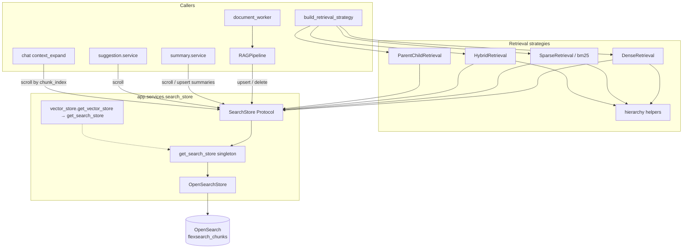
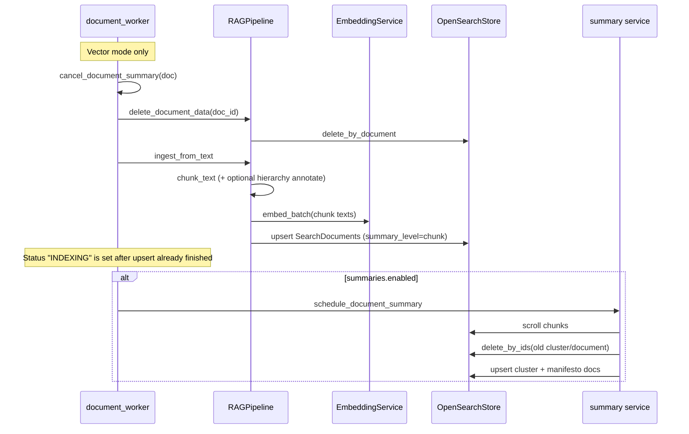
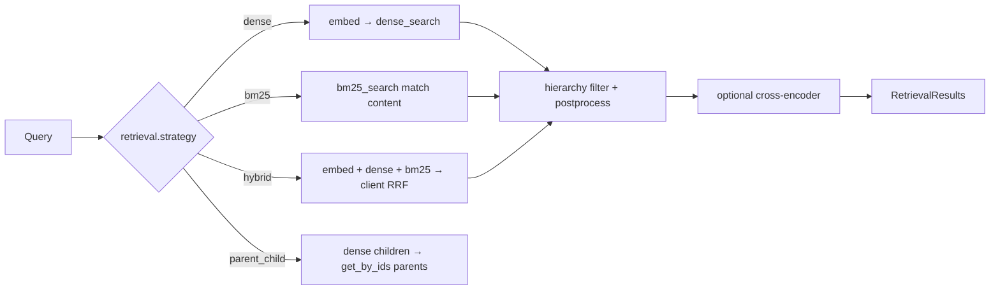

# OpenSearch / SearchStore (Vector RAG)

OpenSearch is the **sole** vector + lexical store for **Vector RAG** projects. Dense k-NN, BM25, and hybrid retrieval all hit the same index through the `SearchStore` protocol. Graph RAG does **not** use OpenSearch for primary retrieval (Neo4j / Microsoft GraphRAG instead).

This document is the architectural source of truth for the search stack. It replaces earlier short notes that under-specified hybrid fusion, dead BM25 params, and the migration off Qdrant / in-process BM25.

**In plain language:** Vector RAG answers “which passages should the LLM see?” by searching an index of chunks. OpenSearch is that index — one place that holds both the embedding (for meaning) and the text (for exact words), plus metadata that filters by project, hierarchy, and parent/child relationships.

---

## Why OpenSearch exists in FlexSearch

Vector RAG needs two kinds of recall over the same chunks:

1. **Semantic (dense)** — “find text *about* this idea,” even when the wording differs.
2. **Lexical (sparse / BM25)** — “find text that *contains* these words,” especially IDs, acronyms, and rare terms embeddings often miss.

A pure vector database (e.g. the former Qdrant setup) handled (1) well but left lexical search as a separate in-memory BM25 corpus that had to be rebuilt and kept in sync. OpenSearch stores **both** the embedding vector and the searchable text in one document, so a single upsert powers dense, BM25, and hybrid retrieval — no dual-write sync.

### OpenSearch vs a pure vector DB

A **pure vector DB** is optimized for one job: store high-dimensional embeddings and find nearest neighbors. Lexical search, if you need it, is usually a second system (or an add-on) with its own write path and refresh semantics.

**OpenSearch** is a search engine (Lucene-based) that also hosts k-NN vectors. In FlexSearch that matters because:

| Concern | Pure vector DB mindset | OpenSearch in FlexSearch |
|---------|------------------------|---------------------------|
| Primary unit | Embedding + payload | Same — but `content` is a first-class **analyzed** field, not just payload |
| “Find similar meaning” | Dense ANN | `knn_vector` + Lucene HNSW |
| “Find these tokens” | Often external BM25 / keyword store | Native `match` on `content` |
| Filters / tenancy | Payload filters | Same document + `keyword` / range filters |
| Ops | Extra service + keep BM25 in sync | One cluster, one index write path |

**OpenSearch vs a dedicated vector DB (in this project):**

| | Dedicated vector DB (old Qdrant) | OpenSearch (current) |
|--|--------------------------------|----------------------|
| Dense k-NN | Primary strength | Via `knn_vector` + Lucene HNSW |
| Lexical BM25 | Separate process / index | Native `match` on `content` |
| Filters / tenancy | Payload filters | Same doc + `keyword` / range filters |
| Operational model | Extra service + BM25 rebuild | One cluster, one index write path |

Graph RAG still uses Neo4j / Microsoft GraphRAG for entity–community search; OpenSearch is the Vector RAG search plane only.

---

## Key concepts & terminology

| Term | Plain meaning in FlexSearch |
|------|------------------------------|
| **Index** | Named collection of documents (`flexsearch_chunks`). Analogous to a table; all projects share one index and isolate via `project_id` filters. |
| **Mapping** | Schema for fields: which are searchable text, exact keywords, integers, or k-NN vectors. Created in `OpenSearchStore._index_body`. |
| **Settings** | Index-level knobs (shards, replicas, knn plugin, HNSW `ef_search`) — not per-document. |
| **Analyzer** | How text is tokenized/normalized before BM25. FlexSearch uses OpenSearch’s **default** analyzer only (no custom stemming/synonyms). |
| **Embedding** | Fixed-length float vector that represents chunk (or query) meaning for the current `EMBEDDING_MODEL`. |
| **Dense / k-NN search** | Query is an embedding vector; OpenSearch finds nearest neighbors in `embedding` (cosine similarity, HNSW graph). |
| **Sparse / BM25 search** | Query is plain text; BM25 ranks documents by term frequency / rarity on tokenized `content`. “Sparse” here means bag-of-words signals, not a learned sparse model. |
| **Hybrid search** | Run dense + BM25, then merge rankings. FlexSearch fuses **client-side with RRF**, not OpenSearch native hybrid pipelines. |
| **RRF (Reciprocal Rank Fusion)** | Rank-based merge: a doc high in either list scores well; raw score scales need not be comparable. |
| **HNSW** | Approximate nearest-neighbor graph used for fast dense search (`m`, `ef_construction`, `ef_search` trade recall vs latency). |
| **`SearchStore`** | App-facing protocol so retrieval/ingest code does not talk OpenSearch APIs directly. |
| **Upsert / indexing (write path)** | Embed chunk → write `SearchDocument` (vector + text + metadata) into the index so it becomes searchable. |
| **`keyword` vs `text`** | `keyword` = exact match / filter (IDs, types). `text` = analyzed full-text BM25 (`content`). |

### Embeddings, k-NN, and HNSW

**Embeddings** turn text into a point in high-dimensional space. At ingest, each chunk’s text is embedded and stored in the `embedding` field. At query time (dense / hybrid / parent-child), the *same* embedding model encodes the user question. Dense retrieval is “find stored points near the query point.”

**k-NN** (k-nearest neighbors) is that geometric lookup: return the `k` closest vectors under a distance / similarity. FlexSearch uses OpenSearch `knn` queries on `embedding` with `space_type: cosinesimil` (cosine similarity via the Lucene engine).

Exact nearest-neighbor over millions of vectors is expensive, so OpenSearch builds an **HNSW** graph (Hierarchical Navigable Small World) over the vectors:

| Parameter | Role (intuition) |
|-----------|------------------|
| `m` | How many neighbors each node links to — denser graph → better recall, more memory |
| `ef_construction` | Candidate pool while *building* the graph — higher → better graph quality, slower indexing |
| `ef_search` | Candidate pool while *querying* — higher → better recall, slower search |

HNSW is **approximate**: it trades a small chance of missing a true neighbor for speed. That is normal for production vector search; FlexSearch does not run exact brute-force k-NN at query time.

**Mental model:** dense search fails when the embedding space does not encode what the user meant (rare codes, exact quotes, out-of-domain jargon). It wins when the user paraphrases or asks thematically.

### BM25 (lexical / “sparse”)

**BM25** is classic full-text ranking on tokenized words. After the analyzer turns `content` into terms, BM25 scores a document higher when:

- Query terms appear often in that document (term frequency),
- Those terms are rare across the corpus (inverse document frequency),
- Document length is normalized so long chunks are not unfairly favored.

In FlexSearch, “sparse” means this bag-of-words BM25 signal — **not** a learned sparse encoder (SPLADE-style). There is no separate sparse vector field; lexical search is OpenSearch `match` on `content`.

**Mental model:** BM25 wins on exact tokens (SKU `XJ-2044`, error code `ECONNRESET`, a proper name spelled uniquely). It fails when the user uses synonyms the analyzer never equated (“buy” vs “purchase”) or when the answer is paraphrased without shared rare terms.

### Analyzers

An **analyzer** is the pipeline that turns raw text into tokens before BM25 indexing and before `match` queries. Typical steps: character filters → tokenizer → token filters (lowercase, stopwords, stemming, …).

FlexSearch maps `content` as `"type": "text"` with **no custom analyzer**. Index and query both use OpenSearch’s **default** analyzer (standard tokenization + basic normalization). There is:

- No project- or language-specific stemming
- No synonym filter
- No custom stopword list

So BM25 is only as smart as default tokenization. “Running” and “ran” may not match each other the way a stemmer would; “PostgreSQL” and “postgres” only help if they share tokens after default analysis. Filters that need exact strings (`project_id`, `chunk_type`, …) use `keyword` fields and **skip** analysis — that is intentional so IDs are not tokenized apart.

### Hybrid + client-side RRF

**Hybrid** means: run dense and BM25 independently, then merge the ranked lists. Raw cosine scores and BM25 scores live on different scales, so FlexSearch does **not** add or weight them directly.

**Reciprocal Rank Fusion (RRF)** merges by *rank position*:

\[
\mathrm{score}(id) = \sum_{\text{lists}} \frac{1}{k + \mathrm{rank} + 1}
\]

A chunk that is #1 in BM25 and #5 in dense outranks a chunk that is mediocre in only one list. `rrf_k` (default 60) softens the contribution of lower ranks. Fusion happens in application code after two OpenSearch searches (`OpenSearchStore.hybrid_search`) — FlexSearch does **not** use OpenSearch native hybrid / search-pipeline APIs.

**Mental model:** hybrid is the default “cover both failure modes” strategy when you can afford two queries. It still fails when *both* channels miss (wrong project filter, empty index, question that needs graph hops rather than chunk similarity).

### Parent-child (search small, return large)

Parent-child is a **chunking + retrieval** pattern, not an OpenSearch join type:

1. At ingest, large **parent** chunks and smaller **child** chunks are both stored; children carry `parent_id`.
2. At query time, dense search runs only on `chunk_type=child` (finer granularity → better match precision).
3. Hits are collapsed to unique parents; parents are loaded with `get_by_ids` and returned as LLM context (scored by the best matching child).

OpenSearch only stores the relationship as keyword fields (`chunk_type`, `parent_id`). There is no `has_child` / join query in use.

**Mental model:** wins when you need precise matching *and* paragraph-or-section context for generation. Fails if children were never indexed (`chunk_type` wrong), parents missing, or the project was not chunked with `ParentChildChunking`.

### Index / mapping mental model

Think of one shared index as a **table of searchable rows**, not a file folder:

```text
flexsearch_chunks
┌─────────────┬──────────────┬─────────────┬──────────────────────────┐
│ _id         │ embedding[]  │ content     │ metadata (keyword / int) │
├─────────────┼──────────────┼─────────────┼──────────────────────────┤
│ chunk uuid  │ 768 floats…  │ passage…    │ project_id, chunk_type…  │
│ cluster id  │ centroid…    │ summary…    │ summary_level=cluster    │
│ manifesto   │ manifesto…   │ overview…   │ summary_level=document   │
└─────────────┴──────────────┴─────────────┴──────────────────────────┘
```

- **Settings** = how the table is stored and searched (knn on, HNSW `ef_search`, shards/replicas).
- **Mapping** = column types: `knn_vector`, `text`, `keyword`, `integer`. Wrong type → wrong query behavior (e.g. analyzing an ID would break exact filters).
- **Document** = one row: always vector + text + filters when ingested as a normal chunk; summaries reuse the same columns with different `summary_level`.
- **Isolation** = `filter` on `project_id`, not a separate index per project.

Changing embedding dimension or adding required mapped fields usually means **recreate index + reingest** — vectors and mappings are not freely morphable in place.

---

## When each retrieval mode wins or fails

Factory strategies (`dense` / `bm25` / `hybrid` / `parent_child`) all read the same index; they differ in *which signals* they trust. Hierarchy modes (`chunks_only` / `summaries_first` / `mixed`) further change which `summary_level` rows are eligible — see §6.

| Strategy | Wins when… | Fails / weak when… |
|----------|------------|---------------------|
| **dense** | User paraphrases; topical / “about this idea” questions; synonyms embeddings capture | Exact IDs, codes, rare spellings; embedding model mismatch with corpus domain |
| **bm25** | Exact token match matters (part numbers, error strings, unique names) | Synonym-only questions; default analyzer does not stem/synonymize; very short noisy queries |
| **hybrid** | Mixed corpus: some asks need exact terms, some need paraphrase; you want one default | Extra latency (two searches); both lists empty or both miss; RRF can promote a doc strong in one weak channel |
| **parent_child** | Need fine match + larger generation context; docs ingested with parent/child chunking | No child hits / missing `parent_id`; hierarchy summary modes expected but ignored (always chunk-level children) |

**Hierarchy add-ons** (orthogonal to the four strategies for dense/BM25/hybrid):

| Mode | Wins when… | Weak when… |
|------|------------|------------|
| `chunks_only` | Short docs; citations should stay on passages | Long docs where themes live above any single chunk |
| `summaries_first` | “Which section / doc is about X?” then expand members | Summaries not built yet; over-expand floods context |
| `mixed` | Want both map and detail in one list | Dedup / ranking noisier; more hits to truncate |

These are retrieval *quality* heuristics, not guarantees — eval and golden sets (see `app/eval/`) are how you validate a project’s choice.

---

## 1. Role

| Concern | Store |
|---------|--------|
| Vector RAG chunks, summaries, dense / BM25 / hybrid / parent-child | **OpenSearch** (`SearchStore`) |
| Graph RAG entities / communities / local+global search | Neo4j or Microsoft GraphRAG workspace |
| Object files / extracted markdown | MinIO |
| Job / chat / document metadata | Postgres (+ Redis for jobs) |

**Replaces:**

- **Qdrant** — removed from settings, admin URLs, and runtime. No Qdrant client remains under `app/`.
- **In-process BM25** (`app/rag/retrieval/bm25_index.py`) — deleted. Lexical search is OpenSearch `match` on `content` with the index’s default BM25 similarity.

**Does not replace:** Graph mode pipelines. `RAGPipeline.index_chunks` / `delete_*` OpenSearch paths are skipped when `rag_mode == GRAPH`.

Infra is typically an external OpenSearch (e.g. infra-hub `infra-opensearch`). FlexSearch connects via `OPENSEARCH_URL` and does not embed a cluster in this repo’s compose beyond pointing workers/API at the hub service name.

---

## 2. Architecture



### SearchStore protocol

Module: `app/services/search_store/protocol.py`

Backend-agnostic contract used by vector retrieval and ingest. Callers depend on this interface so retrieval strategies stay portable; today the only implementation is `OpenSearchStore`.

| Method | Behavior |
|--------|----------|
| `ensure_index(dimension?)` | Create index if missing; **fail fast** if existing `knn_vector` dimension ≠ embedding model |
| `upsert(documents)` | Bulk index `SearchDocument`s (`refresh=wait_for`) |
| `dense_search(query_vector, filters, top_k, score_threshold?)` | Lucene HNSW k-NN on `embedding` |
| `bm25_search(query, filters, top_k)` | `match` on `content` |
| `hybrid_search(query, query_vector, filters, top_k, rrf_k)` | Dense + BM25, then **client-side RRF** (not OpenSearch native hybrid) |
| `get_by_ids(ids)` | `mget` — parent resolve, summary member expand |
| `delete_by_document` / `delete_by_project` | `delete_by_query` on keyword fields |
| `delete_by_ids(ids)` | Bulk delete — summary refresh without wiping chunks |
| `scroll(filters, size, search_after?)` | Sorted `_id` pagination — summaries, suggestions, neighbor expand |
| `get_index_info()` | Doc count / store size for admin |

Shared types live in `types.py`:

- **`SearchFilters`** — `project_id`, `document_id`, `chunk_type`, `parent_id`, `summary_level` / `summary_levels`, `cluster_id`, `chunk_index_min` / `chunk_index_max`
- **`SearchDocument`** — upsert model; `to_source()` flattens embedding + metadata (+ `extra`)
- **`SearchHit`** — normalized hit; full `_source` retained in `payload` (embeddings available to summary clustering)

### Singleton & boot

`get_search_store()` returns a process-wide `OpenSearchStore`. First call attempts `ensure_index()`; on failure it **logs and defers** so the API can start when OpenSearch is briefly down. The next upsert/search retries `ensure_index`.

`reset_search_store()` closes the client (tests).

### `vector_store` shim

`app/services/vector_store.py` is **not** a second store:

```python
get_vector_store = get_search_store
```

Prefer `app.services.search_store.get_search_store` in new code. The alias exists only for older call sites / tests.

---

## 3. Index model

Conceptually: every searchable unit (chunk, cluster summary, document manifesto) is one OpenSearch document with (a) an embedding for dense recall, (b) `content` text for BM25, and (c) metadata fields for filtering and hierarchy. There is no separate “vector collection” vs “text index” — one mapping covers both.

**Write once, query many ways:** the same upsert makes a row eligible for dense, BM25, hybrid, parent resolve (`get_by_ids`), hierarchy expand, and neighbor scroll. Choosing a retrieval strategy does not require a second index write.

### Name

```text
{OPENSEARCH_INDEX_PREFIX}_{OPENSEARCH_INDEX_NAME}
```

Defaults → **`flexsearch_chunks`**.

One shared index for all projects. Isolation is **filter-based** (`project_id` term), not per-project indices.

### Settings & mapping

**Mapping** declares field types so OpenSearch knows how to index and query each property. **Settings** control cluster/index behavior (knn on, HNSW search params, shard/replica counts). Both are created together by `OpenSearchStore._index_body(dimension)`:

**Analyzers (lexical path):** `content` is mapped as `text` with no custom analyzer. At index and query time OpenSearch applies its default analyzer (tokenize + basic normalization). There is no project-specific stemming, stopword list, or synonym filter — see limitations §10. That is why BM25 is strong on shared exact tokens and weak on linguistic variants the default analyzer does not collapse.

| Setting / field | Value | Purpose |
|-----------------|-------|---------|
| `index.knn` | `true` | Enable knn plugin path |
| `knn.algo_param.ef_search` | `OPENSEARCH_KNN_EF_SEARCH` (100) | HNSW search ef |
| `number_of_shards` / `replicas` | `1` / `0` | Dev-friendly defaults (not HA) |
| `embedding` | `knn_vector`, dim = embedding model | Dense path: HNSW, `space_type: cosinesimil`, `engine: lucene` |
| HNSW `m` / `ef_construction` | env (16 / 100) | Graph connectivity / build quality (`m` = neighbors per node; `ef_construction` = build-time candidate pool) |
| `content` | `text` | Lexical BM25 body (default analyzer + default BM25 similarity) |
| `project_id`, `document_id` | `keyword` | Exact filters for tenancy / delete (not full-text analyzed) |
| `chunk_index` | `integer` | Neighbor expand via range filter |
| `chunk_type`, `parent_id` | `keyword` | Parent-child retrieval |
| `summary_level` | `keyword` | `chunk` \| `cluster` \| `document` |
| `cluster_id`, `member_chunk_ids` | `keyword` | Summary identity + expand targets |
| `filename` | `keyword` | Citations |
| `start_char`, `end_char` | `integer` | Optional span metadata |

`SearchDocument.extra` keys (e.g. hierarchy breadcrumbs) are written into `_source` and may land as **dynamic** fields — they are not in the explicit mapping.

### Dimension safety

On existing indices, `ensure_index` reads the mapping and raises `OpenSearchStoreError` if `embedding.dimension` ≠ current embedding model dimension. Fix by recreating the index or changing `EMBEDDING_MODEL`. If `summary_level` is missing from an old mapping, a warning is logged (recreate for hierarchical summaries).

---

## 4. Document model & ID schemes

Each row below is one OpenSearch `_source` document. Stable `_id`s make re-ingest an overwrite (upsert) rather than duplicate rows.

| Kind | `_id` | `summary_level` | Notes |
|------|-------|-----------------|-------|
| Normal / child chunk | `uuid5(DNS, "{document_id}_{chunk_index}")` | `chunk` | Stable across reindex of same doc+index |
| Parent chunk | `parent_chunk_id` from chunk metadata | `chunk` | Children store this as `parent_id` for `get_by_ids` |
| Cluster summary | `uuid5(DNS, "summary:{doc}:cluster:c{N}")` | `cluster` | Centroid embedding; `member_chunk_ids` |
| Document manifesto | `uuid5(DNS, "summary:{doc}:document:manifesto")` | `document` | Embeds manifesto text; members = all clustered chunks |

Ingest always sets `summary_level: "chunk"`. Summaries are a **later upsert** into the **same** index (see §5).

Parent-child chunking (`ParentChildChunking`, LangChain nested recursive splitters) stamps:

- Parents: `metadata.chunk_type=parent`, `metadata.parent_chunk_id=<id>`
- Children: `chunk_type=child`, `Chunk.parent_id=<parent id>`

`pipeline.index_chunks` maps those into `SearchDocument.chunk_type` / `parent_id`.

---

## 5. Write path (ingest lifecycle)

**Indexing**, in FlexSearch terms: turn extracted text into chunks, embed them, and upsert into OpenSearch so both the vector and the text become queryable. Summaries are a second write into the same index (same mapping, different `summary_level`), not a separate store.



### Entry points

1. **`document_worker._run_chunk_and_index`** — cancel in-flight summary → wipe OpenSearch docs for the document → `pipeline.ingest_from_text` → optionally `schedule_document_summary`.
2. **`RAGPipeline.ingest_from_text` → `chunk_text` → `index_chunks`** — embed batch, build `SearchDocument`s, `get_search_store().upsert`.
3. **`summary.service.build_document_summaries`** — scroll `summary_level=chunk`, K-Means on stored embeddings (fallback re-embed), LLM cluster/manifesto text, upsert `cluster` / `document` levels with `member_chunk_ids`.
4. **Deletes** — document API / reindex: `delete_by_document`; project wipe: `project_index_service` / `delete_project_data` → `delete_by_project`.

Graph mode workers extract text and schedule graph indexing; they do **not** call `index_chunks`.

### Upsert mechanics

- Bulk `index` ops with document `_id`
- `ensure_index(len(first.embedding))` before write
- `refresh="wait_for"` so subsequent BM25/knn see new docs in the same request path
- Partial bulk failures raise `OpenSearchStoreError`

---

## 6. Read paths

At query time the chosen **retrieval strategy** decides how OpenSearch is called. Dense needs an embedding of the user query; BM25 sends the query string as-is; hybrid does both and fuses ranks. Hierarchy modes only change which `summary_level` docs are eligible and whether summary hits are expanded to member chunks.



Factory: `build_retrieval_strategy` in `app/rag/factory.py`, driven by `RetrievalConfig` + `summaries.retrieval_mode`.

For win/fail intuition per strategy, see [When each retrieval mode wins or fails](#when-each-retrieval-mode-wins-or-fails) above.

### Dense

Semantic recall: the query is embedded with the same model used at ingest, then OpenSearch walks the HNSW graph on `embedding`.

`DenseRetrieval` → `embedding.embed(query)` → `dense_search`.

- Query body: `knn` on `embedding` with `k=top_k`
- Filters applied as `bool.filter` around the knn clause when present
- Optional `score_threshold` filters hits **after** the response (score semantics follow lucene/cosinesimil — not a calibrated 0–1 probability)

**Example win:** “How do we handle retries when the upstream API flakes?” matches a chunk that talks about “exponential backoff on transient HTTP failures” without sharing the word “flakes.”

**Example fail:** Query `"ticket INC-44192"` when that string appears once in a table — embeddings may bury it under thematically similar incident prose; BM25 / hybrid is stronger here.

### BM25 (sparse) — and dead `k1` / `b`

**BM25** is classic full-text ranking: documents that use the query’s terms often (and those terms are rare corpus-wide) rank higher, with length normalization. In FlexSearch this is OpenSearch’s built-in similarity on analyzed `content` — not a learned sparse encoder and not the old in-process `rank_bm25` corpus.

`SparseRetrieval` (strategy name `"bm25"`) → `bm25_search`:

```json
{ "match": { "content": { "query": "<user query>" } } }
```

wrapped with the same filter clauses as dense.

**Important:** `Bm25RetrievalParams.k1` / `b` (defaults 1.5 / 0.75) are accepted by the schema, API catalog, frontend form, and `SparseRetrieval.__init__` for factory compatibility — but **they are never applied**. OpenSearch uses its **index-level default BM25 similarity**. There is no custom `index.similarity` or per-query BM25 param wiring.

Treat UI/API `k1`/`b` as **legacy / no-ops** until index similarity settings are implemented.

**Example win:** Looking up `OPENSEARCH_KNN_EF_SEARCH` or a customer account id that appears verbatim in a runbook.

**Example fail:** “Cancel a subscription” when the docs only say “terminate the billing agreement” — default analyzer has no synonym bridge; dense or hybrid usually recovers.

### Hybrid — client-side RRF (not native hybrid)

**Role in FlexSearch:** hybrid is the strategy that covers both “same words” and “same meaning” failures of either channel alone — e.g. BM25 catches exact product codes while dense catches paraphrases. Fusion is by **rank**, not by blending raw BM25 and cosine scores (those scales are not comparable).

`HybridRetrieval` → `hybrid_search`:

1. `fetch_k = max(top_k * 3, top_k)`
2. Run `dense_search` and `bm25_search` independently at `fetch_k`
3. If one list is empty, return the other truncated to `top_k`
4. Else fuse with Reciprocal Rank Fusion:

\[
\mathrm{score}(id) = \sum_{\text{lists}} \frac{1}{k + \mathrm{rank} + 1}
\]

(`k` = `rrf_k`, default 60; ranks are 0-based in code so `rank+1` is 1-based position.)

Fused hits store `payload.rrf_score` and set `hit.score` to the RRF value. This is **application-side** fusion (two HTTP searches). FlexSearch does **not** use OpenSearch’s native hybrid / search-pipeline APIs.

`HybridRetrieval.reciprocal_rank_fusion` duplicates the same math on `RetrievalResult` for unit tests / callers.

**Example win:** Query mixes a rare SKU with a paraphrase of the procedure — BM25 surfaces the SKU chunk, dense surfaces the procedure chunk, RRF keeps both near the top.

**Example fail / cost:** Every hybrid retrieve pays for two OpenSearch round-trips; if BM25 returns empty (no token overlap), you effectively get dense-only after the spare call. Native hybrid pipelines could cut latency but are not wired today (§10).

### Parent-child

Conceptually: search on small **child** chunks (better precision), then return the larger **parent** chunk for LLM context. OpenSearch only stores the relationship via `chunk_type` / `parent_id`; there is no OpenSearch join query type in use.

1. Dense search with `chunk_type=child`, `summary_level=chunk`, `top_k * 2`
2. Keep best child score per `parent_id`
3. `get_by_ids(ordered parent ids)`
4. Return **parent** content scored by best child; metadata includes `matched_child_id`

`hierarchy_mode` is accepted for factory symmetry but **does not** change parent-child filters (always chunk-level children).

**Example win:** A one-sentence child matches “rate limit 429,” but the parent paragraph also contains the remediation steps the LLM needs.

**Example fail:** Project still uses flat recursive/fixed-window chunking (no `chunk_type=child`) → child filter returns nothing → empty retrieval. Or users expect `summaries_first` to apply — it does not for this strategy.

### Hierarchy modes

Helpers: `app/rag/retrieval/hierarchy.py`

Summaries live in the **same** index as chunks. Hierarchy modes choose whether retrieval starts from fine chunks, coarse summaries, or both — then optionally expand summary hits via `member_chunk_ids`.

| Mode | OpenSearch filter | Postprocess |
|------|-------------------|-------------|
| `chunks_only` | `summary_level=chunk` | none |
| `summaries_first` | `summary_level ∈ {cluster, document}` | expand `member_chunk_ids` via `get_by_ids`; **replace** summaries with members |
| `mixed` | no level filter | keep summaries **and** append members (deduped) |

Dense / BM25 / hybrid all go through `filters_for_hierarchy` + `apply_hierarchy_postprocess`.

### Neighbor expand (chat)

`app/rag/chat/stages/context_expand.py` — when `chat.context_window > 0`:

- For each primary **chunk** hit, `scroll` with `document_id` + `summary_level=chunk` + `chunk_index` range `[idx-W, idx+W]`
- Insert neighbors around the primary with attenuated scores
- Skips expanding cluster/document hits (those use member-chunk expand instead)

### Suggestions

`suggestion.service` scrolls manifesto / cluster / chunk docs from the same index to seed suggested questions.

---

## 7. Config / environment

| Variable | Default | Purpose |
|----------|---------|---------|
| `OPENSEARCH_URL` | `http://127.0.0.1:9200` | Client base URL |
| `OPENSEARCH_INDEX_PREFIX` | `flexsearch` | Index name prefix |
| `OPENSEARCH_INDEX_NAME` | `chunks` | Suffix → `flexsearch_chunks` |
| `OPENSEARCH_USERNAME` / `PASSWORD` | empty | Optional basic auth |
| `OPENSEARCH_USE_SSL` | `false` | TLS |
| `OPENSEARCH_VERIFY_CERTS` | `false` | Cert verification when SSL on |
| `OPENSEARCH_HTTP_PORT` | `9200` | Public/admin link port |
| `OPENSEARCH_DASHBOARDS_PORT` | `5601` | Dashboards link |
| `OPENSEARCH_KNN_M` | `16` | HNSW `m` |
| `OPENSEARCH_KNN_EF_CONSTRUCTION` | `100` | HNSW build ef |
| `OPENSEARCH_KNN_EF_SEARCH` | `100` | Index `ef_search` |
| `RETRIEVAL_STRATEGY` (settings) | `dense` | Global default among `dense` / `parent_child` / `hybrid` / `bm25` |

**Connection matrix**

| Runtime | Typical `OPENSEARCH_URL` |
|---------|--------------------------|
| Host / local | `http://127.0.0.1:9200` |
| API/worker containers on infra network | `http://opensearch:9200` |

Compose overrides `OPENSEARCH_URL` for API and Celery workers. Derived helpers: `settings.opensearch_index`, `opensearch_public_url`, `opensearch_dashboards_url`, and `admin_urls["opensearch"]`.

Health check (`main.py`): `OpenSearchStore.ping()`; service marked unhealthy if unreachable.

Python dependency: `opensearch-py>=2.8.0`. There is **no** `rank_bm25` package.

---

## 8. Ops

### Smoke

```bash
curl -s "$OPENSEARCH_URL"
# Expect cluster metadata; distribution typically "opensearch"
```

### Recreate index (dimension / mapping change)

1. Stop writers (or accept brief inconsistency).
2. Delete index: `DELETE /flexsearch_chunks` (or configured name).
3. Next `ensure_index` / upsert recreates mapping from current embedding dimension.
4. Reindex all vector projects/documents (ingest workers).

### Dimension mismatch

Error text from `ensure_index` tells you existing vs expected dim. Do not “fix” by changing only the model without recreating the index — vectors are incompatible.

### Progress UX caveat

The worker sets status `INDEXING` / “Indexing vectors in OpenSearch…” **after** `ingest_from_text` has already upserted. Treat that step as a post-index bookkeeping signal, not the actual write window.

---

## 9. Migration notes

| Old | New |
|-----|-----|
| Qdrant collections + client | OpenSearch `knn_vector` + `SearchStore` |
| `bm25_index.py` in-memory corpus rebuilt from chunks | Live BM25 on indexed `content` — no separate rebuild |
| Dual write / sync BM25 with vector store | Single upsert writes both vector and text fields |
| `get_vector_store()` as Qdrant handle | Alias → `get_search_store()` |
| Tunable in-process BM25 `k1`/`b` | Params retained in schema/UI but **unused**; OpenSearch default similarity |

Plan references to `bm25_index.py` are historical only; the module is not present in the tree.

Graph projects were never on Qdrant/OpenSearch for primary retrieval; their path is unchanged aside from shared document lifecycle (extract → storage → graph index).

---

## 10. Limitations & roadmap hints

1. **Dead BM25 `k1`/`b`** — document and/or wire index similarity settings; until then hide or ignore in UI.
2. **Client RRF hybrid** — two queries per hybrid search; native hybrid / search pipelines would cut latency.
3. **Single shared index** — soft multi-tenancy via `project_id`; consider per-project indices for stronger isolation / lifecycle.
4. **No custom analyzers** — default analyzer only; language/stemming/synonyms not configured.
5. **`ensure_index` on every op** — correct but chatty; cache “index ready” after first success.
6. **Replicas=0** — fine for local/dev; raise for production durability.
7. **Tests are mocked** — `test_opensearch_*`, `test_bm25_retrieval.py` do not hit a live cluster.
8. **Dynamic `extra` fields** — can complicate mapping evolution over time.
9. **Parent-child ignores hierarchy modes** — intentional today; document in product UX so users don’t expect summary-first parent-child.

---

## 11. Tests

| File | Coverage |
|------|----------|
| `tests/test_opensearch_retrieval.py` | RRF fusion, hybrid_search wiring, mapping body, parent-child scoring, `SearchDocument` defaults |
| `tests/test_opensearch_settings.py` | Index name property; Qdrant absent from `admin_urls` |
| `tests/test_bm25_retrieval.py` | `SparseRetrieval` → `bm25_search` mock |
| `tests/test_rag_config.py` | Factory builds `SparseRetrieval` / `HybridRetrieval` with params (including unused k1/b) |
| `tests/test_phase3_ingest_summaries.py` | Hierarchy filters + member expand |

Run (from `backend/`):

```bash
uv run pytest tests/test_opensearch_retrieval.py tests/test_opensearch_settings.py tests/test_bm25_retrieval.py -q
```

---

## 12. Related code map

| Path | Role |
|------|------|
| `app/services/search_store/protocol.py` | `SearchStore` Protocol |
| `app/services/search_store/types.py` | Filters / Document / Hit |
| `app/services/search_store/opensearch_store.py` | OpenSearch implementation + RRF |
| `app/services/search_store/__init__.py` | Singleton factory |
| `app/services/vector_store.py` | Back-compat shim |
| `app/rag/retrieval/{dense,sparse,hybrid,parent_child,hierarchy}.py` | Strategies |
| `app/rag/factory.py` | Strategy construction |
| `app/rag/pipeline.py` | `index_chunks` / delete / retrieve orchestration |
| `app/services/document_worker.py` | Ingest → index → schedule summaries |
| `app/services/summary/service.py` | Cluster / manifesto upserts |
| `app/rag/chat/stages/context_expand.py` | Neighbor scroll |
| `app/core/config.py` | `OPENSEARCH_*` settings |
| `app/schemas/rag_config.py` | Retrieval + hierarchy + (dead) BM25 params |
| `app/api/rag.py` | Strategy catalog including bm25 k1/b defaults |
| `app/main.py` | OpenSearch health ping |

**Out of scope for this doc:** Neo4j GraphRAG, Celery queue topology, and frontend form layout — see sibling docs under `backend/docs/`.
