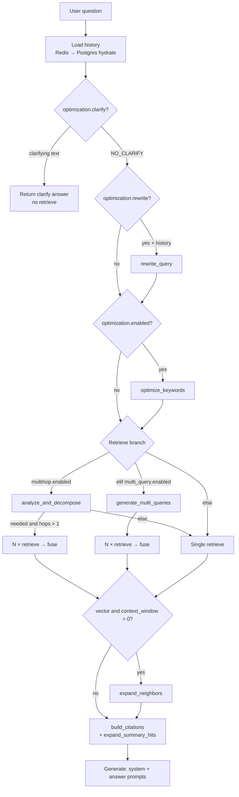
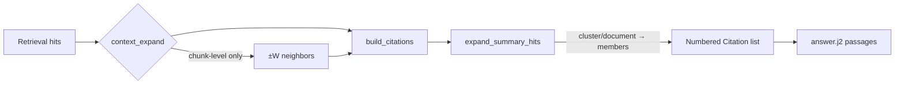

# Query-quality stages

Per-project stages that wrap `RAGPipeline.retrieve()` **without forking** retrieval. Toggle via `rag_config.chat` (project Settings → Chat stages / `RagConfigForm`).

**In plain language:** after the user asks a question, FlexSearch can optionally rewrite or expand that question, run retrieval more than once, merge the hit lists, and pull neighboring chunks so the LLM sees coherent passages. These stages sit *around* the shared retrieval pipeline — they do not invent a second search engine.

Chat HTTP surface, SSE, and persistence: [chat/README.md](../chat/README.md).

---

## Why query stages exist

Raw retrieval is brittle to how humans speak. A perfect index still fails when:

| Failure mode | What goes wrong | Stage that helps |
|--------------|-----------------|------------------|
| Vague ask | “Tell me about that” has nothing to embed or match | **Clarify** |
| Conversational glue | “And the second one?” is meaningless alone | **Rewrite** |
| Lexical mismatch | Chatty phrasing misses exact IDs / product names BM25 loves | **Keyword optimize** |
| Wording luck | One paraphrase hits; another misses the same fact | **Multi-query** |
| Multi-fact ask | One query cannot cover two separate evidence needs | **Multihop** |
| Isolated chunk | Hit is mid-paragraph; definition is next door | **Context expand** |

Stages trade **extra LLM calls and/or N retrieves** for better recall and cleaner context. They never replace OpenSearch / Neo4j ranking — each `retrieve()` is still the same pipeline Search lab uses.

**Mental model:** prepare the *question string* → maybe fan out into *several* retrieve calls → fuse ranked lists → optionally widen each hit into a *local window* → generate.

---

## Terminology

| Term | Meaning |
|------|---------|
| **Query stage** | An optional step before or after `retrieve()` that reshapes the question, runs multiple retrieves, or expands hits. Configured under `ChatConfig`. |
| **Prepared query** | The string actually passed to retrieval after clarify/rewrite/optimize. May differ from the user’s original wording. |
| **Retrieve** | One call to `RAGPipeline.retrieve()` (vector OpenSearch or graph Neo4j / Microsoft). Stages never replace this call; they may invoke it N times. |
| **Fusion** | Merging several ranked hit lists into one top-k list. FlexSearch uses **frequency consensus** (see §4.6), not Reciprocal Rank Fusion (RRF). |
| **Frequency consensus** | Chunks that appear in more retrieve lists get a small score boost on top of their best score — “agreed by multiple queries” ranks higher. |
| **RRF (Reciprocal Rank Fusion)** | A common industry fusion method that combines ranks as \(1/(k + \text{rank})\). Used inside **hybrid retrieval** (dense + BM25 within one `retrieve`). Chat multi-list merge uses frequency consensus instead. |
| **Multi-query** | Generate paraphrases of the same intent, retrieve once each, fuse. Good for wording/coverage. |
| **Multihop** | Decompose a complex question into sub-questions (hops), retrieve per hop, fuse. Good for multi-fact asks. |
| **Context expand** | After retrieval, pull ±W neighboring chunks by `chunk_index` in the same document so the LLM sees local continuity. |
| **Clarify short-circuit** | Ask the user a clarifying question and **skip** retrieve + passage-based generate for that turn. |

---

## 1. Design principle

Stages improve **what** is retrieved and **how** context is assembled. They never replace the pipeline:

```
ChatOrchestrator
  └─ create_pipeline(rag_config, rag_mode).retrieve(query, project_id, top_k, overrides)
        ├─ vector → OpenSearch strategy (+ optional rerank)
        └─ graph  → Neo4j / Microsoft strategy
```

**Why this shape:** search-lab experiments and production chat must share one retrieval implementation. Stages only change the *query* and *post-processing*, so toggling chat quality knobs does not fork indexing or ranking code.

Implications:

- Search-lab and chat share the same retrieval implementations and overrides.
- Multi-query / multihop mean **N** full `retrieve` calls, then fusion in the orchestrator.
- Graph readiness is enforced in the chat API before the orchestrator runs.

There are **no** global `ENABLE_*` env flags for these stages — only per-project `ChatConfig`.

---

## 2. Pipeline order

Conceptually the pipeline is: **understand the ask → retrieve (once or many) → enrich hits → answer**. Early stages may abort (clarify) or only reshape the retrieval string (rewrite / optimize). Later stages never change the user’s question in the answer prompt — only what passages are attached.



Textual order:

```
question
  │
  ├─ load history          include_history ∧ memory.enabled
  ├─ clarify?              optimization.clarify
  ├─ rewrite               optimization.rewrite (+ history)
  ├─ keyword optimize      optimization.enabled  ← runs whenever master switch is on
  │
  ├─ multihop?             multihop.enabled  ──► analyze → N× retrieve → fuse
  │     else multi_query?  multi_query.enabled ──► generate → N× retrieve → fuse
  │     else single retrieve
  │
  ├─ context expand        context_window > 0 AND rag_mode == vector
  ├─ citations             expand_summary_hits (summaries → member chunks)
  └─ generate answer
```

**Precedence:** if both `multihop.enabled` and `multi_query.enabled` are true, **multihop wins** (`if` / `elif` in `_retrieve_staged`). Multi-query is never run.

---

## 3. Config reference (`ChatConfig`)

Defined in `app/schemas/rag_config.py`. Nested under both `VectorRagConfig.chat` and `GraphRagConfig.chat`. Defaults from `ChatConfig()` / `GET /api/rag/options` → `chat.defaults`.

| Field | Default | Range / type | Effect |
|-------|---------|--------------|--------|
| `temperature` | `0.3` | 0–2 | Answer generation |
| `max_tokens` | `2048` | 64–8192 | Answer generation |
| `top_k` | `5` | 1–50 | Default retrieve k (request `top_k` overrides) |
| `include_history` | `true` | bool | Must be true to load conversational history |
| `context_window` | `0` | 0–5 | ±N neighbor chunks by `chunk_index` (**vector only**) |
| `memory.enabled` | `true` | bool | Redis memory + history load gate |
| `memory.max_turns` | `10` | 1–50 | History window |
| `memory.ttl_seconds` | `3600` | 60–86400 | Redis TTL |
| `optimization.enabled` | `false` | bool | Master switch — **also runs keyword optimize** |
| `optimization.rewrite` | `false` | bool | Conversational rewrite |
| `optimization.clarify` | `false` | bool | Clarify short-circuit before retrieve |
| `multi_query.enabled` | `false` | bool | Query variants + consensus fuse |
| `multi_query.count` | `3` | 2–8 | Variant count (includes original) |
| `multihop.enabled` | `false` | bool | Decompose + fuse (wins over multi_query) |
| `multihop.max_hops` | `2` | 1–5 | Hop cap; graph may inject as `retrieval_params.max_hops` |
| `debug` | `false` | bool | Expose stage timings in JSON / SSE `debug` |

### History gate

`_load_history` returns `[]` unless **all** of:

1. `session_id` is set  
2. `include_history` is true  
3. `memory.enabled` is true  

**Why:** history is needed for rewrite/clarify and for the answer prompt’s conversational context, but loading it is opt-in so one-shot or anonymous calls stay cheap and private.

### UI

`frontend/src/components/RagConfigForm.tsx` + `rag-types.ts` mirror these fields. Options metadata lists `phase2_stages`: `context_window`, `memory`, `optimization`, `multi_query`, `multihop`, `debug`.

---

## 4. Stage deep-dives

Each subsection teaches the **idea**, shows a **worked example**, then documents how FlexSearch implements it (config, prompts, effects).

### 4.1 Clarify — `stages/rewrite.py` → `clarify_question`

**Idea:** Retrieval cannot invent missing constraints. If the user has not said *which* document, product, or time range they mean, searching anyway returns a random “best guess” corpus slice. Clarify asks one targeted follow-up and **stops** the turn before retrieve.

**Worked example**

| | |
|--|--|
| History | *(empty — first turn)* |
| User | “What about the penalty?” |
| Without clarify | Retrieve on “penalty” → mixes SLA penalties, late fees, and tax penalties |
| With clarify | Model returns e.g. “Which document or clause are you asking about?” → `retrieval_strategy="clarify"`, no passages, no generate-from-hits |
| Next turn | User: “Clause 4 in the Acme MSA” → normal retrieve path |

If the model replies `NO_CLARIFY`, the pipeline continues (rewrite → optimize → retrieve).

| | |
|--|--|
| **Config** | `optimization.enabled` ∧ `optimization.clarify` |
| **Prompt** | `prompts/clarify.j2` |
| **Input** | User question + history |
| **Output** | Clarifying question string, or `None` if model returns `NO_CLARIFY` |
| **Effect** | **Short-circuits** the pipeline: no retrieve, no generate-from-passages. Answer is the clarifying text; `retrieval_strategy="clarify"`, `empty_retrieval=true`. |

Runs **before** rewrite/optimize. Useful for underspecified first turns; can be noisy if the model over-asks.

---

### 4.2 Rewrite — `rewrite_query`

**Idea:** Chat users speak in pronouns and ellipsis. Search engines need standalone strings that resemble indexed text. Rewrite resolves “that / the second one / it” against history into a self-contained retrieval query — **without** changing what the answer prompt treats as the user’s question.

**Worked example**

| | |
|--|--|
| History | Assistant explained two SLA tiers: Standard and Premium |
| User | “and the second one?” |
| Raw retrieve query | `"and the second one?"` → near-zero lexical/semantic match |
| After rewrite | `"Premium SLA terms and conditions"` (illustrative) → real hits |
| Answer prompt still sees | Original: “and the second one?” + history + passages |

| | |
|--|--|
| **Config** | `optimization.enabled` ∧ `optimization.rewrite` ∧ (`history` or `memory.enabled`) |
| **Prompt** | `prompts/rewrite.j2` |
| **Behavior** | Standalone retrieval query from follow-ups; `NO_REWRITE` keeps original |
| **Early exit** | If `history` is empty, returns the question **without** an LLM call |
| **Important** | Rewritten text is used for **retrieval only**. Answer prompts still receive the original user question. |

---

### 4.3 Keyword optimize — `optimize_keywords`

**Idea:** Dense retrieval likes natural language; BM25 / hybrid’s sparse side likes exact tokens (IDs, product codes, section titles). Conversational questions often bury those tokens. Optimize extracts a short keyword string and **appends** it so lexical search can fire without discarding the original intent.

**Worked example**

| | |
|--|--|
| User / prepared query | “What’s the uptime promise for the gold support tier?” |
| Keywords (illustrative) | `uptime SLA gold support 99.9` |
| Combined retrieval string | `What’s the uptime promise for the gold support tier? uptime SLA gold support 99.9` |
| Effect | Dense still sees the sentence; BM25 gets the tokens that appear in the contract |

If the model returns `NO_OPTIMIZE`, or the keywords are already contained in the question, the string is left unchanged.

| | |
|--|--|
| **Config** | `optimization.enabled` alone (rewrite/clarify flags irrelevant) |
| **Prompt** | `prompts/optimize.j2` |
| **Behavior** | Extracts lexical keywords; appends to query unless `NO_OPTIMIZE` or keywords already contained |
| **Quirk** | Enabling optimization for rewrite/clarify **always** incurs this extra LLM call when the master switch is on |

Timer detail `changed` compares the post-optimize string to the **original** question (not the pre-optimize query), so after a rewrite the flag can be true even if optimize was a no-op relative to the rewritten query.

---

### 4.4 Multihop — `stages/multihop.py` → `analyze_and_decompose`

**Idea:** Some questions need **evidence from more than one fact or document slice**. A single monolithic query tends to retrieve passages about only the dominant facet and miss the other. Multihop asks an LLM whether decomposition helps, then retrieves **per sub-question** and fuses the hit lists.

This is a **coverage** problem (different facts), not a **wording** problem (same fact, different phrasings — that is multi-query).

**Worked examples** (advanced-rag style)

| User question | Likely hops (illustrative) | Why one query fails |
|---------------|----------------------------|---------------------|
| “Compare the penalty in clause 4 vs clause 7” | (1) penalty clause 4 · (2) penalty clause 7 | One query often ranks only the stronger-matching clause |
| “Compare Acme’s SLA uptime with Beta’s list price for plan Pro” | (1) Acme SLA uptime · (2) Beta Pro list price | Two vendors / two doc neighborhoods |
| “What is the total of the setup fee and the annual license?” | (1) setup fee amount · (2) annual license amount | Numbers live in different sections |
| “If force majeure applies, what are the notice obligations?” | (1) force majeure triggers · (2) notice obligations under that clause | Conditional / linked requirements |

**How FlexSearch implements it:** hops are **not** dependent chain-of-thought with intermediate answers (no “answer hop 1 then feed into hop 2”). They are parallel-ish sub-questions fused by chunk frequency (still sequential awaits today). Think “several independent search queries about different facets,” then one fused top-k for a single final generate.

| | |
|--|--|
| **Config** | `multihop.enabled`, `multihop.max_hops` |
| **Prompt** | `prompts/multihop.j2` (`graph_aware=true` when `RagMode.GRAPH`) |
| **Parse** | JSON `{"multihop": bool, "hops": [...]}` (fallback: numbered lines / `NO_MULTIHOP`) |
| **Retrieve** | If needed and `len(hops) > 1`: sequential `retrieve` per hop → `frequency_consensus_fuse` |
| **Else** | Single retrieve on the prepared query |
| **Graph nudge** | `_graph_aware_overrides` sets `overrides.retrieval_params.max_hops` when unset |

---

### 4.5 Multi-query — `stages/multi_query.py` → `generate_multi_queries`

**Idea:** The same information need can be worded many ways. Embeddings and BM25 are sensitive to phrasing; one wording may miss a relevant chunk that another wording would hit. Multi-query generates paraphrases (plus the original), retrieves each, and keeps chunks that show up across variants — a **consensus** bet on the same intent.

**Worked example**

| | |
|--|--|
| Intent | Find the refund window for digital goods |
| Original | “How long do I have to get a refund on a digital purchase?” |
| Variants (illustrative, `count=3`) | original · “digital goods refund period days” · “return policy window for digital products” |
| Retrieve | 3× `RAGPipeline.retrieve` |
| Fuse | Chunks appearing in 2–3 lists rise via frequency consensus |

**Multihop vs multi-query — different problems**

| | Multihop | Multi-query |
|--|----------|-------------|
| Problem | Need **multiple facts** / evidence slices | Need **better coverage of one fact** under wording luck |
| LLM step | Decompose into *different* sub-questions | Paraphrase *same* intent |
| Bad fit | Simple factual lookup | “Compare A and B across two docs” |
| Good fit | Compare / total / if-then across clauses | Synonym-rich domains, messy user phrasing |
| FlexSearch | Analyze → N retrieves → fuse | Generate → N retrieves → fuse |
| Both on? | **Multihop wins**; multi-query skipped (§5) |

Prefer one, not both.

| | |
|--|--|
| **Config** | `multi_query.enabled`, `multi_query.count` |
| **Prompt** | `prompts/multi_query.j2` |
| **Parse** | JSON array preferred; line list fallback; **always includes original**; case-insensitive dedupe; truncated to `count` |
| **Retrieve** | One `retrieve` per variant → fuse |
| **Skipped when** | `multihop.enabled` is true |

---

### 4.6 Fusion — `stages/fusion.py` → `frequency_consensus_fuse`

**Idea:** After N retrieves you have N overlapping ranked lists. Fusion collapses them into one top-k list so the answer stage sees a single coherent context window. Chunks that multiple queries independently retrieved are treated as stronger consensus.

**Frequency consensus (what FlexSearch uses for multi-list merge)**

\[
\text{score}' = \max(\text{score}) + 0.15 \times (\text{list\_count} - 1)
\]

**Worked example**

| Chunk | List A score | List B score | Lists | Boosted score |
|-------|--------------|--------------|-------|---------------|
| `c1` | 0.82 | 0.70 | 2 | \(0.82 + 0.15 = 0.97\) |
| `c2` | 0.90 | — | 1 | 0.90 |
| `c3` | 0.55 | 0.60 | 2 | \(0.60 + 0.15 = 0.75\) |

Even though `c2` had the single best raw score, `c1` can rank higher after consensus — “agreed by two queries” beats a lonely high score.

**Frequency consensus vs RRF**

| | Frequency consensus (chat multi-list) | RRF (hybrid *inside* one retrieve) |
|--|--------------------------------------|-------------------------------------|
| When | After multihop / multi-query | Merging dense + BM25 for hybrid strategy |
| Signal | How many lists contain the chunk + best score | Rank positions: \(1/(k+\text{rank})\) summed across lists |
| Formula focus | Occurrence count | Rank reciprocity |
| Config | Fixed boost `0.15` (not in `ChatConfig`) | `rrf_k` on hybrid retrieval params |
| Code | `frequency_consensus_fuse` | `OpenSearchStore._rrf` / `HybridRetrieval` |

Same goal when merging lists (stable multi-list merge); **different formula and different call site**. Do not confuse chat fusion with hybrid RRF.

Used by both multihop and multi-query:

- Dedupes by `chunk_id` within each list and across lists (keeps best base score).
- Writes `metadata.consensus_count` and `metadata.consensus_score`.
- Sorts descending, truncates to `top_k`.

Single-list input returns that list sliced to `top_k` (no boost).

---

### 4.7 Context expand — `stages/context_expand.py` → `expand_neighbors`

**Idea:** Vector search often returns an isolated mid-document chunk. Definitions, table headers, or “see above” antecedents live in the previous/next chunk. Neighbor expand pulls ±W chunks by document order (`chunk_index`) **without a second semantic search** — a cheap locality prior.

**Worked example** (`context_window = 1`)

```
Document "MSA.pdf" chunk_index order:
  …  [12] definition of “Service Credit”
      [13] ← primary hit (“credits apply when uptime < 99.5%”)
      [14] how to request a credit
  …
```

Expand inserts neighbors around the primary (document order), scores them as a fraction of the primary:

- Neighbor distance 1 → `primary.score * 0.35`
- Distance 2 → `primary.score * (0.35 / 2)`, etc.
- Metadata: `neighbor=true`

So the LLM sees definition + hit + procedure as one local window, not a lonely mid-sentence.

| | |
|--|--|
| **Config** | `context_window > 0` |
| **Mode** | **`RagMode.VECTOR` only** (graph skips entirely) |
| **Store** | OpenSearch via `get_search_store().scroll` |
| **Logic** | For each primary hit with `summary_level == "chunk"`, fetch same-document chunks with `chunk_index` in `[idx−W, idx+W]` |
| **Scores** | Primaries keep scores; neighbors get `primary.score * (0.35 / distance)` and `metadata.neighbor=true` |
| **Order** | Neighbors before primary (lower index), then primary, then after |
| **Skips** | Non-chunk summary levels (`cluster` / `document`) — expanding those by `chunk_index` would pull unrelated neighbors. Member-chunk expansion for citations is separate (`expand_summary_hits`). |

See also [summaries/README.md](../summaries/README.md) and [opensearch/README.md](../opensearch/README.md).

---

### 4.8 Debug — `stages/debug.py` → `StageTimer`

**Idea:** Every enabled stage adds LLM and/or retrieve latency. Without timings you cannot tell whether rewrite, multi-query, or expand is dominating. Debug surfaces per-stage timings so you can tune knobs with evidence.

| | |
|--|--|
| **Recording** | Always on in orchestrator (`StageTimer(enabled=True)`); events feed metrics |
| **Client exposure** | Only when `chat.debug` |
| **Non-stream** | `ChatAnswer.debug` = `{ stages: [...], total_stage_ms }` |
| **Stream** | SSE `debug` after prepare, after retrieve-family stages, after generate, plus summary |

Stage names include: `clarify`, `rewrite`, `optimize`, `multihop_analyze`, `multihop_retrieve`, `multi_query_generate`, `multi_query_retrieve`, `retrieve`, `context_expand`, `generate`.

Note: `StageTimer.enabled` only affects whether `end()` returns the event object; events are always appended. Exposure is gated by `chat.debug`, not by the timer flag alone.

---

### 4.9 Citations post-process — `types.build_citations`

**Idea:** Hierarchy modes may retrieve cluster/document summaries for recall, but users and the LLM need citable passages. Citation expand swaps summary hits for member chunks before numbering — a different “expand” from neighbor windows (§8).

After stages return `RetrievalResult`s:

1. `expand_summary_hits(results, keep_summaries=False)` — replace cluster/document hits with member chunks from OpenSearch (`member_chunk_ids`).
2. Build numbered `Citation` objects for the answer prompt and API.

This is why chat can retrieve at summary level (depending on hierarchy mode) but still cite concrete passages.

---

## 5. Multihop vs multi-query precedence

Both paths cost multiple retrieves and share the same fusion step. They solve **different** failure modes (multi-fact vs multi-wording) — see §4.4–4.5. The orchestrator picks **at most one** retrieve-family strategy:

```python
# orchestrator._retrieve_staged (conceptual)
if chat_config.multihop.enabled:
    ...
elif chat_config.multi_query.enabled:
    ...
else:
    single retrieve
```

| Config | Runtime |
|--------|---------|
| Only multihop | Multihop path |
| Only multi_query | Multi-query path |
| **Both enabled** | **Multihop only** — multi_query ignored |
| Neither | Single retrieve |

The UI allows enabling both; there is no server-side validation warning. Prefer enabling one.

**Choosing quickly**

- Questions like “compare X and Y”, “total of A and B”, “if A then B” → **multihop**.
- Questions that are already single-fact but worded oddly / synonym-heavy → **multi-query**.
- Simple lookups with clear wording → neither (single retrieve).

---

## 6. Vector vs graph differences

| Stage / concern | Vector | Graph |
|-----------------|--------|-------|
| `RAGPipeline.retrieve` | OpenSearch + optional rerank | Neo4j / Microsoft; rerank name `"none"` |
| `context_window` | Neighbor expand via OpenSearch | **Ignored** |
| Multihop prompt | Standard | `graph_aware` entity/relation bias |
| Multihop + local graph | May set `max_hops` on retrieval params | Same |
| Summary citation expand | Yes (`expand_summary_hits`) | N/A / graph passages as returned |
| API gate | — | Index ready / non-empty graph |

**Conceptually:** vector stages lean on chunk locality (neighbors, summary→member expand). Graph retrieval already walks relations; chat multihop mainly reshapes the *question* and may nudge graph `max_hops` when unset.

---

## 7. Prompt template mapping

| Template | Stage / use |
|----------|-------------|
| `clarify.j2` | Clarify |
| `rewrite.j2` | Conversational rewrite |
| `optimize.j2` | Keyword optimize |
| `multi_query.j2` | Multi-query generation |
| `multihop.j2` | Multihop analyze/decompose |
| `system.j2` | Answer system message (project name, rag_mode) |
| `answer.j2` | User message with passages + history + question |

Loader: `app/prompts/render_prompt(name, **ctx)` (Jinja2, no autoescape).

**Not query stages** (suggestion service only):

| Template | Docs |
|----------|------|
| `followup.j2` | [suggestions](../suggestions/README.md) |
| `suggested_questions.j2` | [suggestions](../suggestions/README.md) |
| `cluster_summary.j2` / `document_manifesto.j2` | [summaries](../summaries/README.md) |

---

## 8. Citation post-processing and summaries

Two different “expand” ideas:

1. **Neighbor expand** (`context_window`) — same document, adjacent `chunk_index` for continuity.
2. **Summary expand** (`expand_summary_hits`) — hierarchy hit → member chunks for citations.



- **Neighbor expand** refuses non-chunk `summary_level`.
- **Citation expand** replaces summary hits with member chunks so the LLM cites readable text.
- Hierarchy retrieval modes (`chunks_only` / `summaries_first` / `mixed`) are configured under `VectorRagConfig.summaries`, not under `ChatConfig` — see [summaries/README.md](../summaries/README.md).

---

## 9. Tuning guidance and cost

Stages buy quality with **latency and tokens**. Think in three cost buckets:

| Bucket | What you pay | Typical stages |
|--------|--------------|----------------|
| **+1 LLM (prep)** | Small prompt, hundreds of tokens, tens–hundreds of ms | clarify, rewrite, optimize, multihop analyze, multi-query generate |
| **×N retrieves** | Full embedding + OpenSearch/graph (+ optional rerank) **per** hop/variant; sequential today → latency ≈ sum | multihop retrieve, multi_query retrieve |
| **Prompt bloat** | More chunks in the answer context → higher generate cost/latency | `context_window`, high `top_k`, consensus bringing diverse hits |

| Knob | Quality intent | Cost |
|------|----------------|------|
| `optimization.clarify` | Fewer bad retrieves on vague asks | +1 LLM; may skip retrieve entirely (can *save* cost on bad turns) |
| `optimization.rewrite` | Better follow-up retrieval | +1 LLM when history exists |
| `optimization.enabled` | Lexical assist for BM25/hybrid | **+1 LLM whenever on** |
| `multi_query.count=N` | Consensus / paraphrase coverage | +1 LLM + **N retrieves** (+ N reranks on vector) |
| `multihop.max_hops=H` | Multi-fact questions | +1 LLM + up to **H retrieves** |
| `context_window=W` | Local continuity around hits | OpenSearch scrolls; each hit can add up to `2W` neighbors → larger prompts |
| `debug` | Latency introspection | Larger SSE/JSON payloads |

**Conceptual tradeoffs**

- Clarify is the only stage that can *reduce* end-to-end work (skip retrieve + generate-from-passages). Over-triggering hurts UX more than cost.
- Rewrite + optimize are cheap relative to N retrieves; enable them before multi-query if follow-ups are the main pain.
- Multi-query and multihop scale roughly **linearly** with N/H on the retrieve path (sequential awaits). Doubling `count` roughly doubles retrieve latency.
- Context expand is usually cheaper than another retrieve, but prompt size grows fast: `top_k=5` and `W=2` can approach ~25 chunk texts in the worst case.
- Hybrid RRF inside each retrieve still runs when configured — multi-query × hybrid means N hybrid (dense+BM25+RRF) calls, then frequency consensus on top.

Practical tips:

- Prefer **either** multihop **or** multi-query, not both.
- Keep `context_window` small (1–2); each hit can add up to `2W` neighbors into the prompt.
- For graph projects, tune retrieval `max_hops` / strategy in graph config; chat multihop only nudges when unset.
- Measure with `chat.debug` or `/metrics` stage histograms before enabling stages in production.

---

## 10. Known limitations

1. **Multihop silently overrides multi_query** when both flags are on.
2. **`optimization.enabled` always runs keyword optimize**, even if only rewrite/clarify were intended.
3. **Context expand is vector-only** — graph ignores `context_window`.
4. **Sequential multi-retrieve** — hops/variants are awaited in a loop (latency ≈ sum of retrieves).
5. **`StageTimer.enabled` vs `chat.debug`** — recording vs client exposure are separate concepts.
6. **Optimize `changed` metric** compares to the original question, not the pre-optimize query.
7. **No config validation** that multihop and multi_query are mutually exclusive.
8. **Clarify over-triggering** can block retrieval on questions that were already answerable.
9. **Fusion frequency boost** (`0.15`) is fixed — not configurable via `ChatConfig`.
10. **Neighbor expand** depends on accurate `chunk_index` / `document_id` metadata in OpenSearch.

---

## Code map

| Path | Contents |
|------|----------|
| `app/rag/chat/orchestrator.py` | `_prepare_query`, `_retrieve_staged`, answer/stream |
| `app/rag/chat/stages/rewrite.py` | clarify, rewrite, optimize |
| `app/rag/chat/stages/multi_query.py` | variant generation |
| `app/rag/chat/stages/multihop.py` | analyze / decompose |
| `app/rag/chat/stages/fusion.py` | frequency consensus |
| `app/rag/chat/stages/context_expand.py` | neighbor expand |
| `app/rag/chat/stages/debug.py` | `StageTimer`, `DebugEvent` |
| `app/rag/chat/types.py` | citations + `expand_summary_hits` hook |
| `app/schemas/rag_config.py` | `ChatConfig` and nested models |
| `app/rag/pipeline.py` | shared `retrieve` |

---

## See also

- [Chat API & persistence](../chat/README.md)
- [Suggestions / follow-ups](../suggestions/README.md)
- [Hierarchical summaries](../summaries/README.md)
- [OpenSearch](../opensearch/README.md)
- [Neo4j Graph RAG](../neo4j-graph-rag/README.md)
