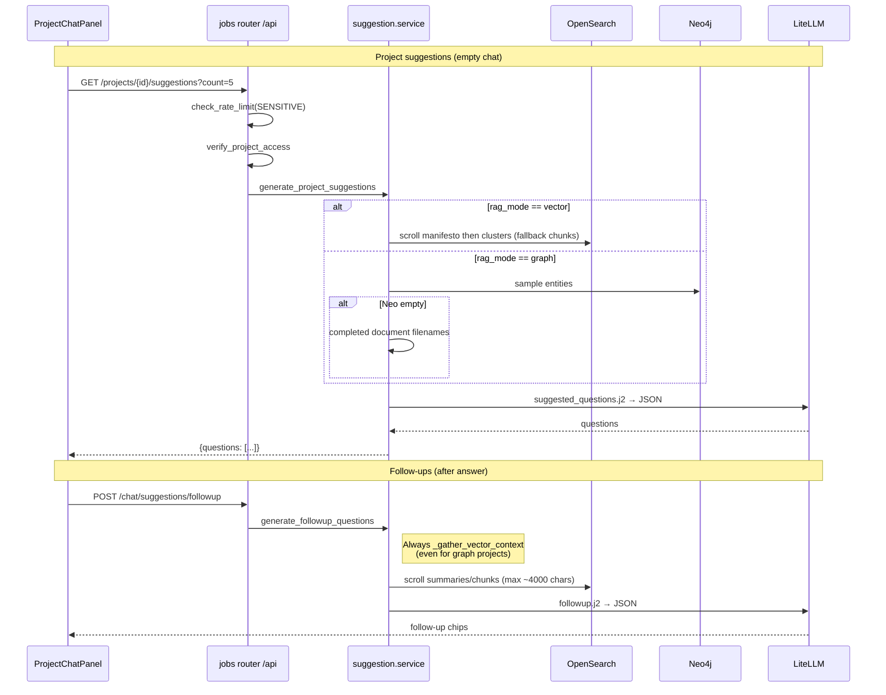

# Suggestions

Surface **suggested questions** for an empty project chat (from document manifesto / cluster summaries / graph entities) and **follow-up chips** after an answer. No translation layer — uses the project LLM via LiteLLM.

Suggested questions are short, clickable prompts the UI shows as chips. They lower the “blank composer” barrier: users see what the corpus can actually answer, click a chip, and send that question without inventing wording from scratch.

Suggestions are **not** part of `ChatOrchestrator` or retrieval. They are a separate UX layer that proposes *what to ask next*; answering still goes through normal chat + RAG. See [chat/README.md](../chat/README.md).

---

## Concepts

| Term | Meaning |
|---|---|
| **Suggested question** | A natural-language question the system proposes the user might ask next. Shown as a chip; selecting it fills (or sends) the chat composer. |
| **Project suggestions** (cold-start) | Questions generated when chat history is empty — “what can I ask about this project?” Grounded in corpus overviews (summaries or graph entities), not in a prior Q&A turn. |
| **Follow-up suggestions** | Questions generated after an answer — “what might you ask next given this exchange?” Grounded in the last query + answer, optionally plus a shorter corpus snippet. |
| **Chip** | UI control that displays one suggested question; clicking it uses that text as the next user message. |
| **Document manifesto** | Tier-2 hierarchical summary of a whole document (themes, purpose). Preferred context for vector-mode project suggestions. See [summaries](../summaries/README.md). |
| **Cluster summary** | Tier-1 summary of a K-Means group of chunks within a document. Used alongside manifestos when available. |
| **Corpus context** | Text fed into the suggestion prompt so the LLM writes *answerable, specific* questions instead of generic ones. |

### Why suggestions exist in RAG UX

Retrieval and chat answer *one* question well. They do not tell the user **what is askable**. In a RAG product that gap shows up as:

- An empty composer with no hint of coverage (“what’s in this project?”).
- After a good answer, a dead end (“I got a fact — now what?”).
- Users inventing vague or off-corpus questions the retriever cannot support.

Suggested questions close that loop **before** and **between** retrieval turns:

| Moment | Without chips | With chips |
|---|---|---|
| **Cold-start** (empty chat) | User must guess topics, filenames, or jargon from memory | Project chips advertise themes/entities the index can retrieve against |
| **After an answer** | User must invent the next angle from scratch | Follow-up chips propose adjacent, answerable next asks |

**Design intent (advanced-rag style):** suggestions are *query proposals*, not answers. They bias the user toward questions the corpus can ground — reducing hallucination-prone freeform chat and improving the odds that the next retrieve hits real passages. They deliberately reuse the **same project LLM** (LiteLLM) as chat so domain language and tone match answers; there is no separate embedding-only or translation shortcut.

Related but distinct from:

- **Query stages** (rewrite / multi-query / multihop) — reshape or expand an *already typed* question for better retrieval ([query-stages](../query-stages/README.md)).
- **Hierarchical summaries** — map layers for search *and* the preferred text source for vector project chips ([summaries](../summaries/README.md)).

### Project chips vs follow-ups (with examples)

Same UI pattern (chips), different **trigger**, **grounding**, and **job**.

| | Project suggestions | Follow-up suggestions |
|---|---|---|
| **When** | Empty chat history | After a streamed/JSON answer completes |
| **API** | `GET /projects/{id}/suggestions` | `POST /chat/suggestions/followup` |
| **Primary grounding** | Corpus overview (manifestos/clusters/entities) | Last **query + answer** (dialogue-first) |
| **Secondary grounding** | — | Optional OpenSearch snippet (`max_chars≈4000`, vector scroll only) |
| **Typical count** | Default 5 (1–10) | Default 3 (1–8) |
| **Fallback if weak** | Hardcoded generic starters | Often empty list (prefer silence over inventing) |

**Example — cold-start (project chips)**

Corpus overview might include a manifesto like *“Q3 vendor risk review covering cloud DPAs, subprocessors, and residual findings…”* and clusters about *access reviews* and *incident SLAs*.

Plausible project chips:

- “What residual findings remain from the Q3 vendor risk review?”
- “How are subprocessors documented in the cloud DPAs?”
- “What access-review gaps does the corpus call out?”

These are **corpus-first**: they could appear even with zero prior turns, and they advertise coverage.

**Example — after an answer (follow-ups)**

User asked: *“What residual findings remain from the Q3 vendor risk review?”*  
Assistant answered with three findings about encryption at rest, missing SOC reports, and SLA exceptions.

Plausible follow-up chips:

- “Which vendors are missing SOC reports?”
- “What encryption-at-rest controls were flagged?”
- “How are SLA exceptions tracked in the documents?”

These are **dialogue-first**: they deepen or branch from the exchange. They should not merely restate the original question (prompt rule). A shorter corpus snippet may be attached so chips stay answerable from documents, but the prompt’s main inputs are query + answer.

**Same topic, different moment:** “What are the main topics in this project?” is a fine *project* chip for an empty chat; after a detailed answer about vendor risk, a good *follow-up* is narrower (“Which vendors lack SOC reports?”), not another overview ask.

### How generation works (conceptually)

1. **Gather a compact overview** of the project (manifestos → clusters → chunks for vector; Neo4j entities or filenames for graph).
2. **Ask the LLM** (via Jinja prompts) for N short questions answerable from that overview (or from query+answer for follow-ups).
3. **Parse JSON** (with line/`?` fallbacks) and return a list; if context or parsing fails, return hardcoded generic starters (project) or possibly an empty list (follow-up).

Cold-start and follow-up differ mainly in *when* they run and *what* the prompt emphasizes: corpus-first vs dialogue-first.

Conceptually, context gathering is a **lossy map**, not a second retrieval pass for answering:

```
Stored knowledge (OpenSearch / Neo4j)
        │
        ▼
  Compact overview (truncated text)
        │
        ▼
  Suggestion prompt (Jinja) + project LLM
        │
        ▼
  Parsed question list → UI chips
        │
        ▼  (user clicks a chip)
  Normal chat / RAG path (retrieve → generate)
```

The overview exists so the LLM proposes *specific, answerable* questions. Clicking a chip still runs full chat retrieval — suggestions never substitute for `RAGPipeline.retrieve()`.

---

## Purpose

| Feature | When | Source of truth for context |
|---|---|---|
| Project suggestions | Empty chat / “what can I ask?” | Vector: OpenSearch summaries; Graph: Neo4j entities (or filenames) |
| Follow-up suggestions | After a chat answer | Query + answer + **vector-only** corpus snippet |

Both endpoints are rate-limited under the **sensitive** rule and require project ACL.

---

## Architecture



---

## Context gathering

Context is the bridge from stored knowledge to useful chips. Richer overviews (manifestos, clusters, entities) yield more specific questions; missing summaries push the system toward raw chunks or generic defaults.

**Why gather at all?** Without corpus text, an LLM tends to invent generic prompts (“What is this document about?”) that any project could claim. Feeding a truncated overview steers chips toward *named* themes, entities, and findings that retrieval can later support. Gathering is intentionally **cheap and shallow** (scroll + truncate) — not ranked search for the user’s next click — because the chip is only a proposed query string.

### Project suggestions — vector (`_gather_vector_context`)

Prefer coarse map text, then fall back to detail:

1. Scroll up to **20** docs with `summary_level=document` (manifestos) → `[manifesto] …`
2. Scroll up to **30** clusters, take first **15** → `[cluster] …`
3. If still empty: sample **10** `summary_level=chunk` hits (first 500 chars each)
4. Join with `---` separators; truncate to **8000** chars

Manifestos and clusters are preferred because they already compress themes; raw chunks are a last resort when hierarchical summaries have not run yet ([summaries README](../summaries/README.md)). Before summaries exist, chips fall back to raw chunks or hardcoded defaults.

### Project suggestions — graph (`_gather_graph_context`)

1. Neo4j `_search_entities_fulltext(project_id, "", limit=30)` → `- name: description`
2. On failure / empty: up to 5 completed document **filenames** as `"Documents: a, b, …"`
3. Microsoft GraphRAG workspaces without Neo4j entities get the filename fallback only (no workspace summary pull today)

Entity names/descriptions play the same role as manifesto text: a compact vocabulary of what the graph knows.

### Follow-ups — vector-only (caveat)

`generate_followup_questions` **always** calls `_gather_vector_context(project_id, max_chars=4000)` when `project_id` is set.

Follow-ups are dialogue-led: the prompt’s primary inputs are the user’s last question and the assistant’s answer. The OpenSearch scroll is optional grounding so chips stay answerable from the corpus — not a second retrieval pass for the answer itself.

| Project mode | Follow-up context today |
|---|---|
| Vector | Manifesto / clusters / chunks (as above) |
| Graph | Still OpenSearch vector scroll — often **empty** for pure graph projects |

Graph-aware follow-ups are not implemented. Failures gathering context are swallowed (`context=""`); the LLM still sees query + answer.

---

## LLM & parsing

### Prompts

| Template | Role |
|---|---|
| `app/prompts/suggested_questions.j2` | System prompt for project chips; asks for `{"questions":[…]}` |
| `app/prompts/followup.j2` | System prompt for follow-ups; same JSON shape; ≤120 chars each; answerable from docs |

User message is a short instruction (“Generate the suggested questions as JSON.” / “Generate follow-up questions as JSON.”).

Settings: `temperature=0.6`, `max_tokens` 512 (project) / 400 (follow-up).

### `_parse_questions`

1. Strip markdown fences if present
2. `json.loads` → list, or dict with `"questions"`
3. Fallback: lines ending in `?` after stripping list markers
4. Truncate to `limit`

### Hardcoded fallbacks

| Situation | Fallback questions (truncated to `count`) |
|---|---|
| Empty corpus context | “What are the main topics…”, “Can you summarize…”, “What should I know first…” |
| LLM parse empty (project) | “What are the main themes…”, “Summarize the most important findings.” |
| Follow-up parse empty | Returns whatever `_parse_questions` got (may be `[]`) |

Empty-corpus and parse-empty fallbacks keep the empty-chat UX usable before ingest/summaries finish; follow-ups prefer silence over inventing chips when parsing fails.

---

## APIs

Router: `app/api/jobs.py`, mounted at `/api` in `main.py`.

| Method | Path | Body / query | Auth | Rate limit |
|---|---|---|---|---|
| `GET` | `/api/projects/{project_id}/suggestions` | `count` (clamped 1–10, default 5) | Bearer + project access | `SENSITIVE_RULE` (default 30/min) |
| `POST` | `/api/chat/suggestions/followup` | `{project_id, query, answer, count}` (`count` 1–8, default 3) | Bearer + project access | `SENSITIVE_RULE` |

Response model:

```json
{"questions": ["…", "…"]}
```

Errors: `500` with detail string on unexpected failures; `429` when rate-limited; standard ACL `403`/`404` from `verify_project_access`.

---

## Frontend

`frontend/src/components/ProjectChatPanel.tsx` + `frontend/src/lib/api.ts` (`suggestionsApi`):

1. On empty history → `GET …/suggestions` → chip buttons that fill the composer
2. After stream `done` → `POST …/followup` with last question + answer → follow-up chips
3. Failures are logged to console; UI continues without chips

That maps directly to cold-start vs follow-up: empty history triggers project suggestions; a completed answer stream triggers follow-ups.

---

## Failure modes

| Symptom | Likely cause |
|---|---|
| Generic fallback questions | No OpenSearch summaries/chunks yet, or graph with no entities/filenames |
| Empty follow-ups on graph project | Vector-only context gather (see caveat above) |
| `429` | Sensitive rate limit; wait / raise `RATE_LIMIT_SENSITIVE_PER_MINUTE` |
| Stale / off-topic chips | Summaries not rebuilt after reindex; cancel+reschedule should have run — check summary job status |
| LLM JSON garbage | Parser falls back to `?` lines or hardcoded list |

---

## Module map

| Path | Role |
|---|---|
| `app/services/suggestion/service.py` | Context gather + LLM + parse |
| `app/services/suggestion/__init__.py` | Exports |
| `app/api/jobs.py` | HTTP endpoints + rate limit + ACL |
| `app/prompts/suggested_questions.j2` | Project chips prompt |
| `app/prompts/followup.j2` | Follow-up prompt |
| `app/core/rate_limit.py` | `SENSITIVE_RULE` |

---

## How to test

```bash
cd backend
UV_NO_SYNC=1 .venv/bin/python -m pytest tests/test_phase4_api.py -k suggestion -q
```

Manual:

```bash
curl -s -H "Authorization: Bearer $TOKEN" \
  "$BASE/api/projects/$PROJECT_ID/suggestions?count=5"
```

---

## Related docs

- [Hierarchical summaries](../summaries/README.md) — manifesto/cluster context; COMPLETED-on-failure if summary LLM fails
- [Chat](../chat/README.md) — answer stream that triggers follow-ups
- [Query-quality stages](../query-stages/README.md) — reshape an already-typed question (not chip generation)
- [Ops](../ops/README.md) — rate limits (`SENSITIVE_RULE`), `MetricsRegistry` / `flexsearch_rate_limit_hits_total` (ops owns deeper metrics; `timed_stage` is unused — StageTimer records chat stages)
- [Neo4j graph RAG](../neo4j-graph-rag/README.md) — graph entity store
