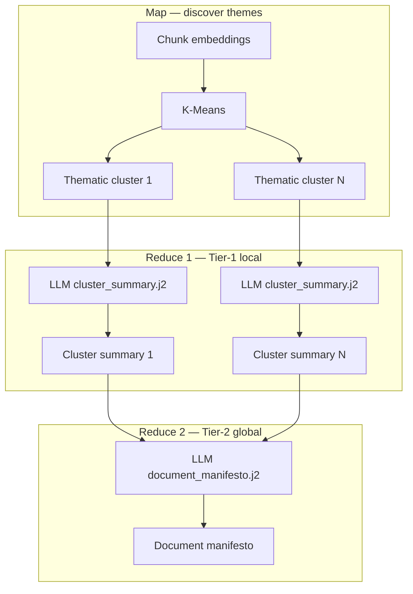
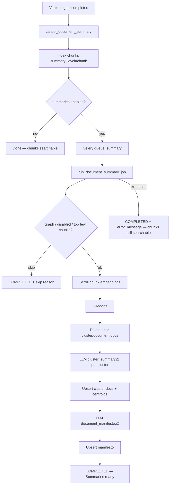
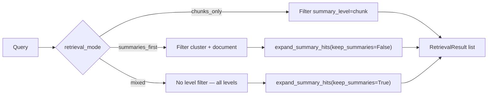

# Hierarchical summaries

Build searchable **cluster** (Tier-1) and **document manifesto** (Tier-2) summaries on top of OpenSearch chunks so vector retrieval can use map/detail patterns (`chunks_only` | `summaries_first` | `mixed`).

OpenSearch is the retrieval source of truth. Chunks and summaries live in the **same index**, distinguished by `summary_level`. There is no Postgres summary table.

This is FlexSearch’s **content-adaptive document understanding**: after chunks are indexed, a background job discovers thematic clusters in embedding space, writes a local summary per cluster, then rolls those up into one whole-document “manifesto.” Retrieval can then start from the map and walk down to the passages you cite.

---

## Why summaries exist in RAG

Long documents become dozens or hundreds of chunks. A user question often matches a **theme** or **section**, not a single sentence. Searching only raw chunks can miss the right neighborhood or bury it under near-duplicate fragments.

**Worked example.** A 120-page policies PDF chunks into ~200 passages. The user asks: *“What is the remote-work approval process?”*

| Without summaries | With hierarchical summaries |
|---|---|
| Dense search returns scattered sentences that mention “remote,” “VPN,” or “approval” across HR, IT, and travel chapters — high lexical noise. | A **cluster** summary that already says “remote-work eligibility, manager approval, and VPN prerequisites” ranks near the query; expand via `member_chunk_ids` pulls the right contiguous passages. |
| A thematic ask like *“Which doc covers vendor risk?”* must luck into a chunk that happens to use those words. | The **document manifesto** embeds whole-doc purpose/themes, so the right file surfaces even when no single chunk restates the theme. |

Hierarchical summaries give the retriever coarser “map” layers:

| Layer | Role in search |
|---|---|
| **Chunks** (detail) | Exact passages you cite and quote |
| **Cluster summaries** (mid-level map) | Coherent topic groups within a document — good for “find the section about X” |
| **Document manifesto** (high-level map) | Whole-doc purpose and themes — good for “which document is about Y?” and UI suggestions |

At answer time, FlexSearch still grounds citations in **chunks**. Summary hits are a routing aid: match the map, then expand to the member passages (`member_chunk_ids`) before citing.

Summaries also feed **UX** outside chat retrieval: suggested questions scroll manifesto/cluster text for project chips ([suggestions README](../suggestions/README.md)).

---

## Content-adaptive document understanding

Think of a thick technical report as a city. Chunks are street addresses (precise, easy to get lost among). Cluster summaries are neighborhood names. The manifesto is the city overview on a tourist map. FlexSearch builds those map layers **from the document’s own embedding geometry**, not from a fixed outline — hence *content-adaptive*.

### Map-reduce mental model

The job is a classic **map → reduce → reduce** pipeline. The LLM never swallows the full raw document in one shot; it sees capped excerpts per cluster, then only the cluster texts for the manifesto.



| Stage | What happens | Why |
|---|---|---|
| **Map** | Partition chunk vectors into K groups with K-Means | Nearby embeddings ≈ related topics; structure without headings |
| **Reduce 1 (Tier-1)** | LLM writes a short factual summary per non-empty cluster | Compress many passages into one searchable “section about X” |
| **Reduce 2 (Tier-2)** | LLM synthesizes those Tier-1 texts into one manifesto | Whole-doc purpose/themes for routing and suggestions |

This is the same *idea* as map-reduce community reports in GraphRAG-style systems, but scoped to **one vector document** and stored as ordinary OpenSearch docs with `summary_level`.

### Clustering and choosing K

**K-Means** places each chunk embedding into one of K groups by minimizing distance to cluster centers. It does not “understand” language; it only groups vectors. The LLM later turns each group into readable prose.

**How many clusters (K)?** In clustering literature, a common quality check is the **silhouette score**: for each point, compare closeness to its own cluster vs the nearest other cluster; average over points. A **silhouette sweep** tries several K values and picks the score peak — that is one way to estimate “natural thematic density.”

**What FlexSearch does:** it does **not** run a silhouette sweep. Auto-K is a cheap heuristic:

```text
n_clusters = max(2, min(√n, n, 50))   # when config.n_clusters is null
```

or a fixed `n_clusters` from project config (still clamped to `[2, n]`). Sklearn `KMeans` uses `n_init=10`, `random_state=42`. Tiny documents (`len(chunks) < min_chunks`, default 6) skip the job entirely — not enough signal to form useful map layers.

**Intuition for √n:** a 9-chunk note → ~3 clusters; a 100-chunk chapter → ~10; a 400-chunk book → capped at 50. Too few clusters blur distinct themes into one blob; too many produce near-duplicate “summaries” of single chunks.

### Tier-1 (local) vs Tier-2 (manifesto)

| | **Tier-1 — cluster summary** | **Tier-2 — document manifesto** |
|---|---|---|
| **Scope** | One K-Means group inside a document | Entire document |
| **Built from** | Up to 20 member excerpts × 1200 chars | Joined Tier-1 texts (`Cluster i: …`) |
| **Prompt** | `cluster_summary.j2` — topics, entities, claims; 3–8 sentences; no invented facts | `document_manifesto.j2` — purpose, themes, how sections relate; 1–2 short paragraphs |
| **Indexed as** | `summary_level=cluster` | `summary_level=document` |
| **Embedding** | **Centroid** = mean of member chunk vectors (stays near those chunks in vector space) | Embedding of the **manifesto text** (matches thematic whole-doc queries) |
| **`member_chunk_ids`** | That cluster’s chunk ids | **All** chunk ids for the document |
| **Best query fit** | “Find the section about X” | “Which document is about Y?” / suggestion chips |

**Example (one employee handbook):**

- Tier-1 cluster `c2`: *“Remote work requires manager approval, VPN enrollment, and a written schedule. Eligibility excludes contractors in section 4.2…”*
- Tier-1 cluster `c5`: *“Expense reimbursement: submit within 30 days; meal caps; travel booking policy…”*
- Tier-2 manifesto: *“This handbook covers employment policies: remote work, expenses, leave, and code of conduct. Remote and expense chapters are the operational core; leave and conduct are supporting sections.”*

A query about VPN enrollment should hit **c2** (or its members after expand). A query *“Do we have an HR policy handbook?”* should prefer the **manifesto**.

### Why this helps retrieval (and what it does not do)

Summaries improve **routing and recall of the right neighborhood**. They do **not** replace evidence:

1. Query embeds and searches OpenSearch (optionally filtered to cluster/document levels).
2. A summary hit is expanded with `expand_summary_hits` → load `member_chunk_ids`.
3. Chat citations always expand with `keep_summaries=False` so the UI quotes **chunks**, not summary prose.

Caveat: a manifesto hit expands to **every** chunk in the document — powerful for “this is the right file,” but can flood context under `summaries_first` / `mixed` if top-k is large. Prefer cluster-level hits for section-scoped asks.

---

## Concepts and terms

| Term | Plain meaning |
|---|---|
| **Chunk** | Small retrieval unit produced at ingest (`summary_level=chunk`). The passages users see cited. |
| **Cluster summary** | LLM overview of one K-Means group of related chunks (Tier-1 / local). Stored as `summary_level=cluster`. |
| **Document manifesto** | Short whole-document overview built from cluster summaries (Tier-2 / global). Stored as `summary_level=document`. Not a legal “manifesto” — an intentional name for the doc-level synopsis. |
| **Map-reduce (here)** | Partition chunks (map) → summarize each cluster (reduce 1) → summarize the summaries (reduce 2). |
| **`summary_level`** | Field that marks whether an OpenSearch hit is `chunk`, `cluster`, or `document`. Same index; different roles. |
| **`member_chunk_ids`** | Which concrete chunks a summary covers. Clusters list their members; the manifesto lists **all** chunk ids for that document. Used to expand map hits back to detail. |
| **Centroid embedding** | For a cluster: mean of member chunk vectors (not a fresh embed of the summary text). Positions the cluster near its members in vector space. |
| **Manifesto embedding** | Embedding of the manifesto **text** itself — so thematic queries can hit the whole-doc synopsis. |
| **Map / detail** | Search pattern: hit a coarse summary (map), then load its member chunks (detail) for context and citations. |
| **`expand_summary_hits`** | Post-process that loads members from `member_chunk_ids` so chat can cite passages, not summary prose. |
| **`retrieval_mode`** | Per-project choice: search chunks only, summaries first, or all levels mixed (see [Retrieval modes](#retrieval-modes)). |
| **K-Means** | Groups chunk embeddings into topic-ish clusters before the LLM writes each cluster summary. Purely structural; the LLM supplies the readable text. |
| **Silhouette (concept)** | Classic cluster-quality score / sweep for choosing K. **Not implemented** in FlexSearch; auto-K uses ≈ √n (clamped). |

---

## Purpose

| Goal | How |
|---|---|
| Compress long documents for retrieval | K-Means on chunk embeddings → LLM cluster summaries → LLM manifesto |
| Enable hierarchy-aware search | Filter by `summary_level`; expand via `member_chunk_ids` |
| Keep citations grounded | Chat always expands summary hits to concrete chunks before citing |

Summaries are **vector-mode only**. Graph / Microsoft GraphRAG projects skip the job entirely (those modes already have their own structure for multi-hop / entity routing).

---

## Architecture



### Conceptual flow

1. **Ingest first** — chunks go live immediately; users can search the document before summaries finish.
2. **Cluster** — similar chunks are grouped by embedding space (K-Means), then each group gets a short factual write-up.
3. **Roll up** — cluster texts feed one manifesto that describes the whole document.
4. **Index as searchable docs** — clusters and manifesto are ordinary OpenSearch documents with embeddings, so dense/hybrid/BM25 can hit them like chunks.
5. **Expand at use** — retrieval or citation code walks `member_chunk_ids` so answers stay grounded in original text.

### Same OpenSearch index

| `summary_level` | What it is | Embedding | `member_chunk_ids` |
|---|---|---|---|
| `chunk` | Normal retrieval unit from ingest | Chunk embedding | empty |
| `cluster` | Tier-1 summary of a K-Means group | Mean of member vectors (centroid) | Member chunk ids |
| `document` | Tier-2 manifesto for the whole doc | Embedding of manifesto text | **All** chunk ids for that document |

Stable document ids use `uuid5(NAMESPACE_DNS, f"summary:{document_id}:{level}:{key}")` so re-runs overwrite the same ids.

Extra payload fields:

- `cluster_id` — `c0`, `c1`, … or `manifesto`
- `extra.summary_kind` — `cluster` | `manifesto`
- `filename`, `project_id`, `document_id`, `chunk_index`

---

## Lifecycle

### 1. Schedule after ingest

In `document_worker._run_chunk_and_index`:

1. **`cancel_document_summary(document.id)`** — revoke any in-flight / queued summary for this document (`terminate=True`) so a late upsert cannot resurrect ghost summaries after wipe, and so a fresh schedule is not discarded as revoked.
2. `pipeline.delete_document_data` — OpenSearch `delete_by_document` removes **chunks and summaries** (same `document_id`).
3. Re-chunk + index with `summary_level="chunk"`.
4. Mark document `COMPLETED` / “Done”.
5. If `VectorRagConfig.summaries.enabled` → `schedule_document_summary(document_id, project_id)`.

### 2. Celery enqueue (`summary_tasks.py`)

| Item | Value |
|---|---|
| Task | `app.services.celery_tasks.build_document_summaries_task` |
| Queue | **`summary`** |
| Base task id | `summary:{document_id}` |
| Replace policy | `prepare_replace_task_id` — always replaces prior work (including `RUNNING`); after revoke uses a **fresh** id suffix so workers do not discard the enqueue |
| Soft / hard time limits | 20 min / 25 min |

Worker must listen on `summary` (and typically the other queues):

```bash
# Makefile: make worker-local
celery -A app.celery_app worker -Q ingest,graph,summary,default --concurrency=2 -l INFO
```

Docker Compose sets `CELERY_QUEUES=ingest,graph,summary,default`.

### 3. Worker gate (`summary_worker.run_document_summary_job`)

| Condition | Result |
|---|---|
| `RagMode.GRAPH` + Microsoft GraphRAG | skip `microsoft_graphrag` |
| Any graph mode | skip `graph_mode` |
| `summaries.enabled == false` | skip `summaries.disabled` |
| Document row missing | skip `document_not_found` |
| Fewer than `min_chunks` chunks | skip `too_few_chunks:N` (from service) |

Progress while building: status stays `INDEXING` (or keeps `COMPLETED` if already done), step `Building hierarchical summaries…`, `progress_pct=92`.

### 4. COMPLETED-on-failure (important)

If `build_document_summaries` raises:

- Document is still set to **`COMPLETED`**
- Step: `Summaries failed (chunks still searchable)`
- `error_message`: `summary: {exc}`
- Exception is re-raised for Celery failure tracking

Chunks remain searchable; manifesto/clusters may be missing or partial. Operators should treat `error_message` starting with `summary:` as a soft failure, not a hard ingest failure.

On skip/success: `COMPLETED`, `progress_pct=100`, step like `Summaries ready (N clusters)` or `Summaries skipped (reason)`.

### 5. Delete / project teardown

- Document delete (`documents.py`) and project lifecycle call `cancel_document_summary` before wipe.
- OpenSearch delete-by-document removes all levels for that `document_id`.

---

## Algorithm (`summary/service.build_document_summaries`)

Implements the map-reduce flow above: **group → summarize each group → summarize the groups**. The LLM never sees the full raw document at once; it sees capped excerpts per cluster, then the cluster texts for the manifesto.

1. **Scroll** all hits with `project_id` + `document_id` + `summary_level=chunk` (page size 1000).
2. Prefer non-`parent` chunks when parent/child chunking is used; if that filter empties the list, fall back to all chunks.
3. Skip if `len(chunk_hits) < config.min_chunks` (default **6**).
4. Build matrix `X`:
   - Prefer `hit.payload["embedding"]` from OpenSearch `_source`
   - Else re-embed `hit.content` (expensive fallback)
5. **K-Means** (`sklearn.cluster.KMeans`, `n_init=10`, `random_state=42`):
   - `n_clusters` from config, or auto `max(2, min(√n, n, 50))` — not a silhouette sweep
6. **`_delete_existing_summaries`** — scroll + `delete_by_ids` for prior `cluster` and `document` levels only (chunks kept).
7. Per non-empty cluster (**Tier-1 / Reduce 1**):
   - Up to **20** member excerpts × **1200** chars (ordered members, not centroid-sampled)
   - Prompt `cluster_summary.j2` → LLM (`temperature=0.2`, `cluster_max_tokens`)
   - Empty LLM → fallback first member’s first 500 chars
   - Upsert with **centroid** embedding = mean of member vectors
8. If any cluster summaries (**Tier-2 / Reduce 2**):
   - Join as `Cluster i: …` → `document_manifesto.j2` → LLM (`manifesto_max_tokens`)
   - Empty → join first 5 cluster texts
   - Embed manifesto text; upsert `summary_level=document`, `member_chunk_ids=all chunk ids`

Prompts live under `app/prompts/`:

- `cluster_summary.j2` — factual 3–8 sentence cluster summary; do not invent facts
- `document_manifesto.j2` — 1–2 short paragraphs: purpose, themes, how sections relate

---

## Config

Per-project `VectorRagConfig.summaries` (`HierarchicalSummaryConfig` in `app/schemas/rag_config.py`):

| Field | Default | Meaning |
|---|---|---|
| `enabled` | `true` | Enqueue summary job after vector ingest |
| `retrieval_mode` | `chunks_only` | Hierarchy mode for dense / hybrid / BM25 |
| `min_chunks` | `6` | Skip job when document has fewer usable chunks |
| `n_clusters` | `null` | Fixed K; `null` → auto ≈ √n (clamped 2…50) |
| `cluster_max_tokens` | `512` | LLM cap per cluster |
| `manifesto_max_tokens` | `1024` | LLM cap for document manifesto |

Frontend: RAG config form exposes these under the summaries section.

`chunks_only` remains the conservative default: summaries are still **built** (when enabled) for suggestions and future mode switches, but day-to-day retrieval ignores them until you choose `summaries_first` or `mixed`.

---

## Retrieval modes

Implemented in `app/rag/retrieval/hierarchy.py`, wired from `factory` / `RAGPipeline` via `rag_config.summaries.retrieval_mode`. Dense, hybrid, and BM25 strategies apply filters + post-process. **Parent-child** retrieval always searches chunk-level children; hierarchy mode is largely unused there.

**Mental model:** `chunks_only` searches the street addresses only. `summaries_first` searches neighborhood and city maps first, then walks down to addresses (and drops the map rows from the hit list). `mixed` keeps both map pins and street hits in the ranked list.

**Example.** Query: *“meal reimbursement caps.”*

| Mode | Typical behavior |
|---|---|
| `chunks_only` | Must match expense-policy chunks directly |
| `summaries_first` | May hit the expenses **cluster** (or manifesto), then expand to member chunks; summary rows removed before the caller sees results |
| `mixed` | Cluster/manifesto rows can remain alongside expanded members (and any direct chunk hits) |

**When to use which (practical):**

| Mode | Best for |
|---|---|
| `chunks_only` | Default / citation-heavy Q&A; no map layer in the hit list |
| `summaries_first` | Broader “find the right section/doc” queries; hits are expanded to chunks and summary rows dropped |
| `mixed` | Keep both summary and chunk hits (summaries can still appear in the ranked list alongside expanded members) |



| Mode | OpenSearch filter | Post-process |
|---|---|---|
| `chunks_only` | `summary_level=chunk` | none |
| `summaries_first` | `summary_levels=["cluster","document"]` | Expand members; **drop** summary hits |
| `mixed` | no level filter | Keep summaries **and** append expanded members (deduped) |

`expand_summary_hits`:

- Collects `member_chunk_ids` from cluster/document hits
- `SearchStore.get_by_ids` loads members
- In replace mode, member score = `max(member.score, summary.score)` and metadata gets `expanded_from_summary`
- Manifesto hits expand to **every** chunk in the document — can flood context in `summaries_first` / `mixed` if top-k is large

Neighbor context expand (`chat/stages/context_expand.py`) **skips** non-`chunk` levels (expanding by `chunk_index` on a summary would pull unrelated neighbors).

---

## Chat citations

Summaries are a **compass**, not the destination. `build_citations()` in `app/rag/chat/types.py` always runs:

```text
expand_summary_hits(results, keep_summaries=False)
```

So the UI cites concrete passages even if retrieval left summary-level hits (e.g. mixed mode before citation, or any path that skipped post-process). Citations carry `chunk_id`, `document_id`, score, filename, and metadata (including `expanded_from_summary` when applicable).

Summaries improve **routing**; they are not themselves the cited evidence.

---

## Skip rules (summary)

- Graph mode (Neo4j or Microsoft) — no vector summary job
- `summaries.enabled=false`
- `too_few_chunks` relative to `min_chunks`
- Document not found

Skipped jobs still return a meta payload (`cluster_count`, `manifesto_id`, `skipped`, `reason`) for Celery result / logging.

---

## Module map

| Path | Role |
|---|---|
| `app/services/summary/service.py` | K-Means + LLM + OpenSearch upsert |
| `app/services/summary_worker.py` | Async job, skip rules, document status |
| `app/services/summary_tasks.py` | Cancel + schedule on Celery |
| `app/services/celery_tasks.py` | `build_document_summaries_task` |
| `app/services/celery_schedule.py` | Safe revoke/replace task ids |
| `app/rag/retrieval/hierarchy.py` | Filters + `expand_summary_hits` |
| `app/rag/chat/types.py` | Citation expand |
| `app/rag/pipeline.py` | Indexes chunks with `summary_level=chunk` |
| `app/services/search_store/types.py` | `SummaryLevel`, `SearchDocument` fields |
| `app/prompts/cluster_summary.j2` | Tier-1 prompt |
| `app/prompts/document_manifesto.j2` | Tier-2 prompt |

Downstream consumers:

- Suggestions — scroll manifesto/cluster for project chips ([suggestions README](../suggestions/README.md))
- Eval golden modes — mock `summaries_first` / `mixed` ([eval README](../eval/README.md))
- Ops metrics — `MetricsRegistry` records chat / retrieval / LLM / ingest / rate_limit; **no dedicated summary job series** yet ([ops README](../ops/README.md))

Observability note: `app/observability/tracing.timed_stage` is exported but **unused**. Chat stage latencies come from `StageTimer` in the orchestrator → `metrics.observe_stage`. Prefer that path when instrumenting; see ops docs for the full series list.

---

## How to test

```bash
cd backend
UV_NO_SYNC=1 .venv/bin/python -m pytest tests/test_phase3_ingest_summaries.py -q
UV_NO_SYNC=1 .venv/bin/python -m pytest tests/test_document_tasks_celery.py -q
UV_NO_SYNC=1 .venv/bin/python -m pytest tests/test_query_stages.py -k summary -q
```

---

## Ingest quality notes (related Phase 3)

Not part of the summary job itself, but affect chunk quality that clustering sees:

- **Preprocess** — `app/rag/ingestion/preprocess.py` after extract
- **Extractors** — `ocr`, `vlm`, `docling`, `hybrid_pdf` via factory
- **Heading hierarchy** — markdown headings → `heading_path` / `section_title` on chunks
- **Recursive chunking** — LangChain `RecursiveCharacterTextSplitter`; `preserve_structure=true` keeps fenced code and pipe tables atomic

---

## Related docs

- [Suggestions](../suggestions/README.md) — manifesto/cluster as suggestion context
- [Eval](../eval/README.md) — offline hierarchy modes in golden set
- [OpenSearch](../opensearch/README.md) — index mapping (`summary_level`, knn)
- [Celery](../celery/README.md) — queues and workers
- [Ops](../ops/README.md) — metrics, runbooks (summary stuck / COMPLETED-on-failure)
- [Chat](../chat/README.md) — citations and retrieval path
